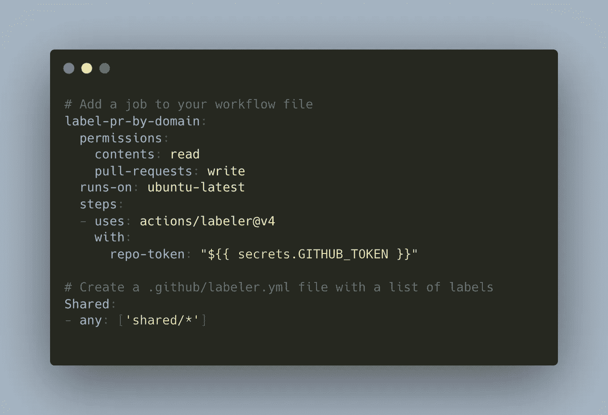
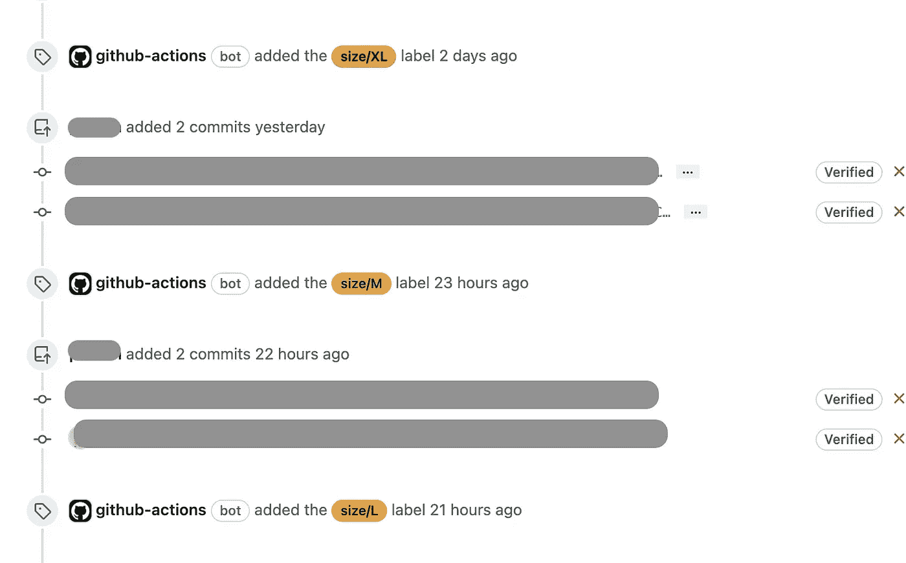
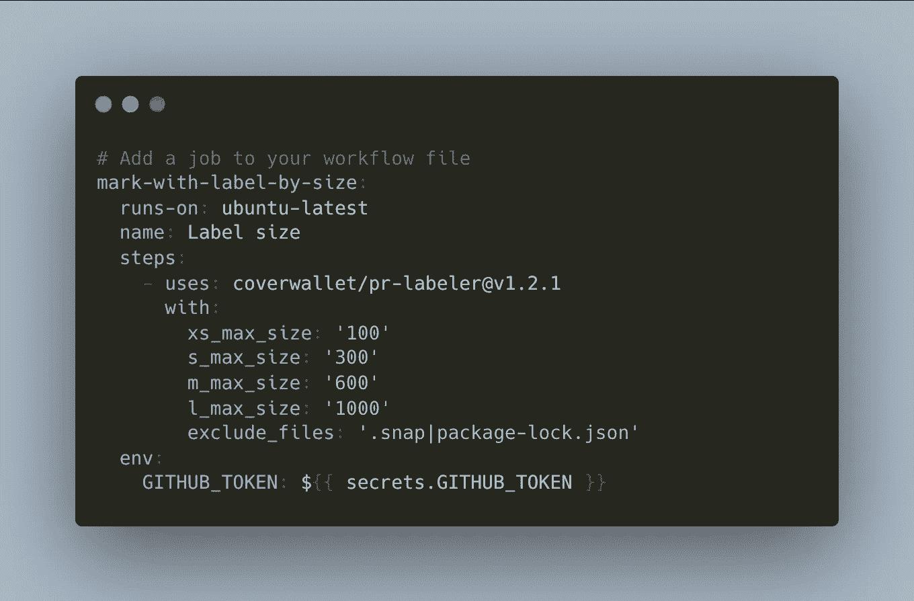
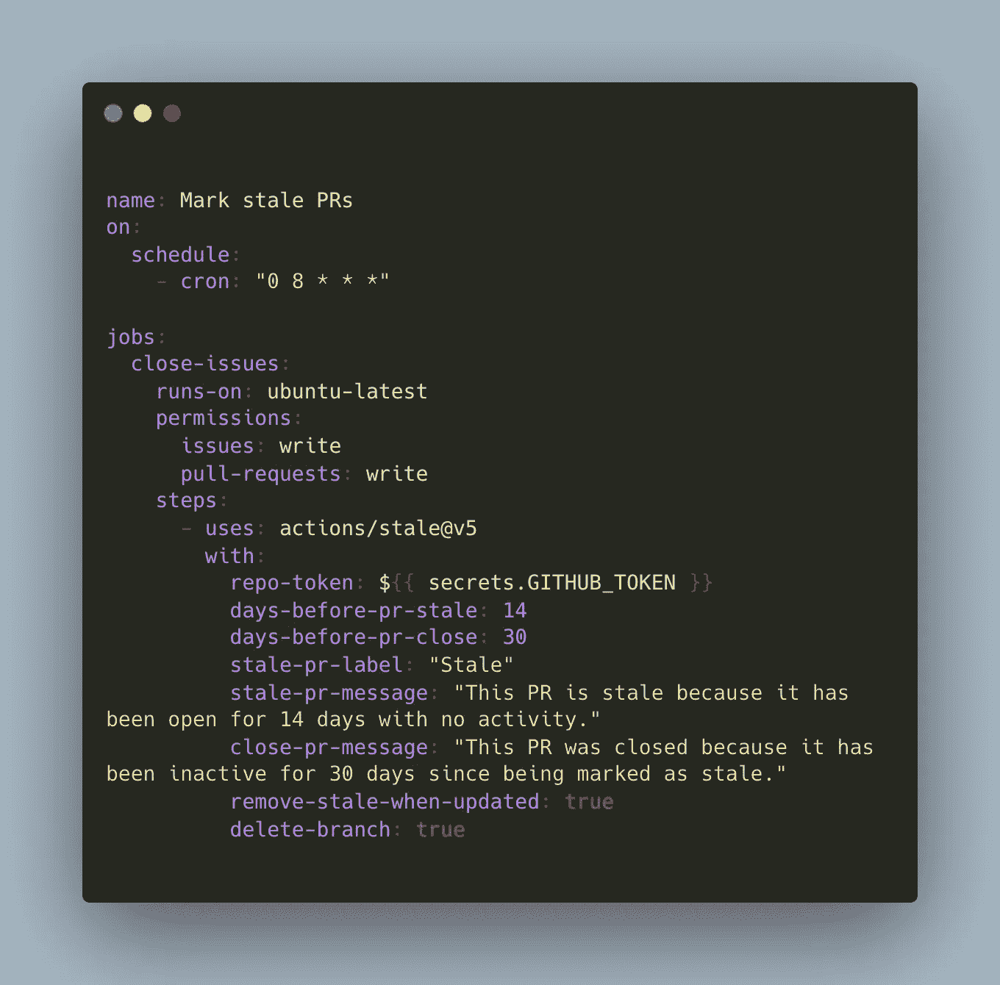
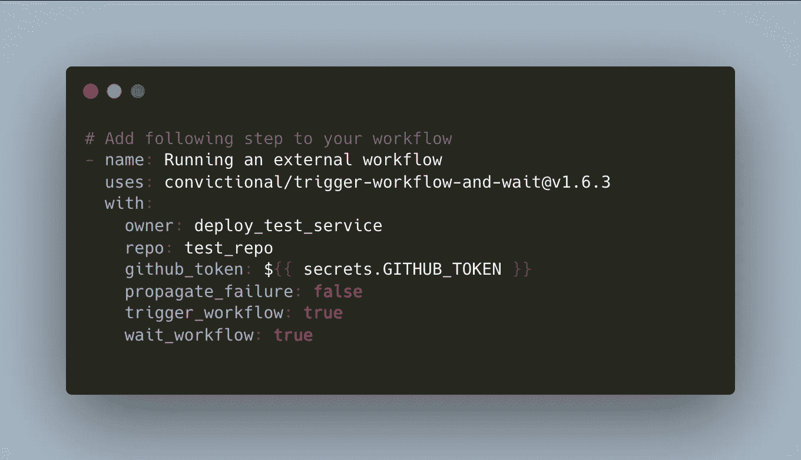

# GitHub 的动作可能会让你的项目变得混乱有序

> 原文：<https://javascript.plainenglish.io/the-github-actions-that-might-turn-chaos-into-order-in-your-project-815fce7eb84d?source=collection_archive---------8----------------------->

## 这些 GitHub 行动可能有助于**改善你的项目** **的工程流程，化混乱为有序**。

Image from [unsplash.com](https://unsplash.com/)

GitHub Actions Marketplace 存储了成千上万个不同的包，可能会对你有所帮助。有时，甚至对于一个请求，您可以在这一团乱麻中找到几十个重复的操作。幸运的是，在任何一堆泥土中，都有可能找到金色的沙子。

在这篇文章中，我们将修改可能有助于**改进项目** **工程过程的行动，将混乱变成有序**。动作将被分成几类，因为可用性比机制更重要。此外，我想向您透露我们在项目中使用的具体行动列表，并分享我们的经验。我们开火吧！

## 自定义标签

第一个提名是标签管理行动。基本上，通过使用它们，您可以自动管理 PR (Pull Requests)或根据一些预定义的条件(如文件路径、用户名等)发布标签。

例如，我们想要通过域([域驱动设计](https://martinfowler.com/bliki/DomainDrivenDesign.html))和负责它们的团队来分离项目资源。我们以 [**贴标机动作**](https://github.com/actions/labeler) 为基础，做了一点改动以满足我们的要求。现在，我们的 PRs 根据文件的路径按域进行标记，因此，如果域文件被更改，相关人员将会看到它，而无需浏览整个列表。

**易于配置，易于使用，并且可能在代码审查期间增加可见性和优先级。**

PR Labeler Action Configuration

**动作:**

*   [根据被更改文件的路径在新的拉取请求上添加标签](https://github.com/actions/labeler)
*   [在基于作者团队的拉取请求上添加标签](https://github.com/JulienKode/team-labeler-action)
*   [根据问题正文添加标签](https://github.com/Renato66/auto-label)

## 拉取请求大小

第二类也和标签管理有关。不过，我想单独解释一下，因为逻辑略有不同——pr 大小评估。它在代码审查期间也很有帮助，增加了 PRs 的可见性，并让人们首先审查和推出小规模的拉请求。

PR Size Labeler Action in Use

设置几乎相同。您只需定义一个配置，该操作将为 PR 添加一个 t 恤尺寸标签。您还应该添加排除项，因为并非所有文件都在拉请求中扮演重要角色。

PR Size Labeler Action Configuration

**动作:**

*   [根据差异的总大小向拉请求添加标签](https://github.com/pascalgn/size-label-action)
*   [根据变更和排除文件的数量为拉取请求添加标签](https://github.com/coverwallet/pr-labeler)

## 过时的提取请求

有时，可能会出现这样的情况，即**一个拉取请求悬而未决，没有任何更新，最终由于一些依赖性、延迟的反馈或者仅仅是它的使命**而变得过时。当然，开一个 PR 的人，总要想想它的命运，最后关闭，但为什么不能自动完成呢？

对于这样的场合，我们有非常有用的动作，有一个明显的名字——[**stale**](https://github.com/actions/stale)。**它会发出警告，然后关闭在指定时间内没有活动的问题和 PRs。**不需要在每个拉取请求上运行它，更好地按计划运行(参见下面的例子)。

Stale PR Action Configuration

**动作:**

*   [警告并关闭在指定时间内没有活动的问题和 PRs](https://github.com/actions/stale)

## 工作流触发器

可能会出现触发另一个工作流并等待其完成的情况。这有利于保持工作流程的简洁明了。此外，该方法也适用于从另一个存储库运行工作流。例如，**部署一个应用程序，你可能需要部署额外的服务或者单独运行一些测试套件**。

让我们来看看这个例子:

Trigger workflow and Wait Action in Use

该步骤将从“test_repo”中触发“deploy_test_service”工作流，并等待它完成。太棒了，对吧？

**动作:**

*   [从另一个工作流程中触发一个工作流程](https://github.com/marketplace/actions/trigger-workflow-and-wait)

## **通知**

最后但同样重要的是，所有与通知相关的操作。对于任何一个送信人来说，市场上真的有很多。为什么它可能是有利的？首先，当部署或任何其他关键工作流程出现问题时，您可能会陷入循环。此外，**诸如随叫随到服务、成功消息和预定工作报告等案例可以由他们负责**，并更快地向人们提供详细信息。

[阅读更多关于配置闲置通知的信息](/be-aware-of-your-github-actions-workflow-with-slack-35d1f46821cf):

 [## 注意你的 GitHub 动作工作流程和 Slack

### 几个月前，当我们享受宁静的时候，我们从我们的支持部门得到一个消息，我们的一个…

javascript.plainenglish.io](/be-aware-of-your-github-actions-workflow-with-slack-35d1f46821cf) 

**动作:**

*   [将数据发送到空闲通知消息中](https://github.com/marketplace/actions/slack-send)
*   [发送电报通知消息](https://github.com/marketplace/actions/telegram-notify)

## 结论

开始了。我们携手经历了各种 GitHub 行动，这些行动可能有助于减少紧张，改善工程流程，并随时了解您的工作流程。

请在评论中分享您的宝贵意见，帮助我在市场中找到更多优秀的 GitHub 行动。

*更多内容看* [***说白了。报名参加我们的***](https://plainenglish.io/) **[***免费周报***](http://newsletter.plainenglish.io/) *。关注我们关于* [***推特***](https://twitter.com/inPlainEngHQ) ， [***领英***](https://www.linkedin.com/company/inplainenglish/) *，以及* [***不和***](https://discord.gg/GtDtUAvyhW) *。***