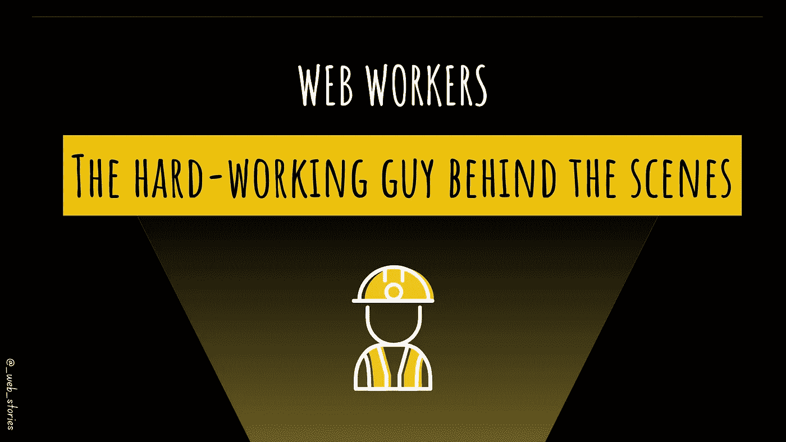

# 认识网络工作者:幕后辛勤工作的家伙

> 原文：<https://javascript.plainenglish.io/the-hard-working-guy-behind-the-scenes-f81b41cbab69?source=collection_archive---------10----------------------->

## 什么是网络工作者？它是如何工作的？



By FAM

# 你好👋

你听说过网络工作者吗？如果没有，你就在正确的页面上。这篇文章会给你所有你需要知道的关于这个人的信息。了解 web workers 是非常必要的，因为它们在任何地方都被使用，并且对应用程序的性能非常重要。作为一名 web 开发人员，您肯定会在日常工作中遇到或编写代码！

# 一句话…

> web worker 是一个 JS 程序，用于在后台执行耗时的任务，以避免影响应用程序的性能。

就这么简单。您让主线程呈现您的 web 应用程序。当你需要做复杂的事情时，你让超级`worker`去做，而不阻塞用户界面，这导致了一个平滑和反应性的页面，从而带来了良好的用户体验。

技术上讲`Worker`是一个 API 接口，让你在后台创建一个线程。

# 网络工作者的使用案例

对于大型 web 应用程序，性能很重要。有很多耗时的任务会影响他们的表现。其中一个用例可能是从服务器获取大数据或文件，显示包含大量统计数据和实时数据的仪表板页面，等等…

# 具体是怎么运作的？

与员工建立沟通并要求他做复杂的事情是非常简单的。以下是步骤:

*   **首先，检查浏览器是否支持工作人员**

```
**// in the main script**if (typeof(Worker) !== “undefined”) {
 // Yes! Web worker is supported!
} else {
 // Nop! Web Worker not supported
}
```

*   **二、创建职工档案**

```
**// in the worker.js file****onmessage** = function(message){
  console.log(message);
  let sum = 0; for (let i = 0; i < 10000000000; i++) {
    sum += i;
  } ***this.postMessage(sum);***
}
```

*   **第三，创建工人对象**

```
**// in the main script**if (typeof(Worker) !== “undefined”) {
  const **worker** = **new Worker("worker.js");**

  **worker.postMessage("Launch sum");**} else {
 // Nop! Web Worker not supported
}
```

*   **现在，我们很好地完成了工人为我们完成的任务**

```
**// in the main script**worker.**onmessage** = (message) => {
  // The returned sum value is in message.data
  console.log(**message.data**);
}
```

*   **完成后进行清理**

```
worker.terminate();
```

# 完整的演示代码

在完整的演示中，在没有 web worker 的版本中，一旦我们启动 sum 计算，屏幕就会被阻止。我们不能点击另一个按钮来改变标题。直到 for 循环完成，只有在此之后，屏幕才再次反应，其他按钮才起作用。

示例中的 for 循环只是一个需要时间来完成的操作的模拟。

没有工人的版本被评论。玩玩看区别。

[](https://github.com/famzila/2022-WEB-PROGRAM/tree/main/Chapter6/workers) [## 2022-网络计划/第 6 章 main famzila 的工人/2022-网络计划

### 在 GitHub 上创建一个帐户，为 famzila/2022-WEB 程序开发做出贡献。

github.com](https://github.com/famzila/2022-WEB-PROGRAM/tree/main/Chapter6/workers) 

今天就到这里，看阿雅🙋

如果您有任何问题或反馈，请点击评论或通过 LinkedIn 联系我— **我洗耳恭听！**

[**想请我喝杯咖啡吗？☕️**](https://www.buymeacoffee.com/fatimaamzil)

> 让我们为 2022 年打造一个更好的‘我们’！

## 了解有关 2022 年网络快车计划的更多信息:

I- [网络常识](https://medium.com/geekculture/2022-web-program-chapter-n-1-is-done-499fb0707220?source=your_stories_page----------------------------------------)

[II-网页框架:HTML](https://famzil.medium.com/your-html-essentials-69d9b2349355?source=your_stories_page----------------------------------------)

[III-网页样式:CSS](https://medium.com/geekculture/recap-of-the-css-chapter-ae388d51e564?source=your_stories_page----------------------------------------)

网络互动:JavaScript

[虚拟物料清单& DOM](http://8c48)

## VI-网络性能

*   [关键渲染路径(CRP 和 CSSOM)](https://medium.com/geekculture/critical-rendering-path-92f1ddcf02e8?source=your_stories_page-------------------------------------)
*   [回流](https://medium.com/geekculture/the-browser-reflow-whereabouts-c3d963eabe4a?source=your_stories_page-------------------------------------)
*   [预加载、预连接、预取、伪装者](https://levelup.gitconnected.com/browser-built-in-loading-strategies-f952873be53d?source=your_stories_page-------------------------------------)、…

> **工人**

*   图像优化

[](https://medium.com/geekculture/2022-web-program-is-launched-f38a3280af1a) [## 2022 网络计划启动！

### 改变来自心态和习惯

medium.com](https://medium.com/geekculture/2022-web-program-is-launched-f38a3280af1a) 

与想成为 web 开发人员的人分享该程序！这将有助于保持进步，并在旅途中互相帮助。

> 如果你喜欢我的文章， [**订阅**](https://famzil.medium.com/subscribe) 获取我的最新文章。如果你自己喜欢体验媒介，可以考虑通过[**注册会员**](https://famzil.medium.com/membership) 来支持我和其他成千上万的作家。它只需要每月 5 美元，它支持我们，作家，你也有机会用你的作品赚钱。当然，你可以随时取消会员资格。通过注册[这个链接](https://famzil.medium.com/membership)，你将直接用你的一部分费用来支持我，这不会花费你更多。如果你这样做了，万分感谢！

让我们在 [**上**取得联系****](https://medium.com/@famzil/)**[**Linkedin**](https://www.linkedin.com/in/fatima-amzil-9031ba95/)**[**脸书**](https://www.facebook.com/The-Front-End-World)**[**insta gram**](https://www.instagram.com/the_frontend_world/)**[**YouTube**](https://www.youtube.com/channel/UCaxr-f9r6P1u7Y7SKFHi12g)**或**[](https://twitter.com/FatimaAMZIL9)********

******[](https://famzil.medium.com/membership) [## 通过我的推荐链接——FAM 加入 Medium

### 作为一个媒体会员，你的会员费的一部分会给你阅读的作家，你可以完全接触到每一个故事…

famzil.medium.com](https://famzil.medium.com/membership) 

*更多内容看* [***说白了就是***](https://plainenglish.io/) *。报名参加我们的* [***免费周报***](http://newsletter.plainenglish.io/) *。关注我们关于*[***Twitter***](https://twitter.com/inPlainEngHQ)*和*[***LinkedIn***](https://www.linkedin.com/company/inplainenglish/)*。查看我们的* [***社区不和谐***](https://discord.gg/GtDtUAvyhW) *加入我们的* [***人才集体***](https://inplainenglish.pallet.com/talent/welcome) *。*******