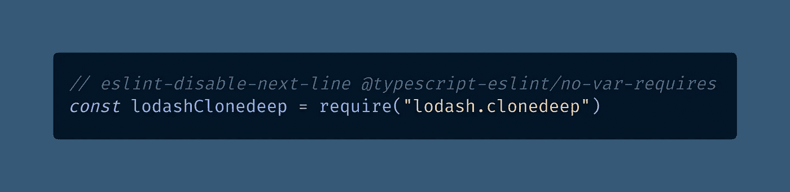
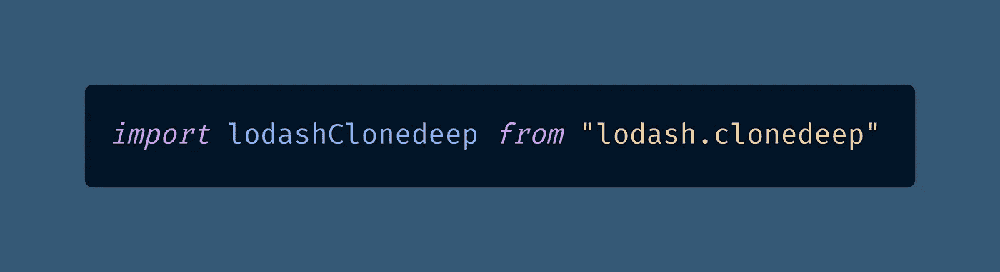
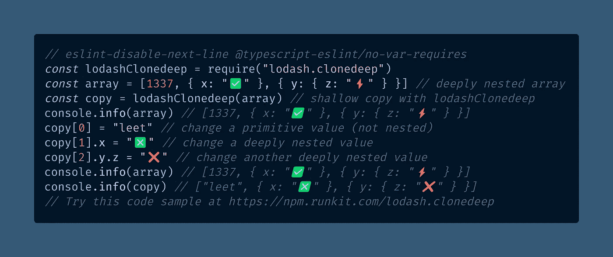
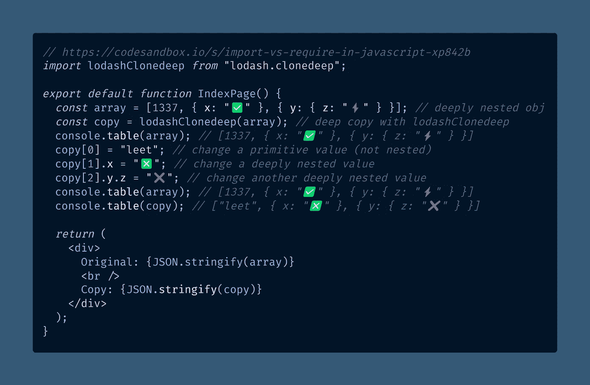
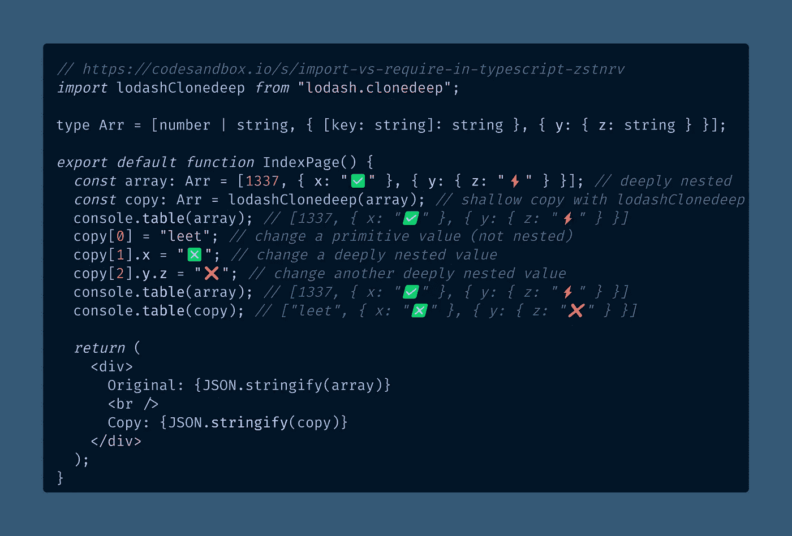
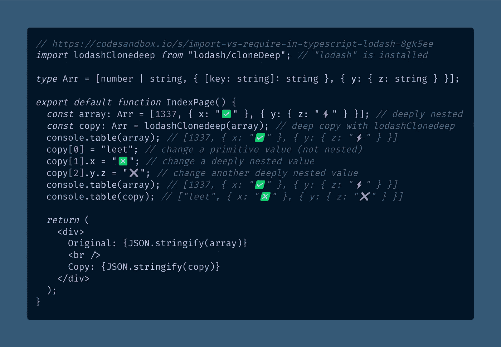
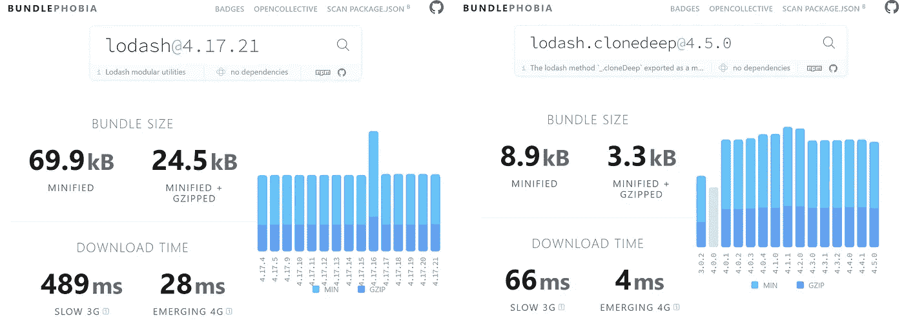

# ES6 导入和 ES5 在 JavaScript 中要求巨大差异

> 原文：<https://javascript.plainenglish.io/the-huge-difference-between-es6-import-and-es5-require-in-javascript-3242c9eae48c?source=collection_archive---------3----------------------->

## 你还在你的代码库中使用`require`吗？让我们尽快让您升级到现代 JavaScript `import`语法。以下是你需要知道的，以及为什么它很重要。

These dogs are named `require` and `import` (Photo by [Kojirou Sasaki](https://unsplash.com/@chelsea777?utm_source=medium&utm_medium=referral) on [Unsplash](https://unsplash.com?utm_source=medium&utm_medium=referral))

想象一下这个场景:你得到一个关于[“no var requires”](https://github.com/typescript-eslint/typescript-eslint/blob/main/packages/eslint-plugin/docs/rules/no-var-requires.md)的 [ESLint](https://betterprogramming.pub/how-to-set-up-vs-code-like-a-pro-in-just-5-minutes-65aaa5788c0d) 警告，并开始写下一行注释禁用它:

\[View the raw code](https://gist.github.com/DoctorDerek/30c4eb5560f26dd5b412f5a5972e7118) as a GitHub Gist

但是等等——您应该禁用 ESLint 警告吗？如果你使用的是[类型脚本](/how-to-sort-imports-in-typescript-automatically-in-vs-code-f4fe4e499bb1)，下面是你应该使用的语法:

[View the raw code](https://gist.github.com/DoctorDerek/fe70965f937936cbf9f25c45005c1b56) as a GitHub Gist

你知道`[require](https://developer.mozilla.org/en-US/docs/Learn/Server-side/Express_Nodejs/Introduction#helloworld_express)`和`[import](https://developer.mozilla.org/en-US/docs/Web/JavaScript/Reference/Statements/import)`的区别吗？如果你是高级开发人员，什么时候可以使用旧的 T4 语法？

# 发生了什么事需要陈述，爷爷？👴

虽然我习惯于避免使用`require`语句，但在我尝试为它们找到 MDN 页面之前，我从未真正想过要写这个话题。

没有了。[针对](https://developer.mozilla.org/en-US/docs/Web/JavaScript/Reference/Statements/import) `[import](https://developer.mozilla.org/en-US/docs/Web/JavaScript/Reference/Statements/import)` [语句](https://developer.mozilla.org/en-US/docs/Web/JavaScript/Reference/Statements/import)的 Mozilla 文档已经完全删除了对`require`的所有引用，转而支持 ES6 语法。

虽然我们都喜欢像 Object.is() 这样的 ES6 语法，但我认为文档中的变化非常极端，直到我开始思考这个问题。

`require`语法比较老(2015 年之前，意思是 ES6 之前)，在“现代 JavaScript”中不常用——这是有原因的！

当您调用`require`时，您正在请求 JavaScript [主线程](https://developer.mozilla.org/en-US/docs/Glossary/Main_thread)(CPU)读入并执行整个包。没有优化。

另一方面，通过使用`import`，你有机会让类似 Webpack 的东西(Next.js [依赖于](https://nextjs.org/docs/api-reference/next.config.js/custom-webpack-config))自动帮你解决问题。

# 是的，这是埃斯林规则

我认为在你的所有项目中保持下面的 [ESLint 规则](https://eslint.org/docs/rules/)是一个好主意——因为你应该尽可能地使用`import`。

> `*no-var-requires*` ( [诚信通文档](https://github.com/typescript-eslint/typescript-eslint/blob/main/packages/eslint-plugin/docs/rules/no-var-requires.md))
> 
> ”换句话说，使用像`var foo = require("foo")`这样的形式是被禁止的。请改用 ES6 风格导入或`import foo = require("foo")`导入。

如果你还没有安装 ESLint，我会等着你阅读我广受欢迎的 *Better Programming* 文章，它会帮你解决这个问题:

 [## 如何在短短 5 分钟内像专业人士一样设置 VS 代码

### 初学者指南

better 编程. pub](https://betterprogramming.pub/how-to-set-up-vs-code-like-a-pro-in-just-5-minutes-65aaa5788c0d) 

# 什么时候可以忽略这个规则？

一般来说，如果你发现自己因为某种原因需要忽略这条规则，你可能做错了。

您可能应该找到一个使用正确的 ES6 导出语法的不同的 npm 包，以便您可以导入而不是需要它。

但是，如果你不使用 [TypeScript imports](/how-to-sort-imports-in-typescript-automatically-in-vs-code-f4fe4e499bb1) 并且不打算执行[树摇动](https://developer.mozilla.org/en-US/docs/Glossary/Tree_shaking)来减少你的 JavaScript 包大小，你可以使用 require。

> `*no-var-requires*` ( [诚信通文档](https://github.com/typescript-eslint/typescript-eslint/blob/main/packages/eslint-plugin/docs/rules/no-var-requires.md))
> 
> **何时不用:**“如果你不在乎 TypeScript 模块语法，那么你就不需要这个规则。”

除了编写一些基本的代码演示或一次性的技巧([比如从浏览器控制台](https://levelup.gitconnected.com/how-to-load-external-javascript-files-from-the-browser-console-8eb97f7db778)加载外部 JavaScript 文件)，避免`require`。

当然，当你想在 RunKit 上尝试一个包[的快速演示时，这很好，但是](https://npm.runkit.com/lodash.clonedeep)[一个基于 NextJS](/the-10-next-11-0-0-features-you-need-to-know-about-from-next-js-conf-ac31d795accd) 构建的现代 JavaScript 应用不应该使用`require`。

这里有一个使用`require`的例子，我们将[使用现代 JavaScript 语法(ES6 `import`语法)重构](https://www.yourdictionary.com/refactor)以提高性能。

[View the raw code](https://gist.github.com/DoctorDerek/a1f5aeaa7f2d5665ecf6523d232e7f67) as a GitHub Gist, then run the code at [https://npm.runkit.com/lodash.clonedeep](https://npm.runkit.com/lodash.clonedeep)

如果您需要解释上面使用`require`的例子中发生了什么，请阅读我关于 JavaScript 深度复制的文章。

 [## 如何在 JavaScript 中深度复制对象和数组

### 复制对象或数组的常用方法只能进行浅层复制，所以深度嵌套的引用是个问题…

javascript.plainenglish.io](/how-to-deep-copy-objects-and-arrays-in-javascript-7c911359b089) 

现在，让我们看看在 Next.js 应用程序中使用`import`的同一段代码，该应用程序设置为通过 React 函数组件呈现相同的数组:

[https://codesandbox.io/s/import-vs-require-in-javascript-xp842b?file=/pages/index.js](https://codesandbox.io/s/import-vs-require-in-javascript-xp842b?file=/pages/index.js)

是的，你可以使用`require` ——但是性能会很差，因为每次 React 渲染组件时你都要重新加载包。

 [## 谷歌的“通过/失败”核心网站要害使性能对搜索引擎优化至关重要

### 谷歌即将处罚慢速网站。如果你关心搜索引擎优化(SEO)和你的排名…

bettermarketing.pub](https://bettermarketing.pub/googles-pass-fail-core-web-vitals-make-performance-matter-for-seo-b8490a5ca5ec) 

性能很重要，这就是为什么你想使用`import`而不是`require`。每次用`require`，一只小狗就开始哭。

等等，这不太对。每次你使用`require`，JavaScript 引擎(也称为 [the node.js V8 编译器](https://v8.dev/))就开始溅射。

也不完全是这样，但更接近了。使用`require`意味着 1)读取代码，2)运行代码，3)将所有代码存储在一个变量中。

你见过谷歌灯塔报告抱怨你的页面上有“未使用的 JavaScript”吗？如果你曾经运行过 Lighthouse，那么你几乎肯定看到过这样的警告。

导致未使用 JavaScript 的一个原因是使用了`require`，加上[阻塞了该死的主线程](https://medium.com/@francesco_rizzi/javascript-main-thread-dissected-43c85fce7e23)，所以不要这样做， [Mmkay？](https://www.urbandictionary.com/define.php?term=mmkay)

# 使用 TypeScript 实现最大的类型安全性

在 TypeScript 中，前面的例子看起来像下面的代码，其中我添加了一个`Arr`类型。还是一个简单的 Next.js (React) app:

[https://codesandbox.io/s/import-vs-require-in-typescript-zstnrv?file=/pages/index.tsx](https://codesandbox.io/s/import-vs-require-in-typescript-lodash-8gk5ee?file=/pages/index.tsx)

# 说真的，我想我需要忽略这条规则

好吧，我对你有点太严格了。我最近提交了禁用这个 ESLint 规则的代码到我项目中的`[next.config.js](https://nextjs.org/docs/api-reference/next.config.js/introduction)`文件中。

您能猜到为什么我需要忽略以文件扩展名`.js`结尾的特定 Next.js 配置文件中的这个 TypeScript 规则吗？

是的，你说得对。在服务器加载之前，Next.js 配置文件就被读取了——在 Webpack(和[next . js SWC 编译器](https://nextjs.org/docs/advanced-features/compiler))可以运行之前。

任何时候，如果你不使用某些东西来处理`import`语句，不管是[一段 RunKit 代码](https://npm.runkit.com/lodash.clonedeep)、[浏览器控制台](https://levelup.gitconnected.com/5-ways-to-log-an-object-to-the-console-in-javascript-7b995c56af5a)，还是[下一个配置文件](https://nextjs.org/docs/api-reference/next.config.js/introduction) *，你可能会发现自己在使用`require`。没关系！

*(*注意:如果你喜欢模块语法，你可以使用 next.config.mjs 文件。我大概应该这么做，而不是用* `*require*` *。哎呦！🥳)*

但是，任何其他时候你想使用`require`，记住小狗，更喜欢`import`——它会对你的应用程序的性能更好。

# 为什么不直接从 Lodash 进口？

最后，我想指出，你可能期望我写`import lodashClonedeep from "lodash/cloneDeep"`，但我没有。

[https://codesandbox.io/s/import-vs-require-in-typescript-lodash-8gk5ee?file=/pages/index.tsx](https://codesandbox.io/s/import-vs-require-in-typescript-lodash-8gk5ee?file=/pages/index.tsx)

我只导入了`[lodash.clonedeep](https://www.npmjs.com/package/lodash.clonedeep)`而没有从已安装的`"lodash"`包中导入`lodash/clonedeep`(意思是`clonedeep`)的原因是，我不想安装整个庞大的`lodash`包，即使[我相信 Webpack 能够正确地自我抖动](https://webpack.js.org/guides/tree-shaking/)。

为什么不呢？嗯，我最近在查看一个`yarn.lock`文件，看到了几十个 lodash 的独立副本，它们有不同的包依赖关系，每个包使用不同的版本。这导致了您所说的[包大小膨胀](https://bundlephobia.com/package/lodash):

[https://bundlephobia.com/package/lodash](https://bundlephobia.com/package/lodash) vs. [https://bundlephobia.com/package/lodash.clonedeep](https://bundlephobia.com/package/lodash.clonedeep)

因此，即使我相信 Webpack、TypeScript、Next.js 和我的工具的其余部分实际上只给了我`clonedeep`函数，仍然可能存在使用各种不同版本的包依赖。

另外，我仍然会犯一个在团队环境中很重要的关键错误——不去想下一个开发人员。

如果我已经将`lodash`作为一个依赖项添加到项目中，为什么我不能将它用于所有的事情呢？如果我什么都用`lodash`，难道我不应该只使用`import _ from "lodash"`并拥有`lodash`的所有功能吗？

# 为什么我导入`lodash.clonedeep`而不是 Lodash

你可以猜到我的回答会是——不，谢谢你，先生。我想要的只是方便的`clonedeep`功能，所以我使用了模块化的`lodash.clonedeep`。当然，*你*可能需要更多的`lodash`；您的里程可能会有所不同。

原因如下。我不想鼓励我团队中的下一个开发人员随意地使用`import _ from "lodash"`，因为我将`lodash`添加到了`package.json`文件中，其中包含了我们项目的所有依赖项。Nuh-uh 。

同时，我也绝对不希望那个开发者使用`require`，所以我希望他们能像你一样花时间阅读这篇文章。谢谢大家！🙏

如果你喜欢这篇文章，你可能会喜欢我的另一篇文章:

 [## 如何在 JavaScript 中舍入到特定的小数位数

### 内置的 Math.round()函数不允许您指定舍入小数的精度。以下是如何…

medium.com](https://medium.com/swlh/how-to-round-to-a-certain-number-of-decimal-places-in-javascript-ed74c471c1b8) 

**编码快乐！** 🥳🙂😉😘😄

That’s a good boy, `import` (Photo by [Karsten Winegeart](https://unsplash.com/@karsten116?utm_source=medium&utm_medium=referral) on [Unsplash](https://unsplash.com?utm_source=medium&utm_medium=referral))

[德里克·奥斯丁](https://www.linkedin.com/in/derek-austin/)博士是《职业编程:如何在 6 个月内成为 6 位数的成功程序员 一书的作者，该书现已在亚马逊上出售。