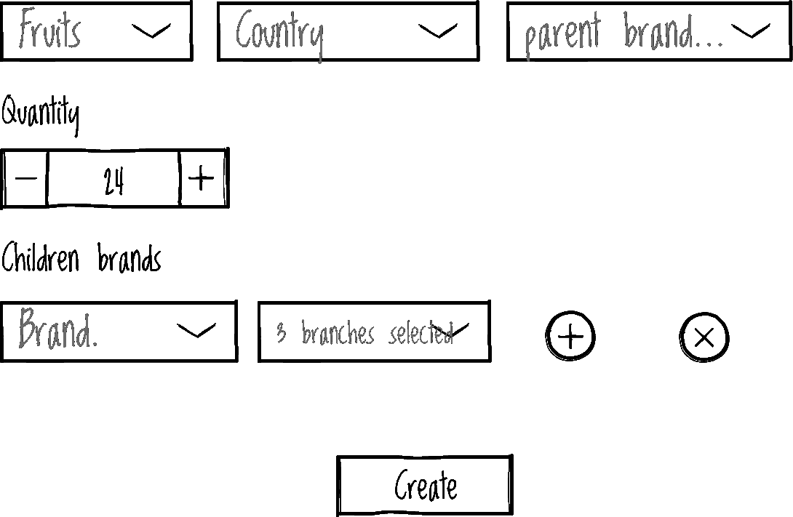

# 理想的前端用户故事

> 原文：<https://javascript.plainenglish.io/the-ideal-frontend-user-story-e2b40f3437b1?source=collection_archive---------8----------------------->

Photo by [Eran Menashri](https://unsplash.com/@chesnutt?utm_source=medium&utm_medium=referral) on [Unsplash](https://unsplash.com?utm_source=medium&utm_medium=referral)

让我们面对现实: [Scrum](https://www.atlassian.com/agile/scrum) 并不完美，虽然许多团队尽最大努力遵循这种方法，但最好的可能方式是，现实世界是狂野的，有时你需要做出妥协来交付价值和满足业务需求。

# 问题

这种不完美的一部分是用户[故事的编写方式](https://www.romanpichler.com/blog/10-tips-writing-good-user-stories/amp/)，有一天我得到了一个只有 UI 设计和标题的故事。

Bad user story

不知何故，这个故事设法逃脱了细化和规划会议，并没有[准备好完成](https://www.scruminc.com/definition-of-ready/)，对我来说，这个故事缺乏[关键方面](https://frontend.turing.edu/lessons/module-3/user-stories.html)一个理想的好前端用户故事应该有:

*   描述性标题，检查✅.
*   最终用户界面设计，检查✅.
*   通过[验收标准](https://www.mobindustry.net/blog/how-to-write-acceptance-criteria-examples-and-best-practices/)明确定义的范围，失败🔴。
*   未知检查:依赖性、可行性、应创建的跟进单？等等，失败🔴。

# 理想的用户故事结构

在现实世界中，如果事情没有准备好，我们有时不能将它们返回到待办事项中，需要满足截止日期，并且像这样的故事需要“一路精炼”，让我们分析这个故事并尽可能精炼它。

# 这些问题

*   **水果名:**水果名有什么字符限制？不应该是文本框，而应该是显示商家提供的所有水果的选择框？
*   **国家:**为什么国家不是一个选择框？
*   **母品牌:**母品牌的价值从何而来？应该硬编码？，还是来自 API 服务？这项服务存在吗？
*   **数量:**放入篮子的水果的最小和最大数量是多少？商家提供的所有水果的数量都一样吗？
*   **(可能是子)品牌:**品牌的价值观从何而来？这些品牌与母品牌相关吗？母子品牌之间存在怎样的交叉验证？物品选择框里的“物品”到底是什么？添加品牌的最大或最小数量是多少？
*   最后，**创建按钮，**创建购物篮的服务存在吗？另外，标签上写着创建和编辑，这个服务也处理编辑功能吗？

# 答案

我们会见了我们的产品负责人、设计师和后端开发人员，之后我们还从真实用户那里了解了英特尔，我们澄清了之前的问题，为我们留下了一个精心制作的用户故事。

**门票名称:**创建一个新的水果篮子莫代尔

**设计:**

A better user story

**验收标准**

**列表屏幕**

*   作为用户，我想从果篮列表屏幕创建一个新的果篮。
*   “添加新篮子”按钮应该显示“创建新的水果篮子”模式。

**水果**

*   水果选择是必填字段，其值来自水果服务。
*   国家是必填字段，我们应该重用现有的国家组件。

**数量**

*   数量是必填字段，是 1 到 10 之间的整数。

**品牌**

*   母品牌选择是必填字段，其值来自品牌服务。
*   儿童品牌的选择和分支是必填字段，其值来自品牌服务。
*   我想在添加或修改子品牌之前选择一个母品牌，至少应选择一个带有分支的子品牌。
*   如果我选择了一个新的父分支，那么子分支应该被重启到初始状态。

**创建**

*   应该满足前面的验证，这样我就可以创建一个正确的果篮。

**加载和错误状态**

*   加载和错误处理应该使用整个应用程序中使用的相同模式。

**依赖关系**

**被覆盖**

*   加载和错误状态机制。
*   篮子水果列表屏幕，门票链接。
*   获取水果服务，服务 swagger 文档。
*   获取品牌服务、服务 swagger 文档(针对母品牌和子品牌)。

**现有的**

*   创建水果篮 API 服务票—要做但 API 合同已定义，同时使用模拟 API。
*   更新水果篮 API 服务票—要做但 API 合同已定义，同时使用模拟 API。

**跟进票**

*   编辑新的水果篮子模式—待办事项
*   为编辑和创建流连接到真正的 API 票证——To do

故事要点:3

关于验收标准，有些人喜欢使用 BDD 来编写清晰的验收标准，我通常也喜欢这样，但是在本文中，为了简洁起见，我们没有使用 given-then-when 公式，但是如果您不熟悉的话，我鼓励您看一下[这个链接](https://revelry.co/insights/development/behavior-driven-development-bdd/)。

# 为产品所有者助一臂之力

作为开发人员，这个问题的解决方案可以是预先提炼故事:问你的产品负责人下一次 sprint 的优先事项是什么，每天花一个小时检查待办事项，查看标签并收集一个问题列表，以进行下一次提炼，这样我们就降低了非常单薄或不清楚的故事到达 sprint 的风险，并且你对业务的了解将随着时间的推移而增加，这总是有价值的。

# 结论

我们在这里编写用户故事的方式并不是唯一的，也不是完美的，事实上，我们肯定会留下一些未知的答案，这些答案可能会在一开始就被发现，并且需要在未来进行一些小的调整，但是嘿:这就是敏捷的魔力，不是吗？适应变化！🙈。

此外，有些人会争辩说，我们不应该在后端或前端、后端或移动之间划分故事，我们应该避免 T2 筒仓方法，我倾向于同意这一点，但有时这是一些组织的工作方式，有时我们应该在试图改变它或逐步改进它之前适应当前的流程，这是另一篇文章的故事。

事情是这样的，本文给出的结构只是一个起点，本文背后真正的要点是无论你使用什么样的用户故事结构，最重要的是:**使用一个能让你理解需求的结构；我们不能在黑暗中创建软件，假设很多东西，询问，提炼，迭代。**

嗨，[在这里](https://davidjsmoreno.dev/)我们谈论软件开发、JavaScript、自学教育和其他东西。

*更多内容请看*[***plain English . io***](https://plainenglish.io/)*。报名参加我们的* [***免费周报***](http://newsletter.plainenglish.io/) *。关注我们关于*[***Twitter***](https://twitter.com/inPlainEngHQ)[***LinkedIn***](https://www.linkedin.com/company/inplainenglish/)*[***YouTube***](https://www.youtube.com/channel/UCtipWUghju290NWcn8jhyAw)*[***不和***](https://discord.gg/GtDtUAvyhW) *。***