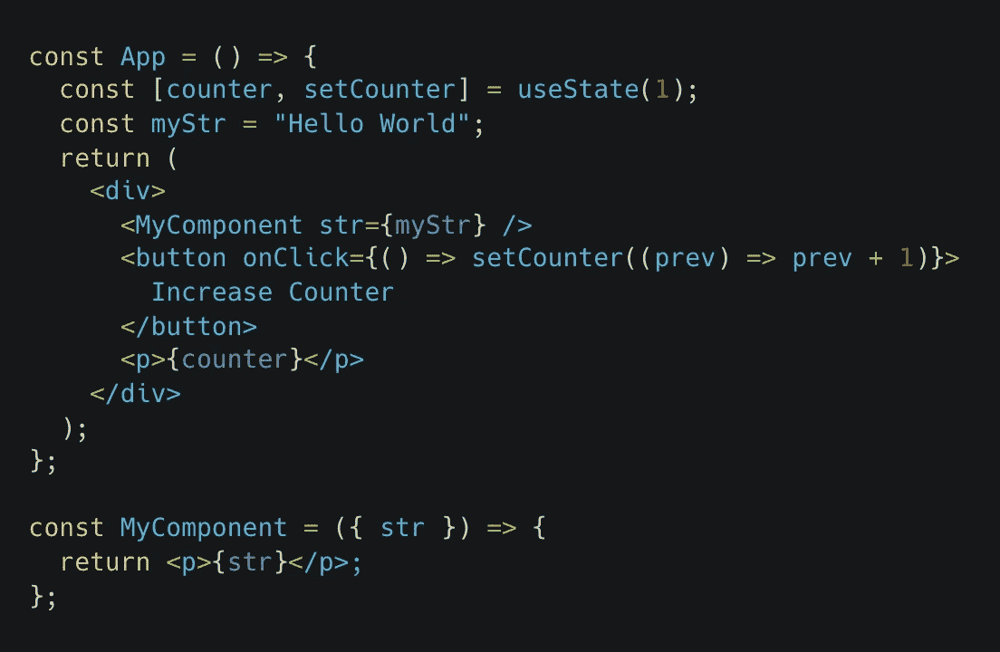
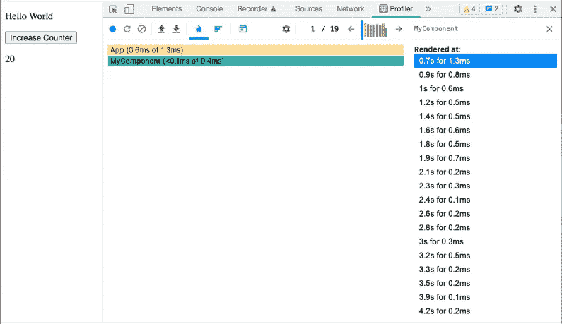
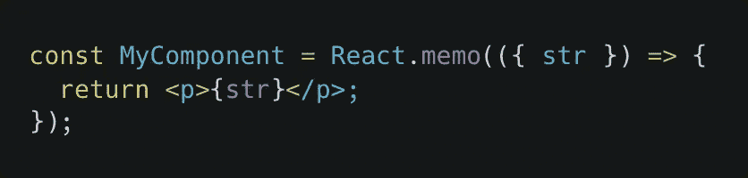
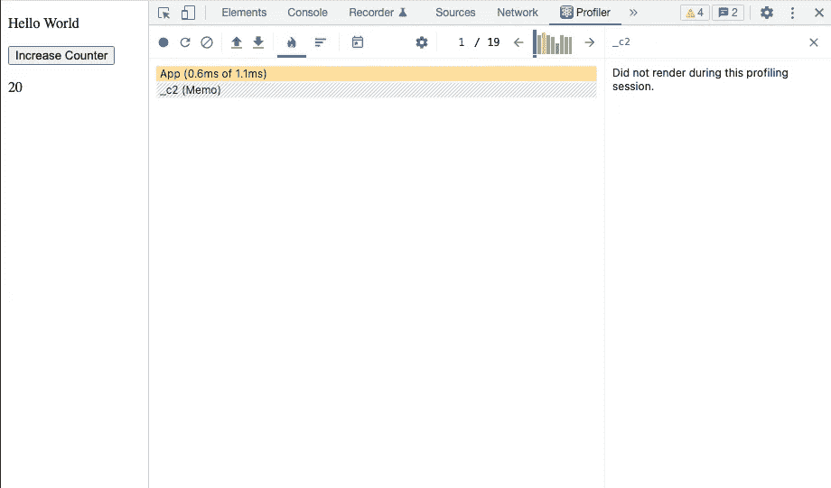
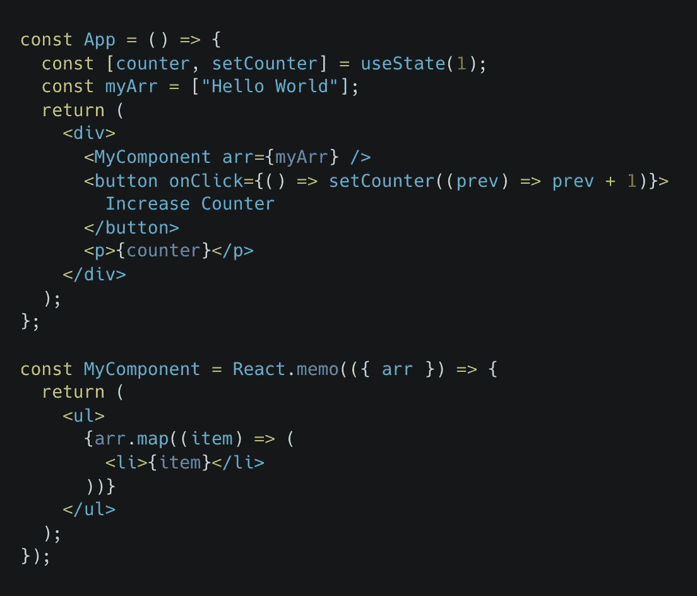
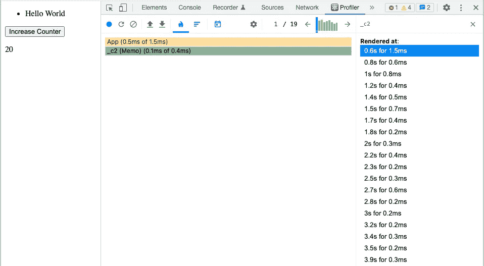

# 在开始使用 React 之前了解 JavaScript 的重要性

> 原文：<https://javascript.plainenglish.io/the-importance-of-knowing-javascript-before-knowing-react-afd0df3274e1?source=collection_archive---------25----------------------->

## 基本概念如何让你成为更好的开发人员，并为你节省大量时间和头痛。


Photo by [Wes Hicks](https://unsplash.com/@sickhews?utm_source=medium&utm_medium=referral) on [Unsplash](https://unsplash.com?utm_source=medium&utm_medium=referral)

最近，我一直在我工作的公司进行 React 面试，我注意到许多开发人员很难回答一些问题，因为他们不熟悉基本的 JavaScript 概念，或者他们不知道如何将它们转化为 React。在本文中，我们将关注 JavaScript 如何处理等式以及在使用 React 时的重要性。

在采访中，当我们谈到优化部分时，我会提出以下问题:

## **重新渲染一个组件需要做什么？**

*当我们传递给组件的道具或其内部状态发生变化时* s ✅

简单一点。好，那么下一个代码呢:



为什么每次我点击*增加计数器按钮*时`*MyComponent*`都会被重新渲染，如果我传递给它的道具总是相同的，并且我没有任何内部状态？🤔

## **我如何知道它正在被重新渲染？**

很多人回答:*我可以在组件*里面放一个 `console.log` *😬*

嗯，这是一种方法，但请不要！🛑

我正在寻找的答案是:*因为我可以使用 React Dev Tools Profiler 来查找它。*

我采访过的大多数开发人员都不知道这个工具的存在，也不知道如何使用它。如果你还没有看过，请去看看🙏

[](https://reactjs.org/blog/2018/09/10/introducing-the-react-profiler.html) [## 介绍 React Profiler - React 博客

### React 16.5 增加了对新的 DevTools profiler 插件的支持。这个插件使用 React 的实验分析器 API 来…

reactjs.org](https://reactjs.org/blog/2018/09/10/introducing-the-react-profiler.html) 

既然我们知道它的存在，那就利用它吧。下面的图片是我点击按钮 19 次后分析器的样子，



React Dev Tools Profiler

我在这里能看到什么？，那个 **MyComponent** 被渲染了 19 次，同样的点击量。

现在回到最初的问题。

## **为什么每次我点击*增加计数器按钮*时*我的组件*都会被重新渲染，如果我传递给它的道具总是相同的，并且我没有任何内部状态？🤔**

TL；DR 的回答是，每次我们点击按钮，我们改变来自 **App** 组件的状态，因此，导致重新渲染，每次渲染都是新的；道具，状态，孩子。所以在每一次渲染中， **MyComponent** 都会被再次渲染，即使看起来那个组件正在接受相同的道具，并且正在破坏我们在开始给出的答案中所陈述的内容。React 就是这么设计的，我们也无能为力。

好了，现在我们已经有点清楚了，让我们继续。

## **那我们怎么防止它被重新渲染呢？(假设这个组件很重，如果道具不变，我不想每次都被重新渲染)**

嗯，有许多解决方案，但是让我们通过使用 [**React.memo**](https://reactjs.org/docs/react-api.html#reactmemo) 来采用[记忆化](https://en.wikipedia.org/wiki/Memoization?oldformat=true)的方式，这是一个 [**高阶组件**](https://reactjs.org/docs/higher-order-components.html) ，它对先前的道具和当前的道具进行简单的(将这个词留到以后)比较，以确定该组件是否应该重新渲染。

要想在记忆之前找到其他解决方案，请查看这篇精彩的文章。

[](https://overreacted.io/before-you-memo/) [## 备忘录之前()

### 有许多关于 React 性能优化的文章。一般来说，如果一些状态更新很慢，你…

反应过度了](https://overreacted.io/before-you-memo/) 

回到使用 *React.memo* 的问题，让我们在下一段代码中修改我们的组件。



让我们打开 profiler 并再次单击按钮，现在我们可以看到我们的组件只被渲染了一次！🎉



Results using React.memo

如果我修改 **MyComponent** 来接收一个数组，而不是一个字符串，会发生什么，如下面的代码所示？



我们再检查一下侧写器。



哦不，它又在渲染了😱为什么？

记得我之前让你留着以后用的那个词吗？是的，浅薄。正如我所说的， *React.memo* 所做的是以前的道具和新道具之间的浅层比较，所以基本上它所做的是:

```
prevProps === nextProps
```

因为我们知道 JavaScript 如何工作(我们应该知道)，我们知道下一个代码返回`false`

```
[] === []
```

这也是 React 认为道具不一样的原因。因为他们是，虽然他们有相同的价值。

幸运的是， *React.memo* 允许我们传递自己的比较器函数作为第二个参数，这样我们可以实现一个更好的方法来比较先前的属性和当前的属性是否相同，以防止渲染。因为我们知道 JavaScript 是如何工作的(我们应该知道),所以我们知道数组不是导致这种行为的唯一类型的属性。

## 结论

现在你知道了，知道 JavaScript 如何工作使我们成为更好的 React 开发者。这一次，我们探索了 JavaScript 处理等式的方式如何在优化之类的事情上发挥巨大的作用，但是对于其他 React 主题，有很多事情也是如此，比如高阶函数、闭包等等。

我的建议是:在 React 之前学习 JavaScript。

干杯！

*更多内容请看*[***plain English . io***](http://plainenglish.io/)*。报名参加我们的* [***免费周报***](http://newsletter.plainenglish.io/) *。在我们的* [***社区***](https://discord.gg/GtDtUAvyhW) *获得独家获得写作机会和建议。*