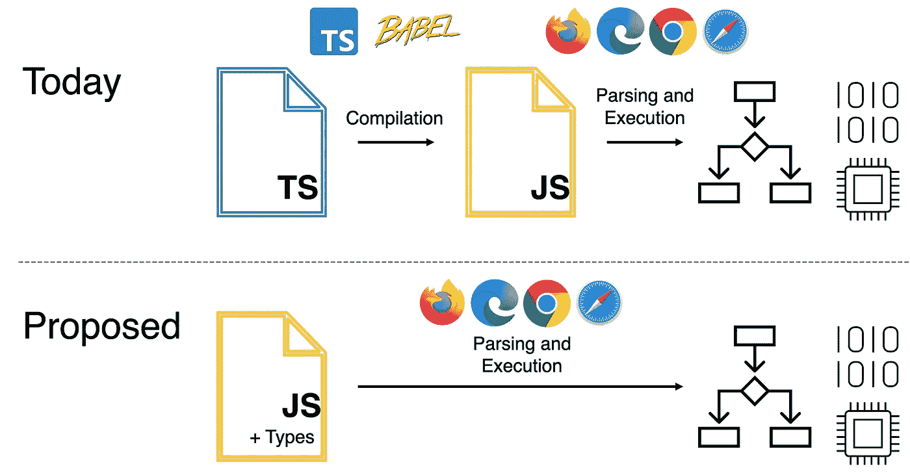

# 类型语法的重要性

> 原文：<https://javascript.plainenglish.io/the-importance-of-type-syntax-507a075fcb5b?source=collection_archive---------14----------------------->

## 为什么我认为 JavaScript 中可选和可擦除类型语法的提议很重要。


Photo by [Ana Khutsishvili](https://unsplash.com/@xuc0?utm_source=medium&utm_medium=referral) on [Unsplash](https://unsplash.com?utm_source=medium&utm_medium=referral)

你可以在当今大多数流行的语言中发现类型语法。Java、Dart、Rust 和 C 语言是少数几种需要现成类型语法的语言。像 Kotlin、Swift 和 Go 这样的语言要么有推断类型，要么你可以显式地推断类型。即使是以初学者友好和没有静态类型语法而闻名的 Python，也从版本 3.5 开始开发了类型。类型语法最近似乎越来越流行。

我不会深入探讨强/弱和静态/动态类型语法的细节，因为本文主要关注的是类型语法的重要性。

当然，类型语法并不是每个开发人员都喜欢的。有些人可能会认为，在代码中处理类型语法会减慢开发过程，特别是如果您有一个紧迫的截止日期或者需要将 MVP 推向生产，类型语法可能是您和您的团队的一个缺点。在运行时，必须不断地确保您的值没有被赋给不同类型的变量可能会很烦人，或者必须键入更多的代码一点也不好玩。有人认为，如果你编写干净的代码，他们代码中的类型语法是不必要的。可读性也是为什么一些开发人员喜欢推断的或动态类型的语法，而不是静态类型的语法。

# 为什么我喜欢打字稿

JavaScript 目前支持类似于类型语法的东西。如果使用 VSCode，可以添加带有 JSDoc 注释的类型文档，然后使用`@ts-check`注释对代码进行类型检查。

```
// @ts-check/**
 * @param bar {number}
 * @returns {number}
 */
function foo(bar) {
  return bar
}
```

这种文档化的方法对我来说有点繁琐，没有必要。另一方面，TypeScript 的行为类似于 Java 和 C，其中在变量声明和/或参数中，有时在返回类型中需要变量类型声明。因此，我认为没有必要像上面那样添加文档。

在我第一次实习后，我看到 TypeScript 在开发人员社区中越来越受欢迎，并决定开始学习它。毕竟，我的大部分工作(如果不是全部的话)都以某种方式与 JavaScript 相关。所以，学习打字只是第二天性。

我想大多数人都会同意，`function foo(bar){}`比`function foo(bar: string): void{}`更容易阅读(对于那些使用 Java 的人来说，`public static void main()`对于那些不熟悉 Java 的人来说可能有点过分)😂).我认为这也是一些开发者不喜欢任何类型语法的原因。显然，并不是所有公司的代码都像 foo 和 bar 那么简单，但随着 repos 变得越来越大，项目的复杂性可能会变得不那么可读。

当使用 TypeScript 进行测试时，我相信它消除了某些测试的冗余。我认为测试变量类型是多余的，因为我已经转而使用 TypeScript 了。每次我编译我的 TypeScript 代码时，它都会在部署和生产构建之前对我的整个项目进行一次小型测试。实际上，在我试图编译它之前，VSCode 会告诉我有一个错误。回到我使用 JavaScript 的时候，测试变量类型是重复的，而且是浪费时间。如果代码中已经有了类型语法，那么就不需要测试变量类型了。

当然，当测试变量类型时，也有一些例外，例如，当变量有多种类型或自定义类型时。

在代码中使用类型语法可以防止一些不必要的变量突变。我曾与经常在 JavaScript 变量声明中使用`var`或`let`的开发人员共事过，让我抓狂的是，改变这些变量是多么容易。我实践(或者至少尝试)从工作到兼职项目编写代码的行业标准，以便编写“好”代码成为我的第二天性。这就是为什么我喜欢使用 TypeScript，它迫使其他开发者对他们写的东西负责。

# 为什么这对我很重要

在我从事许多不同类型的项目以及在 TypeScript 和 JavaScript 之间切换的经历中，我遇到过一个让我抓狂的问题…当一个变量可能为空或未定义，而你必须在它出现的任何地方添加`eslintignore`…

无论如何，我都不是最擅长 TypeScript 的，但是如果我使用的是没有安装类型的新库或包，解决这些小问题有时会有点烦人。我在使用 Web3 和 ethers 时经常遇到这个问题。



Photo from [“A Proposal For Type Syntax in JavaScript by Daniel Rosenwasser”](https://devblogs.microsoft.com/typescript/a-proposal-for-type-syntax-in-javascript/)

可选语法的提议基本上与它所写的一样。是*可选*。该提案的想法是消除浏览器从 TypeScript 到 JavaScript 的转换过程，并使类型语法成为 JavaScript 的一部分。这为许多想要将他们的 JavaScript repos 转换或迁移到 TypeScript 的开发人员和团队消除了障碍！

我认为这对于许多喜欢在将代码转换成 TypeScript 之前用 JavaScript 测试代码的开发人员来说也是非常有益的。我发现自己在从头开始创建新的组件或功能时经常这样做。

# 我的担忧

我对这个提议结果的一个主要担忧是这个“可选”语法的可选性如何。开发者能够在他们的代码中使用部分语法吗(例如`function main(str: string, num): void {}`)？在它的第一个初始版本中会出现多少错误和故障排除？其他库和包将如何与这些变化交互？

你们觉得怎么样？

## 资源

如果有人有兴趣阅读更多内容，请点击这里:

*   [关于 JavaScript 类型语法的提议](https://devblogs.microsoft.com/typescript/a-proposal-for-type-syntax-in-javascript/)
*   [TC39 提案:类型为注释](https://tc39.es/proposal-type-annotations/)
*   [ECMAScript 建议:类型注释](https://github.com/tc39/proposal-type-annotations)

## 来源

[Python 打字文档](https://docs.python.org/3/library/typing.html)

基于 GitHub 的[*octo verse 的 2021 状态*](https://octoverse.github.com/) 和 JetBrain 的 [*开发者生态系统的状态 2021*](https://www.jetbrains.com/lp/devecosystem-2021/) 。

*更多内容看* [***说白了就是***](https://plainenglish.io/) *。报名参加我们的* [***免费每周简讯***](http://newsletter.plainenglish.io/) *。关注我们关于* [***推特***](https://twitter.com/inPlainEngHQ) ， [***领英***](https://www.linkedin.com/company/inplainenglish/) ，*和* [***不和***](https://discord.gg/GtDtUAvyhW) *。*