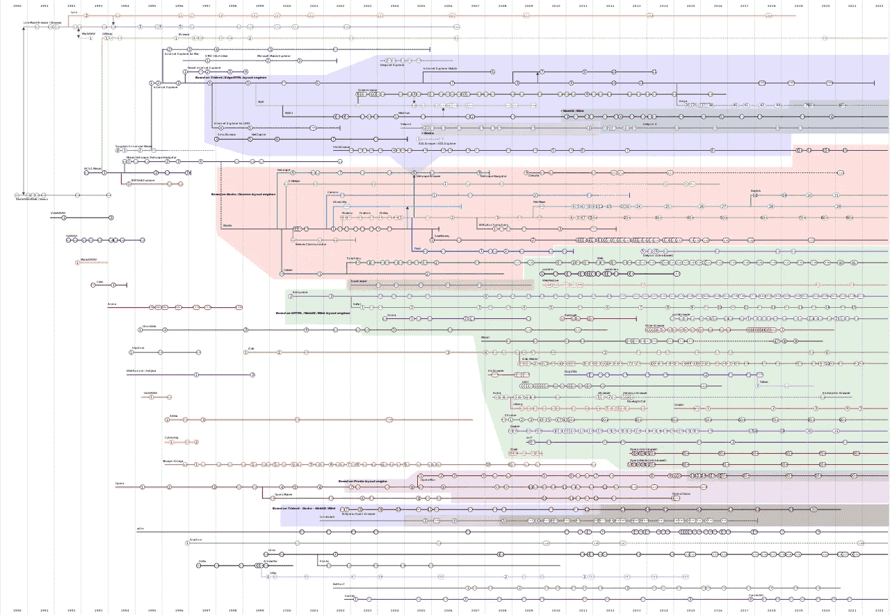

# 网络浏览器的有趣历史

> 原文：<https://javascript.plainenglish.io/the-interesting-history-of-web-browsers-29c37604923b?source=collection_archive---------4----------------------->

## 你的浏览器来自哪里？它是怎么到现在这个位置的？从那以后有什么变化？我们将回答所有这些问题以及更多问题。

网络浏览器有着迷人的历史，可以追溯到 20 世纪 90 年代。我们大多数人都有一个首选的网络浏览器，而有些人使用已经安装或默认的谷歌浏览器。以下是我们今天使用的流行网络浏览器的简史，从头开始。

当试图找到所有 web 浏览器的时间线时，您会发现一个深奥的图形，如下所示:

这个时间线很难破译，包括一堆没人用的垃圾浏览器。在这里，我将时间线解密，只讨论你关心的浏览器(作为一个 web 开发者和用户)。

# 万维网/网络连接

通常，当我们想到第一个网络浏览器时，我们的脑海中会浮现出网景导航器；**不是这样的**。Netscape Navigator 是第三个公开的网络浏览器。

第一个网络浏览器被命名为**万维网**，更名为 **Nexus** 以避免万维网和实际网络浏览器的混淆。

1990 年，创造了万维网的发明家蒂姆·伯纳斯·李爵士发布了世界上第一个网络浏览器。这个浏览器也是创建网页的工具。后来在 1994 年，当更新更好的网络浏览器出现时，它停止了。

 [## 万维网|维基世界

### 您可以通过报告不合适的照片来帮助我们自动选择封面照片。封面在视觉上干扰了…

www.wikiwand.com](https://www.wikiwand.com/en/WorldWideWeb) 

# 猞猁

你还记得以前你只能用终端来输入命令吗？GUI 要么不存在，要么很少使用的时代？我确实不知道；那时候我还没出生。

Lynx 是一个为终端设计的网络浏览器。这是一个基于文本的浏览器，所以忘掉图像和高级 CSS 或动画吧。这个名字来源于这样一个想法，即网站只是一堆带有链接的文本，这些链接可以导航到其他页面。目前仍在积极开发中。如果你访问他们的[网站](https://lynx.invisible-island.net)，你会发现他们的网站可以在浏览器中完美运行(因为他们的网站是基于文本的，但也很难看)。

我第一次尝试 Lynx 是在高中的时候，当时我爱上了 Linux 机器上的终端。

想试用的可以下载。

 [## LYNX -文本网络浏览器

### http://lynx.invisible-island.net/版权所有 1997-2017，2018 是文本网页浏览器。这是…

lynx.invisible-island.net](https://lynx.invisible-island.net) 

# 马赛克/网景导航器

这是我们进入网络的真正起点。正如我们今天所知，Mosaic 是第一个真正的网络浏览器。马赛克通信公司拥有它更名为网景通信公司。新浏览器的名字当时是**马赛克网景**，最终在后续版本中更名为**网景导航**。

JavaScript 是现代网络浏览器中使用的脚本语言，最初是为 Netscape Navigator 开发的。它的创建是为了让开发者能够在他们的网页上增加交互性。这个实验首先被添加到 Netscape Navigator 中，后来扩展到后续的浏览器中。

其他组织也采用了网景导航器的技术。像 Mozilla Firefox 这样的现代浏览器是基于后来的 Netscape Navigator。Netscape Navigator 在 2008 年 2 月发布了最终版本，并重定向用户安装像 Firefox 这样的浏览器，而不是 Netscape。

 [## 网景导航|维基世界

### Netscape Navigator 是一个专有的 web 浏览器，是 Netscape 系列的原始浏览器，从版本 1 到…

www.wikiwand.com](https://www.wikiwand.com/en/Netscape_Navigator) 

# 歌剧

Mosaic 推出他们的浏览器后不久， **Opera** 就诞生了。他们在 1994 年 11 月发布了第一个测试版本。这是一个原始的 web 浏览器，他们使用自己的渲染引擎，并非常快地实现了 Netscape Navigator 中使用的 JavaScript 运行时。

Opera 甚至在 1998 年就有了移动设备浏览器，尽管它们是随着 Android 和 iOS 的发布而起飞的。Opera 的现代版本基于 Chromium，这是谷歌 Chrome 浏览器的开源基础。

# 微软公司出品的 web 浏览器

每个人都知道**Internet Explorer**——它曾经是所有 Windows 机器上的默认浏览器。IE 在 1995 年 8 月问世，微软在 2016 年结束了对它的支持。最近，Internet Explorer 被正式封杀，正在被淘汰出所有 Windows 机器。

四个月后，微软发布了 MAC 版的 ie 浏览器。如今，微软想要主导互联网领域，将自己卷入了一场大官司。

这个浏览器在 2010 年早期就停止支持 HTML、CSS 和 JavaScript 的新功能，所以许多 web 开发人员不再在他们的代码中支持它。到这个时候，大多数人已经转而使用谷歌浏览器、火狐浏览器或苹果浏览器。

# Mozilla Firefox / SeaMonkey

1999 年 3 月，Mozilla 创建了一个互联网套件。他们的浏览器软件最初被命名为 Pheonix，并于 2002 年 9 月推出。2003 年，他们将 Mozilla Pheonix 重新命名为 Firebird，但在 2004 年又将其改为 Firefox。

最初的 Mozilla 浏览器没有被杀死。相反，他们将原来浏览器的名字改为 **Mozilla SeaMonkey** 。SeaMonkey 至今仍在使用和积极开发中。

这两种浏览器都使用 Mozilla 的 Gecko 引擎来呈现网页。Firefox 和 SeaMonkey 在网络浏览器的历史上有着感性的根源；它是 Netscape Navigator 最接近的祖先，如果过时的浏览器继续发展，它看起来会非常类似于 Firefox。

今天，许多网络浏览器都是基于 Firefox 的，但没有一个像 Firefox 和 SeaMonkey 那样与 Netscape Navigator 密切相关。

 [## 下载史上最快的火狐浏览器

### 没有见不得人的隐私政策或广告商的后门。只是一个不会出卖你的快如闪电的浏览器。砰的一声…

www.mozilla.org](https://www.mozilla.org/en-US/firefox/new/?utm_medium=paidsearch&utm_source=google-rsa&utm_campaign=firefox100&utm_content=A144_A203_299443&gclid=CjwKCAjwh-CVBhB8EiwAjFEPGQi4EWNtH8t0z1QBX7g0UEIaFl0PKgtIJMxUmI69LyN3wtxqfEkGihoCjmsQAvD_BwE)  [## SeaMonkey 项目

### SeaMonkey 项目是一个开发 SeaMonkey Internet 应用程序套件的社区项目(见下文)。这样一个…

www.seamonkey-project.org](https://www.seamonkey-project.org) 

# 旅行队

2003 年 6 月，苹果终于为他们的 MAC 电脑发布了内置网络浏览器 **Safari** 。自 1998 年以来，苹果一直致力于开发名为 **Webkit** 的浏览器引擎——如果你是一名网络开发人员，这个名字应该听起来很熟悉。

Webkit 是一个原创的浏览器引擎，如今大多数浏览器都基于它。除了只是一个浏览器引擎之外，它还是一个与 Safari 高度相似的独立浏览器——也被称为 Safari 技术预览版。

Webkit 是 Safari 浏览器的引擎——类似于 Chromium 和谷歌 Chrome。

2007 年，苹果发布了 Safari for Windows 的预览版，并于 2008 年发布了稳定版。2003 年至 2007 年间，苹果公司一直致力于将 Webkit 移植到 Windows 上。这使得谷歌创造了世界上最流行的浏览器 Chromium。

 [## 网络工具包

### WebKit 是 Safari、Mail、App Store 以及 macOS、iOS 和 Linux 上的许多其他应用程序使用的 web 浏览器引擎。获得…

webkit.org](https://webkit.org) 

# 谷歌浏览器

谷歌浏览器是世界上最流行的网络浏览器。它是基于开源的变体， **Chromium** 。许多其他浏览器，如较新版本的 Opera、Microsoft Edge、Vivaldi 和 Brave Browser，都基于 Chromium。

Chromium 不是原创浏览器。**是苹果公司创建的一个 fork(基于)Webkit** 。Google 获取了 Webkit 的源代码，在此基础上进行改进，并开发了 Blink 浏览器引擎。任何基于 Chrome 的浏览器都使用 Blink 浏览器引擎，网页的运行方式与 Chrome 浏览器完全相同。

 [## 谷歌浏览器-从谷歌下载快速、安全的浏览器

### 下载 Chrome For Windows 10/8.1/8/7 32 位。适用于 64 位 Windows 11/10/8.1/8/7。这台电脑将不再接收…

www.google.com](https://www.google.com/chrome/) 

请让我知道你是否使用了一个不太知名的网站来收录它。

如果你喜欢这篇文章，请像这样检查更多。

 [## Internet Explorer 已死:微软臭名昭著的浏览器的下一步是什么

### 微软在 2022 年 6 月 15 日扼杀了 Internet Explorer。以下是对浏览器和微软未来计划的反思。

medium.com](https://medium.com/@thesoggywaffle/internet-explorer-is-dead-whats-next-with-microsofts-infamous-browser-3cc908b796c8)  [## Chrome 103 有什么新功能

### 谷歌 Chrome 的每一次更新都充满了独特的功能。以下是 Chrome 版本的一些新功能…

medium.com](https://medium.com/@thesoggywaffle/whats-new-in-chrome-103-3b118b6dadde)  [## Web 开发:成功的路线图

### 成为一名优秀的 web 开发人员只需要十个步骤。这很简单，我会告诉你怎么做。

javascript.plainenglish.io](/web-development-a-roadmap-to-success-5ed8439c72a2)  [## 每个开发人员都应该使用的 6 个软件开发工具

### 不管你在做哪个项目，也不管你和多少人一起工作，你都应该使用这六个…

javascript.plainenglish.io](/6-software-development-tools-every-developer-should-use-35f7ac771bad) 

*更多内容请看*[***plain English . io***](https://plainenglish.io/)*。报名参加我们的* [***免费周报***](http://newsletter.plainenglish.io/) *。关注我们关于*[***Twitter***](https://twitter.com/inPlainEngHQ)*和*[***LinkedIn***](https://www.linkedin.com/company/inplainenglish/)*。查看我们的* [***社区不和谐***](https://discord.gg/GtDtUAvyhW) *加入我们的* [***人才集体***](https://inplainenglish.pallet.com/talent/welcome) *。*