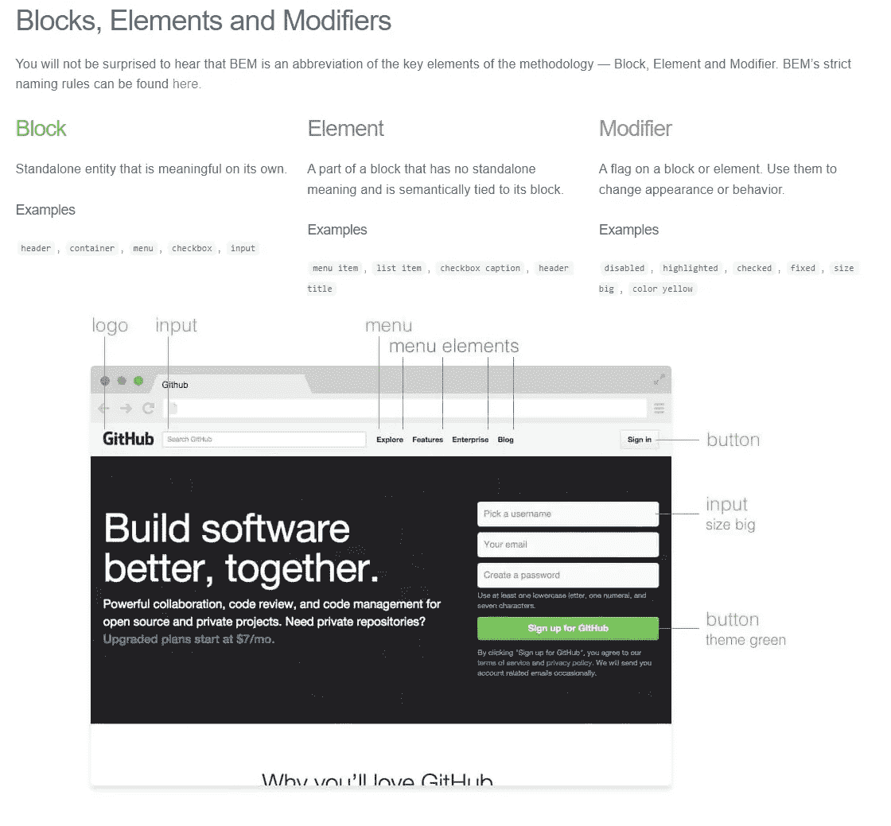

# CSS 架构介绍

> 原文：<https://javascript.plainenglish.io/the-introduction-to-css-architecture-c15b7470196a?source=collection_archive---------7----------------------->

Photo by [Jackson So](https://unsplash.com/@jacksonsophat?utm_source=medium&utm_medium=referral) on [Unsplash](https://unsplash.com?utm_source=medium&utm_medium=referral)

**层叠样式表(CSS)** 是一种定义文档呈现方式的语言。CSS 被用于 HTML、XUL、SVG 和其他标记语言。CSS 使您能够将样式应用于网页。CSS 有 3 个主要版本:CSS 1、2.1 和 3。现在所有的现代浏览器都试图遵循 CSS 2.1，但是一些 CSS 解析器仍然遵循 CSS1 解析规则来支持基本的 CSS。一些浏览器开始在 CSS 2.1 上实现 CSS 3 特性支持，尽管 CSS 3 还在开发中。

你有没有感觉到与 CSS 保持风格一致的挑战？即使很小的 CSS 变化也会影响 JavaScript 的功能。但是这些问题可以通过在项目开始时的仔细规划来避免。

一个好的 CSS 架构具有良好的可扩展性。可伸缩性在任何项目开发中都是一个挑战。编写样式的原生 CSS 语言非常强大，因为 CSS 缺乏无变量、无函数、无抽象机制和无模块机制的概念。

但是，这也导致了编写效率低下，代码维护性差，可重用性低。因此，它很容易理解和学习，但很难掌握。

CSS 的属性互不正交，大量的依赖和耦合难以记忆，规则非常复杂。此外，CSS 选择器的范围是全局的。如果两个选择器同名，后面定义的选择器将覆盖前面的选择器。

例如，不同种类的选择器，如 ID 选择器、类选择器、元素选择器等具有不同的权重，这很容易导致样式相互重叠和冲突。它被称为全球污染。虽然通过区分类名可以避免全局冲突，但是会导致类命名复杂度的增加。

由于这些因素，你会发现修改一行 CSS 来修复一个特性会破坏一堆其他的 CSS 特性，这让你很头疼。因此，仔细规划可以带来一些好处:

1.  更少的风格冲突
2.  更顺利的项目移交
3.  团队成员之间的良好沟通
4.  简单的维护

**编写模块化 CSS 的 4 种流行方式**

1.  面向对象的 CSS (OOCSS)
2.  CSS 的可扩展模块化架构(SMACSS)
3.  不要重复自己 CSS(干 CSS)
4.  块、元素、修改器(边界元)

**SMACSS 规则类型**

[**乔纳森·史努克**](https://snook.ca/about/) 出版了他的著作《[**CSS 的可扩展和模块化架构**](https://www.amazon.com/Scalable-Modular-Architecture-Jonathan-Snook/dp/0985632100) 》解释了 [**的概念，对 CSS 规则进行了分类**。](http://smacss.com/book/categorizing)我使用 7 个类别来定义规则集，大多基于 SMACSS 推荐的实践。

1.  **基础款式**

它是创建在基本 HTML 元素上的基本样式规则，如`<a>`标签、标题、排版等。或者像流行的[框尺寸重置](https://www.paulirish.com/2012/box-sizing-border-box-ftw/)一样应用固执己见的重置。

**2。对象**

它只关注结构和布局，结构和布局定义了元素如何响应其内容框的高度和宽度。它适用于图像、视频和其他可嵌入的媒体格式，但不允许修改类的样式。目的是重用相同结构和布局的页面模式。这是因为您可以将这些样式映射到对象类，以避免冗余并减小 CSS 的大小。

**3。组件**

组件是独立的、自包含的 UI 设计。组件包含选择器、属性和值。目的是使组件独立，您可以将组件放置在页面上的任何位置，并保持其设计和结构。

**选择器:**类名，id 名，或元素名
**属性:**你想要样式化的属性名，例如边框，颜色，背景，位置等。
**属性值:**将分配给属性的值。

**4。状态**

State 类通过定义链接如何启用或禁用、元素如何隐藏或可见、accordion 如何展开或折叠来帮助修改组件的状态。

**5。主题**

主题类将一个组件更改为使用独特的颜色、字体或其他装饰。它还可以修改整个页面。不是每个项目都需要，但是需要的时候就用。

**6。公用事业**

它被视为一个工具集类。目的是帮助我们应用特殊的样式规则。它们可用于修改间隙、增加字体大小、居中文本、添加清晰的修正、隐藏等。它通过在组件之间添加间隙或清除浮动来帮助您微调布局。

**7。JavaScript 挂钩**

Js 钩子用于拦截过程、文档对象模型( **DOM** )、样式，并可能改变它们的行为方式。当 CSS 被重构，JavaScript 依赖不明确时，Js hook 子类就是为了解决这类问题而设计的。

**班名**

作为一名优秀的 CSS 程序员，创建描述性的、有意义的名称是最棘手的问题之一。 [**伊森·穆勒**](https://twitter.com/ethanmuller) 写了一篇很棒的文章《 [**命名 CSS 的东西真的很难**](https://sparkbox.com/foundry/naming_css_stuff_is_really_hard) 》，他更详细地解释了这件事。

然而，当涉及到更大更复杂的项目时，你如何组织你的代码显示了你的编码能力。

[**块元素修改器命名方法**](http://getbem.com/introduction/)

*   一种非常流行的命名方法，因为它比其他方法(如 SMACSS)更容易混淆。
*   这种方法将训练你根据一组独立的模块来思考布局，而不是我如何设计这个页面
*   一些常见的边界元规则:
*   (1)你想只用类来构建选择器。
*   (2)类名以**块/模块**的名称开始，接下来是元素的名称(紧跟在 2 个下划线/__ 之后)，最后是装饰者的名称(在 2 个破折号/—)之后。
*   (3)装饰器可以应用于块和元素
*   (4)任何元素都不能出现在其块之外
*   (5)元素可以嵌套在其块内
*   (6)块是独立的，可以重用。
*   (7)使用布局类

[http://getbem.com/introduction/](http://getbem.com/introduction/)

*   边界元命名法有三个优点:
*   1)可读性:对大多数元素的类名使用清晰的描述
*   2)自描述性:使用层次化的类名，使组件所属的类别非常清楚。级联继承风格不再有问题
*   3)特异性:向组件中的每个元素添加一个类可能有点过分，但是这样做，可以保持每个选择器的特异性较低，使覆盖更加直接

下面有很多链接。如果你想有更好的理解，请点击链接，否则，请忽略它们。我会花一些时间来消化它们，并向你提供有价值的信息。

> D isclaimer:大部分内容来自[深思熟虑的 CSS 架构](https://sparkbox.com/foundry/thoughtful_css_architecture)

**进一步研究**

**材料**

 [## 网页设计组的 HTML 帮助

### 网页设计组的成立是为了促进非浏览器特定的，非解决方案特定的，创造性的，和…

www.htmlhelp.com](https://www.htmlhelp.com/) 

**命名空间**

 [## 带有名称空间的更透明的 UI 代码

### 哈利·罗伯茨写的 CSS 魔法。目录名称空间对象名称空间:o 组件名称空间…

csswizardry.com](https://csswizardry.com/2015/03/more-transparent-ui-code-with-namespaces/) 

**代码样式**

 [## GitHub - necolas/idiomatic-css:编写一致的、惯用的 css 的原则。

### 下面的文档概述了 CSS 开发的合理风格指南。这些指导方针强烈鼓励…

github.com](https://github.com/necolas/idiomatic-css)  [## 谷歌 HTML/CSS 样式指南

### 这个文档定义了 HTML 和 CSS 的格式和样式规则。它旨在改善协作、代码质量…

google.github.io](https://google.github.io/styleguide/htmlcssguide.html)  [## 初级 CSS

### GitHub 初级设计系统的 CSS

底漆.风格](https://primer.style/css/) 

**贝姆**

**组织机构代码**

 [## Sass:语法上很棒的样式表

### 语法上很棒的样式表

语法上令人敬畏的风格 Sheetssass-lang.com](https://sass-lang.com/)  [## 入门| Less.js

### Less 扩展了 CSS 的动态行为，比如变量、混合、操作和函数。更少的运行在两个…

lesscss.org](https://lesscss.org/)  [## 富有表现力、动态、健壮的 CSS

### 一旦你有了 Node.js，安装 Stylus 是非常容易的

stylus-lang.com](https://stylus-lang.com/)  [## PostCSS

### 借助 JavaScript 的力量改造 CSS。自动前缀、未来的 CSS 语法、模块、林挺等等都是可能的…

postcss.org](https://postcss.org/) 

**倒三角 CSS**

 [## 使用新的 CSS 架构 ITCSS 管理大型 web 项目

### youtube: hz76JIU_xB0 CSS 架构现在很流行。毫无疑问，这件事你已经听 T21 提起过了…

www.creativebloq.com](https://www.creativebloq.com/web-design/manage-large-scale-web-projects-new-css-architecture-itcss-41514731) 

**更好的 CSS 架构**

 [## CSS 指南

### CSS 指南是我写的一个文档，哈利·罗伯茨。我是来自英国的顾问前端建筑师，我帮助…

cssguidelin.es](https://cssguidelin.es/)  [## CSS 架构和性能工程- CSS 魔法

### 关于 CSS、OOCSS、前端架构、可伸缩性和性能的文章。

csswizardry.com](https://csswizardry.com/)  [## 主页 stubbornella/oocss Wiki

### 此时您不能执行该操作。您已使用另一个标签页或窗口登录。您已在另一个选项卡中注销，或者…

github.com](https://github.com/stubbornella/oocss/wiki) 

[https://snook.ca/about/](https://snook.ca/about/)

**浏览器幕后工作**

 [## 浏览器如何工作:现代网络浏览器的幕后——html 5 摇滚

### 网络浏览器是使用最广泛的软件。在这本初级读本中，我将解释它们是如何在幕后工作的。我们会…

www.html5rocks.com](https://www.html5rocks.com/en/tutorials/internals/howbrowserswork/#CSS_parsing) 

**Youtube 教程**

**参考文献**

 [## 深思熟虑的 CSS 架构和组织

### 架构:复杂或精心设计的结构你曾经参与过的 CSS 项目…

sparkbox.com](https://sparkbox.com/foundry/thoughtful_css_architecture)  [## CSS 架构-应用工程

### 对于许多 Web 开发人员来说，擅长 CSS 意味着你可以制作一个可视化的模型，并在代码中完美地复制它。你…

engineering.appfolio.com](https://engineering.appfolio.com/appfolio-engineering/2012/11/16/css-architecture)  [## 什么是 CSS？CSS、CSS2 和 CSS3 之间的区别

### 级联样式表，通常称为 CSS，是 HTML 元素上的样式层，或者更简单地说，它…

hackr.io](https://hackr.io/blog/difference-between-css-css2-and-css3)  [## 实现 SMACSS:CSS 的可扩展和模块化架构

### 当我们谈论应用程序的可伸缩性时，我们很少提到 CSS。可扩展性通常会提高…

www.lambdatest.com](https://www.lambdatest.com/blog/smacss-scalable-modular-architecture-for-css/)  [## 安装-顺风 CSS

### 对于大多数项目来说(为了利用 Tailwind 的定制特性)，你需要通过…

v1.tailwindcss.com](https://v1.tailwindcss.com/docs/installation)  [## 保罗·爱尔兰

### 我最不喜欢 CSS 布局的一个部分是宽度和填充的关系。你正忙着定义…

www.paulirish.com](https://www.paulirish.com/2012/box-sizing-border-box-ftw/)  [## CSS:CSS 重置的现代替代方案

### CSS 的现代替代重置 NPM npm 安装保存 normalize.css CDN 见…

github.com](https://github.com/necolas/normalize.css/)  [## 防止重构的 CSS 类名

### 这不是一篇关于 CSS 架构的文章。这也不是一篇关于命名约定的文章。相反…

sparkbox.com](https://sparkbox.com/foundry/naming_css_stuff_is_really_hard)  [## 边界元-块元修改器

### 在较小的宣传册网站上，如何组织你的风格通常不是一个大问题。你进去，写一些 CSS…

getbem.com](http://getbem.com/introduction/)  [## CSS 教程

### CSS 是级联样式表的简称。CSS 用于设计网页或 web 应用程序中 HTML 元素的样式。这个 CSS…

tutorials.jenkov.com](http://tutorials.jenkov.com/css/index.html)  [## CSS 组件-温泉用户界面

### Onsen UI 的交互式、可轻松定制的 CSS 组件列表。iOS 和 Android。

温泉城](https://onsen.io/v2/api/css.html)  [## GitHub - zhangxinxu/zxx.lib.css:一个 css 库，用于快速布局，尤其是流程布局

### 如你所知，有些 CSS 样式使用非常频繁。例如，显示:无-最常用的方法…

github.com](https://github.com/zhangxinxu/zxx.lib.css) 

如果你发现我的任何文章有帮助或有用，那么请考虑给我一杯咖啡，帮助支持我的工作或给我赞助😊，通过使用

[帕特里翁 ](https://www.patreon.com/jinlowmedium)

[**Ko-fi.com**](https://ko-fi.com/jinlowmedium)

[buymeacoffee](https://www.buymeacoffee.com/jinlowmedium)

*最后但同样重要的一点是，如果你还不是灵媒会员，并打算成为灵媒会员，我恳请你使用以下链接。我将收取你的一部分会员费，不增加你的额外费用。*

 [## 用我的引荐链接-金加入 Medium

### 作为一个媒体会员，你的会员费的一部分会给你阅读的作家，你可以完全接触到每一个故事…

jinlow.medium.com](https://jinlow.medium.com/membership) 

*更多内容请看*[***plain English . io***](http://plainenglish.io/)*。报名参加我们的* [***免费周报***](http://newsletter.plainenglish.io/) *。在我们的* [***社区***](https://discord.gg/GtDtUAvyhW) *获得独家获得写作机会和建议。*