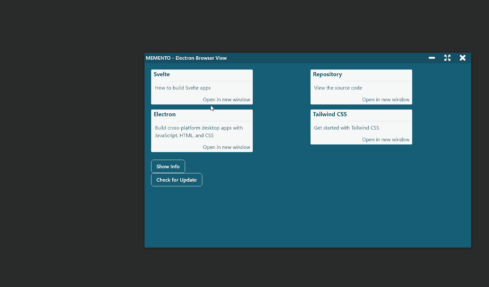
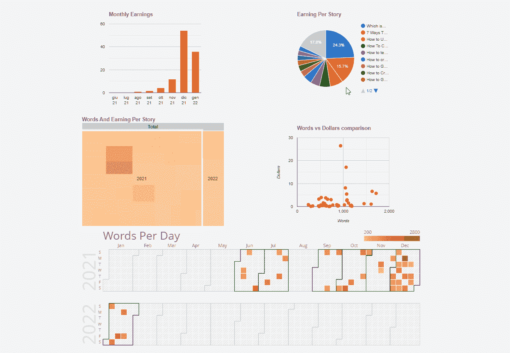
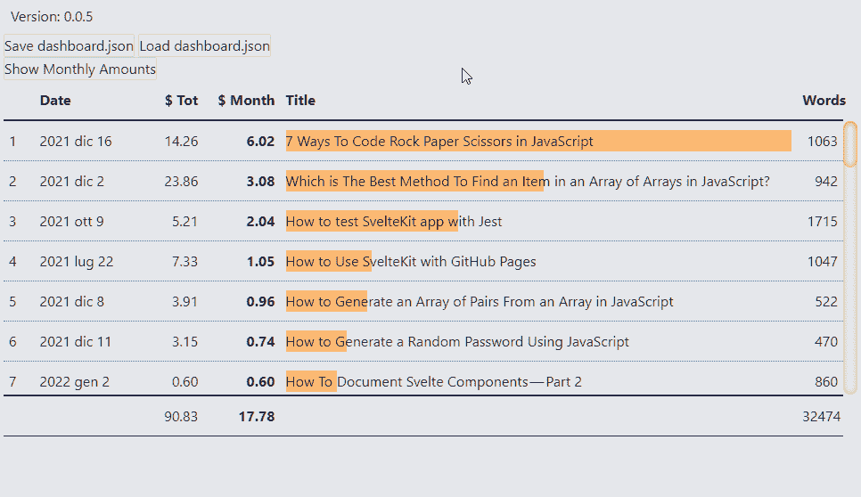

# 一个程序员的旅程

> 原文：<https://javascript.plainenglish.io/the-journey-of-a-programmer-january-2022-65b46994dfa1?source=collection_archive---------19----------------------->

## 记录我作为程序员到 2022 年 1 月的进步。

Photo by [Matese Fields](https://unsplash.com/@tesecreates?utm_source=medium&utm_medium=referral) on [Unsplash](https://unsplash.com?utm_source=medium&utm_medium=referral)

距离我上次更新已经一个多月了:是时候进行一次新的更新了。迟早我将能够实现这些报告的规律性。我应该每月做一次。首先，对我来说，它们是用来理解我是如何进行的:给出一个规律性应该会给我带来一些好处。

反正我是从我上次(在【2021 年 12 月中旬)写的东西开始。

# 订阅模式

我还是想不通这个平台怎么用。这可能不适合我的目的:记录我所做的事情，并可能收到反馈。我在 Medium 上得到一些有趣的评论。不全是正面的，不全是赞同我写的。但是所有这些都是有益的，有助于成长和提高。帕特里翁号。

解决方法是在 Patreon 上发表我的文章吗？或者报告我在博客和媒体上发布的内容？

关于这一点，我可以通过插入朋友链接，使用 Patreon 来表示在媒体上发布的内容吗？通过这种方式，Patreon 上这篇文章的读者可以获得文章的完整版本，而不必向 Medium 支付订阅费。这是我必须考虑的事情。

# GEST-仪表板

我的主要项目 GEST-DASHBOARD 取得了一些进展。我很满意。

12 月，我强调了我遇到的一些问题。这些问题与通过浏览器进行电子和文件管理有关。嗯，我能够(部分)解决这两个问题。然而，还有许多细节有待界定。我必须想出如何把不同的部分组合在一起。

我创建了两个存储库。首先，[el3um 4s/memento-electron-browser-view](https://github.com/el3um4s/memento-electron-browser-view)，我尝试了如何使用浏览器视图来显示 Electron 之外的网页。我不重复这些步骤，我参考一篇更完整的文章:

 [## 如何使用浏览器查看电子版

### 了解如何管理多个窗口

better 编程. pub](https://betterprogramming.pub/how-to-use-browserview-with-electron-9998fa834b44) 

想法是使用这种技术来查看保存在 PC 上的独立应用程序。这要归功于阿什利·古伦的一个想法:[Ashley scirra/serve folder . dev](https://github.com/AshleyScirra/servefolder.dev)。从这个画布开始，我创建了自己的版本，[el3um 4s/svelte-server-folder](https://github.com/el3um4s/svelte-server-folder)。对于技术细节，我参考这篇文章:

 [## 使用 TypeScript 和 Svelte 在浏览器中直接托管 Web Dev 文件的本地文件夹

### 为你的浏览器提供一个本地文件夹

better 编程. pub](https://betterprogramming.pub/host-a-local-folder-of-web-dev-files-directly-in-the-browser-using-typescript-and-svelte-397c113a8bf8) 

下一步将是合并这两个项目，看看我能否让它们一起工作。

# 苗条的

从我的文章历史中你可以看出，我非常关注斯维特。

12 月初，我还在考虑如何记录我的 Svelte 组件。我已经完成了与这个想法相关的知识库。我在这里已经详细讨论过了:

 [## 如何记录纤细的组件—第 2 部分

### 如何轻松记录使用 Svelte 创建的 web 组件的指南。

javascript.plainenglish.io](/how-to-document-svelte-components-part-2-9db50dff8f38) 

这份工作比我计划的要长，迫使我深入研究一些技术方面的问题。

之后，我开始了一个稍微复杂一点的项目:如何创建一个仪表板来查看我的中型统计数据。做一些更复杂的事情很有启发性。我花了很多时间想办法[创建响应表](https://betterprogramming.pub/how-to-create-responsive-data-tables-with-css-grid-9e0a37394450)并插入[图表](https://betterprogramming.pub/visualize-your-medium-stats-with-svelte-and-javascript-eb1ef7c71a63)。

显然，我离我想达到的目标还很远，但我并不着急:这是很好的训练。

在接下来的几天和几周，我想深化两件事:

*   如何创建上下文菜单
*   如何创建侧面菜单

# 练习

说到培训，我参加了开发降临日历。它非常有用，原因有二:

1.  帮助我每天面对不同的问题
2.  它帮助我每天写一些东西

一月份，我错过了这个习惯。这个月初，我以为我可以做类似的事情，但是……嗯，不，我甚至还没有离开。我想在练习和稍微复杂一点的实验之间找到平衡。但是我必须找到一个好的“练习册”。许多互联网用户推荐这些网站:

*   [代码大战](https://www.codewars.com/)
*   [LeetCode](https://leetcode.com/)
*   [黑客银行](https://www.hackerrank.com/)
*   [编码名称](https://www.codingame.com/)

这个月我想知道什么最适合我的需求。

# 中等

最后是中杯。一月份，我写得更少了。但是我非常感谢收到的评论，尤其是[更好编程](https://betterprogramming.pub/)和[简单英语 JavaScript](https://javascript.plainenglish.io/)的建议。写作帮助我专注于想法，跟踪我学到的东西，记住技巧和步骤。

但是有一件事我想做。每天我都阅读不同的东西，不仅仅是在媒体上。有些是很容易被遗忘的，但有时也有一些真正有趣的故事。不仅仅是编程和编码。我想记录下这些小小的发现。也许是通过时不时地写一个“阅读技巧”的帖子。这是我要考虑的另一件事。

感谢阅读！敬请关注更多内容。

***不要错过我的下一篇文章—报名参加我的*** [***中邮箱列表***](https://medium.com/subscribe/@el3um4s)

 [## 通过我的推荐链接加入 Medium—Samuele

### 阅读萨缪尔的每一个故事(以及媒体上成千上万的其他作家)。不是中等会员？在这里加入一块…

el3um4s.medium.com](https://el3um4s.medium.com/membership) 

*原载于 2022 年 2 月 2 日 https://blog.stranianelli.com***。**

**更多内容看* [***说白了。报名参加我们的***](http://plainenglish.io/) **[***免费每周简讯***](http://newsletter.plainenglish.io/) *。在我们的* [***社区不和谐***](https://discord.gg/GtDtUAvyhW) *获得独家获得写作机会和建议。****