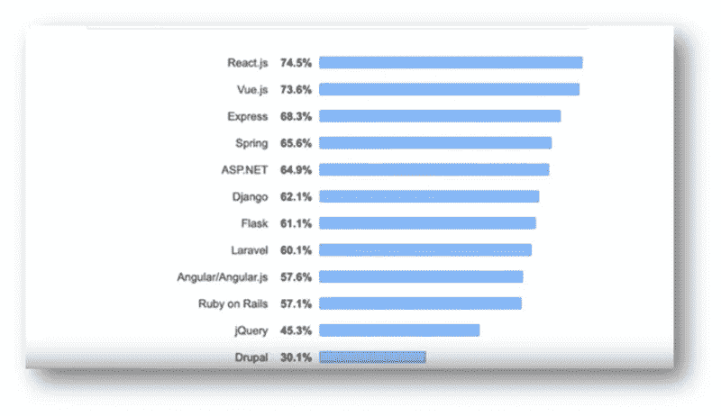

# 建立网站所需的知识

> 原文：<https://javascript.plainenglish.io/the-knowledge-required-to-build-a-website-a2639215684d?source=collection_archive---------18----------------------->

## HTML、CSS、JavaScript、Vue.js、React、Angular、Apache、PHP、MySQL——学习这些来建设网站。

Photo by [Florian Olivo](https://unsplash.com/@florianolv?utm_source=medium&utm_medium=referral) on [Unsplash](https://unsplash.com?utm_source=medium&utm_medium=referral)

几天前，我和我的室友建了一个网站。这就是我最近停止写文章的原因。建网站应该学什么？如果你有耐心学习，我会推荐 HTML，CSS，JavaScript，React，Vue.js，PHP，和 MySQL，如果你是前端开发人员。

 [## WampServer

### WampServer 64 位(x64)3 . 2 . 6 wamp server est disponible gratuity(sous license GPL)。你记得吗…

www.wampserver.com](https://www.wampserver.com/en/) 

它需要你安装软件，我会推荐 WampServer，它包括 Apache，PHP 和 MySQL。

首先，你应该学习 HTML 和 CSS。两者都非常容易理解。w3school 上有很多教程。其次，你要学习 javascript，它比 HTML 难多了，还有 CSS。同样，w3school 的教程也适合学习。

但是，如果你想更好地理解，我强烈推荐下面的两本书。可以学习实际的应用场景。更好理解就容易多了。jQuery 是 web 开发前端的起点。毫无疑问，jQuery 是一个非常好的 JavaScript 库。但随着 React、Angular、Vue.js 等模型-视图-视图模型(MVVM)的不断流行，他们的数据驱动开发方式大大提高了 web 开发效率，也更容易维护。

 [## DOM 脚本:使用 JavaScript 和文档对象模型的 Web 设计

### DOM 脚本:使用 JavaScript 和文档对象模型的网页设计

amzn.to](https://amzn.to/3KjUyms) 

[https://amzn.to/3r9qqTw](https://amzn.to/3r9qqTw)

**The popularity results from** [**Jean Galea**](https://jeangalea.com/angular-vs-react-vs-vue/)

目前，有 3 个主要的框架，Vue，React 和 Angular。[这篇文章](https://medium.com/swlh/angular-vs-react-vs-vue-802a7c5f7e50)很好地解释了消除这三者之间选择的困境。从结果来看，我要说的是，它应该有反应，Vue 的评级相当不错。综合我同事的几篇文章和建议，Vue 本身比较简单，但难点是不太好学的 Vue 家族桶系统，nodeJs。我看了《[如何用 Node.js](https://medium.com/bb-tutorials-and-thoughts/how-to-develop-and-build-vue-js-app-with-nodejs-bd86feec1a20) 开发构建 Vue.js App》这篇文章，可能会对你有一个整体的了解。如果对前端不感兴趣，可以忽略这部分。

你在学习 JavaScript 的时候，可能接触过数据交换，比如 AJAX(=异步 Javascript 和 XML)。这个时候，你就可以开始学习 PHP 了。这需要很多细节来处理。所以，我会推荐另一本书。

 [## PHP 和 MySQL Web 开发(开发人员库)

### PHP 和 MySQL Web 开发(开发者的图书馆)[Welling，Luke，Thomson，Laura]关于 Amazon.com。*免费*送货到…

amzn.to](https://amzn.to/3j9eTiu) 

如果不需要通过 Linux 服务器部署，PHP 和 apache 与 Windows 的兼容性非常好。现在微软有了 Windows Subsystem for Linux (WSL)，也就是说你可以直接在 Windows 中使用 Linux 系统进行开发。建议了解 WSL。

希望这篇文章能帮到你。

**参考文献**

 [## HTML 教程

### 使用我们的“自己尝试”编辑器，您可以编辑 HTML 代码并查看结果:单击“自己尝试”…

www.w3schools.com](https://www.w3schools.com/html/)  [## W3。CSS 主页

### W3。CSS 更小，更快，更容易使用。W3。CSS 是一个现代的，反应灵敏的，移动优先的 CSS 框架。W3。CSS…

www.w3schools.com](https://www.w3schools.com/w3css/defaulT.asp)  [## JavaScript 教程

### JavaScript 是世界上最流行的编程语言。JavaScript 是网络的编程语言…

www.w3schools.co](https://www.w3schools.com/js/)  [## AngularJS 教程

### AngularJS 用新的属性扩展了 HTML。AngularJS 非常适合单页应用程序(spa)。AngularJS 很容易…

www.w3schools.com](https://www.w3schools.com/angular/)  [## 什么是 Vue.js

### Vue.js 让你用称为指令的 HTML 属性扩展 HTML

www.w3schools.com](https://www.w3schools.com/whatis/whatis_vue.asp)  [## React 教程

### W3Schools 提供所有主要网络语言的免费在线教程、参考资料和练习。覆盖…

www.w3schools.com](https://www.w3schools.com/REACT/DEFAULT.ASP)  [## AJAX 简介

### AJAX 是开发人员的梦想，因为您可以:更新网页，而无需从服务器重新加载页面请求数据…

www.w3schools.com](https://www.w3schools.com/xml/ajax_intro.asp)  [## MVC 与 MVVM:示例的主要区别

### MVC 框架是一种架构模式，它将应用程序分成三个主要的逻辑组件模型…

www.guru99.com](https://www.guru99.com/mvc-vs-mvvm.html)  [## 安装 WSL

### 您必须运行 Windows 10 版本 2004 和更高版本(内部版本 19041 和更高版本)或 Windows 11。请注意检查您的…

docs.microsoft.com](https://docs.microsoft.com/en-us/windows/wsl/install) 

***如果你发现我的任何文章有帮助或有用，那么请考虑给我一杯咖啡，帮助支持我的工作或给我赞助😊，通过使用*中的**

[**Patreon**](https://www.patreon.com/jinlowmedium)

[**Ko-fi.com**](https://ko-fi.com/jinlowmedium)

[buymeacoffee](https://www.buymeacoffee.com/jinlowmedium)

*最后但同样重要的一点是，如果你还不是灵媒会员，并打算成为灵媒会员，我恳请你使用以下链接。我将收取你的一部分会员费，不增加你的额外费用。*

 [## 用我的引荐链接-金加入 Medium

### 作为一个媒体会员，你的会员费的一部分会给你阅读的作家，你可以完全接触到每一个故事…

jinlow.medium.com](https://jinlow.medium.com/membership) 

*更多内容请看*[***plain English . io***](http://plainenglish.io/)*。报名参加我们的* [***免费周报***](http://newsletter.plainenglish.io/) *。在我们的* [***社区***](https://discord.gg/GtDtUAvyhW) *获得独家获得写作机会和建议。*