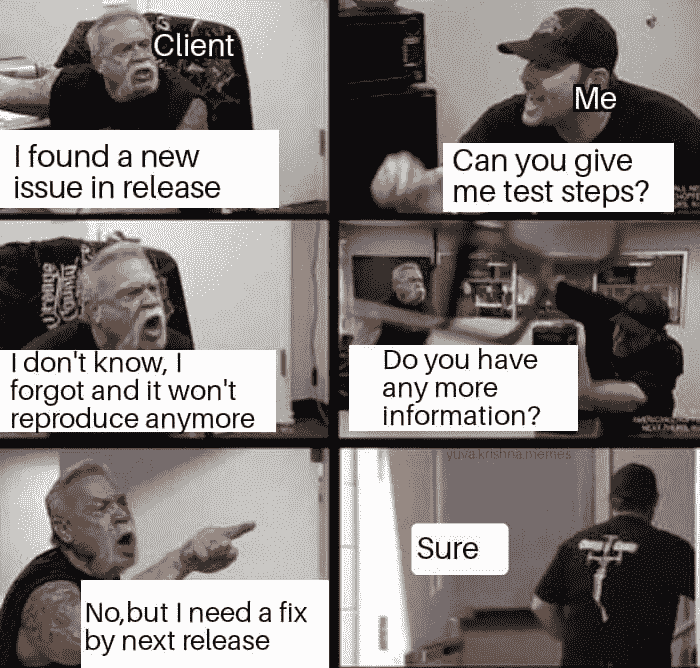
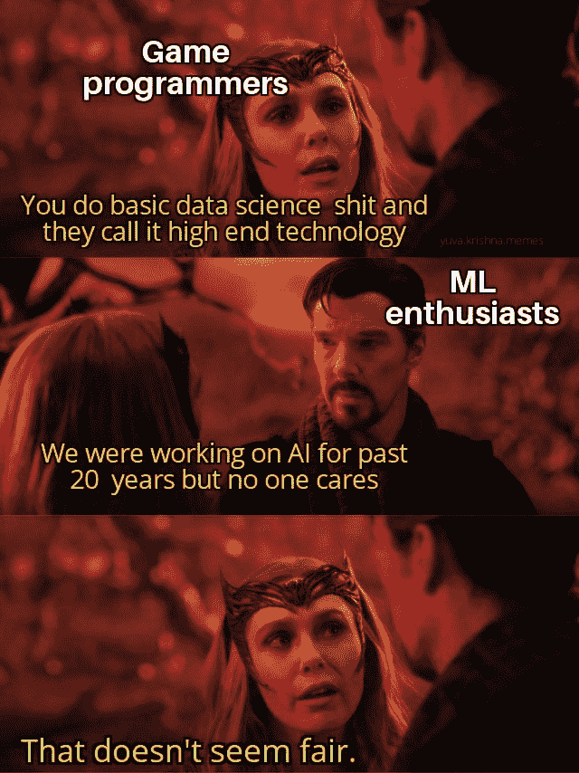
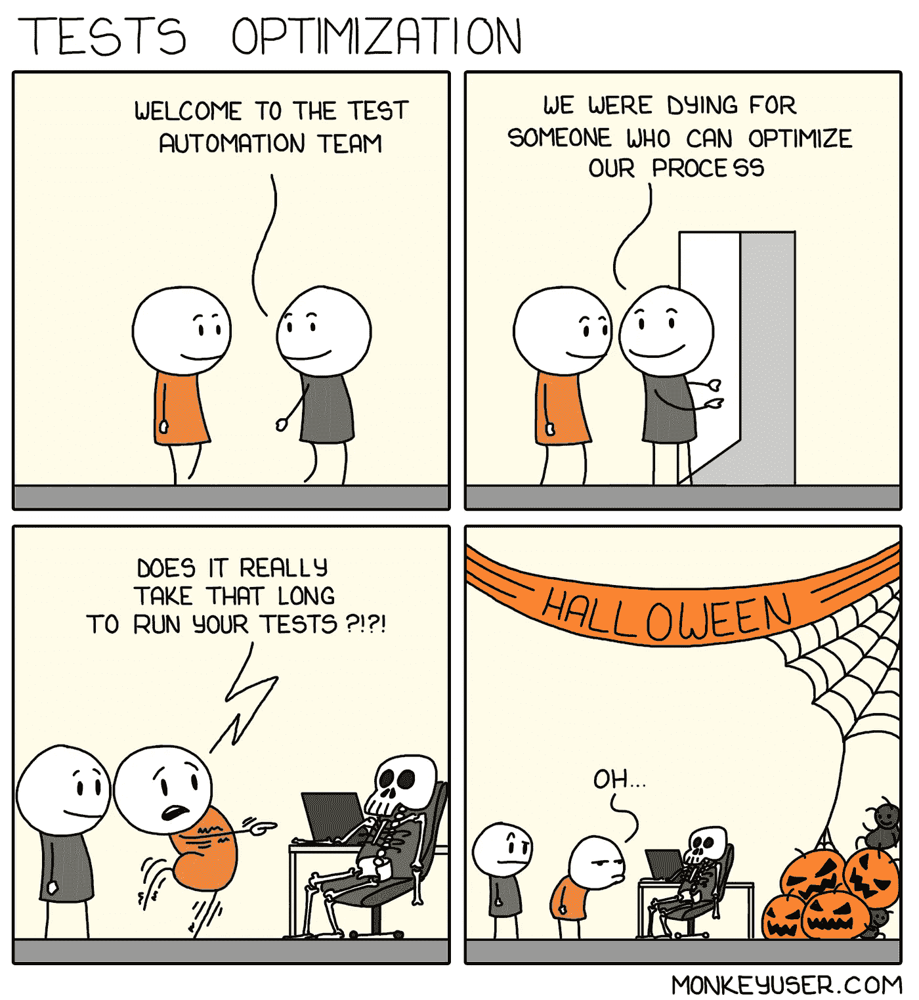
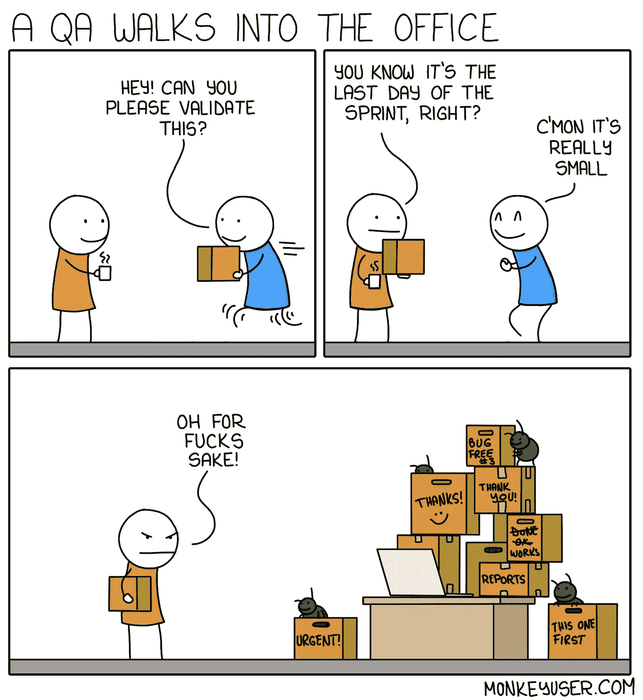
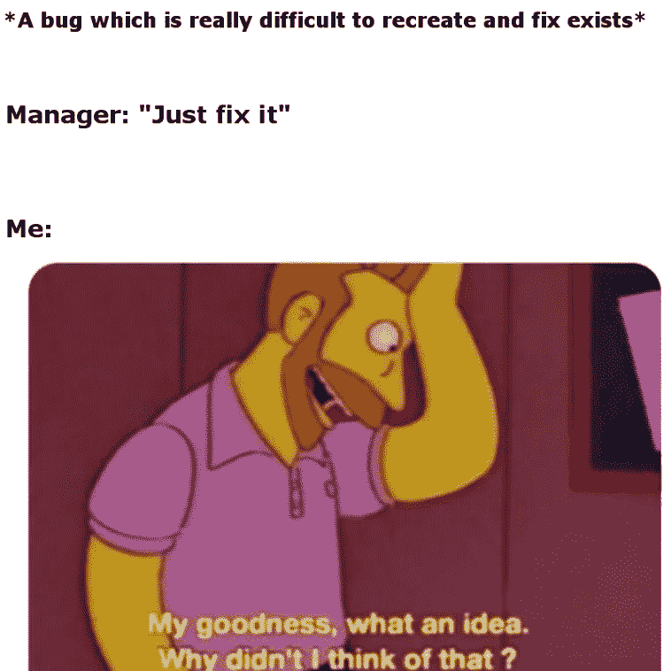
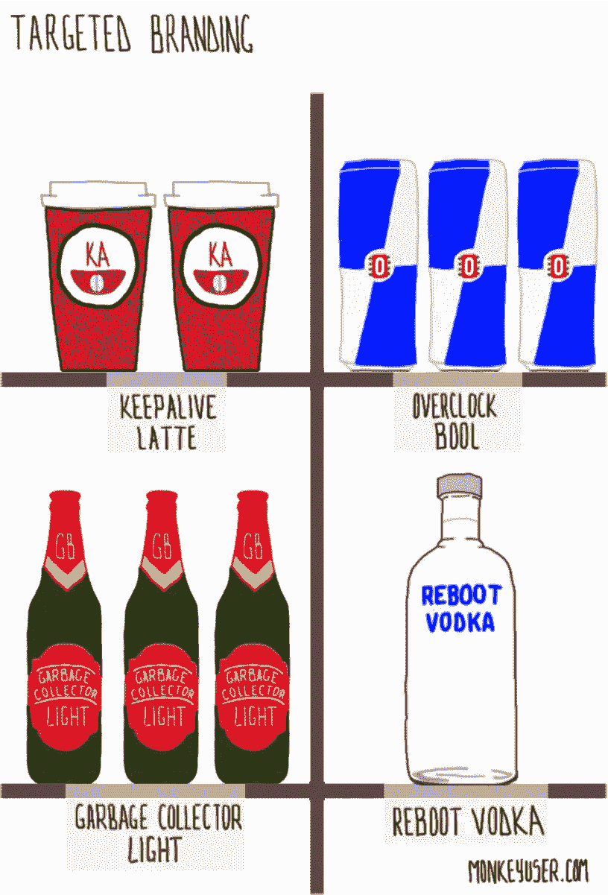
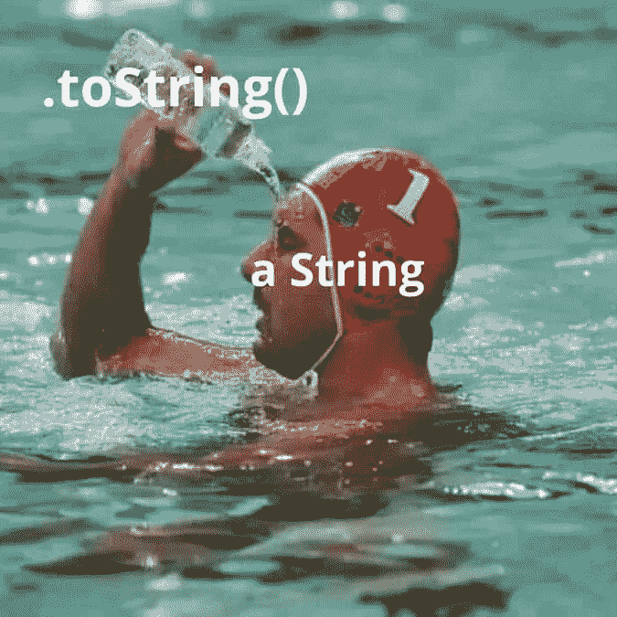
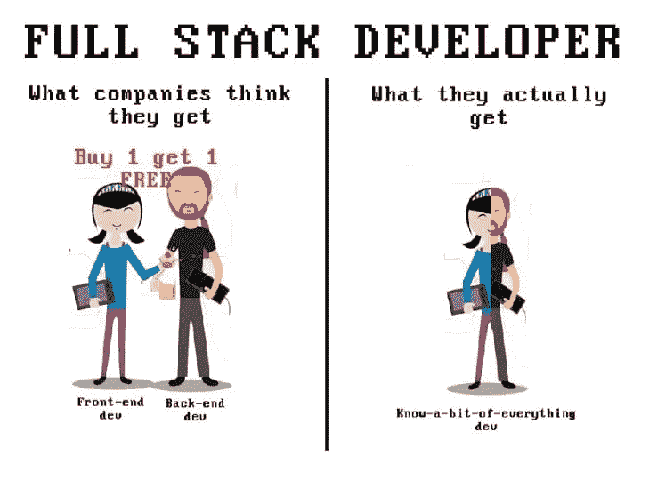
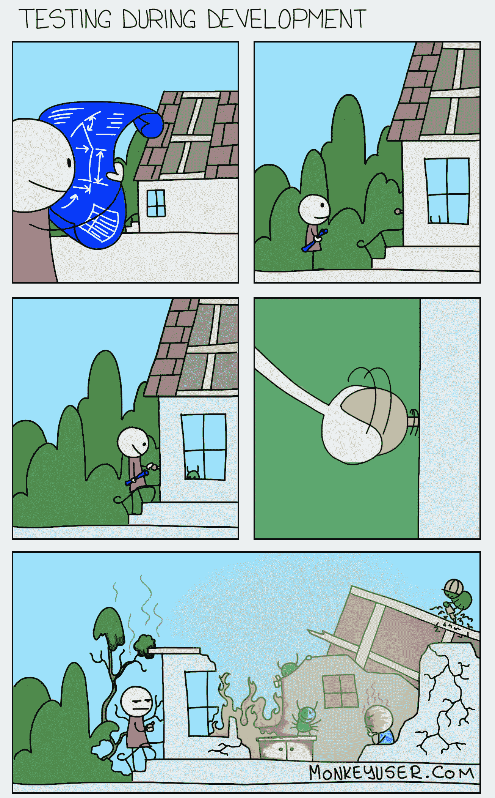

# 用模因解释软件专业人员的生活

> 原文：<https://javascript.plainenglish.io/the-life-of-a-software-professional-explained-with-memes-15900b40e3fc?source=collection_archive---------2----------------------->

## 来自互联网的最佳模因汇编

Photo by [Brooke Cagle](https://unsplash.com/@brookecagle?utm_source=medium&utm_medium=referral) on [Unsplash](https://unsplash.com?utm_source=medium&utm_medium=referral)

在疫情期间，你看到的谈论最多的一个职业是软件开发。当朋友和亲戚看到我们在家工作时，他们觉得我们有最好的生活，因为我们只需盯着电脑 8 个小时。但是作为程序员或 IT 专业人员，我们知道我们内心在想什么。

我们确实有一些不眠之夜，需要投入额外的时间来赶上最后期限，等等。

在这篇文章中，我只是用我在互联网上找到的这些模因来覆盖我作为一名 IT 专业人士的感受。

# 问题出现一次，但我不知道步骤…

Picture Credit: [https://www.facebook.com/yuva.krishna.memes](https://www.facebook.com/yuva.krishna.memes)

# 你在用图书馆减少线路吗？

Picture Credit: [https://www.facebook.com/javascript.shitposting](https://www.facebook.com/javascript.shitposting)

# 有没有 View ML 爱好者？

Picture Credit: [https://www.facebook.com/yuva.krishna.memes](https://www.facebook.com/yuva.krishna.memes)

# 获得工作后的表情 vs 第一天

Picture Credit: [https://www.facebook.com/javascript.shitposting](https://www.facebook.com/javascript.shitposting)

# 这不是我的领域…别管我…

Picture Credit: [https://www.facebook.com/yuva.krishna.memes](https://www.facebook.com/yuva.krishna.memes)

# 你有未完成的课程或培训吗？

Picture Credit: [https://www.facebook.com/javascript.shitposting](https://www.facebook.com/javascript.shitposting)

# 解决矛盾…我们不可能成为朋友…

Picture Credit: [https://www.facebook.com/yuva.krishna.memes](https://www.facebook.com/yuva.krishna.memes)

# 你有没有遇到过这种情况，你责怪某人，而那个人就是你？LOL…

Picture Credit: [https://www.facebook.com/javascript.shitposting](https://www.facebook.com/javascript.shitposting)

# 你是怎么做到的？也许因为你得到更多的钱…哈哈的笑

Picture Credit: [https://www.facebook.com/yuva.krishna.memes](https://www.facebook.com/yuva.krishna.memes)

# 欢迎加入团队…

Picture Credit:[https://www.monkeyuser.com/](https://www.monkeyuser.com/)

# 没有压力…只是完成这些东西…

Picture Credit: [https://www.facebook.com/yuva.krishna.memes](https://www.facebook.com/yuva.krishna.memes)

# 最后一天冲刺…QA 会很忙…

Picture Credit:[https://www.monkeyuser.com/](https://www.monkeyuser.com/)

# 她在写什么垃圾？

Picture Credit: [https://www.facebook.com/yuva.krishna.memes](https://www.facebook.com/yuva.krishna.memes)

# 修好它…不知道…

Picture Credit:[https://programmerhumor.io/programming-memes](https://programmerhumor.io/programming-memes)

# 在 IT 公司附近树立品牌的最佳方式…

Picture Credit:[https://www.monkeyuser.com/](https://www.monkeyuser.com/)

# 让我们添加以确保…由于我不知道类型…

Picture Credit:[https://programmerhumor.io/programming-memes](https://programmerhumor.io/programming-memes)

# 很久以前我所做的…

Picture Credit: [https://www.reddit.com/r/ProgrammerHumor/](https://www.reddit.com/r/ProgrammerHumor/)

# 人无完人…最好的例子…

Picture Credit:[https://programmerhumor.io/programming-memes](https://programmerhumor.io/programming-memes)

# 当一个设计师要求增加好的功能时…

Picture Credit:[https://programmerhumor.io/programming-memes](https://programmerhumor.io/programming-memes)

# 千万不要碰热锅…

Picture Credit:[https://www.monkeyuser.com/](https://www.monkeyuser.com/)

希望你能根据自己的生活来理解这些迷因。下一篇文章再见。

*更多内容看* [***说白了。报名参加我们的***](https://plainenglish.io/) **[***免费周报***](http://newsletter.plainenglish.io/) *。关注我们关于*[***Twitter***](https://twitter.com/inPlainEngHQ)*和*[***LinkedIn***](https://www.linkedin.com/company/inplainenglish/)*。加入我们的* [***社区***](https://discord.gg/GtDtUAvyhW) *。***