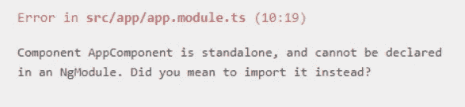

# 角形独立组件背后鲜为人知的故事

> 原文：<https://javascript.plainenglish.io/the-little-known-story-behind-angular-standalone-components-2392abc4fcfa?source=collection_archive---------1----------------------->

## [有角度的](https://medium.com/@lorenzozar/list/angular-5496c492a185)

## 我掉进了一个兔子洞，这个洞让我想到了棱角分明的独立组件背后令人惊讶的人类故事

在试用 Angular Standalone Components (SC)时，我问自己为什么 Angular 团队会引入这个特性。


Angular Nation: [Standalone Components w/ Alex Rickabaugh](https://www.youtube.com/watch?v=kE_zr5ZiPWc&ab_channel=AngularNation)

[官方文件](https://angular.io/guide/standalone-components#getting-started-with-standalone-components)声明:

> 在 v14 和更高版本中，独立组件提供了一种构建角度应用程序的简化方法。独立组件、指令和管道旨在通过减少对`[NgModule](https://angular.io/api/core/NgModule)`的需求来简化创作体验。

所以，一句话，**简化**。

到目前为止，一切顺利！还是没有？

# 我们如何在应用中使用组件

使用 Angular CLI，我们通常用`ng g c component-name`生成一个新组件。几秒钟后(还是我的笔记本电脑太慢了？)，我们得到了一个全功能的组件，它也是在 AppModule 中自动声明的，并且可以在我们想要的任何模板中使用。

AppModule 是在我们创建 Angular app 的时候创建的，默认情况下从`@angular/core`导入`NgModule`。

为此，我们甚至不需要知道 AppModule 的存在或它的作用。它是自动的。

如果你已经使用 Angular 超过一个星期，你可能没有这个问题！

## 独立组件有何不同？

简而言之，独立组件不需要在`NgModule`中声明。

我们可以通过使用`standalone:true`标志将一个组件标记为独立的。

> 标记为独立的 Angular 类不需要在 NgModule 中声明(如果尝试，Angular 编译器将报告错误)。

我试过了。

我用 Angular 14 创建了一个新的 app，并在 app.component.ts 中添加了`standalone:true`。

```
import { Component } from '[@angular/core](http://twitter.com/angular/core)';[@Component](http://twitter.com/Component)({
  standalone: true,
  selector: 'my-app',
  templateUrl: './app.component.html',
  styleUrls: ['./app.component.css'],
})
export class AppComponent {}
```

由于`NgModule`默认导入 app.component.ts，我得到了以下错误:



Angular compiler error

好的，不出所料。

然而，我想保持 AppComponent(它使用的是`NgModule`)不变，因为它更好地模拟了专业环境，在这个环境中，您可能已经有了 Angular 应用程序。

在现有应用中逐步采用独立组件的可能性非常受欢迎，因为它简化了现有 Angular 应用的迁移。

让我们从 app.component.ts 中删除`standalone:true`标志。

## 创建和使用独立组件

我使用`ng g c standalone`创建了一个组件，就像我创建其他组件一样。

这一次，我们将`standalone:true`标志添加到组件的类中，使其成为一个独立的组件。

```
import { Component } from '[@angular/core](http://twitter.com/angular/core)';[@Component](http://twitter.com/Component)({
  standalone: true,
  selector: 'app-standalone',
  templateUrl: './standalone.component.html',
  styleUrls: ['./standalone.component.css'],
})
export class StandaloneComponent {}
```

我们还需要从 AppModule 中删除声明，使其看起来像这样:

```
import { NgModule } from '[@angular/core](http://twitter.com/angular/core)';
import { BrowserModule } from '[@angular/platform-browser](http://twitter.com/angular/platform-browser)';import { AppComponent } from './app.component';
import { StandaloneComponent } from './standalone/standalone.component';[@NgModule](http://twitter.com/NgModule)({
  imports: [BrowserModule, StandaloneComponent],
  declarations: [AppComponent],
  bootstrap: [AppComponent],
})
export class AppModule {}
```

注意 StandaloneComponent 是在导入数组中导入的，而不是在声明中，因为它通常发生在使用`NgModule`的组件中。

这样，您可以在 AppComponent 中使用该组件，就像它是一个常规组件一样。

```
// app.component.html<h1>Standalone Components</h1><app-standalone></app-standalone>
```

好吧，酷。

但到目前为止，使用独立组件并没有简化我现有的应用程序。如果有的话，它增加了复杂性，因为直到迁移结束，我们有一个标准和独立组件的混合。

回到原来的问题！

# 为什么我们需要角形独立元件？

在我看来，上面这个简单的例子代表了一个常见的场景。

所以，我不买答案“*简单化。*

当我们从头开始创建应用程序时，独立组件可能会简化您的应用程序，但当我们在现有的应用程序上工作时，就不会了。

我想这一定有更多，这是故事。

## 1.原罪


Photo by [San Kayzen](https://unsplash.com/@sankayzen?utm_source=medium&utm_medium=referral) on [Unsplash](https://unsplash.com?utm_source=medium&utm_medium=referral)

这一切都始于一个截止日期！

截止日期要追溯到 2016 年 Angular 2 的发布。

正如最后期限经常发生的那样，它们往往在开始时很远，一眨眼就很近了。

> 经过几十年的建设，我明白了截止日期是解决问题的有力工具。
> 
> 亚当·沙维奇

2016 年夏天，Angular 2 本应准备发布，但[提前(AOT)编译器](https://angular.io/guide/glossary#aot)却没有。

你可以想象，这不是小事，因为 Angular 应用程序需要编译后才能在浏览器中运行。

AOT 编译器在构建阶段将 Angular 应用程序转换为 JavaScript 代码，这样浏览器就可以更快地下载和渲染应用程序。

除此之外，许多开发者抱怨 Angular 的发布候选。

它根本就没有工作好！

有两个主要问题:

1.  **通过 npm 发布 Angular 库出错**。库会表现得不稳定并产生错误。这使得几乎不可能建立一个强大而健康的生态系统！此外，这个问题在 2016 年夏天才浮出水面！
2.  指定细粒度的依赖关系通常会导致错误。开发人员可以通过创建可以随处导入的依赖关系数组来找到解决方法。

出于压力和必要，NgModule 诞生了！

NgModule 的设计可能是一个试图针对上述所有问题的补丁。

虽然它允许交付 Angular 2，但它产生了一系列外部性和复杂性:

*   Angular 的入门变得不那么顺利了
*   设计编译器变得更加复杂

同年年底，参与该项目的 Igor Minar 宣布他希望在某个时候让 NgModules 成为可选的。

## 2.救赎之路


Photo by [Jeremy Bishop](https://unsplash.com/@jeremybishop?utm_source=medium&utm_medium=referral) on [Unsplash](https://unsplash.com?utm_source=medium&utm_medium=referral)

时隔两年，2018 年冬天，[明科·格切夫](https://medium.com/u/a7db01a91fcb?source=post_page-----2392abc4fcfa--------------------------------)向[提出让 NgModules 可选](https://github.com/angular/angular/pull/27481)。

该提议基于 Ivy，它正在成为 Angular 的新编译和渲染管道。

常春藤正在路上，但还没到那一步！

如果您开始感觉到一些范围蔓延，您不是唯一的一个！

由于 Ivy 独立成为一个相当大的项目，Angular 团队决定搁置让 NgModules 可选的提议。


A disappointed Minko Gechev in winter 2018\. (It’s a joke) Photo by [Tom Morel](https://unsplash.com/@maiq?utm_source=medium&utm_medium=referral) on [Unsplash](https://unsplash.com?utm_source=medium&utm_medium=referral)

2020 年 2 月，常春藤开始为我们凡人所用，在寒冷的月份特别多产的 Angular 团队复活了可选 NgModules 的梦想。

派对不速之客马克·汤普森登场。

作为喀尔刻和奥德修斯以及他的船员，马克·汤普森引诱棱角分明的团队进入 Byelog 行动，这一努力将持续一年。好吧，也许罪魁祸首是 [Angular 的路线图](https://angular.io/guide/roadmap)，马克·汤普森没有任何过错。不好意思！

但无论如何，该团队专注于一项新的努力。

[Operation Byelog](https://angular.io/guide/roadmap) 包括将工程师集中在分类问题和 PRs 上，以解决更广泛的社区需求。

虽然 Angular 社区对这一努力表示感谢，但可选 NgModules 的梦想正在消退。

直到 2021 年 5 月，才有人再次谈到 NgModules。

当 [@pkozlowski_os](https://twitter.com/pkozlowski_os) 开始讨论时，导航并不顺畅。人们因为其他优先考虑的事情跳上跳下船。

## 3.北极星

幸运的是，专业水手 Alex Rickabaugh 根据 Minko Gechev 的原始 PR 创建了一个 spike。

2021 年 8 月，Alex Rickabaugh 在 Angular Nation 展示了 spike。

Standalone Component Spike w/ Alex Rickabaugh

演示之后是持续数月的激烈讨论，直到“*”虚拟 NgModule 设计获得了团队、客户和 GDE 的一致认可和支持；而被变成了 RFC"* 。

如果你一直陪我到现在，我希望你没有忘记最初的问题！

## **为什么我们需要独立组件？**

似乎使用 NgModules 从来就不是构建角度应用程序的标准方式！

如果你喜欢这个故事:

[](https://medium.com/@lorenzozar/membership) [## 通过我的推荐链接加入 Medium-Lorenzo Zarantonello

### 如果这个有价值，直接支持我！我的文章大多是免费的。考虑成为会员以示支持…

medium.com](https://medium.com/@lorenzozar/membership) 

或者直接关注我:)

这是基于伊戈尔·米纳尔的[推特帖子。](https://twitter.com/IgorMinar/status/1447593478834188291)

错误、失误和不精确是我的。所有围绕 Angular 的出色工作都归功于 Angular 团队。

这是为了庆祝 Angular 团队的努力。如果您觉得这些内容有任何冒犯之处，我深表歉意。那不是我的意图。

*更多内容看* [***说白了就是***](https://plainenglish.io/) *。报名参加我们的* [***免费周报***](http://newsletter.plainenglish.io/) *。关注我们关于* [***推特***](https://twitter.com/inPlainEngHQ) ， [***领英***](https://www.linkedin.com/company/inplainenglish/) *，*[***YouTube***](https://www.youtube.com/channel/UCtipWUghju290NWcn8jhyAw)*，以及* [***不和***](https://discord.gg/GtDtUAvyhW) *。对增长黑客感兴趣？检查* [***电路***](https://circuit.ooo/) *。*