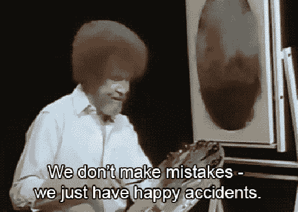
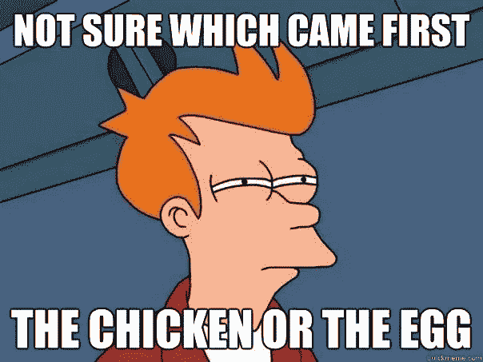

# JavaScript 中的 Sort 方法是如何工作的？

> 原文：<https://javascript.plainenglish.io/the-logic-behind-array-prototype-sort-1188645b1682?source=collection_archive---------2----------------------->


Photo by Mohammad Rahmani on Unsplash

在我今天的文章中，我将向您展示 JavaScript 中的 sort 方法(`Array.prototype.sort()`)是如何工作的，它背后的逻辑，以及如何使用它对数组进行排序。

# 介绍

数组原型`sort()`用于根据提供的逻辑对数组中的元素进行排序，然后返回对同一个数组的引用，现在已经排序了。

`sort()`方法的默认顺序是升序，它的工作方式是将数组元素转换成字符串，然后根据每个字符的 Unicode 码位值排列它们。

`sort()`方法接受一个回调函数，这个函数将包含一些用于正确排序数组的逻辑。

# 我们将做什么

我将在一个数组上使用`sort()`方法，然后提供一个回调函数来实际执行排序

如果我要对数字数组`[3,4,5,2,1]`进行升序排序，我将使用逻辑`( a > b )`来比较每个元素，它将返回其[代码点值](https://www.designcise.com/web/tutorial/how-to-get-the-unicode-code-points-of-a-javascript-character)低于下一个元素的元素，已排序。

# 让我们来谈谈代码点


let's talk meme gif

[根据 Wise geek](https://www.wise-geek.com/what-is-a-code-point.htm) 的说法，码位是指一个特定的数值，表示字符集中的任何一个单独的字符。

这意味着键盘上的每个字符在字符集中都有一个代码点。

现在你可能会问，“那么什么是字符集？”

嗯，字符集就像一本多语言字典，向计算机解释哪些数字对应哪些字符。

因此，在字符集中，大写字符“A”的代码点是“65”，小写字符“A”的代码点是“97”。

这意味着，如果我们要对一个字母数组进行升序排序，大写字母会先排序在小写字母之前，如果我们要对一个字母数组进行降序排序，小写字符会先排序在大写字母之前。

这是因为它们在字符集中的代码点。

这是有道理的，对不对？😃

让我们看看如何在 JavaScript 中获取字符的码位。

# 检索字符的码位

为了检索 javascript 中字符的代码点，我将在字符串上使用字符串方法`codePointAt()`。

```
//uppercase A
console.log("A".codePointAt())
//65

//lowercase a
console.log("a".codePointAt())
//97
```

所以你可以看到一个大写字母在一个小写字母之前，因为它在字符集中的码位。

现在，让我们在一个数组上尝试一下我们目前所学的内容。

# 对数组排序

回想一下，我们讨论过排序方法和逻辑，我们将在回调函数中使用它来对数组进行排序。

在我的第一个例子中，我将按升序对数组进行排序，并在回调函数中使用逻辑(a > b)

```
//sort in ascending order
["a", "C", "b", "A", "c", "B"].sort( (a, b) => {
    return (a > b)
})

//Array(6) [ "A", "B", "C", "a", "b", "c" ]
```

所以你可以看到这个数组是按照升序排列的，首先是大写字母，然后是小写字母。

在我的第二个例子中，我将使用回调函数中的逻辑(b > a)对数组进行降序排序

```
//sort in descending order
["a", "C", "b", "A", "c", "B"].sort( (a, b) => {
    return (b > a)
})

//Array(6) [ "c", "b", "a", "C", "B", "A" ]
```

您可以看到，该数组是按降序排列的，首先是小写字母，然后是大写字母。

根据我的解释，我们甚至可以对一个包含人名的数组进行升序排序，而且它会很好地进行排序

```
//sort in ascending order
["john", "jane", "jade", "joseph"].sort( (a, b) => {
    return (a  > b)
}) 

//Array(4) [ "jade", "jane", "john", "joseph" ]
```

它的工作原理是将字符串中每个字符的代码点相加，然后按升序排列。

这将让你更好地了解计算机在引擎盖下做什么。

下面的代码计算数组元素中每个字符的代码点的总和。

```
let output = []

//function to calculate code point values 
const calcCodePoint = (val) => {
    //store the total code point number of a string
    let totalCodePoint = 0
    //get the code point total of the string
    val.split('').forEach( (el) => totalCodePoint+=el.charCodeAt())
    //add result to the array
    return output.push(totalCodePoint)
}

//loop through the array and calculate their code point values
["john", "jane", "jade", "joseph"].forEach(calcCodePoint)

//sort the result
output.sort( (a, b) => {
    return (a - b)
}) 

//Array(4) [ 404, 414, 431, 649 ]
```

因此，您可以看到，总代码点为 404 的元素(jade)排在第一位，总代码点为 649 的元素(joseph)排在最后，这就是我们的数组的实际排序方式。😎

我希望你现在明白了。

# 不犯错误



如果您试图对包含字母的字符串数组进行排序，请确保在排序之前已经使用 string 方法`toLowerCase()`将其转换为小写。

像这样对一个数组进行排序可能会让你觉得 sort 函数没用，其实不然！

注意“约翰”、“简”和“约瑟夫”中的大写字母。

```
//sort in ascending order
["John", "Jane", "jade", "jOseph"].sort( (a, b) => {
    return (a  > b)
})
//Array(4) [ "Jane", "John", "jOseph", "jade" ]
```

这是一台计算机，它被编程为根据字符集计算字符的代码点，然后再对其进行操作！

此外，不要试图对包含字符串和数字的数组进行排序，因为结果不是您所期望的😅

```
//sort in ascending order
["1", "3", "a", "4", "2", 5].sort( (a, b) => {
    return (a > b)
})
//Array(6) [ "1", "2", "3", "4", "a", 5 ]

//sort in ascending order
[1, 2, "a", "4", "2", "80", "9"].sort( (a, b) => {
    return (a > b)
})
//Array(7) [ 1, 2, "2", "4", "80", "9", "a" ]
```

[Mozilla Docs](https://developer.mozilla.org/en-US/docs/Web/JavaScript/Reference/Global_Objects/Array/sort) 对此有解释；

> *在数字排序中，9 在 80 之前，但是因为数字被转换成字符串，所以在 Unicode 顺序中，“80”在“9”之前*

所以不要责怪你的计算机或 JS 引擎，因为你现在已经清楚地了解了字符和它们的码位号，以及它们是如何排序的。

# 数字呢？

数字没有被遗漏，因为你可以按升序或降序对它们进行排序，这引起了注意，sort 方法在对数组进行操作之前将数组的元素转换为字符串，它被转换为字符串的原因是为了获取它的码位号。

如果我把我班学生的成绩放在一个数组里，我会这样按升序排序；

```
//sort in ascending order
[344,500,222,132,90,50].sort( (a, b) => {
    return (a > b)
})

//or
[344,500,222,132,90,50].sort( (a, b) => {
    return (a - b)
})

//Array(6) [ 50, 90, 132, 222, 344, 500 ]
```

数字串也是如此。

因为数组可能包含数字串，所以我们将使用逻辑`(a - b)`对数组进行升序排序，如果我们想对数组进行降序排序，我们将使用逻辑`(b - a)`。

这是对包含数字或数字字符串的数组进行排序的推荐方法。

看看下面的区别；

```
 //❌ not recommended 👇

//sort in ascending order
["344",500, "222",132, "90", "50"].sort( (a, b) => {
    return (a > b)
})
//Array(6) [ 132, "222", "344", "50", "90", 500 ]

// ✅ recommended 👇

//sort in ascending order
["344",500, "222",132, "90", "50"].sort( (a, b) => {
    return (a - b)
})
//Array(6) [ "50", "90", 132, "222", "344", 500 ]
```

我希望你今天学到了一些惊人的东西。


建议根据您希望结果出现的顺序对字符串使用逻辑`(a > b)`，根据您希望结果出现的顺序对数字或数字字符串使用逻辑`(a - b)`。

如果你想了解更多关于 JavaScript 中排序方法的知识，请访问 Mozilla 文档的链接。

# 这是有趣的时间

关于这个问题，我看到了很多争论。

“先有鸡还是先有蛋？”😅



chicken or egg which came first?

嗯，我想电脑程序员给了我们他们对此的看法。

如果我要检索一个鸡蛋和鸡的表情符号的 Unicode 码点，这是我看到的数字；

```
//code point of egg
console.log( "🥚".codePointAt() )
//129370

//code point of chicken
console.log( "🐥".codePointAt() )
//128037
```

看着上面的结果，你可能已经猜到了先有鸡后有蛋，如果我要对一个只包含这两个元素的数组进行排序，这将是结果。

```
//sort in ascending order
["🥚", "🐥"].sort( (a, b) => {
    return (a > b)
}) 
//Array [ "🐥", "🥚" ]
```

对我来说，我相信先有鸡后有蛋。

# 结论

我们已经讨论了字符的码位，以及键盘上的每个字符如何在计算机的字符集中有一个码位。

我们还讨论了`sort()`方法是如何工作的，以及它用来根据我们的逻辑排列数组元素的逻辑。

我还向您展示了在尝试对数组进行排序时应该避免犯的一些错误，最后，介绍了对字符串数组和数字数组进行排序的推荐方法。

我希望你理解了这篇文章

# 额外的

我构建并启动了一个验证库，您可以使用验证规则、复杂的正则表达式和表单输入属性在客户端和服务器端验证表单

它适用于 ReactJS、NodeJs、PHP 和 Native Js。

这里有一个到库库的链接

[](https://octagon-simon.github.io/projects/octavalidate) [## Octavalidate - JS:入门

### Octavalidate 是一个由 Simon Ugorji 开发的库，它可以帮助你在客户端和服务器端验证你的表单…

八角形-simon.github.io](https://octagon-simon.github.io/projects/octavalidate) 

我对网页开发和技术写作角色都持开放态度。

感谢您的阅读。

图片来源:Unsplash 上的 Mohammad Rahmani

*更多内容请看*[***plain English . io***](https://plainenglish.io/)*。*

*报名参加我们的* [***免费每周简讯***](http://newsletter.plainenglish.io/) *。关注我们关于* [***推特***](https://twitter.com/inPlainEngHQ)[***LinkedIn***](https://www.linkedin.com/company/inplainenglish/)*[***YouTube***](https://www.youtube.com/channel/UCtipWUghju290NWcn8jhyAw)*[***不和***](https://discord.gg/GtDtUAvyhW) ***。*****

*****对缩放您的软件启动感兴趣*** *？检查* [***电路***](https://circuit.ooo?utm=publication-post-cta) *。***