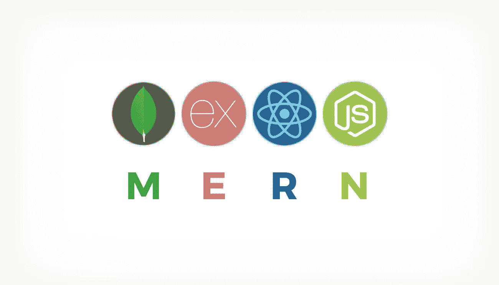
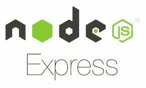
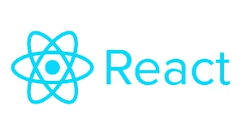

# MERN 堆栈:它是什么，为什么它很棒

> 原文：<https://javascript.plainenglish.io/the-mern-stack-what-it-is-and-why-it-is-great-b62bb2d56f6d?source=collection_archive---------13----------------------->

Photo by [Kevin Ku](https://unsplash.com/@ikukevk?utm_source=medium&utm_medium=referral) on [Unsplash](https://unsplash.com?utm_source=medium&utm_medium=referral)

对于全栈开发，JavaScript 是主要选择之一，尤其是如果您只想使用一种重要且公认的编程语言。你可以从头开始做任何事情，或者在你自己的整个系统上创建一些东西，但是制作一个只有一个标签的简单网页将会花费很长的时间，巨大的努力，以及臭名昭著的结果。

所以，技术栈已经被发明了。它们是一种技术、框架、库、组件或任何你想要的东西的混合，在这种情况下，它们可以在 web 开发的不同领域执行多种操作，并且它们都被连接起来以达到最终目标。最常见的堆栈之一是 MERN。这是什么？是什么技术构成的？这是明智的选择吗？应该选择学习和使用吗？让我们找出答案。

MERN: copyright [https://mernkit.com/blog/mongo-express-react-node-boilerplate](https://mernkit.com/blog/mongo-express-react-node-boilerplate)

# **涉及的技术**

## **MongoDB**

MongoDB 是一个数据库管理系统，它是非 SQL、非关系的，是面向文档的。它是由 MongoDB Inc .开发的，易于使用，但性能也令人难以置信。它与 JavaScript 有很好的内聚性，所有为处理这个 DBMS 而编写的代码都非常容易阅读和交互。

它还与所有主要的云服务，如 Azure、AWS 和 Google Cloud 有着令人难以置信的凝聚力。它还拥有 Apache 许可证。根据 StackOverflow 开发人员调查，这是最重要和公认的 DBMS 之一，是全球第四大最受欢迎的，也是第三大最受欢迎的，另一个也非常年轻，所以它仍然可以发展。一个令人难以置信的选择，也是出于 MERN 堆栈。

## **快递**

Express 是一个 web 应用程序框架，用于创建基于节点的后端服务。现在可以被认为是这个特殊用例的标准事实。它是开源的，有麻省理工学院的许可。它是最著名的 JavaScript 框架之一。根据 StackOverflow 开发者调查，它是第三受欢迎的 web 框架。

它完全是使用 JavaScript 编写和开发的(很明显，我想说得更准确些)，因此它对所有堆栈都有令人难以置信的适应性。它适应性很强，也非常强大。它已经成熟，这使它变得可靠。如果你想开发一个 web 应用程序或者 API，你可以使用这个框架。在 MERN 堆栈中，它是最佳选择。现在 Next.js 发展很快，但是还没有 Express 那么可靠，现在还没有，很可能永远也不会有 Express 那么重要。

## **做出反应**

React 是全世界最著名的流行 JavaScript web 框架。它是由现在的 Meta 公司的脸书开发的。它是开源的，有麻省理工学院的许可。它是面向前端的堆栈部分。正是这个框架发明了一页的概念，并且基于组件的概念。

对于他的重要社区，对于他的轻量级和可靠性，这是一个非常重要的框架。与其他流行的替代方案相比，它不是一个完整的框架:它只是一个库。因此，它更具可定制性和高性能。只有数字应该给你学习这个库的动力，但是它的所有特性都是一个不可思议的优点。由于他非常简单的语法和有趣的表现，他完全融入了这个堆栈。

## **Node.js**

Node.js 是基于谷歌 Chrome 的 V8 引擎的运行时系统。但是，这意味着什么呢？意味着谷歌工程师拿走了 Chrome 的 V8 引擎，这是整个浏览器的大脑，让一切正常工作。然后，他们用它来创建一种虚拟环境，你可以在浏览器之外运行你的 JavaScript 代码。

多亏了 Node.js，你可以在你的机器上运行 JavaScript。它还广泛用于在服务器上运行 JavaScript。这允许并帮助创建新的、更有效的库和包，用于语言的不同用途，比如 Express。如果没有这种特殊的技术，每个后端服务都有内置的 JavaScript。

# 是一个好的选择吗？是有意义的选择吗？

这些问题很简单，答案也很简单。它非常简单，因为它是使用最多的堆栈。因此，JavaScript 社区和所有框架带来了一个不可思议的社区。因此，在学习这个堆栈时，您将获得难以置信的支持，使所有学习过程更加轻松愉快。

然后，所有的技术都是高性能的，这将使您的应用程序在未来容易扩展，没有巨大的问题和成本。可靠性也是令人难以置信的优势。然后，我们可以谈论所有强大的操作，你被允许在 web 开发的所有终端，包括前端和后端。代码库将总是易于阅读，并使用一种单一的语言，有人告诉我，这也是世界上最受欢迎和使用的语言。

事实上，所有的东西都是用 JavaScript 编写的，这使得所有的东西都更有凝聚力，更容易集成，不会有太大的问题。所有这些系统的流行也让我们将其与云系统和其他“相当”知名的产品集成，如 Google one 和 AWS(明确地说，它们是最著名的)。

# 未来呢？

所以，是的，现在是一个很棒的选择，但是未来会怎么样呢？这个栈会被遗忘不再使用吗？不确定。有很多系统是使用 MERN 堆栈创建的，所以在未来，如果你不从头开始重建它们，它们不会改变这一点。所以，你总会有一些需要你更新和解决问题的网络应用程序。但这是以防没有人会继续以这种方式开发东西，这似乎是不可能的。

堆栈中的所有技术每年都在增长，并不断增强社区和技术本身。这是一个长期的过程，不会停止很长时间，也不会在几年内消失。所以，这些技术将会存在至少 15 年，并且将会增长至少 8 年(从近年来开始走下坡路的其他著名和流行的编程语言的生命过程中得到的数据)。

所以，这肯定是一个安全的选择。

# **结论**

所以，最后，MERN 堆栈有很多优点，对于那些试图加入 web 开发世界并有一些 JavaScript 知识的人来说是一个很好的选择。但是，它对每个人开放，没有特定的运动或人更适合这个角色。你想成为一名专业的网页开发者吗？MERN·斯塔克就是答案。

感谢您阅读这篇文章。请考虑鼓掌，也订阅。

如果您对其他 JavaScript 相关的文章感兴趣，这里有一些链接。看看他们。

 [## TypeScript:网络的未来

### 了解什么是 TypeScript，它的特性，以及为什么许多开发人员使用它。

javascript.plainenglish.io](/typescript-the-future-of-web-6893ab2cb6bd)  [## 成为 10 万年薪开发者的 JavaScript 路线图

### 了解如何达到这个目标

javascript.plainenglish.io](/javascript-roadmap-to-becoming-a-100000k-year-developer-78cf3ec3d466)  [## 以你的 JavaScript 技能哪里能赚到 100 $/周？

### 用 JavaScript 编程赚外快？

javascript.plainenglish.io](/where-can-you-earn-100-week-with-your-javascript-skills-4f6f9be41ab8)  [## 学习 JavaScript 的最佳 YouTube 渠道

### 2022 年要学 JavaScript 编码吗？你需要好的资源以好的方式学习它。

javascript.plainenglish.io](/best-youtube-channels-to-learn-javascript-1422f2cb71ce)  [## 2022 年最佳 JavaScript IDE

### 找出 2022 年 JavaScript 的最佳 IDE。

javascript.plainenglish.io](/best-javascript-ide-in-2022-d8743f637a7e) 

*更多内容看* [***说白了。报名参加我们的***](https://plainenglish.io/) **[***免费周报***](http://newsletter.plainenglish.io/) *。关注我们关于*[***Twitter***](https://twitter.com/inPlainEngHQ)*和*[***LinkedIn***](https://www.linkedin.com/company/inplainenglish/)*。加入我们的* [***社区***](https://discord.gg/GtDtUAvyhW) *。***