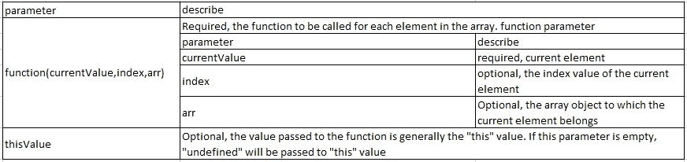
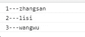
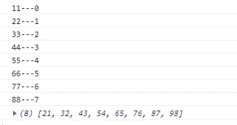
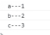

# JavaScript 中遍历数组的方法

> 原文：<https://javascript.plainenglish.io/the-methods-of-traversing-an-array-in-javascript-5502df5f7703?source=collection_archive---------5----------------------->


第一种类型:是 for 循环，这也是最常见的

const arr = [11，22，33，44，55，66，77，88]

```
for (let i = 0; i < arr.length; i++) {
            console.log(arr[i])
        }
```

第二个:forEach()



1) forEach()遍历普通数组

```
arr.forEach( function(item){
            console.log(item)
        } )
```

2) forEach()迭代对象类型数组

```
const arr = [
            {id:1,name:'zhangsan'},
            {id:2,name:'lisi'},
            {id:3,name:'wangwu'}
        ]arr.forEach( function(item){
            console.log(item.id + '---' +  item.name)
        })
```

输出结果:



第三:map()方法

map 的意思是“映射”，原数组被“映射”到相应的新数组中

```
var newArr = arr.map( function(value,index){    console.log(value + '---' + index)    return value + 10})
console.log(newArr)
```

输出结果:



注意:forEach()和 map()的区别:

1.forEach:用于遍历数组中的每一项，该方法没有返回值，不影响原始数组

2.map:支持 return，相当于原数组的克隆，在不影响原数组的情况下改变克隆的每一项

第四:为了…在方法上

为了…在 is5 标准中，这种方法遍历数组的效率很低，主要用于遍历对象的属性

1) for…in 遍历数组

```
for(let item in arr){
            console.log(arr[item])
        }
```

提示:for…in 不应用于迭代索引顺序很重要的数组。
数组索引只是一个带有证书名称的枚举属性，与通用对象属性相同。不保证 for…in 会以任何特定顺序返回索引。for…in 循环语句将返回所有可枚举的属性，包括非整数类型和继承类型的名称

2)对于…..在遍历对象时

遍历对象的属性，动态获取 js 中的 key，在一个对象中获取对应的 value = obj[key]

```
const obj = {
            a:1,
            b:2,
            c:3
        }for(let key in obj){
            console.log(key + '---' + obj[key] )
        }
```

输出结果:



第五:为了……方法(es6 支持)

```
for(let item of arr){
            console.log(item)
        }
```

*更多内容尽在* [***说白了. io***](https://plainenglish.io/) *。报名参加我们的* [***免费周报***](http://newsletter.plainenglish.io/) *。关注我们关于* [***推特***](https://twitter.com/inPlainEngHQ) ，[***LinkedIn***](https://www.linkedin.com/company/inplainenglish/)*，*[***YouTube***](https://www.youtube.com/channel/UCtipWUghju290NWcn8jhyAw)*，* [***不和***](https://discord.gg/GtDtUAvyhW) *。对增长黑客感兴趣？检查* [***电路***](https://circuit.ooo/) *。*