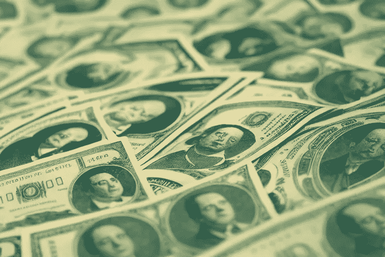

# 以 3000 万美元出售其应用程序的百万富翁开发者

> 原文：<https://javascript.plainenglish.io/the-millionaire-developer-who-sold-his-app-for-30m-beb18fe6e363?source=collection_archive---------1----------------------->

## 我总是告诉年轻人，软件开发是成为百万富翁最简单的方法

Made with AI

17 岁的高中生 Nicholas D'Aloisio 将他的新闻摘要初创公司 Summly 卖给了雅虎，这是一个伟大的英国成功故事。三千万美元。

> 12 岁时，尼克开始为苹果的应用程序商店编程。他在 15 岁时接受了风险投资，这使他成为最年轻的接受者。

尼克·达洛伊西奥是英国计算机程序员和互联网企业家。他因其应用 Summly 而闻名，该应用将人工智能与摘要相结合，是与 SRI International 合作开发的。

# 他小时候就开始编程了

尼克于 1995 年 11 月出生于伦敦。他的父母是移居国外的澳大利亚人。尼克出生后不久，全家搬回了墨尔本。尼克七岁时，达洛伊西奥一家搬到了伦敦西南部的温布尔登，并一直住在那里。

这位科技神童九岁时拥有了他的第一台电脑，一台 Mac 笔记本电脑。到他 12 岁时，他已经学会了如何编码，并开始开发应用程序。

# 世界是如何开始注意到他的…

2011 年 3 月，Nick 开发了一个名为 Trimmit 的 iOS 应用程序，使用分析技术将文本内容减少到 1000、500 或 140 个字符。这款应用引起了苹果公司的注意，因此他们在其应用商店中将它作为一款全新的杰出应用进行了突出展示。

因此，亿万富翁李嘉诚看到了 Trimmit 的巨大潜力，决定向该公司投资 30 万美元。利用来自 Trimmit 的反馈，Nick 重新设计了这个程序，并在 2011 年 12 月以 Summly 的名字发布。

# App Summly

Summly 受到 Trimit 的启发，使用机器学习和自然语言处理对网络内容进行了总结。这个精巧的工具甚至有能力识别材料的类型，并对不同类型的材料采取不同的措施。

Summly 最初的发布只是一个原型，尽管获得了超过 20 万的下载量。2012 年 11 月，Summly 从 Horizons Ventures 和 Ka-Shing 获得了 100 万美元的进一步资助，以及小野洋子、阿什顿·库彻和史蒂芬·弗莱等名人的支持。然后，达洛伊西奥开始与一群支持者、顾问、投资者和 IT 专家一起开发 2.0 版本。

在他 17 岁生日的时候，Summly 第二版发布了，仅仅几个月的时间，就产生了 9000 多万条摘要。

2011 年 12 月， [GigaOm 的 Om Malik](http://gigaom.com/2011/12/13/meet-the-internets-newest-boy-genius/) 称之为互联网新的“天才少年”，然后达洛伊西奥被列入福布斯 30 个 30 岁以下和标准晚报的 1000 名伦敦人。达洛伊西奥还获得了 2012 年年度企业家伦敦精神奖，而 Summly 获得了苹果年度最佳应用的直观触摸奖。

2013 年 3 月，雅虎！花 3000 万美元买了这个应用。收购后，Summly 不再出现在应用程序商店，但该技术后来出现在多个雅虎！产品。与此同时，达洛伊西奥是最年轻的雅虎。员工。他对自己的成功感到惊讶，他说，“我从来没有想到我会这么快就找到自己的位置。”

# 他现在怎么样了？

达洛伊西奥现在 26 岁，已经把他的第二家公司 Sphere——一家 20 人的科技初创公司——卖给了 Twitter。

在 2015 年离开雅虎去牛津大学攻读计算机科学和哲学之后，达洛伊西奥在 Airbnb 做了一年的“常驻企业家”。他开发了 Sphere 的概念，这是一个知识共享社区，成员可以使用类似于即时消息的应用程序来分享知识和想法。

2015 年底，达洛伊西奥和他在牛津认识的首席技术官托马斯·哈尔加斯(Tomas Halgas)共同创立了 Sphere。据知情人士说，考虑到达洛伊西奥的过往记录，这种想法很容易被投资者接受。

> 达洛伊西奥声称，第二次带来了各种挑战。“这既容易又困难。因为我以前的经验，这变得更容易，我们从愿意承担这一风险的投资者那里筹集了 3000 万美元。”

“相比之下，人们有更多的要求和期望。创业难；你必须付出很多努力，随着人们习惯上网，说服他们(使用新应用)变得越来越难，”达洛伊西奥说。

据英国《金融时报》报道，截至 2019 年 3 月，该业务已融资 3000 万美元。TechCrunch、The Telegraph、The Times 和 BBC 等新闻机构在 2021 年 10 月宣布，Twitter 已经收购了 Sphere，30 名员工中的大部分将加入该公司。

达洛伊西奥认为，与他作为年轻开发者的时代相比，英国在促进数字创业方面取得了重大进展。

> “现在，我在商界有了一些认识很久的朋友。十年前，我的朋友中没有一个对技术感兴趣。”

*更多内容请看*[***plain English . io***](https://plainenglish.io/)*。*

*报名参加我们的* [***免费周报***](http://newsletter.plainenglish.io/) *。关注我们关于*[***Twitter***](https://twitter.com/inPlainEngHQ)，[***LinkedIn***](https://www.linkedin.com/company/inplainenglish/)*，*[***YouTube***](https://www.youtube.com/channel/UCtipWUghju290NWcn8jhyAw)*，以及* [***不和***](https://discord.gg/GtDtUAvyhW) ***。***

***有兴趣缩放你的软件启动*** *？检查* [***电路***](https://circuit.ooo?utm=publication-post-cta) *。*