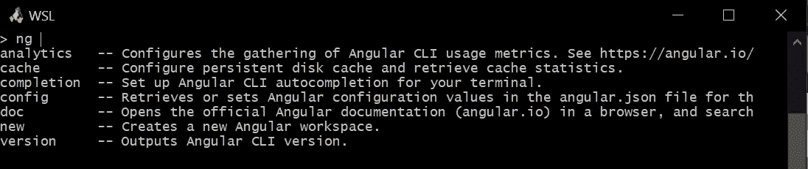
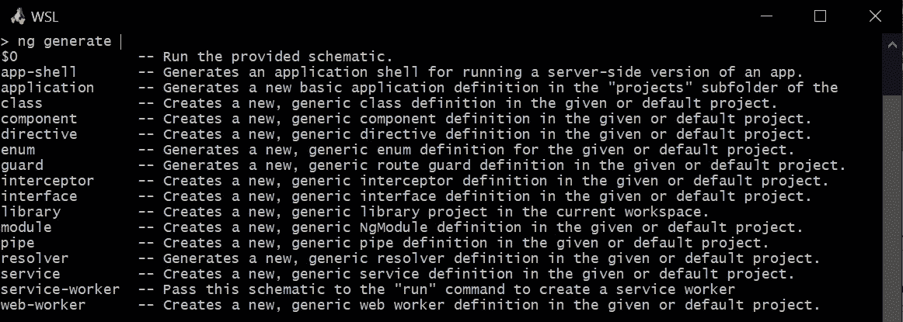
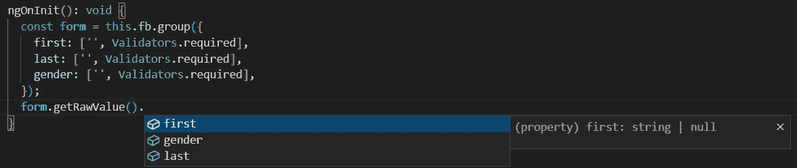

# Angular v14 的新特性

> 原文：<https://javascript.plainenglish.io/the-new-features-of-angular-v14-851995870f59?source=collection_archive---------4----------------------->

## Angular v14 终于推出了一些激动人心的新功能！


Logo from [Angular Presskit](https://angular.io/presskit)

距离 Angular 13 在 2021 年 11 月发布已经有一段时间了。Angular 14 终于推出了一些令人兴奋的新功能。

在本文中，我们将快速了解 Angular v14 带来了什么。

所以，让我们开始吧！

# CLI 自动完成

Angular 14 具有新的 CLI 功能，允许实时提前自动完成键入。

***注:*** *此功能在****Windows Cmd****或* ***Powershell、*** *上不支持，但我们可以用****Git Bash****或* ***Windows 子系统 for Linux*** *来代替。*

要使用这个特性，我们首先需要执行:

```
ng completion
```

接下来，我们需要重启我们的终端。然后，我们可以像往常一样使用 CLI，只是如果我们现在按下`Tab`，所有可用的选项都会为我们列出。



我们可以使用箭头键来导航和选择我们选择的选项。同样，如果你在一个角度项目中，那么更多的选项将会出现。



最后，我们可以重复这个过程，直到我们创建了满足我们需要的命令！

# 独立组件和可选模块

Angular 14 支持独立组件，这意味着模块变得可选。在以前的版本中，组件必须在`NgModule`中声明。嗯，不再是了！

标记为`standalone`的角度组件可以通过导入属性直接管理它们的模板依赖。我们甚至可以让`AppComponent`独立出来，删除`AppModule`。

```
import { CommonModule } from '@angular/common';
import { Component } from '@angular/core';

@Component({
  selector: 'app-root',
  standalone: true,
  imports: [CommonModule],
  template: `<h1>Hello World</h1>`
})
export class AppComponent {}
```

然后直接使用`AppComponent`引导我们的应用程序！

```
import { bootstrapApplication } from '@angular/platform-browser';
import { AppComponent } from './app/app.component';

bootstrapApplication(AppComponent).catch((err) => console.error(err));
```

此外，这些独立组件可以与路由和延迟加载一起使用。首先，让我们创建一个`routes.ts`文件，在其中声明我们的 routes 对象。

```
import { Routes } from '@angular/router';

const routes: Routes = [
  {
    path: 'home',
    title: 'Home Page',
    loadComponent: () =>
      import('./home/home.component').then((c) => c.HomeComponent)
  },
  {
    path: 'personal',
    title: 'Personal Information',
    loadComponent: () =>
      import('./personal/personal.component').then((c) => c.PersonalComponent)
  },
];
```

另一个新功能是我们可以为每条路线设置不同的标题页。我们在哪里使用刚刚宣布的路线？当然是在我们的引导文件中。

```
import { importProvidersFrom } from '@angular/core';
import { bootstrapApplication } from '@angular/platform-browser';
import { RouterModule } from '@angular/router';
import { AppComponent } from './app/app.component';
import { routes } from './routes';

bootstrapApplication(AppComponent, {
  providers: [importProvidersFrom(RouterModule.forRoot(routes))],
}).catch((err) => console.error(err));
```

最后，我们需要在组件中使用提供的路线。

```
import { CommonModule } from '@angular/common';
import { Component } from '@angular/core';
import { RouterModule } from '@angular/router';

@Component({
  selector: 'app-root',
  standalone: true,
  imports: [CommonModule, RouterModule],
  template: `
    <h1>Hello World</h1>
    <button routerLink="home" routerLinkActive="router-link-active">Home</button>
    <button routerLink="personal">Personal Information</button>
    <hr />
    <router-outlet></router-outlet>
  `
})
export class AppComponent {}
```

你可以在[这个 StackBlitz 链接](https://stackblitz.com/edit/angular-14-demo)找到一个工作演示。

[](https://stackblitz.com/edit/angular-14-demo?file=src/app/app.component.ts) [## Angular v14 演示版- StackBlitz

### 一个带有独立组件的小型工作示例，一个有角度的 v14 新功能。

stackblitz.com](https://stackblitz.com/edit/angular-14-demo?file=src/app/app.component.ts) 

但是，等等！

**`NgModule`**会怎么样？模块要灭绝了吗？****

**我的猜测是，为了提供向后兼容性，模块仍将存在相当一段时间。**

**如果这种情况真的会发生，也不会很快发生。鉴于 Angular 是一个如此广泛使用的框架，这将是一个真正意想不到的举动。**

**但那只是个人猜测。所以不要相信我的话！**

# **强类型反应形式**

**最受欢迎的特性之一是针对[严格类型的反应形式](https://github.com/angular/angular/discussions/44513)。窗体控件、组和数组现在是类型安全的，这意味着 TypeScript 将自动强制各自的类型。**

****

**当您处理大型嵌套表单时，这变得特别方便。嗯，我们可以用[一招](/angular-custom-form-controls-nested-form-groups-made-easy-2ac09e91cf67)或[两招](https://betterprogramming.pub/split-angular-nested-forms-into-subform-components-dcf32d1fb10d)让我们的生活更轻松。但是有棱有角的有我们的背部掩护要好得多！**

# **注入服务的新方法**

**众所周知，在 Angular 中，我们可以在组件、管道、指令和其他服务的构造函数中注入依赖关系。另外，在 Angular 14 之前，我们可以使用`inject()`函数来注入令牌。**

```
@Component({
  selector: 'app-item-list',
  templateUrl: './item-list.component.html',
  styleUrls: ['./item-list.component.css']
})
export class ItemListComponent implements OnInit {
  constructor(public dataService: DataService) {
     // ...
  }
  // ...
}
```

**在 Angular 14 中，`inject()`函数有了一个新的用例。更具体地说，我们可以用它来注入依赖关系。**

**在此之前，您不能在函数中注入服务。现在我们可以创建如下所示的效用函数。**

```
export function getNavigationEndEvents() {
  return inject(Router).events.pipe(
    filter((event) => event instanceof NavigationEnd)
  );
}
```

# **增强的模板诊断**

**最后，但并非最不重要的是，Angular 14 将带来增强的模板诊断，这样开发人员就可以被编译器警告典型的错误。**

**例如，可能会为一些小问题生成警告，比如不正确的双向绑定或使用不必要的操作符(例如，`??`当变量保证不可为空时)。**

# **结论**

**在本文中，我们快速了解了 Angular v14 的新增功能。新功能包括 CLI 自动完成、独立组件、强类型反应式表单和增强的模板诊断。棱角分明看起来更迷人！**

***更多内容请看*[***plain English . io***](https://plainenglish.io/)*。报名参加我们的* [***免费周报***](http://newsletter.plainenglish.io/) *。关注我们关于*[***Twitter***](https://twitter.com/inPlainEngHQ)*和*[***LinkedIn***](https://www.linkedin.com/company/inplainenglish/)*。查看我们的* [***社区不和谐***](https://discord.gg/GtDtUAvyhW) *加入我们的* [***人才集体***](https://inplainenglish.pallet.com/talent/welcome) *。***

*****供进一步阅读:*****

**[](/angular-custom-form-controls-nested-form-groups-made-easy-2ac09e91cf67) [## 角度定制表单控件和嵌套表单组变得简单

### 如何让你的表单更具可重用性，拆分，让它们更具动态性。

javascript.plainenglish.io](/angular-custom-form-controls-nested-form-groups-made-easy-2ac09e91cf67) [](https://betterprogramming.pub/split-angular-nested-forms-into-subform-components-dcf32d1fb10d) [## 将角形嵌套形状拆分为子形状构件

### 如何将有角度的嵌套形状变成更小的子形状组件

better 编程. pub](https://betterprogramming.pub/split-angular-nested-forms-into-subform-components-dcf32d1fb10d) [](https://medium.com/clean-code-practices/7-guidelines-to-write-maintainable-code-be78cd91b81) [## 编写可维护代码的 7 条准则

### 遵循这 7 条准则来提高代码的可维护性。你未来的自己会感谢你的！

medium.com](https://medium.com/clean-code-practices/7-guidelines-to-write-maintainable-code-be78cd91b81)**