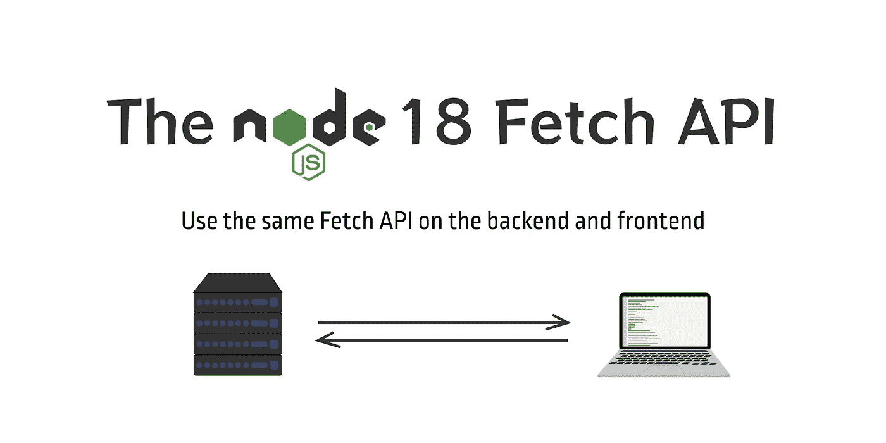

# Node.js 18 Fetch API 简介

> 原文：<https://javascript.plainenglish.io/the-nodejs-18-fetch-api-2d4f06d85319?source=collection_archive---------6----------------------->

## 在后端和前端使用相同的获取 API。



Node.js 18 引入了一些很酷的新特性，其中最有用的一个是内置的 Fetch API。这意味着我们不再需要使用像`node-fetch`这样的第三方 npm 包，因为该功能现在是原生的，并被嵌入到节点中。我们需要安装的依赖项少了一个，所以我们的`node_modules`文件夹应该稍微轻一点。

在使用最新的 Node.js 特性(如 Fetch API)之前，您首先需要检查您的计算机上是否运行了最新版本的 Node.js。在你的控制台上运行命令`node -v`，看看你运行的是哪个版本。如果低于 18，那么你需要升级才能使用这些新功能。

# 使用获取 API

如果您已经熟悉在开发 JavaScript 应用程序时在浏览器中使用 Fetch API，那么这个语法应该很容易理解。我们终于有了一个使用 JavaScript 在后端获取数据的本地解决方案。

```
const getAPI = async () => {
    const res = await fetch('https://pokeapi.co/api/v2/pokemon/'); if (res.ok) {
        const data = await res.json(); console.log(data);
    }
};getAPI();
```

让我们创建一个实际的例子，这样您就可以看到一个潜在的用例。导航到一个目录，然后将下面的代码复制并粘贴到命令行中，以搭建一个项目。

```
mkdir node-backend-fetch
cd node-backend-fetch
npm init -y
npm i express nodemon
touch app.js
mkdir controllers routes
touch controllers/pokemon.js
touch routes/pokemon.js
```

在代码编辑器中打开项目，然后将下面的代码复制到相应的文件中。

`controllers/pokemon.js`

```
exports.getPokemon = async (req, res) => {
    const api = await fetch('https://pokeapi.co/api/v2/pokemon/'); if (api.ok) {
        const data = await api.json(); console.log(data); try {
            res.json(data);
        } catch (error) {
            console.log(error);
        }
    }
};exports.getPokemonMoves = async (req, res) => {
    const api = await fetch('https://pokeapi.co/api/v2/move/'); if (api.ok) {
        const data = await api.json(); console.log(data); try {
            res.json(data);
        } catch (error) {
            console.log(error);
        }
    }
};
```

`routes/pokemon.js`

```
const express = require('express');const pokemonController = require('../controllers/pokemon');const router = express.Router();router.get('/pokemon', pokemonController.getPokemon);router.get('/pokemon-moves', pokemonController.getPokemonMoves);module.exports = router;
```

`app.js`

```
const express = require('express');const pokemonRoute = require('./routes/pokemon');const app = express();app.use('/', pokemonRoute);const port = process.env.PORT || 3000;app.listen(port, () => console.log(`Server running on ${port}, [http://localhost:${port}`));](http://localhost:${port}`));)
```

`package.json`

添加这些运行脚本。

```
"scripts": {"start": "node app.js","dev": "nodemon app.js"},
```

仔细检查以确保您使用的是节点 18，然后运行命令`npm run dev`来启动后端服务器。

如果你走这条路线[http://localhost:3000/pokemon](http://localhost:3000/pokemon)你应该有一个 JSON 返回的 Pokemon 列表。数据也会记录到控制台中。

如果你去这个路径[http://localhost:3000/Pokemon-moves](http://localhost:3000/pokemon-moves)你应该有一个 Pokemon moves 的列表，它也作为 JSON 返回。与另一个例子一样，数据也被记录到控制台。

# 最后的想法

这是对使用 Node.js 18 Fetch API 的简要介绍。要了解更多信息，请查看[官方公告](https://nodejs.org/en/blog/announcements/v18-release-announce/)。

*更多内容看* [***说白了. io***](https://plainenglish.io/) *。报名参加我们的**[***免费周报***](http://newsletter.plainenglish.io/) *。关注我们关于*[***Twitter***](https://twitter.com/inPlainEngHQ)*和*[***LinkedIn***](https://www.linkedin.com/company/inplainenglish/)*。查看我们的* [***社区不和谐***](https://discord.gg/GtDtUAvyhW) *加入我们的* [***人才集体***](https://inplainenglish.pallet.com/talent/welcome) *。**