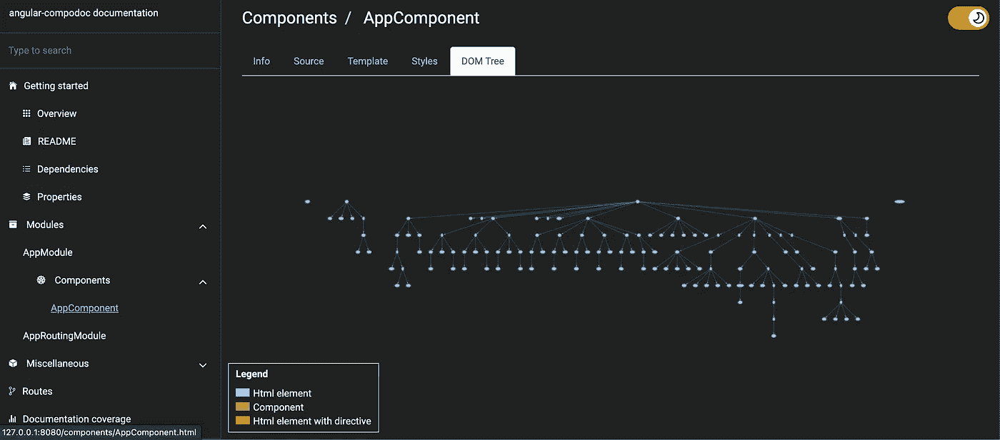

# Meet Compodoc:自动生成静态文档的工具

> 原文：<https://javascript.plainenglish.io/the-only-documentation-you-need-for-the-angular-application-4ceb8f0e6068?source=collection_archive---------10----------------------->

## 什么是 Compodoc？一个很棒的第三方库，它基于一个命令的代码自动生成静态文档。


I know.

作为一名开发人员，我写了很多代码，但是我很少关注应用程序的文档。如果你和我一样，这里有一个很棒的第三方文档库——Compodoc。

Compodoc 是一个很好的文档工具。它用一个命令自动生成基于代码的静态文档。

现在让我们看看如何在 Angular 应用程序中使用 Compodoc。

首先，让我们用 CLI 创建一个新的 angular 应用程序。

```
ng new angular-compodoc
```

CLI 完成创建应用程序后，运行 ng serve 并确保您可以在 localhost:4200 上看到该应用程序

现在让我们全局安装 Compodoc，并将其添加到您的本地项目中。您可以手动安装它，但下面的命令会使您的工作变得容易。

```
npm install -g @compodoc/compodoc
ng add @compodoc/compodoc
```

上面的命令将添加 Compodoc 运行所需的所有依赖项、脚本和 tsconfig.doc.json 文件。

现在，您已经为 angular 项目准备好了使用文档功能。运行以下命令，并在您选择的浏览器中打开 [http://127.0.0.1:8080/](http://127.0.0.1:8080/) 。

```
npm run compodoc:build-and-serve
```



在 [Medium](https://medium.com/@manthenav01) 或 [Twitter](https://twitter.com/SunilManthena08) 上关注我，阅读更多关于 Angular 和 JavaScript 的内容！

*更多内容请看**[***说白了。报名参加我们的***](https://plainenglish.io/) **[***免费周报***](http://newsletter.plainenglish.io/) *。关注我们关于*[***Twitter***](https://twitter.com/inPlainEngHQ)*和*[***LinkedIn***](https://www.linkedin.com/company/inplainenglish/)*。加入我们的* [***社区不和谐***](https://discord.gg/GtDtUAvyhW) *。****