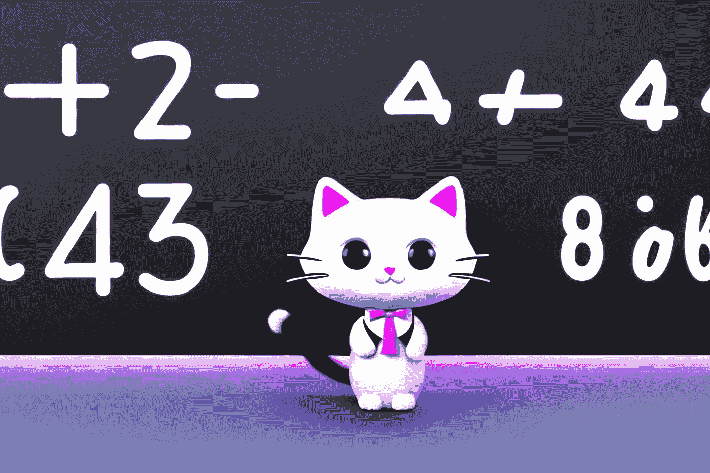

# 持久性问题:从恐吓到理解

> 原文：<https://javascript.plainenglish.io/the-persistence-bugger-problem-from-intimidation-to-understanding-bf70cf78c282?source=collection_archive---------9----------------------->

## 毁灭 2022

## 用 JavaScript 计算持久性的初学者指南



今天的命题涉及一个我不熟悉的数学概念:一个数的持久性。这让我有点担心。但在理解了底层概念之后，我意识到了一些事情:除了它的数学公式之外，这个练习真的很简单。不过还是从问题正文开始吧。

# 问题:顽固的家伙

链接到[形](https://www.codewars.com/kata/55bf01e5a717a0d57e0000ec)

编写一个函数`persistence`，它接受一个正参数`num`，并返回它的乘法持久性，即你必须将`num`中的数字相乘直到达到一位数的次数。

例如(输入→输出):

```
39 --> 3 (because 3*9 = 27, 2*7 = 14, 1*4 = 4 and 4 has only one digit)
999 --> 4 (because 9*9*9 = 729, 7*2*9 = 126, 1*2*6 = 12, and finally 1*2 = 2)
4 --> 0 (because 4 is already a one-digit number)
```

# 我的解决方案


先说‘乘法持续’的定义。根据[维基百科](https://en.wikipedia.org/wiki/Persistence_of_a_number)，`persistence of a number`定义为在达到一个固定点之前，该操作必须应用于该整数的次数，在该点，该操作不再改变该数字。通常，这涉及一个非负整数的加法或乘法持久性，这是一个人必须用数字的和或积替换数字直到达到一个位数的频率。

我们如何解决这个问题？像往常一样，最好把它分解成更小的步骤。但是首先，我们需要做一个小的概念抽象。乍一看，运算的自变量是一个数(like number)。但如果我们思考问题，我们对作为数学实体的数不感兴趣。我们感兴趣的是作为数字列表的数字。换句话说，我们感兴趣的是作为序列数字数组的数字。

```
const digits = (n: number): number[] => [...("" + n)].map(Number);
```

为什么把数字看成数组对我们有用？因为这样我们可以使用 JavaScript 的预定义方法来处理每一个数字。在这种情况下，我发现 [Array.reduce()](https://developer.mozilla.org/en-US/docs/Web/JavaScript/Reference/Global_Objects/Array/reduce) 方法很有用。我可以用它将每个数字乘以之前乘法的结果。唯一要注意的是设置一个起始值(这里是`1`):默认情况下，第一个值总是`0`，乘以`0`总是得到`0`。

```
const multiplice = (n: number): number => digits(n).reduce((a, v) => a * v, 1);
```

这个函数只计算一次每个数字的乘法运算。我们必须重复操作几次，直到出现一个位数。我们可以使用循环(例如 while)或递归函数。但是在决定之前，让我们考虑一下退出条件。

我们可以使用`String.length`或`Array.length`来计算数字的长度。当这个值等于 1 时，那么我们要做的操作就结束了。


但是有一种更快的方法可以得到同样的结果。因为我们使用的是正整数，所以任何小于`10`的数都只有一位。所以我们只需要一个类似于:`n < 10`的条件来退出循环。

现在我有了解决问题的所有方法。我可以用一个`while`循环来实现:

```
const digits = (n: number): number[] => [...("" + n)].map(Number);
const multiplice = (n: number): number => digits(n).reduce((a, v) => a * v, 1);

const persistence = (n: number): number => {
  let i = 0;
  while (n >= 10) {
    n = multiplice(n);
    i++;
  }
  return i;
};
```

我也可以使用一个`recursive` 函数来得到相同的结果:

```
const digits = (n: number): number[] => [...("" + n)].map(Number);
const multiplice = (n: number): number => digits(n).reduce((a, v) => a * v, 1);

const persistence = (n: number, i: number = 0): number =>
  n < 10 ? i : persistence(multiplice(n), ++i);
```

就个人而言，我喜欢后一种解决方案:它简短、简单且相当清晰。但是我们可以更进一步，把一切都简化成一个函数。

```
const persistence = (n: number, i: number = 0): number =>
  n < 10
    ? i
    : persistence(
        [...("" + n)].reduce((a, v) => a * +v, 1),
        ++i
      );
```

结果有点神秘；我更喜欢避免太“聪明”的代码:我未来的自己可能看不懂。然而，看看 JavaScript(和 TypeScript)如何用几个字符解决一个数学问题仍然很有趣。

感谢阅读！敬请关注更多内容。

***不要错过我的下一篇文章—报名参加我的*** [***中邮箱列表***](https://medium.com/subscribe/@el3um4s)

[](https://el3um4s.medium.com/membership) [## 通过我的推荐链接加入 Medium—Samuele

### 阅读萨缪尔的每一个故事(以及媒体上成千上万的其他作家)。不是中等会员？在这里加入一块…

el3um4s.medium.com](https://el3um4s.medium.com/membership) 

## PS:

我让 ChatGPT(它是一种人工智能)来解决同样的问题。这是它给我的回复:

```
function persistence(num: number): number {
  let persistence = 0;
  while (num >= 10) {
    num = num
      .toString()
      .split('')
      .map(Number)
      .reduce((a, b) => a * b);
    persistence++;
  }
  return persistence;
}
```

这个函数接受一个正数`num`并返回它的乘法持久性。它首先将变量`persistence`设置为 0，这将记录我们需要将数字相乘的次数。然后，它进入一个循环，只要`num`大于或等于 10，该循环就会继续。在循环内部，它将`num`转换成一个字符串，将其拆分成一个数字数组，将这些数字映射成数字，并通过将所有数字相乘将数组简化为一个数字。然后，它将变量`persistence`递增 1。当循环退出时，它返回`persistence`的最终值。

比如我们调用`persistence(39)`，函数会先把`persistence`设置为 0。然后，它将进入循环并执行以下操作:

1.  将`num`转换为字符串:`"39"`
2.  将字符串拆分成一个数字数组:`["3", "9"]`
3.  将数字映射到数字:`[3, 9]`
4.  通过将所有数字相乘，将数组简化为一个数字:`27`
5.  将`persistence`变量增加 1: `1`

然后，将`num`设置为`27`，循环将继续。它将执行与之前相同的操作，导致`num`被设置为`4`并且`persistence`被递增为`2`。最后，循环会退出，因为`num`现在小于 10，函数会返回`2`，这是`39`的乘法持久性。


结果是正确的，尽管它没有我的解决方案优雅(没有虚假的谦虚)。但是，有一件事让我很惊讶。AI 将构造函数编号传递给 Array.map()方法，不带任何参数。这将一个字符串转换成一个数字。

ChatGPT 和其他人工智能有了很大的进步。至少在我所做的测试中，他们的能力随着每次更新而提高。然而，有一样东西是他们无法取代的:解决数学或编程难题的智力乐趣。正是这种快乐促使我接受这场灾难。这让我想在圣诞节后继续写这种类型的帖子。

*更多内容请看*[***plain English . io***](https://plainenglish.io/)*。报名参加我们的* [***免费周报***](http://newsletter.plainenglish.io/) *。关注我们关于*[***Twitter***](https://twitter.com/inPlainEngHQ)[***LinkedIn***](https://www.linkedin.com/company/inplainenglish/)*[***YouTube***](https://www.youtube.com/channel/UCtipWUghju290NWcn8jhyAw)*[***不和***](https://discord.gg/GtDtUAvyhW) ***。*****

*****对缩放您的软件启动感兴趣*** *？检查* [***电路***](https://circuit.ooo/?utm=publication-post-cta) *。***