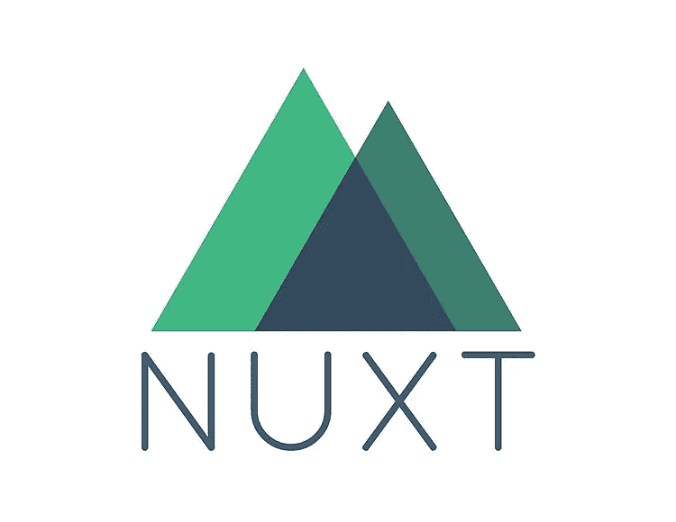
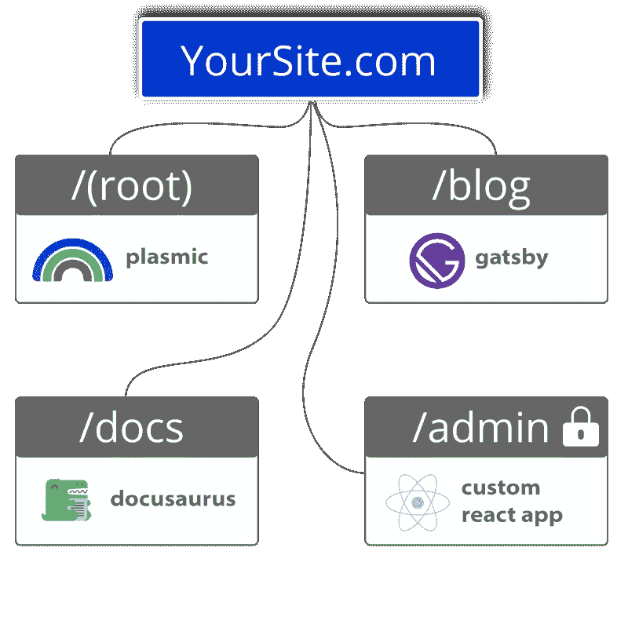

# Nuxt.js 的优点和缺点

> 原文：<https://javascript.plainenglish.io/the-positives-and-negatives-of-nuxt-js-f0b4bb904?source=collection_archive---------19----------------------->

开发一个网站应该是一种有趣、自由的体验。

根据您正在构建的内容，自由选择您想要使用的框架。

通过 Fathym 的[模块化方法](https://www.fathym.com/blog/articles/2022/october/2022-10-04-five-reasons-to-use-modular-frontends)，我们使用“路线”允许你在你的 monolith 之外运行尽可能多的应用或页面。可以把一个路径想象成一个网站的子路径，比如/docs 或者/blog。你的独石可能包含你的主站点和一些路线，但是通过模块化的方法你不会被困在独石中。每条路线及其应用程序都可以由不同的团队使用不同的框架来创建。

除此之外，使用[可组合前端架构](https://www.fathym.com/blog/articles/2022/september/2022-09-01-explaining-composable-frontend-architecture-as-simply-as-possible)才有意义。使用任何 JavaScript 框架来构建网站的一个方面，然后使用不同的框架来构建网站的其他部分。

可组合前端改变了人们开发网站的方式。

因此，本着传播可组合前端的精神——你可以与 [Fathym 的新 UI](https://www.fathym.com/blog/articles/2022/august/2022-08-08-introducing-fathyms-revamped-ui) 一起使用——我们来看看 Nuxt.js 中的一个较新的框架

# Nuxt.js 人气

我们决定深入研究 Nuxt 的原因之一是它在过去一年中的受欢迎程度。

回顾 jam stack . org 2021 年的调查，Nuxt.js 甚至不在最受欢迎/最令人畏惧的框架之列。但快进到今年，Nuxt 以 64.15%的“喜爱”和“畏惧”数字稳稳地排在榜单第九位。

[通过我们关于 2022 年框架流行度的博客。由于多种原因，框架流行度很重要。](https://www.fathym.com/blog/articles/2022/july/2022-07-13-ranking-javascript-frameworks-by-popularity-2022)

首先，如果你和你的团队正在进行一个长期的大项目，你需要确保你所使用的框架将贯穿整个过程。想象一下，开始一个重要的网站建设，而框架突然从地球上消失，那将是一场噩梦。

其次，这种受欢迎程度保证了更多的开发人员知道如何使用这个特定的框架。如果你的第一个开发人员离开了，你应该可以用另一个团队成员来填补他们的位置。或者，在我们的模块化前端的情况下，您可能希望同一个团队中的多个成员了解同一个框架。他们可以合作，互相帮助，创造一些特别的东西。

如果你的公司扩张，你将能够找到使用流行框架的新开发人员。

所以，让我们深入了解 Nuxt 到底是什么，它提供了什么。

# Nuxt.js 是什么？

Nuxt 是一个 JavaScript 框架，它建立在 Vue.js 之上。它提供了一种更简单的方法来创建通用或单页 Vue 应用程序。

Nuxt 还承诺通过结合客户端和服务器端渲染来提高 SPAs 的 SEO 分数。Nuxt 还因其在移动水疗中的出色表现以及给用户带来的体验而受到好评。

不过，让 Nuxt 与众不同的是，它能够生成开箱即用的静态网站。这对于那些希望尽快找到一个网站的人来说是一件大事。静态网站更简单，并不适合所有类型的网站，但它们可以用于只有几页的博客或只在一定时间内开放的推广网站。再说一遍，静态网站对安全性也很重要，因为它们不连接到服务器或任何信息。

Nuxt 做的另一件事是通过自动代码分割来缩小应用程序的大小。它们以 57kb 的轻量级大小出现。

那么，你为什么要使用 Nuxt.js 而不是 Vue.js 呢，它是建立在之上的？由于我们上面提到的原因，Nuxt.js 有助于构建更快、更高效的 Vue 应用。

## Nuxt.js 优缺点

**Nuxt.js 优点**

*   spa 的 SEO 改进
*   移动应用性能
*   能够创建开箱即用的静态网站
*   静态站点同样具有很高的安全性
*   与 Vue.js 相比，企业就绪型
*   自动代码分割

**Nuxt.js 缺点**

*   缺少通用插件
*   网站的高流量会导致服务器压力
*   调试很困难
*   背后的小社区

# 结论

你试过 Nuxt.js 吗？

嗯，你今天可以在 [Fathym 平台上免费！](https://www.fathym.com/dashboard)

如果你有，也许你想和其他框架一起评估 Nuxt.js，比如 Vue、React、Angular 或 Svelte。

或者，用 Nuxt.js 为一条路线——也许是你的主页——创建一个应用，然后在它旁边使用无代码工具为另一条路线——也许是博客——创建一个应用？开发者的选择是无限的，所以今天就选择你自己的旅程吧。

*最初发表于*[*https://www.fathym.com*](https://www.fathym.com/blog/articles/2022/october/2022-10-17-positives-and-negatives-of-nuxt)*。*

*更多内容请看*[***plain English . io***](https://plainenglish.io/)*。报名参加我们的* [***免费周报***](http://newsletter.plainenglish.io/) *。关注我们关于*[***Twitter***](https://twitter.com/inPlainEngHQ)[***LinkedIn***](https://www.linkedin.com/company/inplainenglish/)*[***YouTube***](https://www.youtube.com/channel/UCtipWUghju290NWcn8jhyAw)***，以及****[***不和***](https://discord.gg/GtDtUAvyhW) *对成长黑客感兴趣？检查* [***电路***](https://circuit.ooo/) ***。*****