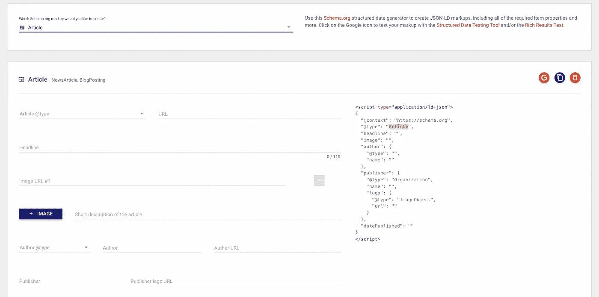

# Schema.org 的力量

> 原文：<https://javascript.plainenglish.io/the-power-of-schema-org-a810d1ffabf2?source=collection_archive---------12----------------------->

## 如何将 Schema.org 集成添加到您的网站。

如果你上过互联网，那么你可能已经在不知不觉中感受到了 Schema.org 的真正力量。我举几个例子，让我知道哪些听起来耳熟。

你曾经:

*   搜索一个网站，谷歌有没有向你展示一个小搜索框，让你可以立即在那个网站上搜索
*   搜索产品并在浏览器中看到评论
*   搜索一家公司或一个人，在你的浏览器中看到了对他们的描述和他们的社会关系

这些只是 Schema.org 整合的几个例子，今天我将教你，你如何把它们添加到你的网站上！


# 它是如何工作的

每个 Schema.org 集成都是一个具有特定格式的脚本标签，您需要将它添加到站点的主体中。虽然您可以自己编写这些脚本，但是有太多的属性、选项和变化，基本上不可能知道所有的内容。这就是为什么我建议你寻找一个坚实的 Schema.org 发电机！

我个人最喜欢的是 TechnicalSEO.com 的那部。



A screenshot of technicalseo.com

当您将这些生成的脚本标签之一添加到您的站点时，它会让搜索引擎知道关于页面内容的更多细节。例如，它指定这个页面是一篇博客文章、一个食谱或一个职位发布。

# 对我排名有影响吗？

我很高兴地说，是的，的确如此！虽然我们从来没有 100%确定搜索引擎的内部工作方式，但专家们非常确定这有助于你获得更高的排名。这表明你的网站是最新的，并利用了最新的趋势和技术。

这是一个很小的变化，但会对你的网站的搜索性能产生很大的影响，所以添加它并没有坏处！

# 一些最有趣的剧本

虽然有大量的选项，但我确信其中一些确实很突出，并且在您正在构建的应用程序中有很好的用例。

## [文章](https://developers.google.com/search/docs/advanced/structured-data/article)

对于博客帖子来说，这种集成非常完美，可以显示文章或博客帖子的作者、标题和内容。它与谷歌紧密集成，可以出现在“头条新闻”部分。


## [面包屑](https://developers.google.com/search/docs/advanced/structured-data/breadcrumb)

虽然这个没有其他的大。这是一个微妙的整合，可以给你的链接更多的可信度！面包屑轨迹向用户显示了他们需要点击才能到达该页面的链接。

举个例子，

```
Home > Blog > Technology > The Power of Schema.org
```

## [常见问题解答](https://developers.google.com/search/docs/advanced/structured-data/faqpage)

非常适合登陆或营销页面。从你的网站中提取关键问题和陈述，并在脚本中正确回答。这个也与谷歌紧密结合，可以显示在有机搜索结果中。


我相信这三个非常有趣，对我来说它们有最好的使用案例，但是请相信我，还有更多！如果你想看看所有的选项，一定要查看一下[谷歌文档](https://developers.google.com/search/docs/advanced/structured-data/search-gallery)，因为他们有一个页面指定了所有可能的选项，以及它们如何出现在他们的搜索引擎中！

祝你有完美的一天！❤️

*更多内容看* [***说白了。报名参加我们的***](https://plainenglish.io/) **[***免费周报***](http://newsletter.plainenglish.io/) *。关注我们关于*[***Twitter***](https://twitter.com/inPlainEngHQ)*和*[***LinkedIn***](https://www.linkedin.com/company/inplainenglish/)*。加入我们的* [***社区***](https://discord.gg/GtDtUAvyhW) *。***