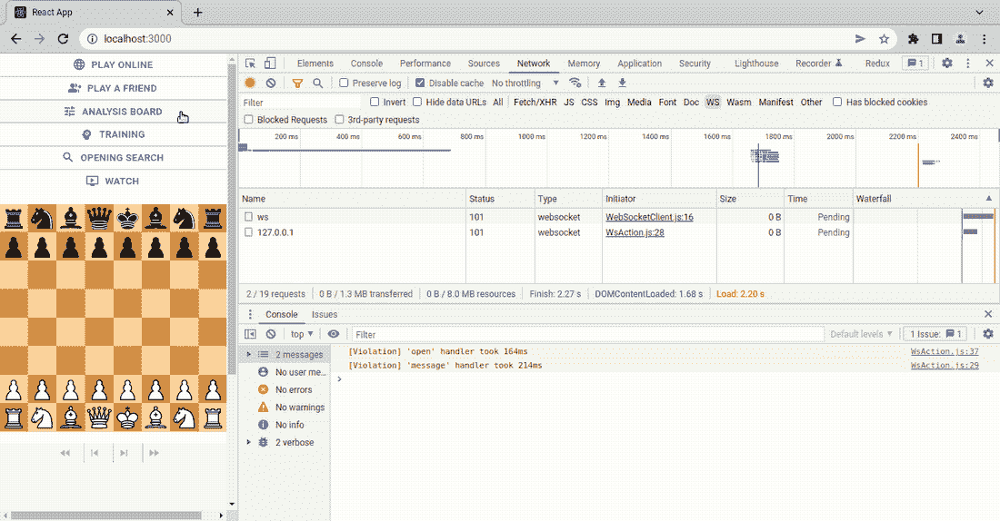
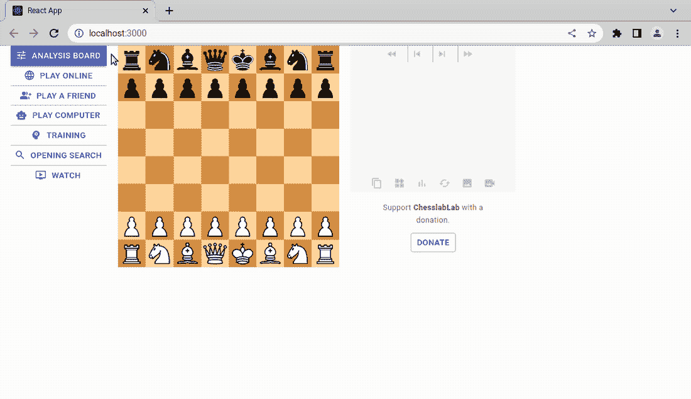

# 如果加载字符串用双引号括起来，进度对话框不会隐藏

> 原文：<https://javascript.plainenglish.io/the-progress-dialog-didnt-hide-if-loading-strings-enclosed-in-double-quotes-14b74ab4078d?source=collection_archive---------13----------------------->

## 这都是关于验证数据和显示错误。


Photo by [Mike van den Bos](https://unsplash.com/@mike_van_den_bos?utm_source=unsplash&utm_medium=referral&utm_content=creditCopyText) on [Unsplash](https://unsplash.com/s/photos/loading?utm_source=unsplash&utm_medium=referral&utm_content=creditCopyText)

嘿，你今天过得好吗？希望如此！

这是“让我们切入正题”系列中的另一篇文章，我在这里告诉你关于解决 GitHub 上的 ChesslaBlab 问题的最重要的事情。

[](https://programarivm.medium.com/solving-issues-on-github-in-few-words-e63a115a3260) [## 用几句话解决 GitHub 上的问题

### 让我们开门见山吧

programarivm.medium.com](https://programarivm.medium.com/solving-issues-on-github-in-few-words-e63a115a3260) 

今天，使用 JavaScript、React 和 Redux Toolkit 的一些编程已经修复了下面的 bug。

[](https://github.com/chesslablab/redux-chess/issues/316) [## 如果加载用双引号括起来的 FEN 字符串，进度对话框不会隐藏

### 此时您不能执行该操作。您已使用另一个标签页或窗口登录。您已在另一个选项卡中注销，或者…

github.com](https://github.com/chesslablab/redux-chess/issues/316) 

正如你在下面的 GIF 中看到的，当输入一个意外的输入值时，进度对话框没有隐藏，比如用双引号括起来的 FEN 字符串。相反，国际象棋服务器会用一个确认消息来响应:“服务器不能识别命令。您提供了有效的参数吗？



**Figure 1**. Command not recognized by the server. Did you provide valid parameters?

这都是关于验证和显示错误消息。

应该帮助用户识别、诊断和从错误中恢复。根据 Jakob Nielsen 的[交互设计的一般原则](https://www.nngroup.com/articles/ten-usability-heuristics/)，每当像这样的错误由于错误的数据输入而发生时，应该用简单的英语显示用户友好的消息。

但这也关乎安全。

现在让我们试着更好地理解 [PHP 象棋服务器](https://github.com/chesslablab/chess-server)如何与客户端交互，请在本地运行服务器。

```
$ php cli/ws-server.php 
Welcome to PHP Chess Server
Commands available:
/accept {"jwt":"<string>"} Accepts a request to play a game.
/draw {"action":["accept","decline","propose"]} Allows to offer a draw.
/heuristics Takes a balanced heuristic picture of the current game.
/heuristics_bar {"fen":"<string>"} Takes an expanded heuristic picture of the current position.
/leave {"action":["accept"]} Allows to leave a game.
/legal_sqs {"position":"<string>"} Returns the legal squares of a piece.
/online_games Returns the online games waiting to be accepted.
/play_fen {"fen":"<string>"} Plays a chess move in shortened FEN format.
/random_checkmate {"turn":"<string>","items":"<string>"} Starts a random checkmate position.
/random_game Starts a random game.
/rematch {"action":["accept","decline","propose"]} Allows to offer a rematch.
/resign {"action":["accept"]} Allows to resign a game.
/gm Returns a computer generated response to the current position.
/restart {"hash":"<string>"} Restarts a game.
/start {"mode":["analysis","gm","fen","pgn","play","stockfish"],"fen":"<string>","movetext":"<string>","color":["w","b"],"settings":"<string>"} Starts a new game.
/stockfish {"options":{"Skill Level":"int"},"params":{"depth":"int"}} Returns Stockfish's response to the current position.
/takeback {"action":["accept","decline","propose"]} Allows to manage a takeback.
/undo Undoes the last move.Listening to commands...
```

然后，打开一个 [websocat](https://github.com/vi/websocat) 会话。

```
$ ./websocat ws://localhost:8080
```

请注意，如果提供了不存在的命令或错误的参数，服务器会响应一个`validate`响应。

```
/start fen ""rnbqkbnr/pppp1ppp/8/4p3/4P3/8/PPPP1PPP/RNBQKBNR w KQkq e6""{"validate":"Command not recognized by the server. Did you provide valid parameters?"}
```

因此，上面的命令类似于下面的命令，因为`/start_fen`提供了两个参数，而不是预期的一个。

```
/start fen "foo" "bar"{"validate":"Command not recognized by the server. Did you provide valid parameters?"}
```

值得一提的是，如果输入一个包含无效 FEN 字符串的语法正确的命令，服务器将做出不同的响应，如下例所示。

```
/start fen "foo"{"\/start":{"mode":"fen","message":"This FEN string could not be loaded."}}
```

如果对 FEN 字符串中的双引号进行转义，客户端将得到完全相同的响应。

```
/start fen "\"rnbqkbnr/pppp1ppp/8/4p3/4P3/8/PPPP1PPP/RNBQKBNR w KQkq e6\""{"\/start":{"mode":"fen","message":"This FEN string could not be loaded."}}
```

问题是，这两种是不同类型的错误消息。前者由无效命令触发，而后者由无效 FEN 字符串触发。尽管如此，验证逻辑已经在服务器端实现了。

到目前为止，React 应用程序还没有识别出`validate`响应——那些服务器在收到语法错误的命令时发送的响应。因此，如果你检查关闭这个问题的公关，你会发现它归结为在`WsEvent.js`实施`onValidate()`事件。

[](https://github.com/chesslablab/redux-chess/pull/325) [## 问题/316 如果加载用双引号括起来的 fen 字符串，进度对话框不会隐藏…

### 将此建议添加到可以作为单次提交应用的批处理中。此建议无效，因为没有更改…

github.com](https://github.com/chesslablab/redux-chess/pull/325) 

此外，React Redux 应用程序引入了一个名为`MODE_UNDEFINED`的新游戏模式，每当出现意外原因时，它都会切换到该模式。



**Figure 2**. Whoops! Something went wrong, please try again with different data.

有人可能会说，最好使用 JavaScript 对双引号进行转义，这样用户就会看到“这个 FEN 字符串无法加载”而不是“呜呜！出现错误，请使用不同的数据重试。但至少 React Redux 应用程序现在可以识别`validate`事件了。

*更多内容看* [***说白了就是 io***](https://plainenglish.io/) *。报名参加我们的* [***免费周报***](http://newsletter.plainenglish.io/) *。关注我们上* [***推特***](https://twitter.com/inPlainEngHQ)[***领英***](https://www.linkedin.com/company/inplainenglish/)**和* [***不和谐***](https://discord.gg/GtDtUAvyhW) ***。****