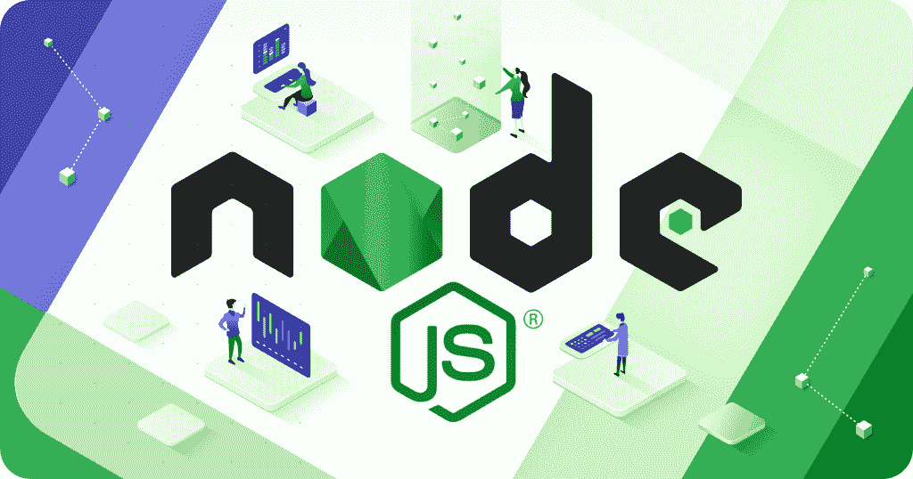
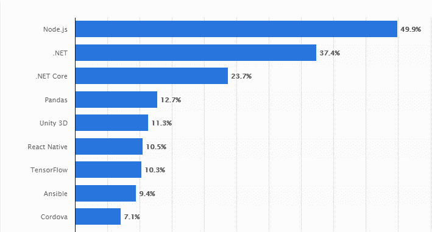
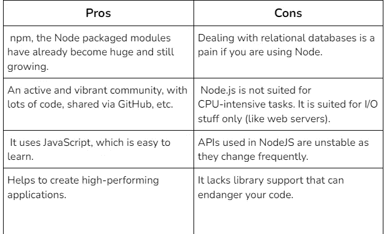
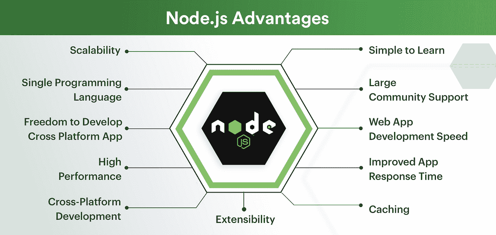
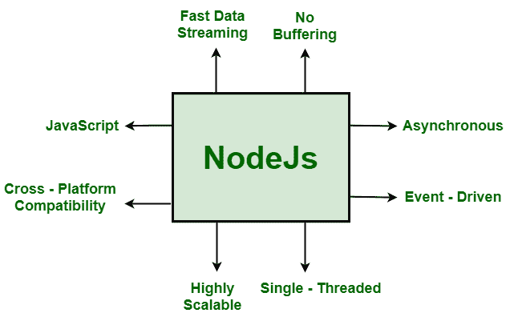

# Node.js Web 应用程序开发的利与弊:详细介绍

> 原文：<https://javascript.plainenglish.io/the-pros-and-cons-of-node-js-web-app-development-a-detailed-look-c91a22f013c?source=collection_archive---------1----------------------->

[Source](https://www.britwise.com/blog/benefits-and-drawbacks-of-node-js-web-development)

在过去的几年中，Node.js 在 web 开发中获得了很大的吸引力，并在开发界掀起了一阵风暴。这有许多原因，但主要的吸引力之一是它能够轻松处理大规模的应用程序。

Node.js 对于创建实时应用程序来说是完美的，它对企业有很多潜在的好处。与传统的 web 应用程序框架如 Ruby on Rails 或 ASP.NET 相比，它提供了许多优势。

但是 Node.js 是什么呢？嗯，它是一个用于服务器端和网络应用程序的开源、跨平台运行时环境。

Node.js 被企业用来提供网络服务，为当今互联网上一些访问量最大的网站提供支持，包括脸书和 LinkedIn。

根据最近的[统计](https://www.esparkinfo.com/node-js-development-trends.html)，**全球 49.9%的开发者**使用 node.js 创建 web 开发项目。

[source](https://www.esparkinfo.com/node-js-development-trends.html)

然而，虽然它拥有出色的性能和可伸缩性，但它也有一些严重的缺点，您应该在开始开发之前考虑一下。

在这篇博客文章中，我们将详细了解 Node.js web 应用程序开发的利弊，以便您对是否选择 Node 得出明确的结论。你下一个项目的 JS。

**让我们开始吧！**

# Node.js 是什么？

节点。JS 建立在 Chrome 的 JavaScript 运行时之上，用于构建快速和可扩展的网络应用。

这个 JavaScript 运行时使用事件驱动的非阻塞 I/O 模型，这使得它对于运行在分布式设备上的数据密集型实时应用程序来说是高效和完美的。

此外，Node.js 应用程序是用 JavaScript 编写的，可以在 Mac OS X、Microsoft Windows 和 Linux 上的 Node.js 运行时中运行，无需任何更改。

# Node.js 的优势

# 1.提供简单的可扩展性

Node.js 提供了简单的可伸缩性，因为它具有异步和事件驱动的特性。这使得 Node.js 非常适合高吞吐量和实时应用程序。node.js 的最大优势之一是它在当今的 web 开发世界中广受欢迎。

Node.js 只需要一个带有事件循环的线程就可以维护长期运行的连接，事件循环用于在监听新数据和处理现有请求之间进行切换。

Node.js 遵循非阻塞 I/O，这使得它在本质上非常可伸缩、高效、快速和高性能。因此，它现在被认为是 web 服务器的一个很好的资源。

除此之外，随着业务的增长，Node.js 平台可以很容易地适应新的需求。它占用的内存很少，这使得它非常适合垂直伸缩。

使用 Node.js 框架可以轻松实现微服务，从而使平台更具可扩展性。而且，你还可以 [**雇佣 node.js 开发者**](https://www.valuecoders.com/hire-developers/hire-nodejs-developers) 将技术集成到你的 web app 开发项目中。

# 2.简单易学

根据节点。JS 的 2016 年用户调查显示，JavaScript 是前端开发最受欢迎的编程语言之一，几乎 **85%的人喜欢它，而不是 Python 或 Ruby** 。

Node.js 是一种高要求的编程语言，它为开发人员社区提供了一种为当今技术驱动的世界创建软件应用程序和服务的优秀方法。

因为它非常容易适应，所以许多人学习 Node.js 用于 web 应用程序开发或其他流行的用例。Node.js 需要较少的时间和精力来学习这种语言。因此，开发高效的 web 应用程序是 node.js 的最大优势之一。

# 3.因提供高性能而广受欢迎

与其他服务器端脚本语言相比，Node.js 以提供高性能而闻名。这使得它成为许多 web 开发人员的一个有吸引力的选择。

为了测试 Node.js 的性能，您可以尝试不同的项目，并将它们的速度与其他服务器端脚本语言(如 Java 或 PHP 等)进行比较。

大多数情况下，在响应网页请求时，Node.js 会比其他服务器端脚本语言更快。

# 4.活跃的大型社区的支持

Node.js 还享有一个大型活跃社区的支持，该社区总是愿意帮助解决您可能面临的任何疑问或问题。

这是一项全球通用的技术，吸引了数百万开发人员从事这项技术，并解决了不同行业中最复杂的问题，包括谷歌或微软这样的科技巨头。

因此，它拥有一个庞大而活跃的社区的支持，这被证明是 node.js 的显著优势之一。

# 5.缓存的优势

Node.js 在缓存方面也有优势。这意味着您可以在用户的计算机上本地存储数据或文件，然后在下次请求时快速访问它们。这可以成为 node.js 对于高流量网站的一大优势。

使用 Node.js 缓存还有助于提高性能和速度。当文件或数据被缓存时，这意味着服务器不必在每次需要时向数据库发回请求。

这可以提高响应时间，让用户感觉网站更快。

# 6.全栈 JavaScript 的成本效益

Node.js 具有成本效益，因为它只使用一种语言进行后端和前端开发。这意味着你不需要学习多种语言来开发一个完整的网站。

对于小型企业或初创企业来说，这可能是 node.js 的一个显著优势，因为它们可能没有预算为网站的后端和前端雇佣单独的开发人员。

而且 Node.js 允许使用全栈 JavaScript。这意味着你可以在网站的前端和后端使用相同的语言。这有助于改善开发人员之间的沟通和协作。

# 7.更快上市

由于 Node 附带了一个内置的包管理器，所以您可以访问库和工具，这些库和工具有助于在任何环境中进行快速开发。

通过这种方式，Node.js 使企业能够更快地将其产品或服务推向市场，这被证明是 node.js 的显著优势之一。

因为 Node.js 提供了高性能和缓存，所以企业可以依靠它来处理高流量负载，而不会出现任何问题。

这使得 Node.js 成为寻求快速发展并需要一种服务器端脚本语言来满足需求的企业的绝佳选择。雇佣 Node.js 开发公司也可以帮你创建动态 web 应用。

# 8.跨平台应用开发的首选

由于是基于 JavaScript 的技术，node.js web 开发不需要编译过程，因此非常适合跨平台应用程序开发。

这意味着，一旦你使用 node.js web development 创建了一个应用程序，你就可以轻松地将其打包为多个操作系统的可执行文件，而无需任何麻烦，甚至无需重新编译代码(这就是所谓的节点模块)。

简而言之，这意味着你可以让几乎所有操作系统用户都能使用你的应用。这是它在当今竞争激烈的 web 应用程序世界中的重要优势之一。

# 9.单一编程语言

虽然大多数其他编程语言只用于一个目的，但 JavaScript 是一种既可用于客户端脚本又可用于服务器端脚本的语言。

这使得使用单一语言开发、部署和维护 web 应用程序比使用不同语言进行前端和后端开发更简单，因为前端和后端开发需要它们之间的有效通信。

Node 的异步模型还消除了与传统技术相关的时间延迟，传统技术限制了应用程序在页面加载时进行交互式内容交付的功能。

# 10.节点包管理器

Node.js 有一个名为 NPM 的内置包管理器，它是语言自带的。这是为了方便快捷地在 Node.js 服务器上安装不同的软件包。

因为如果需要的话，您不需要依赖第三方工具来安装任何库或框架，所以它通过显著减少开发时间来提高开发人员的生产力。

# Node.js 的缺点

*   **不稳定的 API**

node.js 最大的缺点之一是它的 API 不稳定。由于 Node.js 不提供稳定的 API，开发人员在编写需要稳定 API 的程序时会面临一些困难。

这是 node.js 用户报告的一个大问题，因为即使在从一个版本的 node.js 迁移到另一个版本时，他们也必须注意 API 的不断变化。

*   **缺乏强大的图书馆支持系统**

node.js 的另一个显著缺点是缺乏强大的库支持系统。这意味着开发人员必须依赖第三方库来帮助他们完成 node.js 核心库中没有包含的任务。

此外，缺乏强大的文档系统使得新用户很难找到可用于开发的相关信息。

*   **异步编程模型**

与同步编程模型相比，Node.js 异步编程模型很难维护代码。

同步编程模型简单且易于理解，其中所有的进程都是依次执行的。

由于在异步模型中使用了“回调”,开发人员很难处理像竞争条件(当应用程序同时执行两个或更多操作，并且意外操作首先执行时发生的错误)这样的情况。因此，异步编程模型是 node.js 的一个显著缺点。

*   **处理 CPU 受限任务的能力下降**

Node.js 是一个 js 运行时环境；也就是说，它可以处理 CPU 密集型任务，但不能以比现有工具和框架更好的方式处理特定任务。

这是因为 Node.js 最初被设计为在单线程上工作，这意味着它一次可以处理一个请求。

在任何其他请求的情况下，现有的实现倾向于将它们排队，这降低了平均性能。

# Node.js 有哪些不同于其他服务器端脚本语言的特性？

Node.js 是一个运行时环境和库，用于在浏览器之外运行 JavaScript 应用程序。它使用事件驱动的非阻塞 I/O 模型，这使它变得轻量级和高效。

Node.js 非常适合开发网络应用程序和实时应用程序。让我们详细了解一下 Node.js 的一些关键特性:

*   **非阻塞输入/输出**

Node.js 构建在非阻塞 I/O 模型上，这使得它轻量级且高效。Node.js 中的所有非阻塞函数，如 readFile、writeFile 等。，允许您继续执行程序，而不必等待操作完成。

一旦 I/O 操作的函数调用被启动，节点将继续处理其他传入的操作。

*   **事件驱动**

Node.js 使用一个事件模型，其中所有 I/O 操作都被视为事件。因此，通过使用回调，服务器可以同时处理许多连接，而不会阻塞服务器上其他代码的执行。

*   **单线程**

Node.js 在单线程中运行，这对于 I/O 绑定的应用程序来说很好，因为只有一个线程来处理请求，而不是有多个线程。

然而，这也意味着如果你的程序使用了更多的 CPU 资源，它会导致糟糕的性能。

*   **异步**

在 Node.js 中，所有 I/O 操作都是异步的，也就是说，它们不会阻止服务器上其他代码的执行，这使得它比其他脚本语言更快、更轻量、更高效。

*   **开源**

作为一个开源平台，Node 允许开发者通过与他人共享他们自己的模块来为其做出贡献。这使得社区得以发展，人们可以根据自己的需要使用其他人开发的模块。

# 结果

Node.js 是开发动态 web 应用程序的一个通用且有利的工具，它的优点多于缺点。

它扩展了 JS 应用程序的边界，可以用于前端和后端服务器。这样，它被证明是当今 web 开发市场中的一个极好的选择。

既然现在您对该技术有了更好的掌握，您就可以理解使用 node.js 可以为您提供创建复杂的 web 应用程序的多种独特优势。

你也可以雇佣任何一家最好的 [**Node.js 开发公司**](https://www.valuecoders.com/blog/technology-and-apps/top-node-js-app-development-companies/) **(点击查询了解更多)**为你的企业创建一个高效的 web 应用，并在你的垂直领域留下非凡的足迹。

*更多内容请看*[***plain English . io***](https://plainenglish.io/)*。报名参加我们的* [***免费周报***](http://newsletter.plainenglish.io/) *。关注我们关于*[***Twitter***](https://twitter.com/inPlainEngHQ)*和*[***LinkedIn***](https://www.linkedin.com/company/inplainenglish/)*。加入我们的* [***社区不和谐***](https://discord.gg/GtDtUAvyhW) *。*