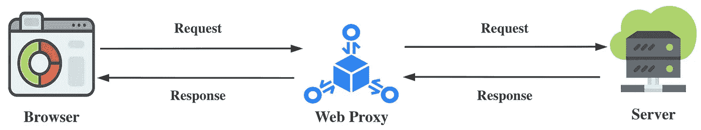
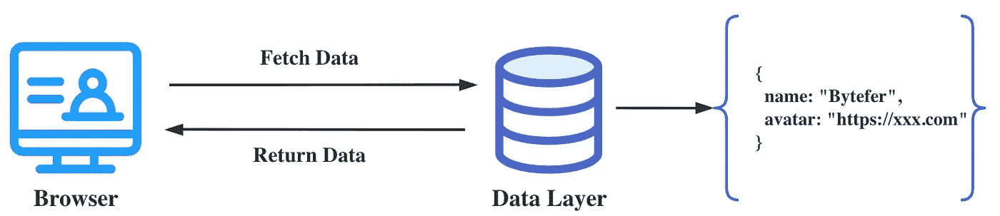
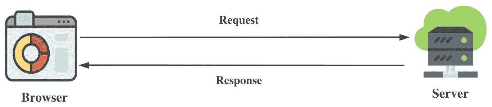
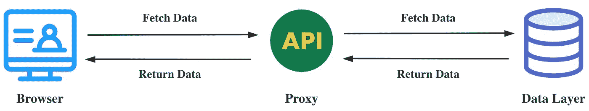
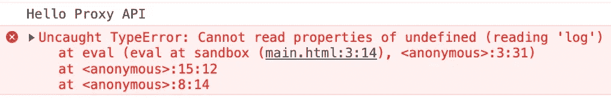

# 代理 API 如此强大，每个 Web 开发人员都应该掌握它！

> 原文：<https://javascript.plainenglish.io/the-proxy-api-is-so-powerful-that-every-web-developer-should-master-it-9bdc71a4032c?source=collection_archive---------1----------------------->

## 80%的 Web 开发人员不应该知道的代理 API 的 8 个主要使用场景！


Photo by [Aziz Acharki](https://unsplash.com/@acharki95?utm_source=medium&utm_medium=referral) on [Unsplash](https://unsplash.com?utm_source=medium&utm_medium=referral)

[代理](https://developer.mozilla.org/en-US/docs/Web/JavaScript/Reference/Global_Objects/Proxy) API 非常强大，非常有用。**在本文中，我将介绍它的 8 种使用场景**。

在日常工作中，我相信很多开发者都使用过 Web 调试代理工具，比如 Fiddler 或者 Charles。通过使用 web 调试代理工具，我们可以拦截 HTTP/HTTPS 协议请求，并手动修改请求参数和响应结果。不仅如此，在调试在线问题时，使用 Web 调试代理工具，**还可以将在线压缩和混淆的 JavaScript 文件映射到本地未压缩和混淆的 JavaScript 文件**。

在简单介绍了 Web 调试代理工具的基本功能之后，我们来看看使用 Web 调试代理工具的 HTTP 请求流程:



从上图可以看出，使用 Web 代理工具后，我们发起的 HTTP 请求会通过 Web 代理进行转发和处理。Web Proxy 代理层的增加使我们能够更好地控制 HTTP 请求流。对于单页面应用，从服务器获取数据后，我们会读取相应的数据并显示在页面上:



上述过程类似于浏览器直接从服务器获取数据:



为了能够灵活地控制 HTTP 请求流，我们添加了一个 Web 代理层。那么我们能控制数据对象的读取过程吗？答案是肯定的，我们可以使用像`Object.defineProperty`或者`Proxy` API 这样的 Web API。引入 Web API 后，数据访问流程如下图所示:



接下来，我将关注`Proxy` API，它是 Vue3 实现 data reactive 背后的“英雄”。

# 1.代理对象简介

`[Proxy](https://developer.mozilla.org/en-US/docs/Web/JavaScript/Reference/Global_Objects/Proxy)`对象用于创建对象的代理，实现基本操作(如属性查找、赋值、枚举、函数调用等)的拦截和定制。).

`Proxy`的构造函数语法是:

```
const p = new Proxy(target, handler)
```

*   `target`:要用代理包装的目标对象(可以是任何类型的对象，包括原生数组、函数，甚至是另一个代理)。
*   `handler`:定义哪些操作将被拦截，以及如何重新定义被拦截的操作的对象。

介绍完代理构造函数之后，我们来看一个简单的例子:

```
const man = {
  name: "Bytefer",
};const proxy = new Proxy(man, {
  get(target, property, receiver) {
    console.log(`Accessing the ${property} property`);
    return target[property];
  },
});console.log(proxy.name);
console.log(proxy.age);
```

在上面的例子中，我们使用了`Proxy`构造函数为`man`对象创建一个代理对象。**在创建代理对象时，我们定义一个 get 陷阱来捕获属性读取操作。**陷阱的作用是拦截用户对目标对象的相关操作。在这些操作传播到目标对象之前，会先调用相应的 trap 函数，从而拦截和修改相应的行为。

上述代码成功执行后，将输出以下结果:

```
Accessing the name property
Bytefer
Accessing the age property
undefined
```

基于上面的输出结果，我们可以发现 get trap 不仅可以拦截已知属性的读操作，还可以拦截未知属性的读操作。创建`Proxy`对象时，除了定义 get 陷阱，我们还可以定义其他陷阱，比如`has`、`set`、`delete`、`apply`或`ownKeys`等。

handler 对象支持 13 种陷阱，这里我只列出以下 5 种常用的陷阱:

*   `handler.get`:是获取属性值的陷阱。
*   `handler.set`:设置属性值的陷阱。
*   `handler.has`:是`[in](https://developer.mozilla.org/en-US/docs/Web/JavaScript/Reference/Operators/in)`操作符的陷阱。
*   `handler.deleteProperty`:删除操作符的陷阱。
*   `handler.ownKeys`:是`[Reflect.ownKeys()](https://developer.mozilla.org/en-US/docs/Web/JavaScript/Reference/Global_Objects/Reflect/ownKeys)`的陷阱。

请注意，所有陷阱都是可选的。如果没有定义陷印，将保留源对象的默认行为。看了上面陷阱的介绍，是不是觉得`Proxy` API 很厉害？

# 2.代理 API 使用场景

## 2.1 增强阵列

在上面的代码中，除了使用代理 API，我们还使用了[反射](https://developer.mozilla.org/en-US/docs/Web/JavaScript/Reference/Global_Objects/Reflect) API。一旦我们有了`enhancedArray`函数，我们可以这样使用它:

```
const arr = enhancedArray([10, 6, 8, 5, 2]);console.log(arr[-1]); // 2
console.log(arr[[2, 4]]); // [ 8, 2 ]
console.log(arr[[2, -2, 1]]); // [ 8, 5, 6 ]
console.log(arr["2:4"]); // [ 8, 5 ]
console.log(arr["-2:3"]); // [ 5, 2, 10, 6, 8 ]
```

从上面的输出结果可以看出，增强的数组对象可以支持**负索引和碎片索引**等函数。除了增强数组，我们还可以使用`Proxy` API 增强普通对象。

## 2.2 增强对象

一旦我们有了`enhancedObject`函数，我们可以这样使用它:

```
const data = enhancedObject({
  user: {
    name: "Bytefer",
    settings: {
      theme: "light",
    },
  },
});console.log(data.user.settings.theme); // light
console.log(data.theme); // light
console.log(data.address); // null
```

从上面的输出结果可以看出，通过使用`enhancedObject`函数处理的对象，我们可以很容易地访问普通对象内部的深层属性。

## 2.3 冻结对象

定义冻结功能后，让我们测试它的功能:

```
console.log(freezedMan.name); // Bytefer
freezedMan.name = "Lolo"; 
delete freezedMan.man; 
freezedMan.age = 30;
console.log(freezedMan); // { name: 'Bytefer' }
```

## 2.4 跟踪方法调用

通过`traceMethodCall`函数，我们可以用它来跟踪指定对象的方法调用:

```
const man = {
  name: "Bytefer",
  say(msg) {
    return `${this.name} says: ${msg}`;
  },
};const tracedObj = traceMethodCall(man);
tracedObj.say("Hello Proxy API"); 
// Call say method -> "Bytefer says: Hello Proxy API"
```

事实上，除了能够跟踪方法调用，我们还可以跟踪对 object 中属性的访问。

## 2.5 跟踪属性访问

通过`tracePropertyAccess`函数，我们可以用它来跟踪指定对象的属性访问:

```
const man = {
  name: "Bytefer",
};const tracedMan = tracePropertyAccess(man, ["name"]);console.log(tracedMan.name); // GET name; Bytefer
console.log(tracedMan.age); // undefined
tracedMan.name = "Lolo"; // SET name=Lolo
```

在上面的例子中，我们定义了一个`tracePropertyAccess`函数，该函数接收两个参数:obj 和 propKeys，它们分别表示要跟踪的目标和要跟踪的属性列表。调用`tracePropertyAccess`函数后，会返回一个代理对象，当我们访问被跟踪的属性时，控制台会输出相应的访问日志。

## 2.6 隐藏属性

使用`hideProperty`函数，我们可以用它来隐藏以`_`(下划线)开头的属性:

```
const man = {
  name: "Bytefer",
  _pwd: "ProxyAPI",
};const safeMan = hideProperty(man);console.log(safeMan._pwd); // undefined
console.log("_pwd" in safeMan); // false
console.log(Object.keys(safeMan)); // [ 'name' ]
```

## 2.7 沙盒

对于 JavaScript 来说，沙箱不是传统意义上的沙箱，它只是一种安全机制，在沙箱中运行一些不可信的代码，使其无法访问沙箱外的代码。

使用`sandbox`功能，让我们验证它的功能:

```
const man = {
  name: "Bytefer",
  log() {
    console.log("Hello Proxy API");
  },
};let code = "log();console.log(name)";
sandbox(code)(man);
```

当在浏览器中运行上述代码时，控制台将抛出以下错误消息:



## 2.8 建造商

构建器模式将一个复杂的对象分解成相对简单的部分，然后根据不同的需求分别创建，最后构建复杂的对象。

使用`Proxy` API，我们可以实现一个`Builder`函数，让它包装的对象支持 builder 模式来构造对象。

对于`Builder`函数，让我们看看它的两种用法。第一种方法是处理普通对象:

```
const defaultUserInfo = {
  id: 1,
  userName: "Bytefer",
  email: "[bytefer@gmail.com](mailto:bytefer@gmail.com)",
};const bytefer = Builder(defaultUserInfo).id(2).build();
console.log(bytefer);
```

第二种方法是处理类:

```
class User {
  constructor() {}
}const lolo = Builder(User, defaultUserInfo);
console.log(lolo.id(3).userName("Lolo").build());
```

如果你知道代理 API 的其他使用场景，可以给我留言。如果你想学习打字稿，那么就不要错过**掌握打字稿**系列。

[](https://medium.com/frontend-canteen/with-these-articles-you-will-not-be-confused-when-learning-typescript-d96a5c99e229) [## 有了 30+篇文章，学习 TypeScript 就不会迷茫了

### 通过生动的动画，让你轻松了解 TypeScript 的难点和核心知识！不断地…

medium.com](https://medium.com/frontend-canteen/with-these-articles-you-will-not-be-confused-when-learning-typescript-d96a5c99e229) 

在 [Medium](https://medium.com/@bytefer) 或 [Twitter](https://twitter.com/Tbytefer) 上关注我，阅读更多关于 TS 和 JS 的内容！

# 资源

[](https://developer.mozilla.org/en-US/docs/Web/JavaScript/Reference/Global_Objects/Proxy) [## 代理- JavaScript | MDN

### 代理对象允许您创建一个可以用来代替原始对象的对象，但是它可能…

developer.mozilla.org](https://developer.mozilla.org/en-US/docs/Web/JavaScript/Reference/Global_Objects/Proxy) 

*更多内容看* [***说白了就是***](https://plainenglish.io/) *。报名参加我们的* [***免费周报***](http://newsletter.plainenglish.io/) *。关注我们关于* [***推特***](https://twitter.com/inPlainEngHQ) ， [***领英***](https://www.linkedin.com/company/inplainenglish/) ***，***[***YouTube***](https://www.youtube.com/channel/UCtipWUghju290NWcn8jhyAw)***，以及****[***不和***](https://discord.gg/GtDtUAvyhW) *对成长黑客感兴趣？检查出* [***电路***](https://circuit.ooo/) ***。****