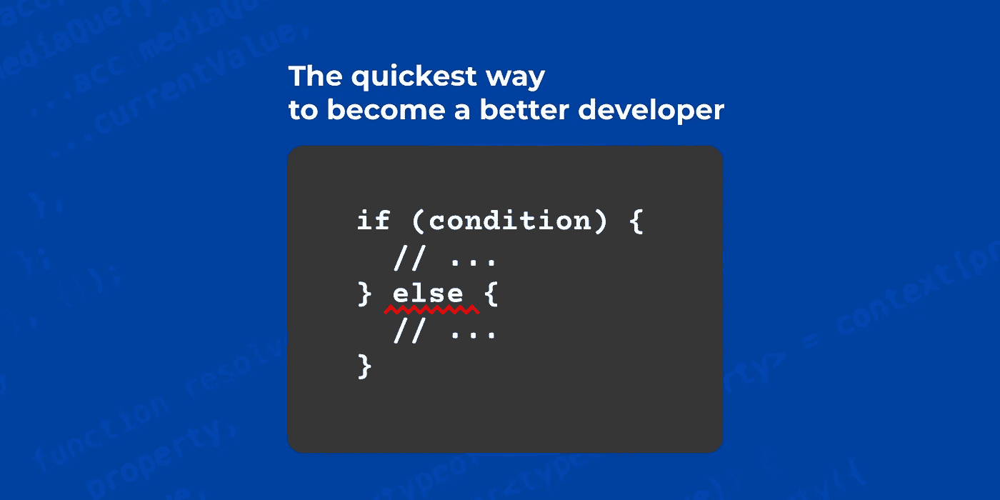
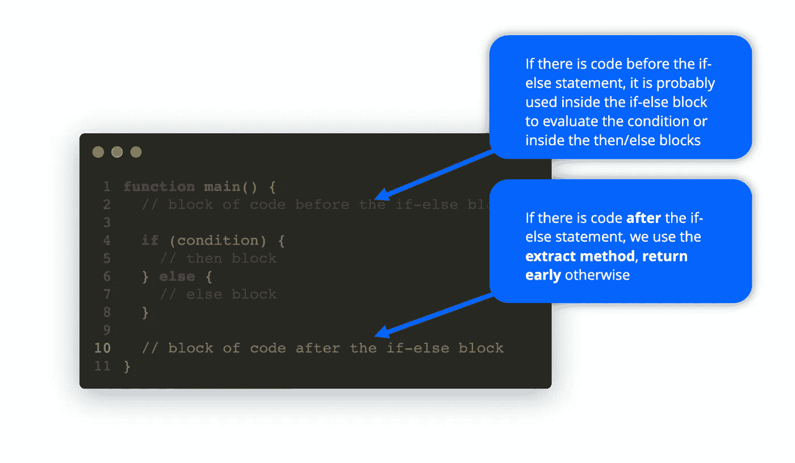
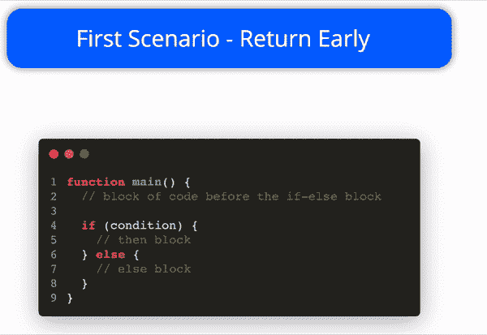
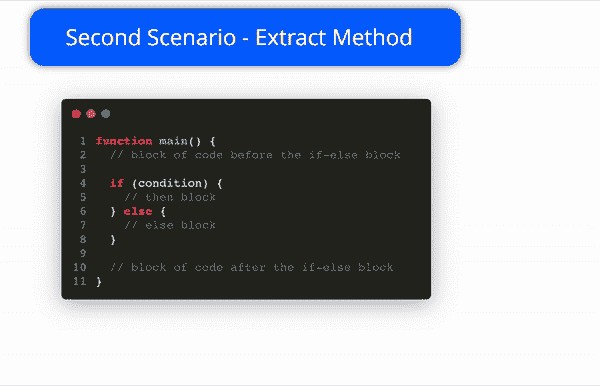
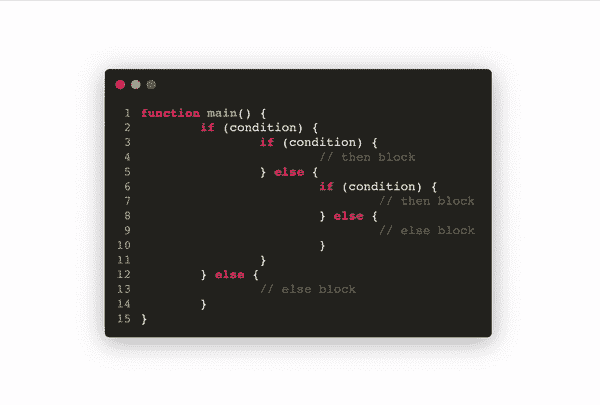

# 成为更好的开发人员的最快方法

> 原文：<https://javascript.plainenglish.io/the-quickest-way-to-become-a-better-developer-715c338a1cee?source=collection_archive---------0----------------------->

## 如果我告诉你停止使用 else 语句会让你成为一个更好的开发人员，并提高你的代码质量，会怎么样？

The simplest trick to improve the quality of your code

实话实说吧……尽管我们总是试图遵循**标准**和**最佳实践**，但我们毕竟只是人(*)！
我们都有不同的*偏好*、*背景*和*经历*，这使得我们的代码看起来与我们同事的代码略有不同，在某种程度上，我们可以说我们都有自己的*风格*编码。*

*大多数时候这种*风格的*由一些小事情组成，比如使用一个**三元运算符**代替一个 **if** 语句进行简单检查，或者使用显式**函数声明**代替**箭头函数**；其他时候，这些事情接近于罪恶的快乐。*

*像每个人一样，我在编码时也有一些偏好，正如你可以从这篇文章的副标题中猜到的，有一点我特别想谈谈:**我从来不使用 else 语句！***

# *else 语句有什么问题吗？*

*答案很简单:**没有它我能写出更好的代码！***

*[我知道在这场*战役*](http://wiki.c2.com/?ElseConsideredSmelly) 中我并不孤单，但是对于那些问我为什么没有使用每种编程语言的基础部分的人，这里有一个解释:*

*我们可以检测到 3 种 [***代码气味***](https://en.wikipedia.org/wiki/Code_smell)*它们经常与 *else* 语句有关:**

****初闻**与条件本身有关，其实**如果条件复杂了，那么*否则*就要比**复杂一倍，因为读者要**颠倒** **条件:****

****第二种气味，**反而与*条件本身的可见度*有关:如果*中的【然后屏蔽】*包含了超过**合理量的**线条，那么**很容易忘记** **条件是什么**。**

**最后但同样重要的是，**第三种味道**是当我们嵌套了 *if-else* 块时，因为它们很容易变得非常——*非常*——难以阅读:**

**Nested if-else blocks are hard to read**

**在前面的所有示例中，重构代码以避免使用 else 分支将会产生更好、更易读的代码。这让我产生了一个想法——***如果 else 分支从未被发明出来会怎样？*** ***没有它世界会不会更美好？*****

# **❌ ***如果 else 分支从未被发明会怎样？*****

## **如果没有 else 语句，世界会更美好吗？**

**简短回答:**是的**。**

**长答:
**问题不在 else 语句，问题在你**！**

**如果我们再次分析这三大“气味”，我们可以看到，真正的问题**不是 else 语句**，真正的问题是整个 *if-else* 块，如果以错误的方式使用**(又名过度使用)**，**会很快变得一团糟。****

****强迫自己**而不是**使用 *else* 语句只是一个**简单的技巧**来更好地构建你的代码，因为你被迫将这段代码提取到一个单独的函数中——*，这总是一个好主意，无论你是否使用 else 分支*。****

****那么… **如果没有“别的”呢？******

****先从一个事实说起:**这个 *else* 语句是多余的！**一个没有*否则*的世界是可能的！****

****A world without else could work!****

****尽管我们在代码中编写了数百万个条件，但是对于一个 *if-else* 语句有两种可能的情况:当在 *if-else* 语句之后有代码时，以及当没有代码时:****

********

******第一种情况:**条件之后没有任何要执行的代码:****

****simple if-else block****

****我们可以这样重构它:*(ed——这是一个动画 GIF)*****

********

****Refactor with Return Early****

****在这个场景中， [**提前返回**](https://medium.com/swlh/return-early-pattern-3d18a41bba8) 是前进的方式。****

******第二种场景:**某些代码在任何情况下都会被执行的时候，不管条件的结果如何。****

****if-else block followed by other code****

****下面是如何重构的:*(ed——这是一个动画 GIF)*****

********

****在这个场景中，将 *if-else* 块提取到一个单独的函数中是一种方法。这种模式还有一个名字:[提取方法](https://refactoring.guru/extract-method)。****

****您总是可以迭代嵌套的 *if-else* 的过程，并同时应用**提前返回**和**提取方法**:*(ed-这是一个动画 GIF)*****

********

****Refactor with Extract Method****

****让我也给你一个真实世界的例子，这样一切都会更容易理解:****

******第一个场景******

****simple example of a useless else****

****这种情况下是否需要 *else* 分支？**明明**没有！
我们可以 [**提前返回**](https://dev.to/jpswade/return-early-12o5) 并轻松删除 else 语句:****

****KISS****

*****这里我们甚至根本不需要 if 语句，因为直接返回“* `*number % 2 === 0*` *”就足够了，但这不是重点。*****

****我们不需要任何**显式** else 分支——如果执行了 *if* 语句下面的代码，就意味着条件为 **false** 。
如此，剩下的函数就是一个**隐式**else*分支！
生成的代码更清晰、更简洁。*****

******第二个场景******

****同样，是否需要 *else* 分支？当然不是！****

****同样，在这种情况下，不使用 *else* 分支最终提高了代码质量，事实上，之前的函数做了两件事:****

****创建消息的内容；
-调用 API 发送通知；****

****现在，消息的创建被委托给一个专门的功能，生成的代码更容易阅读，结构也更好。****

# ****👋最后****

****感谢你阅读这篇文章，我想知道你对它的看法，所以请留下评论，让我知道❤️****

****顺便说一下，我并不反对 *else* 语句，我也不是建议**总是**避免它，我想指出的是:
如果你感觉迷失在某个条件中，尝试重构代码以避免 *else* 分支——结果你会有一个更好的代码，只是因为你会**被迫**遵循最佳实践，而**将复杂性拆分成不同的函数** —😉****

# ****🙆🏻‍♂️关于作者****

****我是 [VLK 工作室](https://www.linkedin.com/company/vlk-studio/?source=about_page----------------------------------------)的一名软件工程师，目前正在从事一个名为 [Morfeo 的开源项目。](https://morfeo.dev/?source=about_page----------------------------------------)****

****只要我能，我就在媒体上分享一些我知道的东西。****

****如果你喜欢我做的事情，请随时支持我的工作:[https://medium.com/@mauro.erta/membership](https://medium.com/@mauro.erta/membership?source=about_page----------------------------------------)****

# ****🔗参考****

## ****其他被认为有气味的****

****http://wiki.c2.com/?ElseConsideredSmelly****

## ****提前返回模式****

**** [## 提前返回模式

### 让你的代码更具可读性的规则。

medium.com](https://medium.com/swlh/return-early-pattern-3d18a41bba8)  [## 早点回来

### 所有项目都应该采用相同的方法，坚持一套编码标准。这解决了许多常见问题…

开发到](https://dev.to/jpswade/return-early-12o5) 

## 提取方法

 [## 提取方法

### 问题:您有一个可以组合在一起的代码片段。解决方案:将这段代码移到一个单独的新方法中(或者…

重构大师](https://refactoring.guru/extract-method) 

## 动画片

动画是使用 slides.com 制作的:

 [## 幻灯片-免费创建和共享演示文稿

### 团队幻灯片让您的整个团队工作得更好。

slides.com](https://slides.com/) 

*更多内容看* [***说白了就是***](https://plainenglish.io/) *。报名参加我们的* [***免费周报***](http://newsletter.plainenglish.io/) *。关注我们关于* [***推特***](https://twitter.com/inPlainEngHQ)**和*[***LinkedIn***](https://www.linkedin.com/company/inplainenglish/)*。查看我们的* [***社区不和谐***](https://discord.gg/GtDtUAvyhW) *加入我们的* [***人才集体***](https://inplainenglish.pallet.com/talent/welcome) *。******