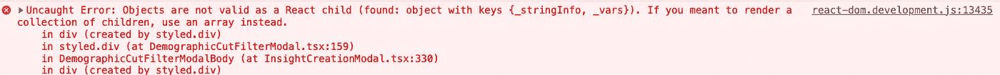
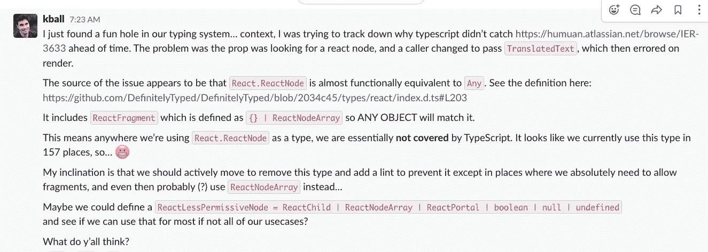
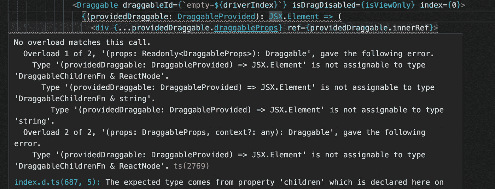
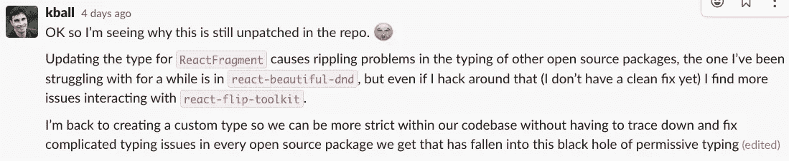

# 的反应。反应节点类型是一个黑洞

> 原文：<https://javascript.plainenglish.io/the-react-reactnode-type-is-a-black-hole-49a8e5516c32?source=collection_archive---------23----------------------->


作为开发人员，我们出于几个不同的原因使用 TypeScript。自我文档方面是巨大的——能够进入一个不熟悉的功能，并知道它所期望的对象的形状，这在处理大型项目时是一个巨大的好处。增加的工具特性，包括智能感知和类似的功能，对生产力也有很大的帮助。但是对我来说，使用强类型系统的最重要的原因是*消除*一整类运行时错误，其中一个函数被传递了一个它不知道如何处理的对象，并且在运行时失败。

正是最后一个原因导致了这篇文章的目的。我最近处理了一个错误，React 组件在运行时抛出了一个异常。问题的根源是最近在国际化我们的应用程序的这个区域时进行的重构，其中一个期望可呈现的属性意外地被传递了一个不能呈现的类的对象。

这正是我们期望 TypeScript 在编译时捕捉到的那种错误！

这是怎么发生的？从高层次上来说，这是因为包含在`DefinitelyTyped`中的`React.ReactNode`类型，在全世界成千上万的代码库中使用，被定义得如此之弱以至于几乎没有意义。

*我们在*[*JS Party # 213*](https://jsparty.fm/213)*的 TIL 段子里高层次的讨论过这个问题，但是我觉得它值得更严谨的处理。*

跟我一起分享探索，为什么这种虫子在野外逗留超过 3！)年[以来，它最初被报道](https://github.com/DefinitelyTyped/DefinitelyTyped/issues/29307)，以及我们如何在我们的代码库中解决它，使我们自己再次受到保护。

# 形势

它始于一个简单的错误报告:

```
When I click on "Boost nudges" and attempt to select a filter group, I get an error saying something went wrong. This feature is vital for a demo I have tomorrow.
```

我的第一个检查是看我是否能在生产应用程序中重现它。我可以。接下来是启动一个开发人员环境，这样我就可以得到一个有用的回溯，错误非常明显:



解释:React 试图渲染一些它无法渲染的东西。使用文件号和行号进一步追踪，我可以看到这个有问题的对象是一个名为`description`的道具，它有以下类型定义:

```
description: string | React.ReactNode;
```

调用者传递给它的是一个`TranslatedText`对象，这是我们在系统中用来处理国际化的一个类。预期的用途是将该对象传递给一个知道如何使用它的`<T>`组件和一个字符串库，以便为当前用户以正确的语言呈现文本。

看到这一点:修复非常简单。在将`TranslatedText`对象作为道具传入之前，将其包装在`<T>`组件中。


有了这个补丁，直接的 bug 就解决了，票里提到的演示也解除了。

理解 bug 是如何产生的非常简单——应用程序的这一部分最近才被国际化，bug 就是在这项工作中引入的。但是真正的难题开始了:这种类型的错误不正是使用 TypeScript 和类型应该防止的吗？类型系统怎么会允许 React 无法渲染的东西被传递到类型为`string | React.ReactNode`的道具中呢？

# 这条小径

当我第一次看到这个问题没有被发现时，我最初的想法是，可能由于某种原因，类型检查根本没有运行。也许我们有一个跨模块调用的 bug，或者我们的配置有问题。但是我很快就排除了这种可能性，只是将 prop 类型减少到`string`，并发现它触发了一个类型错误。

我尝试的下一件事是测试`TranslatedText`是否以某种方式实现了`React.ReactNode`接口，但是向 TranslatedText(即`class TranslatedText implements React.ReactNode`)添加快速`implements`注释导致编译器抛出错误。这符合我的预期，因为它**没有**实现接口——如果它实现了，我们一开始就不会有这个问题了！

然后我开始深入研究`React.ReactNode`的定义方式。这些定义来自`DefinitelyTyped`，npm 包的类型定义的规范开源存储库，它本身不包含类型，而[键定义](https://github.com/DefinitelyTyped/DefinitelyTyped/blob/2034c45/types/react/index.d.ts#L203)看起来像这样:

```
type ReactText = string | number; 
type ReactChild = ReactElement | ReactText; 
interface ReactNodeArray extends Array<ReactNode> {} 
type ReactFragment = {} | ReactNodeArray; 
type ReactNode = ReactChild | ReactFragment | ReactPortal | boolean | null | undefined;
```

在这里，在`ReactFragment`定义中！

`ReactNode`类型中包含的`ReactFragment`包含一个空接口。由于【TypeScript 处理多余属性检查的方式，这意味着`ReactNode`类型将接受任何对象*，除了*一个对象文字。对于几乎所有的意图和目的，它在功能上等同于一个`any`类型。尽管大多数使用这种类型的函数都希望它意味着“React 可以渲染的东西”。

在这一点上，我把它带回了我们在胡姆的团队:



随着人们深入调查，我们的一名团队成员发现，这是一个自 2018 年以来的[已知问题！有](https://github.com/DefinitelyTyped/DefinitelyTyped/issues/29307)[一个讨论](https://github.com/DefinitelyTyped/DefinitelyTyped/discussions/55422)暗示了解决问题的意图，但是担心引入修复的连锁反应，并且在一年的大部分时间里没有进展。

# 第一次尝试修复

当我们开始在代码库中寻找解决这个问题的方法时，我们考虑了两个选项:

1.  将我们代码库中的所有内容转移到自定义类型
2.  使用`patch-package`来更新 React。反应节点定义

评估这些不同方法的优缺点，我们认为`patch-package`方法需要更少的代码更改和更少的持续认知负载，但是缺点是需要额外的依赖(和相关的暂时依赖),并且可能使正在发生的事情不太明显。

最后，我们决定先试试`patch-package`，因为这样工作量会少一些。变化非常简单；我们尝试了一个`ReactFragment`类型的补丁，它看起来非常像在确定类型讨论线程中提出的那个:

```
type Fragment = { 
  key?: string | number | null;
  ref?: null;
  props?: { 
    children?: ReactNode; 
  }; 
}
```

虽然这种方法不会在我们的代码库中引发任何内部类型问题，并且导致类型系统能够捕获一开始就困扰我们的错误类，但它会导致调用几个 React 生态系统库时出现级联类型错误。我们在代码与`react-beautiful-dnd`的接口处遇到了麻烦:



在潜入兔子洞并试图解决这些类型问题一会儿之后，只是让每一个改变都导致越来越多的类型挑战，我决定这需要比我更有打字天赋的人来解决。



# 第二种方法

我们尝试的第二种方法是在我们的代码库中创建一个更严格的类型，查找/替换以在任何地方使用它，然后添加一个 linter 以防止它被使用。我们最终得到的类型文件与我们在补丁方法中尝试过的文件非常相似:

```
import { ReactChild, ReactPortal, ReactNodeArray } from 'react';export type StrictReactFragment = 
  | { 
      key?: string | number | null;
      ref?: null; 
      props?: { 
        children?: StrictReactNode; 
      }; 
    } 
  | ReactNodeArray; export type StrictReactNode = 
  | ReactChild
  | StrictReactFragment
  | ReactPortal
  | boolean
  | null
  | undefined;
```

在验证该类型确实捕获了我们试图防止的类型错误之后，是时候在我们的代码库中进行替换了。

我简要地探索了使用 [jscodeshift](https://github.com/facebook/jscodeshift) 来自动进行替换。我开始沿着这条路走下去，但是我以前没有使用 jscodeshift 的经验，这被证明是很棘手的。由于时间有限，我认为我们的代码库足够小，在 VS 代码中运行 find/replace 加上手动添加导入将是易处理的，并且比继续试图找出 jscodeshift 要快得多。

注意:如果有人想写这个 codemod 并发送给我，我很乐意把它作为这篇文章的附录，并为你大声喊出来！

一次公关之后，我们有了一个更安全的代码库，在任何地方都可以使用`StrictReactNode`,但是还有一个步骤可以让它持续下去。

# 编写 ESLint 插件

`React.ReactNode`渗透到我们的代码库的原因是它是一种在许多情况下都可以使用的逻辑类型。任何时候你想要断言一个道具可以被 React 渲染，很自然的就要用到`React.ReactNode`。

现在，我们需要我们所有的开发人员转而使用`StrictReactNode`。让开发人员自行决定或者要求这成为手工代码审查和/或教育的一部分似乎是站不住脚的，尤其是在像 Humu 这样快速发展的公司。

为了执行新的实践，并使其无缝地保持我们的代码库最新和安全，我们决定编写一个自定义的 ESLint linter 来检查`React.ReactNode`，并抛出一个指向我们首选类型的错误。

这篇文章不是关于 ESLint 插件如何工作的，但是如果你想使用它，这里是我们得到的插件:

```
module.exports = {
    create(context) {
        return {
            TSTypeReference(node) {
                if (
                    node.typeName.type === 'TSQualifiedName' &&
                    node.typeName.left.name === 'React' &&
                    node.typeName.right.name === 'ReactNode'
                ) {
                   context.report(
                       node,
                       node.loc,
                       'React.ReactNode considered unsafe. Use StrictReactNode from humu-components/src/util/strictReactNode instead.',
                   );
                }
            },
        };
    },
};
```

现在，如果有人不小心试图在类型声明中使用`React.ReactNode`，他们会得到如下所示的错误:


林挺是我们 CI 测试的一部分，它发生在任何分支可以被合并之前，所以这可以防止任何人意外地引入不安全的`React.ReactNode`类型并将他们指向替换类型。

*更新* : [Mathieu TUDISCO](https://twitter.com/mathieutu) 写了一个[更广义的 eslint 插件，带一个 fixer](https://gist.github.com/mathieutu/577be7f0cbeba71a894981f07fc082e3) ！

# 包扎

从我的角度来看，使用 TypeScript 和类型系统的整个目标是能够防止一整类的错误，并使重构像最初的那个一样安全。

在一个超级常用的库中有一个像这样的宽开放类型是超级可怕的。如果时间允许的话，我会继续努力让这个补丁明确地定型，但是生态系统的问题太大了，这不太可能及时发生。如此巨大的变化产生了巨大的波动，类型需要更新。

同时，我强烈推荐使用类似我们的`StrictReactNode`的方法来保护你的代码库。

*最初发表于*[*https://changelog.com*](https://changelog.com/posts/the-react-reactnode-type-is-a-black-hole)*。*

*更多内容看* [***说白了就是***](https://plainenglish.io/) *。报名参加我们的* [***免费每周简讯***](http://newsletter.plainenglish.io/) *。关注我们*[***Twitter***](https://twitter.com/inPlainEngHQ)*和*[***LinkedIn***](https://www.linkedin.com/company/inplainenglish/)*。加入我们的* [***社区不和谐***](https://discord.gg/GtDtUAvyhW) *。*