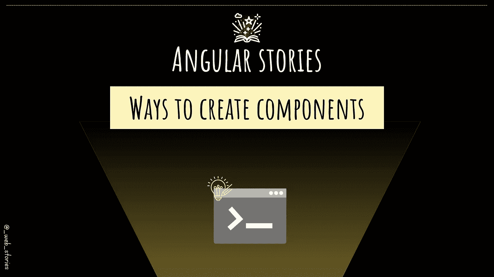

# 创建角形组件的正确方法！

> 原文：<https://javascript.plainenglish.io/the-right-way-to-create-angular-components-69228c5cc0fd?source=collection_archive---------2----------------------->

## [👀VV] —利用角度示意图的强大功能！



By FAM

# 你好👋

> *在开始我们今天的故事之前，我要感谢*[*Adejokun Ibukun*](https://medium.com/u/ce239b57655d?source=post_page-----69228c5cc0fd--------------------------------)*和* [Ihor Harnyk](https://medium.com/u/6345cae48a8?source=post_page-----69228c5cc0fd--------------------------------) *成为我的新推荐成员。感谢您的信任和支持。这对我意义重大！*

在之前关于组件的文章中，您已经学习了

*   什么是组件
*   [它的成分是什么](https://medium.com/gitconnected/angular-component-composition-eb292aad1f3d?source=your_stories_page-------------------------------------)
*   [组件有哪些类型，如何设计它们](https://medium.com/geekculture/angular-component-types-4b9c57877639?source=your_stories_page-------------------------------------)

这次是关于学习如何创建组件。

视觉读者请在文末找到 VV 版。

# 创建角度组件的方法

每次手动创建 HTML、CSS、spec 和 class 文件并不好玩。你有更重要的事情要关注，对吗？

创建组件有一个明智的方法，那就是用 CLI 示意图武装自己。你必须学习一次如何使用它的规则，从那以后，你就不用浪费时间一个接一个地创建文件了。我们走吧！

## -简单的组件生成

*   `g`代表`generate`,如果你想的话也可以使用
*   `c`代表`component`，如果你想用的话，它也可以作为关键词

```
ng g c component-name
```

❌Don't 添加组件前缀，默认情况下由 CLI 添加

## -简单的组件生成:样式、模板和类选项

*   您还可以生成一个组件，并在根 component.ts 文件中内联包含样式。没有多余的`scss`文件。

```
ng g c component-name --inline-style
```

*   通过使用`style`选项来设置样式，样式可以是 CSS 之外的另一种东西

```
ng g c component-name --style sass
```

*   对于模板也可以这样做。

```
ng g c component-name --inline-template
```

## -自定义组件前缀

*   当编写一个库时，你想使用一个更具描述性的前缀，而不是传统的`app-`后缀。主要是为了让开发者清楚一个组件来自于一个库 x。

```
ng g c component-name --prefix lib-x
```

## -模块内的组件生成

*   `g`代表`generate`，如果你想用也可以
*   `c`代表`component`，如果你想使用的话，它也可以作为一个关键字

```
ng g c component-name --module shared/shared.module
```

❌Don't 添加组件前缀，因为默认情况下 CLI 会生成它

## -定制生成的代码

有时您不需要样式表或测试文件，可能是因为组件太小。您仍然可以通过以下方式利用 Angular CLI:

*   没有生成`scss`文件:

```
ng g c component-name --style none
```

*   也不生成`spec`文件:

```
ng g c component-name --style none --skip-tests
```

# 更多高级功能

*   在类端，我们也可以配置一些东西，比如变化检测模式:

```
ng g c component-name --change-detection OnPush
```

*   利用全新的独立功能

独立功能现在是稳定的，您可以使用它。得益于`--standalone`选项，您可以使用 CLI 生成一个独立的组件:

```
ng g c component-name --standalone
```

# 积聚起来

使用 Angular CLI 示意图对每个开发人员来说都是必不可少的。从零开始创建每个文件都是浪费时间、精力和生产力。

记住这些命令只是时间问题。重复的组件创建将使您很快成为使用 CLI 创建组件的专家。

# 视觉版本

By FAM

今天到此为止，再见🙋

如果您有任何问题或反馈，请点击评论或通过 LinkedIn 联系我— **我洗耳恭听！**

[**想请我喝杯咖啡吗？☕️**](https://www.buymeacoffee.com/fatimaamzil)

> 让我们为 2022 年打造一个更好的‘我们’！

## 了解有关 2022 年网络快车计划的更多信息:

I- [网络常识](https://medium.com/geekculture/2022-web-program-chapter-n-1-is-done-499fb0707220?source=your_stories_page----------------------------------------)

[II-网页框架:HTML](https://famzil.medium.com/your-html-essentials-69d9b2349355?source=your_stories_page----------------------------------------)

[III-网页样式:CSS](https://medium.com/geekculture/recap-of-the-css-chapter-ae388d51e564?source=your_stories_page----------------------------------------)

[IV-网络互动:JavaScript](https://levelup.gitconnected.com/congrats-to-js-chapter-finishers-e38a3ca1612c)

[虚拟物料清单& DOM](http://8c48)

[VI- Web 性能](/my-web-articles-roadmap-for-2022-20387cab9b07#e71b)

[七-工具](https://famzil.medium.com/6-essential-frontend-tools-a95995f85eee?source=your_stories_page-------------------------------------)

## VIII-角形

*   [路线图……](https://famzil.medium.com/angular-stories-the-opening-c44d6341e8f3)

[](https://medium.com/geekculture/2022-web-program-is-launched-f38a3280af1a) [## 2022 网络计划启动！

### 改变来自心态和习惯

medium.com](https://medium.com/geekculture/2022-web-program-is-launched-f38a3280af1a) 

与想成为 web 开发人员的人分享该程序！这将有助于保持进步，并在旅途中互相帮助。

*如果你喜欢我的文章，* [***订阅***](https://famzil.medium.com/subscribe) *获取我的最新文章。如果你自己喜欢体验媒介，可以考虑通过**[***报名会员***](https://famzil.medium.com/membership) *来支持我和其他几千个作家。它只花费***每月 5 美元，它支持我们，作家，你也有机会用你的写作* *赚钱* **。当然，你可以随时取消会员资格。通过报名 [*这个链接*](https://famzil.medium.com/membership) *，你直接用你的一部分费用来支持我，不会多花你多少钱。如果你这样做了，万分感谢！*****

**下面我们就**联系一下** [**中**](https://medium.com/@famzil/)**[**Linkedin**](https://www.linkedin.com/in/fatima-amzil-9031ba95/)**[**脸书**](https://www.facebook.com/The-Front-End-World)**[**insta gram**](https://www.instagram.com/the_frontend_world/)**[**YouTube**](https://www.youtube.com/channel/UCaxr-f9r6P1u7Y7SKFHi12g)**********

******[](https://famzil.medium.com/membership) [## 通过我的推荐链接——FAM 加入 Medium

### 作为一个媒体会员，你的会员费的一部分会给你阅读的作家，你可以完全接触到每一个故事…

famzil.medium.com](https://famzil.medium.com/membership) 

## 更多内容请访问 [PlainEnglish.io](https://plainenglish.io/) 。

*报名参加我们的* [***免费周报***](http://newsletter.plainenglish.io/) *。关注我们上* [***推特***](https://twitter.com/inPlainEngHQ) ， [***领英***](https://www.linkedin.com/company/inplainenglish/) ***，***[***YouTube***](https://www.youtube.com/channel/UCtipWUghju290NWcn8jhyAw)***，以及****[***不和***](https://discord.gg/GtDtUAvyhW) *

## *想扩大你的软件创业规模吗？检查[电路](https://circuit.ooo/?utm=publication-post-cta)。*******