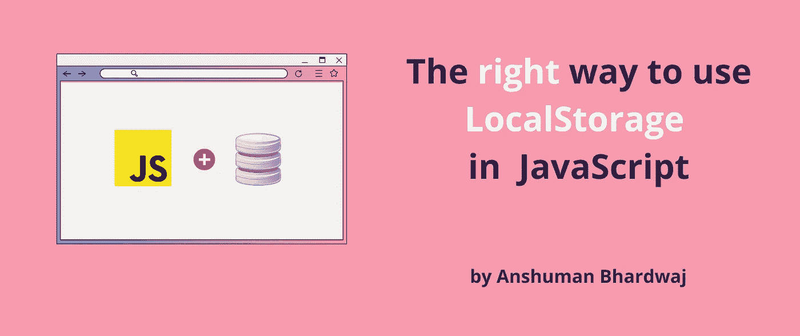

# JavaScript 中使用 LocalStorage 的正确方法

> 原文：<https://javascript.plainenglish.io/the-right-way-to-use-localstorage-in-javascript-4e6e24be5ec1?source=collection_archive---------12----------------------->

## 用不到 5 分钟的时间解释了 LocalStorage API



作为 web 开发人员，我们都遇到过这样的情况，我们希望保存一条信息，如用户数据、主题偏好或选定的过滤器，以便在不同的浏览器会话中为用户提供一致的体验。

这正是 LocalStorage API 发挥作用的地方。


坚持住坚持住。让我们从基础开始

# 什么是 LocalStorage？

web 浏览器的 LocalStorage API 允许跨浏览器会话存储和读取存储的数据。

让我们来分解一下:

*   它允许我们将数据存储到永久存储器中，这样当我们重新启动浏览器甚至计算机时，数据仍然可用。
*   它将数据存储在该源的本地，这意味着您只能对当前源的本地存储读取/写入数据，即以下组合(协议+域+端口)

*需要注意的是，本地存储器开始清空，一旦关闭最后一个私有标签，私有会话期间添加的项目将被清除。*

# 本地存储的内部

LocalStorage 是一个键值存储，这意味着它根据提供的键存储给定值，就像一个 JavaScript 对象，但*是持久的*。

键值存储提供了快速的查找和写入，因为它的结构使得寻找正确的元素总是要花费恒定的时间(除了做 I/O 的时间)。这意味着本地存储中有数百个键不会减慢查找速度。(不知道你为什么会这么做。)

随着它的速度而来的是一个限制，即`key`和`value`都必须是存储在本地存储器中的字符串。嗯，这并不是很难做到。

*目前，Web 存储规范允许每个浏览器的每个应用程序最多存储 5MB。*

# 如何使用 LocalStorage？

幸运的是，LocalStorage API 的接口相当简单。

让我们来看看如何在本地存储上进行创建/读取/更新/删除等基本操作，

# 写入数据

`localStorage.setItem()`接受一个字符串作为`key`，`value`也接受一个字符串。

```
localStorage.setItem('<key>', '<value>')
```

上面的代码行将根据给定的键写入值，如果已经存在，现有的值将被覆盖。

# 读取数据

为了读取存储的信息，我们需要提供`key`

```
const value = localStorage.getItem('<key>')
// value will be null or string
```

如果在给定的`key`中没有找到数据，则返回`null`。

## 在 LocalStorage 中存储对象

你可能想知道，“字符串！天哪，我该拿一个物体怎么办？”别担心。

我们仍然被允许存储对象的序列化版本，

```
 // storing an object in LocalStorage
    const user = { name: 'anshuman_bhardwaj' }
    localStorage.setItem('user', JSON.stringify(user)) // reading the object from LocalStorage
    const strinifiedUser = localStorage.getItem('user')
    if(strinifiedUser) {
      const retrivedUser = JSON.parse(strinifiedUser)
    }
```

# 删除数据

有两种以编程方式从 LocalStorage 中移除存储数据的方法

## `removeItem`

如果您已经知道要删除哪个项目，那么`removeItem`就是正确的选择。

```
localStorage.removeItem('<key>')
```

## 清楚的

如果您想从存储器中取出所有钥匙，那么`clear`是*明确的*选择。(你看到我在那里做了什么吗？)

```
localStorage.clear()
```

虽然听起来可能很刺激，但是`clear`方法不应该使用太多，因为它会清除**所有的**而不仅仅是您添加的*项。*

这意味着，如果您正在与使用 LocalStorage 的服务进行交互，例如像 Firebase Auth 或 Okta 这样的身份验证模块，清除 LocalStorage 也会删除这些服务输入的数据，这将破坏它们的行为。


是啊，别担心，我抓住你了。

在计算机科学中，我们应该始终关注封装，也就是说，我们应该隐藏信息或者封装信息。嗯，这正是我们要解决这个小问题的方法。

*以下是我的朋友&同事* [*莱恩*](https://www.linkedin.com/in/ryanirilli) *给我的提示。*

# 在本地存储中创建和使用命名空间？

我们可以通过将我们所有的数据放在一个预定义的&唯一的键或名称空间下来应用封装的原则。这将使我们能够对应用程序的其他部分隐藏我们的(我们无法控制的)数据，并避免我们错误地更新我们不应该更新的数据。

“听起来不错，但我们该怎么做？”，你可能想知道。

嗯，它比听起来更简单，通过将整个应用程序状态封装在一个键下，而不是为每条信息使用一个新的键来工作。

## 第一步

创建一个关键的、可预测的但独特的。一个很好的例子是[您的-app-name]+[某个唯一的-token]，即 DEV-007

## 第二步

在存储信息时，我们从 LocalStorage 中读取命名空间值，对其进行反序列化，根据对象中的键更新该值，然后在写入 LocalStorage 之前再次对其进行序列化。

## 第三步

在读取信息时，我们从 LocalStorage 中读取命名空间值，对其进行反序列化，并从对象中返回键值。

*这样，我们就把命名空间当作自己的小 LocalStorage。*

下面是上面的代码实现:

```
const NAMESPACE = "DEV-007";function writeToStorage(key, value) {
  const serializedData = localStorage.getItem(NAMESPACE);
  const data = serializedData ? JSON.parse(serializedData) : {};
  data[key] = value;
  localStorage.setItem(NAMESPACE, JSON.stringify(data));
}function readFromStorage(key) {
  const serializedData = localStorage.getItem(NAMESPACE);
  const data = JSON.parse(serializedData);
  return data ? data[key] : undefined;
}function clear() {
  localStorage.setItem(NAMESPACE, JSON.stringify({}));
}function removeItem(key) {
  const serializedData = localStorage.getItem(NAMESPACE);
  const data = serializedData ? JSON.parse(serializedData) : {};
  delete data[key]
  localStorage.setItem(NAMESPACE, JSON.stringify(data));
}
```

`clear`和`removeItem`的上述实现使用安全，解决了我们的问题。

不用担心，您不必编写自己的实现，因为有一个 npm 包 [store2](https://www.npmjs.com/package/store2) 可以解决上述问题，并提供更智能的本地存储。


今天到此为止。如果你有任何问题或建议，请在下面的评论中提出。
更多此类内容，请[在 Twitter 上关注我](https://twitter.com/sun_anshuman)

*下次见！*


*原载于 2022 年 3 月 28 日*[*https://theanshuman . de*v](https://theanshuman.dev/articles/the-right-way-to-use-localstorage-in-javascript-41a0)*。*

*更多内容请看* [***说白了。报名参加我们的***](https://plainenglish.io/) **[***免费周报***](http://newsletter.plainenglish.io/) *。关注我们* [***推特***](https://twitter.com/inPlainEngHQ) *和**[***LinkedIn***](https://www.linkedin.com/company/inplainenglish/)*。加入我们的* [***社区不和谐***](https://discord.gg/GtDtUAvyhW) *。****