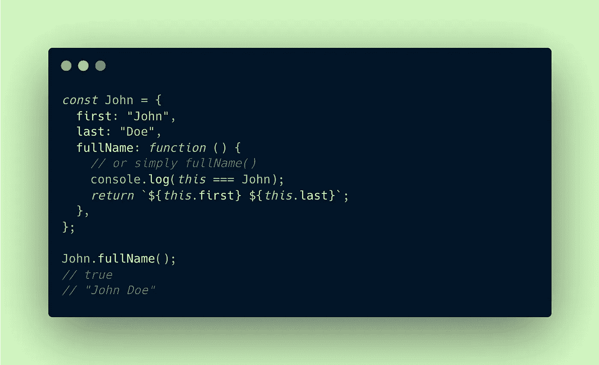
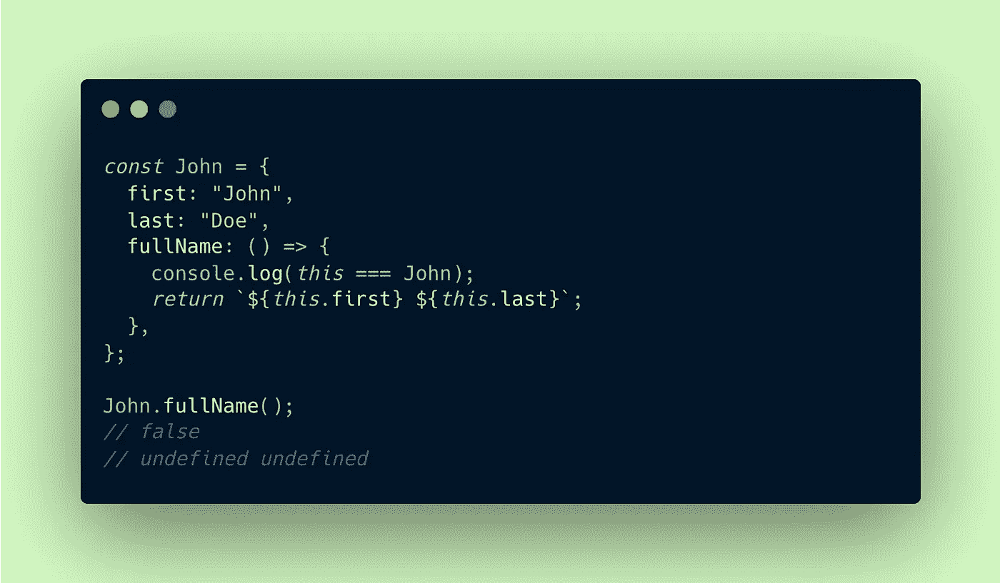
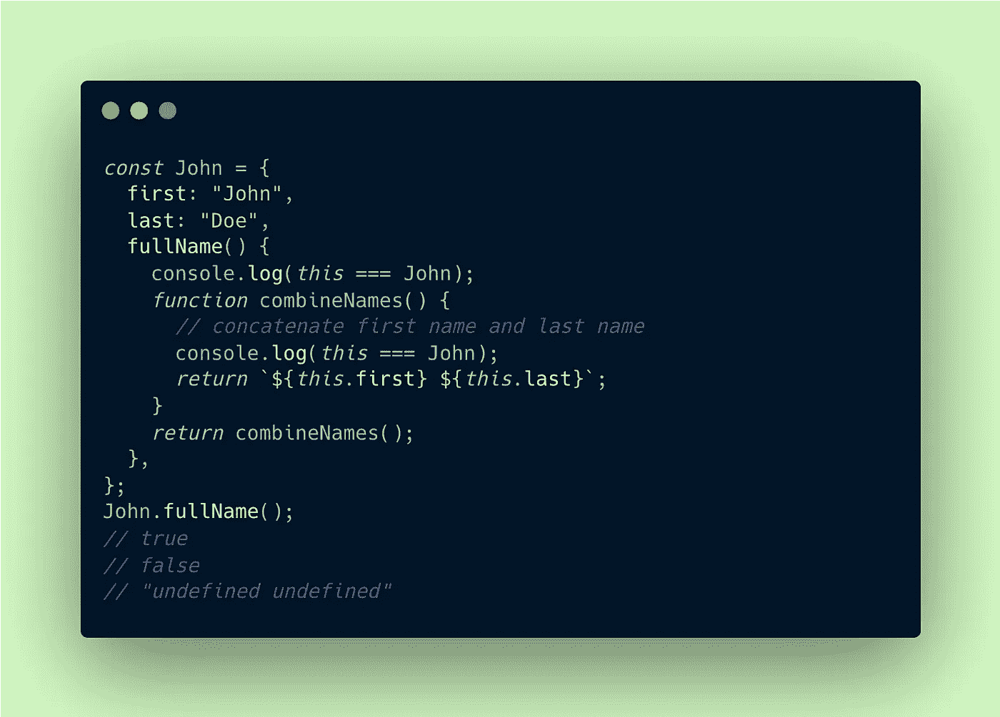
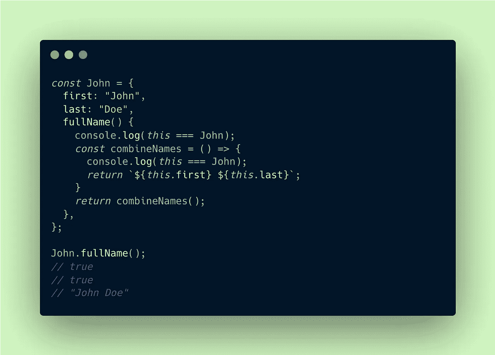
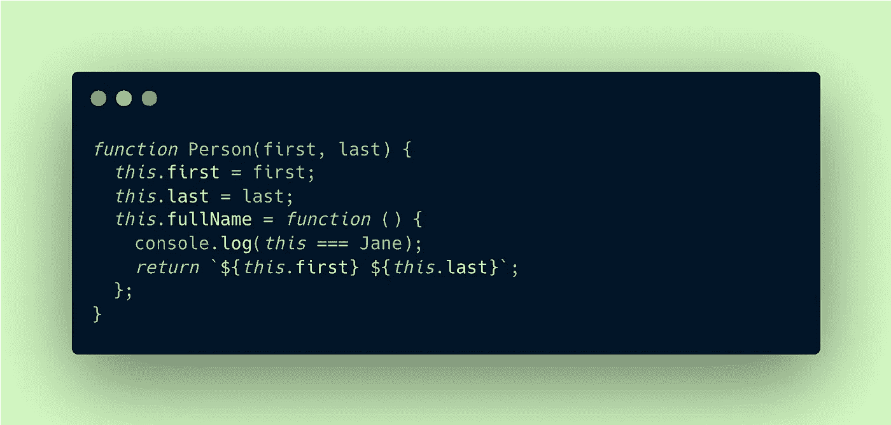
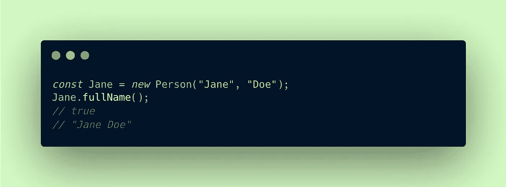
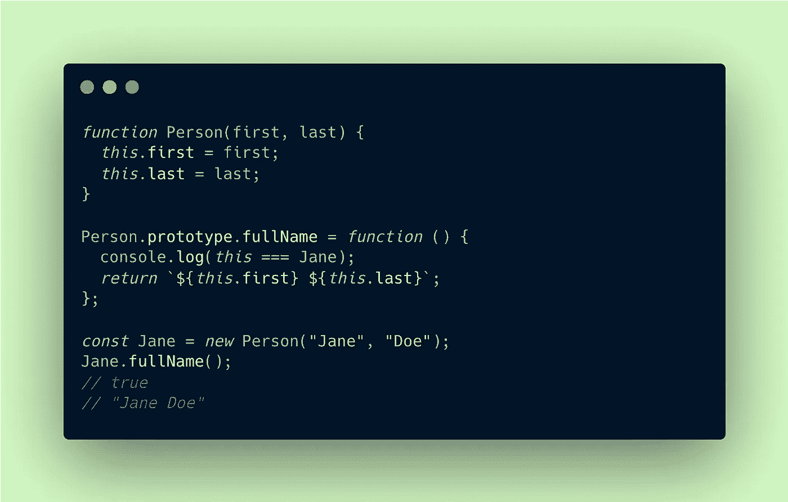

# JavaScript 中使用“this”的正确方法

> 原文：<https://javascript.plainenglish.io/the-right-way-to-use-this-in-javascript-4815cd9e6c65?source=collection_archive---------12----------------------->

Copyright [Justin Lee](https://medium.com/u/ffc03660639f?source=post_page-----4815cd9e6c65--------------------------------)

关键字 ***这个*** 使用频率很高，但是经常会引起很多混淆🤯*。*根据它被调用的地方， ***这个*** 可能成就或者破坏你的编程逻辑*。我们来这里是为了缓解这种困惑。这里我将根据 ***这个*** 最常见的调用来分开:在对象中，在构造函数中*。**

> 注意，所有代码输出都是基于我的本地节点终端，在浏览器中，全局对象会指向窗口对象*。*

# *1。方法调用:*这在一个对象中**

在 JavaScript 中，对象内的*函数被称为**方法调用**。在本例中，函数 *fullName()* 将返回一个包含两个属性(`*first*`和`last`)的全名字符串。*

对于方法调用， *fullName()* 方法属于`*John*`对象，`***this***` **指的是** `***John***`。

## ❌ *不要* ***在方法调用*** 中使用箭头函数

让我们尝试用箭头函数(ES6)语法做同样的事情。

## ❗️发生了什么事？

箭头函数的不同之处在于它遵循[词法](https://medium.com/@iampika/es6-arrow-functions-syntax-and-lexical-scoping-d061732071e7)范围*。*这意味着它继承了其父元素`*Global*`的`*this*`，它在`*John*`对象*之外。*现实中你要`***this***` **是指** `***John***` **而不是** `***Global***` *。*

⭐️因此，在方法调用的情况下使用常规函数语法 *fullName()* 。

## ✅在方法调用中使用箭头函数

也许我在 *fullName()* 中添加了一个名为 *combineNames()* 的函数来连接输入。由于 *fullName()* 属于`*John*`对象， *combineNames()* 里面的`*this*`应该也是指`*John*`吧？

## ❗️What 发生了什么？

好了，既然 *fullName()* 是对象`*John*`的**方法调用**，`*this*`指的是`*John*`。但是由于 *combineNames()* 是一个**函数调用**，`*this*`指的是`*Global*`。外部函数 *fullName()* 不影响内部函数 *combineNames()* 的上下文。

⭐️在这种情况下，解决这个问题的一个常用方法是使用 arrow 函数语法。

内部函数将在*full name()*`*John*`对象之外继承`*this*`，这正是我们想要的！

# 2.构造函数调用:这是在构造函数中

当你用关键字`new`调用一个构造函数时，构造函数被构建。构造函数是创建多个具有特定主题的对象的蓝图，如*人*、*动物*或*水果*。

使用前面例子中的代码，我们可以使用一个`*Person*`构造函数定义许多其他人，比如`*John*`。还有其他[方法来创建构造函数。](https://developer.mozilla.org/en-US/docs/Web/JavaScript/Reference/Classes/constructor)

使用关键字`new`我们传递名字和姓氏，并将对象存储在变量`*Jane*` *中。* `*Jane*`将是一个包含`*first*`、`*last*`等属性的对象，以及可调用的 *fullName()* 函数。

在这种情况下，`***this***` **指的是** `**Jane**`，被创建的对象，而不是`*Person*`，因为`*Person*`仅仅是一个构造器/蓝图*。*

## ➜使用原型

在可能有许多`*People*`对象的情况下，使用原型可能是直接构造函数调用的替代方法*。*这里有两个原因说明为什么在构造函数中定义函数可能不是一个好主意*。*

1.  每次使用`new`调用一个新对象时，函数也会被复制过来。
2.  如果将来需要一个新的函数，您需要将它添加到构造函数中，并重新创建以前的所有对象。

使用原型可以解决这两个潜在的问题。

下面是上面重写的构造函数示例*。*注意`***this***` **怎么还指** `**Jane**` *。*

*在这里* *阅读更多关于构造函数和原型* [*。*](https://developer.mozilla.org/en-US/docs/Web/JavaScript/Reference/Global_Objects/Object/constructor)

# *就这样*

与其关注 ***这个*** 的实际定义，记住这将取决于它是如何被调用的以及它的上下文。问这样的问题，“我是在一个*对象*内部调用这个吗？*建造师*？还是*功能*？”以及“我使用的是什么函数语法？*箭头*？”。当有疑问时，打印 *console.log()* 和如下所示的逻辑语句。

现在我们有了。我希望你已经发现这是有用的。感谢您的阅读！

*更多内容请看*[***plain English . io***](https://plainenglish.io/)*。报名参加我们的* [***免费周报***](http://newsletter.plainenglish.io/) *。关注我们关于*[***Twitter***](https://twitter.com/inPlainEngHQ)[***LinkedIn***](https://www.linkedin.com/company/inplainenglish/)*[***YouTube***](https://www.youtube.com/channel/UCtipWUghju290NWcn8jhyAw)*[***不和***](https://discord.gg/GtDtUAvyhW) *。对增长黑客感兴趣？检查* [***电路***](https://circuit.ooo/) *。***