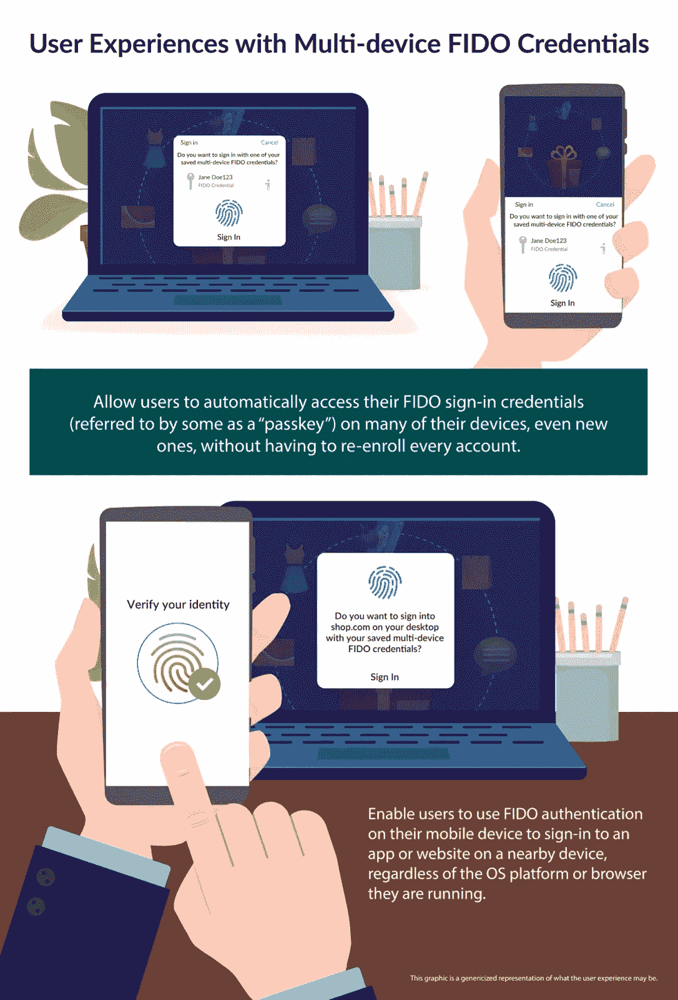

# 无密码登录的兴起

> 原文：<https://javascript.plainenglish.io/the-rise-of-passwordless-logins-964848bd78ac?source=collection_archive---------13----------------------->

## 为什么谷歌、苹果和微软联手消除对密码的依赖

神奇的链接。短信代码。Touch-id 面部识别。

所有这些有什么共同点？它们是无密码登录选项。在你的一生中，你主要通过通用密码来验证自己。并且，您重复使用了一些密码。然而，如今，无密码登录越来越受欢迎。就在最近，苹果、谷歌、微软三大巨头宣布将利用 FIDO 实现无密码登录。让我们一起来探索一下为什么以及如何让 passwordless 选项流行起来，以及关于 FIDO。

# 密码

密码是古老的。*古代*。罗马人是第一个使用了望塔密码的人，这和你今天使用的密码没有太大的不同。到目前为止，密码的创新如此之少，真是疯狂…

# 密码管理器简介

是的，自从密码出现在互联网上，安全性变得比以往任何时候都重要，用户必须做出选择，为了方便而牺牲安全性，通过重复使用他们的密码，或者试图记住 100 个不同的密码。

这就是为什么有密码管理器。您只需要记住一个密码，称为主密码，就可以访问您的所有密码。然后，在这之后，密码管理器将自动填充您访问的每个网站的密码信息。

然而，密码管理器并不是万能的。如果密码管理员偶然发现数据泄露，后果可能是有害的。此外，如果攻击者获得了主密码，那么攻击者就获得了您的所有密码。所以，实际上，这并不比在每个网站上重复使用相同的密码好多少。

# 无密码救援

现在我们到现在。如今，许多应用程序都在使用一种称为无密码的身份验证方法。

## 方法 1:神奇链接

神奇链接是一种无密码的方法，应用程序会向用户的电子邮件发送一个链接。用户只需点击链接，链接会将他们重定向到网站并验证他们自己。中等和松弛使用这种技术。

## 方法 2:短信代码

SMS 代码通常用作双重身份验证，但也可以用作验证用户身份的主要方式。该应用程序会向用户的电话号码发送一个代码，用户将代码输入到应用程序中进行身份验证。

## 方法 3:多设备身份验证

现在，这种方法要求你在使用应用程序时随身携带一部手机。实际情况是，要验证自己的身份，你必须使用手机，使用 touch id 功能或 face id，应用程序会识别你并验证你的身份。对于开发者和消费者来说，这种方法更复杂，但它是最安全的方法。

# 苹果、谷歌和微软新闻

现在是你期待已久的爆炸性新闻。

在 5 月 5 日的世界密码日，谷歌、微软和苹果宣布他们将推出一种无密码的软件登录方式。微软已经通过 Windows Hello 投资了无密码，但它还没有获得那么大的吸引力。

这些巨头希望使用我们已经讨论过的多设备认证。当你访问该应用程序时，你可以通过追踪图案、使用 face ID 或使用 touch ID 在手机上登录。然后，网站会识别出您在手机上通过了身份验证，方法是使用一个名为 passkey 的唯一加密令牌，该令牌由网站和手机共享。

这种跨平台功能是通过一组称为 FIDO 的原则实现的，这些原则是关于这种多设备身份验证应该如何工作的。

Image from FIDO Alliance

# 结论

关于密码的问题已经持续了几十年，然而，FIDO 的这一解决方案以及三大科技巨头对该技术的采用可能最终标志着密码的终结。

*更多内容请看*[***plain English . io***](https://plainenglish.io/)*。报名参加我们的* [***免费周报***](http://newsletter.plainenglish.io/) *。关注我们关于*[***Twitter***](https://twitter.com/inPlainEngHQ)*和*[***LinkedIn***](https://www.linkedin.com/company/inplainenglish/)*。查看我们的* [***社区不和谐***](https://discord.gg/GtDtUAvyhW) *加入我们的* [***人才集体***](https://inplainenglish.pallet.com/talent/welcome) *。*