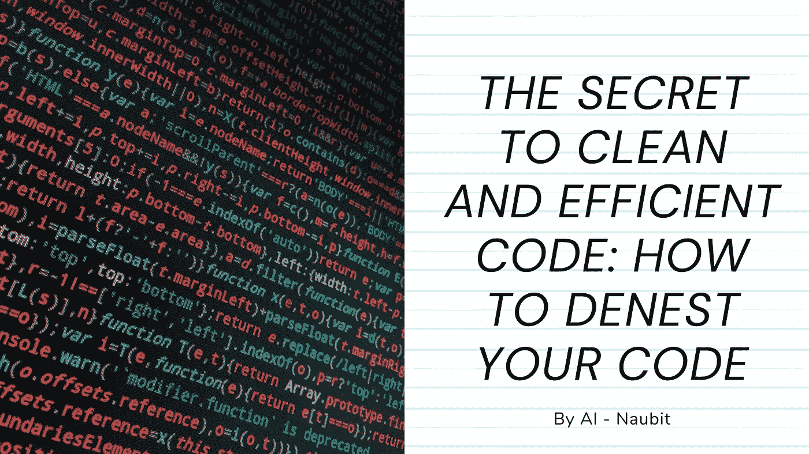

# 简洁高效代码的秘密:如何测试你的代码

> 原文：<https://javascript.plainenglish.io/the-secret-to-clean-and-efficient-code-how-to-denest-your-code-a00cac3449e6?source=collection_archive---------7----------------------->

作为一名程序员，您可能会尝试嵌套您的代码来创建一个更有组织性和更高效的结构。



但是你知道嵌套你的代码实际上会导致几个问题吗，包括增加复杂性和降低可读性。

在这篇文章中，我们将讨论为什么你不应该嵌套你的代码以及一些去嵌套的方法，包括**提取和反转方法**。

# 为什么要避免嵌套？

通过避免嵌套代码，您可以创建一个易于理解和维护的清晰高效的结构。

这将**提高你程序的可读性和可维护性**，甚至可以提高它的性能。因此，请继续阅读，了解更多关于嵌套代码的危险以及如何避免它们。

首先也是最重要的一点，嵌套代码会增加阅读和理解的难度。当你将多层代码嵌套在一起时，其他程序员(*甚至你自己*)就更难理解程序的逻辑和流程。这可能会导致混乱和错误，尤其是在处理大型或复杂的项目时。

此外，嵌套代码会增加程序的复杂性。

嵌套的每一层都增加了一个额外的抽象层，**使得识别和解决错误变得更加困难**。这会导致花费更多的时间调试和测试，甚至会导致程序崩溃。

此外，嵌套代码会增加将来维护和更新的难度。

随着程序的增长和发展，跟踪所有嵌套的代码块并确保它们正确工作是一项挑战。这会导致代码混乱，难以处理和修改。

# 如何避免嵌套你的代码？

那么，如何避免嵌套代码，同时保持一个整洁有序的结构呢？以下是一些取消代码嵌套的方法:

1.  **提取方法:**使用函数和子程序将你的代码分解成更小的模块块。这允许您分离不同的逻辑和功能，使其更容易理解和维护。
2.  **反转方法:**使用条件语句(比如 if/else 或者 switch/case)来处理不同的场景，不需要嵌套代码块。这使您可以轻松地控制程序的流程，而不会增加不必要的复杂性。

# 1.该提取方法

取消代码嵌套的一种方法是提取方法。这包括获取一个嵌套的代码块并**将其提取到自己的函数**或子程序中。这允许您分离代码块的逻辑和功能，使其更容易理解和维护。

以下是提取方法的示例:

原始嵌套代码:

```
if (condition1) {
  if (condition2) {
    if (condition3) {
      // Do something
    }
  }
}
```

提取的代码:

```
function doSomething() {
  // Do something
}

if (condition1) {
  if (condition2) {
    if (condition3) {
      doSomething();
    }
  }
}
```

在这个例子中，嵌套的代码块被提取到一个名为“ *doSomething* ”的函数中。这允许我们从程序**的多个地方快速引用代码块，而不用复制嵌套代码**结构。

提取方法是一种简单有效的代码嵌套方法，可以应用于任何嵌套的代码块。

# 2.反演方法

另一种解除代码嵌套的方法是**反转方法**。这涉及到获取一个嵌套的代码块并反转控制它的条件语句。

这可以让你避免嵌套代码块，并且**创建一个更加精简有效的结构**。

下面是反演方法的一个例子:

原始嵌套代码:

```
if (condition1) {
  if (condition2) {
    if (condition3) {
      // Do something
    }
  }
}
```

反向代码:

```
if (!condition1 || !condition2 || !condition3) {
  return;
}

// Do something
```

在本例中，通过使用逻辑 OR 运算符(||)组合三个条件语句来反转嵌套代码块。这允许我们避免嵌套代码块，并创建一个更简洁和有效的结构。

# 一些最后的想法

总之，嵌套您的代码最初看起来可能是一个好主意，但是它会导致几个问题。

为了避免这些问题，请考虑使用提取和反转方法来取消代码嵌套，并创建一个干净有效的结构。

这将提高你的程序的可读性和可维护性，使得将来更容易操作和修改。

所以，下次你想嵌套代码时，记住嵌套代码的危险，并考虑使用提取和倒置方法来避免它们；如你所见，**这真的很简单！**

# 🌎我们连线吧！

*   [推特:@thenaubit](https://twitter.com/thenaubit)

*更多内容看* [***说白了就是***](https://plainenglish.io/) *。*

*报名参加我们的* [***免费周报***](http://newsletter.plainenglish.io/) *。关注我们关于*[***Twitter***](https://twitter.com/inPlainEngHQ)，[***LinkedIn***](https://www.linkedin.com/company/inplainenglish/)*，*[***YouTube***](https://www.youtube.com/channel/UCtipWUghju290NWcn8jhyAw)*，以及* [***不和***](https://discord.gg/GtDtUAvyhW) ***。***

***有兴趣缩放你的软件启动*** *？检查* [***电路***](https://circuit.ooo?utm=publication-post-cta) *。*