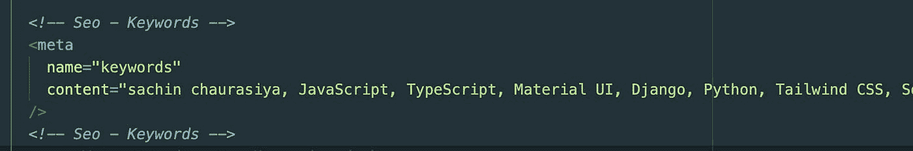

# 应用程序搜索引擎优化的简单指南

> 原文：<https://javascript.plainenglish.io/the-simple-guide-to-seo-for-your-application-d0ee2d313a05?source=collection_archive---------24----------------------->

## 一些基本的 SEO 设置，我们作为开发者可以自己做，不需要依靠 SEO 专家。

作为开发人员，我们主要关注解决问题和构建东西。但是其他一些事情需要我们的关注和时间。SEO(搜索引擎优化)是其中之一，我们不能说这不是一个开发人员的工作，而是一些 SEO 专家的工作。

当我们谈论 SEO 时，有许多事情，作为一名开发人员，我们应该专注于一些我们可以自己完成的事情，而不应该依赖于 SEO 专家。

在这篇文章中，我们将讨论一些基本的 SEO 设置，作为一个开发者，我们可以自己做，不应该依赖 SEO 专家。

我们开始吧，

不知道 SEO 是什么的人？别急，我来解释一下什么是 SEO。

# 什么是 SEO

SEO 代表**搜索引擎优化**。它是一个过程/一组配置/实践，以增加您正在构建或已经构建的服务/产品的可见性。

例如:

如果你在谷歌上搜索什么，比如说**什么是搜索引擎优化？**你会得到成百上千个结果，但每次你只能看到前 10 或 20 个结果，为什么是 10 或 20 个？答案很简单，因为这 10 个服务/产品具有良好的 SEO 设置/流程/配置。

# 为什么 SEO 很重要

为了回答这个问题，让我举一个简单的例子，假设你已经为社交媒体营销建立了一个 SaaS(软件即服务),你将该产品/服务部署到生产中供人们使用。

现在你让你的一个朋友/同事测试你的产品，所以他们去谷歌搜索你的产品“XYZ”，但是奇怪的事情发生了，他们没有在谷歌上找到你的产品/服务，而是看到了具有类似**关键词**的其他产品/服务。

为什么会这样？答案很简单，你刚刚建立了产品/服务，没有基本的搜索引擎优化，谷歌无法抓取你的产品/服务网站。

所以这就是 SEO 重要的最简单的原因。

# 我们可以采取什么行动来改善我们的应用程序搜索引擎优化

正如我所说，我们只需要做一些基本的设置，这样至少谷歌可以抓取我们的产品网站，并在用户搜索与我们相似的关键词时显示给用户。

这是我们可以做的事情的基本列表

*   为标题、视口和描述添加元标记
*   为开放图协议添加元标签
*   为匹配您的产品/服务的关键字添加元标签
*   添加您的产品/服务网站的网站地图
*   添加配置正确的 robots.txt 文件
*   添加清单文件

我为我的网站做了所有这些事情

以上几点我们一个一个来看。

## 为标题、视口和描述添加元标记

在这里你可以看到我是如何为`title`、`description`和`viewport`添加元标签的。

## 为开放图协议添加元标签

在开始之前，让我解释一下什么是开放图协议，为什么要使用它们？ *Open Graph 协议可控制您的产品/服务网站 URL 在社交媒体上分享时的显示方式。*

例如:在这里你可以看到我添加了四个`og:title`、`og:description`、`og:type`和`og:image`开放图元标签。

每当我与他人分享我的网站 URL，或者在一些社交媒体平台上，我的网站 URL 就会像这样显示。

还有一堆其他的开放图形元标签，你可以在这里看到所有的标签。

## 为匹配您的产品/服务的关键字添加元标签

这里有一些关键字，我已经添加到我的网站，所以如果有人搜索这些关键字，我的网站应该在谷歌上得到索引。

## 添加您的产品/服务网站的网站地图

网站地图只不过是你网站的一个结构，它提供了你网站上的页面、视频和其他文件的信息，以及它们之间的关系。

有很多在线工具可以为你的网站生成站点地图，也有一些 npm 包可以帮助你生成站点地图。

其中一个就是 [react-build-sitemap](https://www.npmjs.com/package/react-build-sitemap) 。

## 添加清单和 robots.txt 文件

robots.txt 文件告诉搜索引擎爬虫可以访问你的网站上的哪些 URL，清单是你的网站中的一个简单的 JSON 文件，它告诉用户的移动设备或桌面上的浏览器关于你的网站的信息。

这个话题到此为止。感谢您的阅读。

*原发布于*[*https://blog . sachinchaurasiya . dev*](https://blog.sachinchaurasiya.dev/the-simple-guide-to-seo-for-your-application)*。*

*更多内容看* [*说白了就是*](http://plainenglish.io/) *。报名参加我们的* [*免费每周简讯*](http://newsletter.plainenglish.io/) *。在我们的* [*社区不和谐*](https://discord.gg/GtDtUAvyhW) *获得独家获取写作机会和建议。*