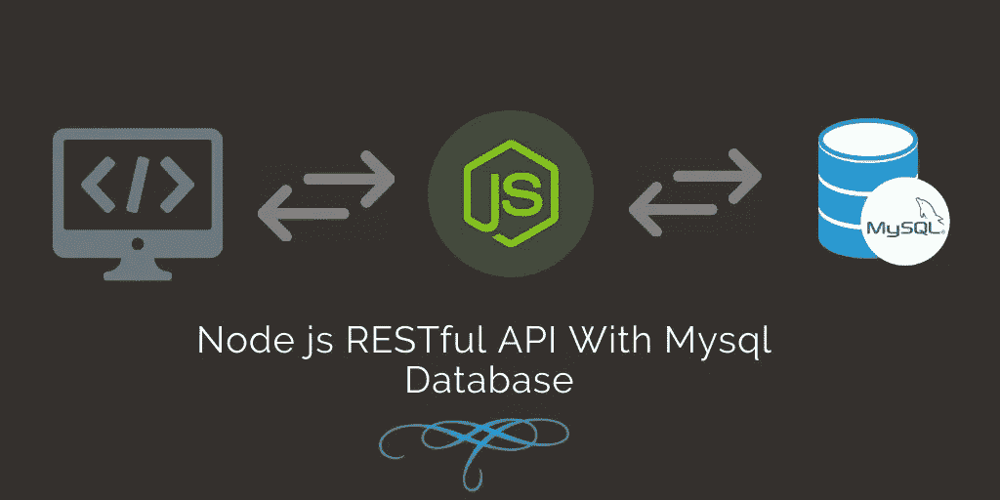
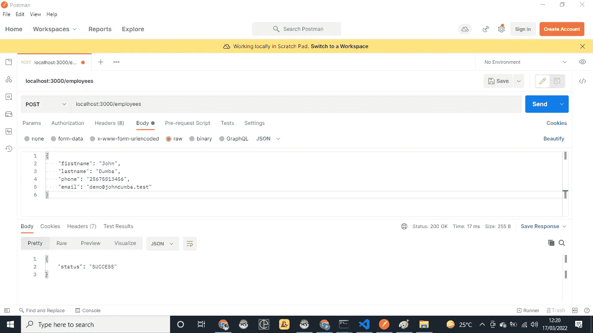
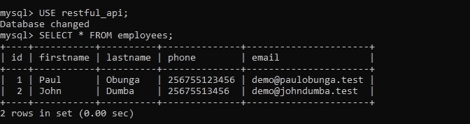
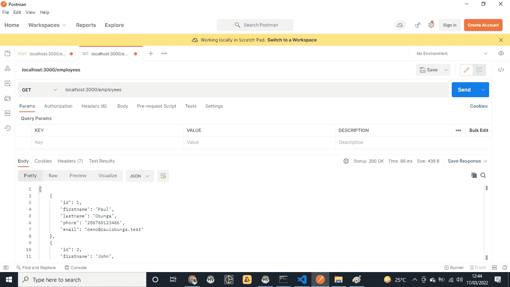

# 用 Node.js 和 MySQL 构建最简单的 RESTful API

> 原文：<https://javascript.plainenglish.io/the-simplest-restful-api-with-nodejs-and-mysql-3d513493ef0e?source=collection_archive---------1----------------------->

## 构建连接到 MySQL 数据库以查询和操作数据的 Express RESTful API 的基础。



我仍然喜欢写一些文章来帮助初学者入门。这些年来，我在不同的领域积累了大量的经验，但是如果没有这些基础知识，我不可能取得现在的成就。

# 我们开始吧

## **1。创建我们的数据库和必要的表。**

创建数据库有很多方法，你可以使用一个 GUI 工具，比如 PHPMyAdmin，HeidiSQL 等等。，或者通过终端创建一个，如下所示。

**a .打开你的终端应用，输入**

```
mysql -u [username] -p
```

*   *将[用户名]替换为您的数据库用户，然后按回车键。系统会提示您输入密码来访问 MySQL shell。*
*   `**mysql>**`提示符表示您已经登录到 MySQL shell。

**b .通过数据库认证后，创建一个数据库。**

在同一终端中，键入:

```
CREATE DATABASE restful_api;USE restful_api;
```

创建存储我们数据的表格。

```
CREATE TABLE employees(
id INT AUTO_INCREMENT PRIMARY KEY, 
firstname VARCHAR(50) NOT NULL, 
lastname VARCHAR(50) NOT NULL,
phone VARCHAR(50) NOT NULL,
email VARCHAR(50) NOT NULL,
);
```

**d .简单地退出 MySQL，因为我们现在已经完成了。**

```
exit;
```

## **2。引导我们的应用程序并创建必要的文件。**

打开终端，导航到 restful_api 目录(如果您不在那里),然后运行下面的命令

a.初始化 npm 并安装必要的模块。为了这个项目。

```
touch index.js .envnpm init -ynpm i express mysql dotenv --savenpm i nodemon --save-dev
```

b.现在我们写一些代码。

在 VSCode 中打开项目，然后打开我们的。env 文件并添加下面的代码

```
DB_DATABASE=restful_api
DB_USERNAME=root
DB_PASSWORD=12345678
DB_HOST=localhost
PORT=3000
```

打开我们的 index.js 文件，创建一个基本的 Express 服务器(暂时)。

在下面的代码中，我们创建了一个基本的 restful API，它运行在。env 文件，设置我们用来发送和接收数据的 API 路由，没什么重要的。😎😎😎

```
require('dotenv').config();
const express = require('express');
const app = express();const PORT = process.env.PORT;//Our Database Config
const DB_HOST = process.env.DB_HOST;
const DB_DATABASE = process.env.DB_DATABASE;
const DB_USERNAME = process.env.DB_USERNAME;
const DB_PASSWORD = process.env.DB_PASSWORD;//Get all employees from the database
app.get('employees', function (req, res) {});//Add new empoyee to the database
app.post('employees', function (req, res) {});//Get single employee by id from the database
app.get('employees/details/:id', function (req, res) {});//Update single employee by id from the database
app.put('employees/update/:id', function (req, res) {});//Delete single employee by id from the database
app.delete('employees/delete/:id', function (req, res) {});app.listen(PORT, function() {
 console.log('Restful API is running on PORT 3000');
});
```

输入所有这些内容后，😩😩😩保存 index.js 文件。

现在让我们运行它，以确保我们没有犯任何错误。👌

打开项目根目录中的 package.json，并对 start scripts 部分进行如下修改。

```
"scripts": {
    "start": "node server",
    "start:dev": "nodemon server"
 },
```

保存您的更改，打开终端并运行:

```
npm run start:dev
```

这个命令将使用 nodemon 启动我们的 express 服务器，并在我们对文件进行更改时自动重启它。很方便，对吧？😎

您的 Express 服务器现在应该已经启动并正在运行。

## **3。现在让我们连接到数据库，查询一些数据。**

a.我们需要使用 require MySQL，如下所示:

```
const mysql = require('mysql');
```

b.在我们代码的数据库配置部分之后，我们需要创建一个到数据库的连接，如下所示:

```
//Connection to MySQL database
const db = mysql.createConnection({
  user: DB_USERNAME,
  password: DB_PASSWORD,
  host: DB_HOST,
  database: DB_DATABASE,
});
```

c.我们现在有了使用🥳🥳🥳.的连接让我们修改我们的 root，向数据库中添加一名新员工:

d.很好，现在很快，让我们打开 Postman 测试一下。输入如下所示的数据并点击发送按钮:



检查数据是否出现在你的数据库中。如果到目前为止所有的指令都被执行了，那么您应该可以在数据库中看到您的数据。

只需在终端中通过 MySQL shell 连接到您的数据库，然后键入

```
SELECT * FROM employees;
```

这应该会返回类似于👇👇👇👇



e.现在我们召集所有员工。只需修改获取员工路线，如下所示:

再次打开 Postman 并进行测试，确保一切正常。



Get all employee records from the database

如果你已经走了这么远。好哇🎉🎈🥳!现在，您已经知道如何使用 Node.js Restful 服务在 MySQL 中查询和执行插入操作。

为了简洁起见，我就讲到这里，但是还有很多要讨论的。

1.  ***获取单条记录***
2.  ***更新单条记录***
3.  ***执行批量更新***
4.  ***返回分页的数据列表。***
5.  ***用 Redis 添加缓存***
6.  ***将 API 部署到服务器上。***
7.  ***搜索功能同弹性搜索。***

如果你觉得这个非常有用，请在评论中告诉我，关注，评论，分享改进，如果你遇到任何问题，请告诉我。我很乐意指导你。

现在再见👋🏽👋🏽👋🏽👋🏽

*更多内容请看*[***plain English . io***](https://plainenglish.io/)*。报名参加我们的* [***免费每周简讯***](http://newsletter.plainenglish.io/) *。关注我们*[***Twitter***](https://twitter.com/inPlainEngHQ)*和**[***LinkedIn***](https://www.linkedin.com/company/inplainenglish/)*。加入我们的* [***社区不和谐***](https://discord.gg/GtDtUAvyhW) *。**