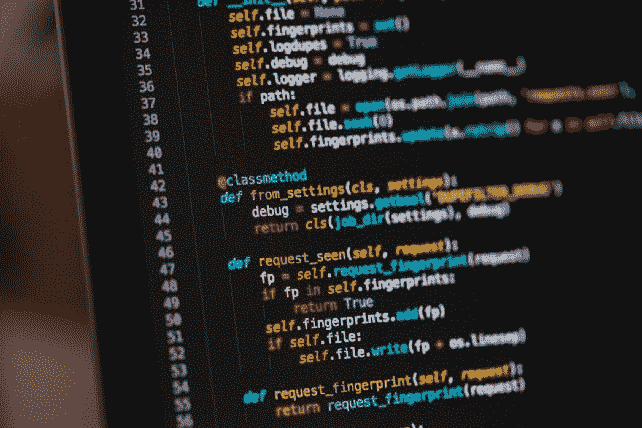
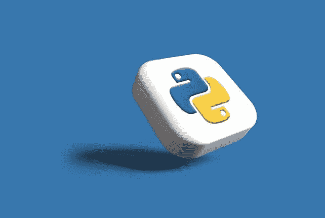
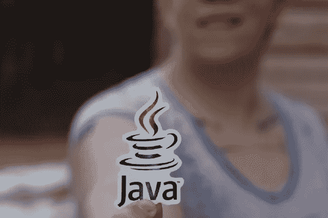

# 2023 年新手的 5 大编程语言

> 原文：<https://javascript.plainenglish.io/the-top-5-practical-programming-languages-for-newbies-in-2023-983b10efc79e?source=collection_archive---------0----------------------->

## 您选择的编程语言应该与您的技能相匹配

Photo by [Chris Ried](https://unsplash.com/@cdr6934?utm_source=medium&utm_medium=referral) on [Unsplash](https://unsplash.com/?utm_source=medium&utm_medium=referral)

无论你是想学习编码是为了好玩，是作为一种职业，还是为了在目前的工作中有所提升，你都必须首先选择从哪种编程语言开始。需要有一个正确的反应。

选择第一种语言将取决于你的目标，你想为谁工作，或者你是否希望它简单。

# 计算机编程语言

Photo by [Rubaitul Azad](https://unsplash.com/@rubaitulazad?utm_source=medium&utm_medium=referral) on [Unsplash](https://unsplash.com/?utm_source=medium&utm_medium=referral)

如果你正在寻找一种简单有趣的编程语言，最好的选择总是 Python。Python 读起来像英语，对于编码新手来说很容易掌握，所以甚至不需要关心严格的语法准则。

它使您能够理解编码原则，而不必浪费时间在其他语言中经常很关键的小细节上。Instagram、YouTube、Spotify 都是用 Python 开发的。因此，除了有一个更快的入职流程外，它也是公司非常看重的。

尽管提供了一些好处，但许多人认为 Python 是一种需要更多测试的缓慢语言，与其他语言相比，它不太适合开发移动应用程序。

# C#

尽管 C#是最难理解的语言之一，但它仍然是一种优秀的教育首选语言。由于 C 是用来实现所有编程语言的，所以在你掌握了 C++之后，你可能会继续学习 c++和 C#。

因为 C#更机器化，了解它会增加你对计算机如何运行的理解。如果你愿意接受挑战，这是编码生产力的最佳方式，因为它需要在成为医生之前掌握基础解剖学。

# Java 语言(一种计算机语言，尤用于创建网站)

Java 是一种跨平台、面向对象的编程语言，也有很高的需求。它的前提是“编写一次，在任何地方运行，使任何人在任何设备上编写和跨平台工作成为可能”。

这是最想学的语言之一，尤其是如果你想要一份好工作的话。因此，IBM、亚马逊和易贝是 Java 程序员的主要雇主。它还经常用于开发 Android 和 iOS 应用程序，因为它是 Android 操作系统的基础。如果你想创建移动应用程序，这是最好的可能性之一。

Java 比 Python 更复杂，但相对来说还是初学者友好的。尽管启动慢，部署时间长，但 Java 是一种高级语言。

# Java Script 语言

根据 General Assembly 的说法，你日常使用的几个网站，包括 Twitter、Gmail、Spotify、脸书和 Instagram，都依赖于 JavaScript。因为 JavaScript 与 HTML 和 CSS 交互，所以你必须利用它来整合网站的交互性。

由于它的广泛使用，网站的前端、后端和面向用户的编程都需要 JavaScript。JavaScript 也是测试自动化框架的支柱，因为量角器和 Nightwatch，它已经是最流行的语言。JS。

使用客户端脚本有一个缺点:它们在不同的浏览器上被不同地处理(需要额外的跨浏览器测试)，并且它们可能在响应式设计上有问题。

同样，虽然 JavaScript 不是最容易学习的语言，但 Python 更复杂。如果 JavaScript 一开始看起来很有挑战性，那么尝试一下这个 JavaScript 教程，它简单到足以让一只猫完成。

# 红宝石

对于还没有获得编程经验的人来说，阅读起来就像 Python 一样简单。你不需要知道很多命令或者编程术语来学习它，它包含了很多方便的库和工具。

Ruby on Rails 是一个面向初创公司和大公司的流行框架，已经变得越来越流行。由于其活跃的开发者社区，Ruby 目前被众多网站使用，包括 Airbnb、Groupon、Hulu 和 Soundcloud。

如果你只想快速制作一个网站，学习 Ruby on Rails 可能会减慢你的学习速度。此外，Ruby 很容易学，但是如果你不同时学习 Rails，你可能不会从中受益。

# 那么，要学习的最重要的编程语言是什么呢？

如果你在寻找一些简单的东西: **Python**
如果你想要一个坚实的基础来帮助你成为一名熟练的开发人员:**C #**如果你想创建移动应用或者正在寻找工作: **Java**
测试前端开发: **JavaScript**
如果你正在开发一个创业网站: **Ruby**

# 结论:

对于初学者来说，这些只是几个最方便的编程语言。如果你刚开始学习，想知道学什么，这些都是很好的选择。

选择一种你喜欢的并且与你的技能相匹配的编程语言是很重要的。一旦你找到了你最喜欢的，你就可以开始构建应用程序并学习更多关于编码的知识。

**你可能也会喜欢这个**

 [## 2023 年顶级无代码开发工具

### 如果你正在创建一个应用程序，但不具备所需的编程专业知识。不用担心；在这里，您将了解一些…

medium.com](https://medium.com/@cannon_circuit/top-no-code-development-tools-in-2022-fc179633682c)  [## 2023 年每个开发者都必须知道的 8 个开源开发工具

### 在你的软件开发之旅中，你应该使用 8 种工具

medium.com](https://medium.com/@cannon_circuit/8-open-source-development-tools-every-developer-must-know-ce14e2762148)  [## 编程语言及其用途:数字世界的基石

### 数字王国的钥匙:理解编程语言及其用途

medium.com](https://medium.com/@cannon_circuit/programming-languages-and-their-uses-the-building-blocks-of-the-digital-world-acb6a31c2e57) 

我希望你觉得读起来很有趣。如果你愿意支持我当作家，可以考虑报名 [**成为中等会员**](https://medium.com/@cannon_circuit/membership) **。**每月只需 5 美元，因为你可以无限制地使用媒体。

加入 4000 多名读者的行列，踏上成为无所不包的终身软件工程师和经理的旅程。今天开始免费阅读[**Codestar**](https://codestar.substack.com/)。 [🧑‍💻](https://emojipedia.org/technologist/)

*更多内容看* [***说白了就是 io***](https://plainenglish.io/) *。报名参加我们的* [***免费周报***](http://newsletter.plainenglish.io/) *。关注我们关于* [***推特***](https://twitter.com/inPlainEngHQ) ， [***领英***](https://www.linkedin.com/company/inplainenglish/) *，*[***YouTube***](https://www.youtube.com/channel/UCtipWUghju290NWcn8jhyAw)*[***不和***](https://discord.gg/GtDtUAvyhW) *。对增长黑客感兴趣？检查* [***电路***](https://circuit.ooo/) *。**