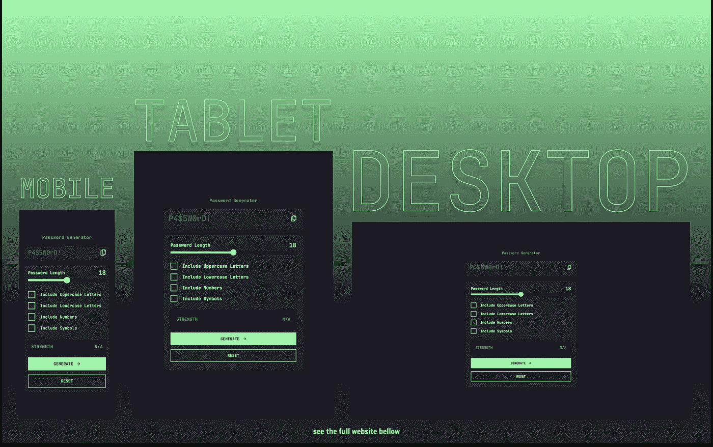

# 4 分钟学会打字的真相

> 原文：<https://javascript.plainenglish.io/the-truth-about-learning-typescript-in-4-minutes-c1cfe380b7d?source=collection_archive---------3----------------------->

## 给每个想学习 TypeScript，但不确定从哪里开始的人一些建议。

Photo by [Florian Klauer](https://unsplash.com/@florianklauer?utm_source=medium&utm_medium=referral) on [Unsplash](https://unsplash.com?utm_source=medium&utm_medium=referral)

> 该不该学 TypeScript？
> 
> 学习 TypeScript 值得吗？
> 
> 对我来说岂不是毁了 JavaScript？

如果你曾经向自己或谷歌问过这些或类似的问题，那么这篇文章就是为你准备的。

# 该不该学 TypeScript？

简单的回答是肯定的，当然，现在就关闭这篇文章，开始阅读文档。

但如果你是来寻求更详细的答案的，那么我想你至少应该读一下这一部分。

我一直在考虑是值得学 TS 还是全是 BS。如今，我们有太多的东西要学，每天都有太多的新技术出现，如果你想保持相关性，你必须至少在其中的大多数方面都很出色。

我在想，TypeScript 是那些只在大型项目或公司中需要的附加物之一，以避免意大利面条式的代码。

但是哦，我错了。

Command + Z gif from [GIPHY](https://giphy.com/gifs/rahul-basak-sorry-mistake-it-was-a-LUcFUSxbLXsK1v7gue)

TypeScript 甚至可以在一个很小的附带项目中帮助你，在更大的附带项目中，它是必须的和救命稻草。

> 但是我们不是已经写了一堆代码了吗，现在你却告诉我要添加更多的代码。尤其是在 React 中，当你必须为浏览器事件选择一个正确的类型时，这简直是矫枉过正——在学习 ts 之前，我对自己说。

这不是矫枉过正，但在开始时，它可能会显得势不可挡。一旦你习惯了它，就像其他语言的语法一样，你会觉得它很正常。

# 哪里可以学？

我开始时试过一些 YouTube 视频，我试过阅读博客和文章，我试过阅读 TypeScript 的官方文档。然而，它们都没有在我的脑海中停留，仿佛缺少了一块。缺少的部分是 React 语法或如何在 React 中使用 TypeScript。

所以我去寻找一个合适的课程，将一切都在里面。

最后买了 [**柯尔特·斯蒂尔**](https://www.udemy.com/user/coltsteele/) **的** [**掌握打字稿— 2022 版**](https://www.udemy.com/course/learn-typescript/) 。是的，我把它推荐给每个想学习 ts 的人，边学边练，并且完全熟悉 React TS 语法。

我购买这个课程的原因，是因为我已经熟悉柯尔特的教学风格，我真的很喜欢他的教学风格。有一堆练习机会和预先写好的笔记，可以下载以后用。

如果你喜欢免费资源，这里有一些*(排名不分先后)*我可以推荐，虽然我不打算说得更详细，但我会让你自己体验一下。

## TypeScript 学习资源

 [## 学习 TypeScript 的起点

### 查找 TypeScript 入门项目:从 Angular 到 React 或者 Node.js 和 CLIs。

www.typescriptlang.org](https://www.typescriptlang.org/docs/)  [## GitHub-total-typescript/初学者-typescript-tutorial:一个交互式的 TypeScript 教程，用于…

### 选修全打字稿课程。在那里，你会发现:每个问题的视频解释和解决方案抄本…

github.com](https://github.com/total-typescript/beginners-typescript-tutorial)  [## 学习 TypeScript——初学者终极指南

### 在过去的几年里，TypeScript 变得越来越流行，现在许多工作都要求开发人员了解…

www.freecodecamp.org](https://www.freecodecamp.org/news/learn-typescript-beginners-guide/)  [## 博客

### 关于 AWS、Serverless、React.js 和 Web 开发的文章——解决问题和自动化任务。

bobbyhadz.com](https://bobbyhadz.com/?q=typescript) 

# 最后的想法

TypeScript 帮助我以不同的方式看待代码，我很高兴我花时间学习它，现在我想掌握它。

在普通 JavaScript 和 React 中使用`use strict`，或者添加`ESlint`与在代码中添加严格类型是不同的。

TypeScript 只是在学习之前看起来“可怕”,因为作为 JavaScript 开发人员，我们习惯于编写代码并让 JS 处理类型，现在一旦有了手动添加类型的方法，我们的大脑就会忽略这个事实。

哦，在我忘记之前，如果你想在提供的资源中练习你刚刚学到的技能，那么开始一个小的副业。事实证明，至少对我来说，如果你不自己做，不管你花多少时间看教程，它都不会留在你的脑海里。

这是我构建的项目:

Password Generator App

 [## GitHub—kens-visual s/Password-Generator-app:密码生成器 App:用 Next 构建。JS…

### 这是一个解决前端导师的密码生成器应用程序的挑战。用户应该能够:生成一个…

github.com](https://github.com/kens-visuals/password-generator-app)  [## 密码生成器

### 用 Next 构建的简单密码生成器应用程序。JS、TypeScript 和 TailwindCSS

密码生成器 app-tawny.vercel.app](https://password-generator-app-tawny.vercel.app/)  [## 通过我的推荐链接加入 Medium-Ken Nersisyan

### 用媒介释放你的潜能。立即加入，阅读我和其他顶尖作家的文章。读书，学习，变得更好…

medium.com](https://medium.com/@kens_visuals/membership) 

# 进一步阅读

 [## 我喜欢 Tailwind CSS 的 10 个原因以及你可能也会喜欢它的原因

### 读完这篇文章后，如果你还没有爱上顺风，你也会爱上它。

javascript.plainenglish.io](/10-reasons-why-i-love-tailwind-css-and-why-you-may-love-it-too-43b7738558ca)  [## 如何在 Visual Studio 代码中修复 Tailwind CSS 智能感知

### TailwindCSS 智能感知在 VS 代码中不起作用？按照文章中的步骤来修复它。

javascript.plainenglish.io](/how-to-fix-tailwind-css-intellisense-in-visual-studio-code-3dede794df21)  [## 为什么我在每个项目中将字体大小改为 62.5%

### 帮助你简化计算的小开发技巧。

javascript.plainenglish.io](/why-i-change-the-font-size-to-62-5-in-every-project-45c5ff785fb5)  [## 作为程序员如何掌握解决问题的能力

### 14 种练习解决问题的资源以及我是如何掌握技能的。

javascript.plainenglish.io](/how-to-master-problem-solving-as-a-programmer-d16a0b8780ab)  [## 如何在 30 天内掌握 Web 开发

### 什么是前端导师，它如何帮助我练习技能并走出教程地狱？

javascript.plainenglish.io](/how-to-master-web-development-in-30-days-8f6d29237361) 

# 让我们连接

 [## 在推特上关注我﹫kens_visuals

### 👨🏻‍💻👾

twitter.com](https://twitter.com/kens_visuals)  [## kens-视觉效果—概述

### 前端开发者| JS 爱好者|科技写手。kens-visual 有 67 个存储库。遵循他们的准则…

github.com](https://github.com/kens-visuals) 

*更多内容请看*[***plain English . io***](https://plainenglish.io/)*。报名参加我们的* [***免费周报***](http://newsletter.plainenglish.io/) *。关注我们关于*[***Twitter***](https://twitter.com/inPlainEngHQ)[***LinkedIn***](https://www.linkedin.com/company/inplainenglish/)*[***YouTube***](https://www.youtube.com/channel/UCtipWUghju290NWcn8jhyAw)*[***不和***](https://discord.gg/GtDtUAvyhW) *。对增长黑客感兴趣？检查* [***电路***](https://circuit.ooo/) *。***