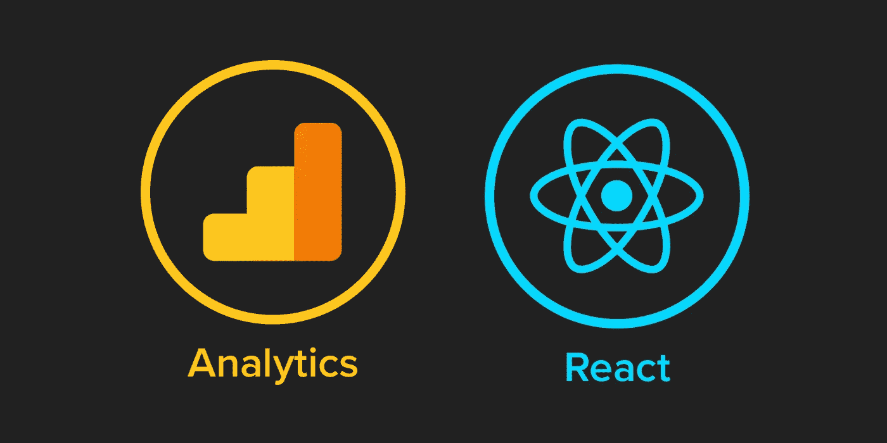

# React(或其他任何东西)上的谷歌分析终极指南

> 原文：<https://javascript.plainenglish.io/the-ultimate-guide-to-google-analytics-ua-ga4-on-react-or-anything-else-ec9dc84c0211?source=collection_archive---------2----------------------->

Picture from [https://medium.com/@jakejrichards](https://medium.com/@jakejrichards)

有许多文章声称提供了设置 Google Analytics 的正确代码片段。他们错了。使用它们，你会遇到双页或缺页跟踪。没有灵丹妙药，没有完美的代码片段。设置将取决于您的具体用例:您正在使用的框架和路由。

在这里，我将提供一些工具，以便您可以为您的特定用例找出正确的设置。

首先，有两种类型的 Google Analytics 属性:Universal Analytics(` ua-xxxxxxxxx-x `)和 Google Analytics 4 属性(` g-xxxxxxxxxxx ` ` ),前者随着 2023.07.01 的停产而不再使用。

这引起了一些骚动，因为 React 的 go-to UA 解决方案( [`react-ga`](https://github.com/react-ga/react-ga) ) [不打算支持 GA](https://github.com/react-ga/react-ga/issues/460#issuecomment-820369771) (相关问题: [1](https://github.com/react-ga/react-ga/issues/460) ， [2](https://github.com/react-ga/react-ga/issues/493) ， [3](https://github.com/react-ga/react-ga/issues/520) )。 [`react-ga4`](https://github.com/PriceRunner/react-ga4) 和 [`ga-4-react`](https://github.com/unrealmanu/ga-4-react) 作为替换物出现，但是因为它们是相似的包装器，所以你只能由维护者来实现和支持所有的功能。

本指南使用 Google 推荐的适用于 UA 和 GA4 的原生设置。它甚至有类型脚本支持！

[推荐的](https://developers.google.com/tag-platform/gtagjs/install)设置 GA 的方式是通过脚本标签，[加载异步](https://developers.google.com/analytics/devguides/collection/analyticsjs#alternative_async_tag)。

这将在任何框架中工作。有些人可能会建议进一步优化。例如，对于 Next.js [你应该使用](https://nextjs.org/docs/messages/next-script-for-ga)自己的 [<脚本>](https://nextjs.org/docs/basic-features/script) 标签。

您可以使用`windows.gtag`通过`@types/gtag.js`触发带有 TypeScript 支持的定制事件。

[自定义参数和默认值](https://developers.google.com/analytics/devguides/collection/gtagjs/pages)也可在此配置，但在评估时请记住。对于 SPA，添加到`index.html`的参数将在第一页加载时评估一次，并且总是发送相同的值。在这种情况下，脚本标签(或参数)应该被移动到动态组件中。

更多的麻烦来自内置的自动页面浏览跟踪。GA4 声称[虚拟页面浏览量](https://support.google.com/analytics/answer/11403294?hl=en)也使用[增强测量](https://support.google.com/analytics/answer/9216061)进行跟踪。也就是说，在不重新加载页面的 SPA 上导航。

但是，URL 的某些部分(如`hash`和`search`)是[不跟踪](https://stackoverflow.com/a/73362255/2771889)的，默认[不是](https://developers.google.com/analytics/devguides/collection/gtagjs/pages) `[page_path](https://developers.google.com/analytics/devguides/collection/gtagjs/pages)` [参数的一部分](https://developers.google.com/analytics/devguides/collection/gtagjs/pages)。这会导致以下问题:

*   未跟踪页面视图上的锚定链接
*   当 React Router 使用`HashRouter`时，初始页面加载将被跟踪，但 SPA 内的导航不会被跟踪

使用[谷歌分析调试器](https://chrome.google.com/webstore/detail/google-analytics-debugger/jnkmfdileelhofjcijamephohjechhna?hl=en)来发现发送了哪些事件和数据。

要完全控制页面视图跟踪，首先，将`gtag`配置编辑为[禁用自动跟踪](https://developers.google.com/analytics/devguides/collection/gtagjs/pages#disable_pageview_measurement):

`gtag('config', 'G-xxxxxxxxxx', { send_page_view: false })`

并使用您的路由器实现它。以下是 React 路由器的一个示例:

现在你有了它:没有什么被跟踪的困惑，现在一切都在你的手中。

在实践中，你可以在 [cra-typescript-starter](https://github.com/thisismydesign/cra-typescript-starter) 看到 React，在 [nestjs-starter](https://github.com/thisismydesign/nestjs-starter) 看到 Next.js。

*更多内容看* [***说白了就是***](https://plainenglish.io/) *。报名参加我们的* [***免费周报***](http://newsletter.plainenglish.io/) *。关注我们关于* [***推特***](https://twitter.com/inPlainEngHQ) ， [***领英***](https://www.linkedin.com/company/inplainenglish/) *，*[***YouTube***](https://www.youtube.com/channel/UCtipWUghju290NWcn8jhyAw)*，以及* [***不和***](https://discord.gg/GtDtUAvyhW) *。*