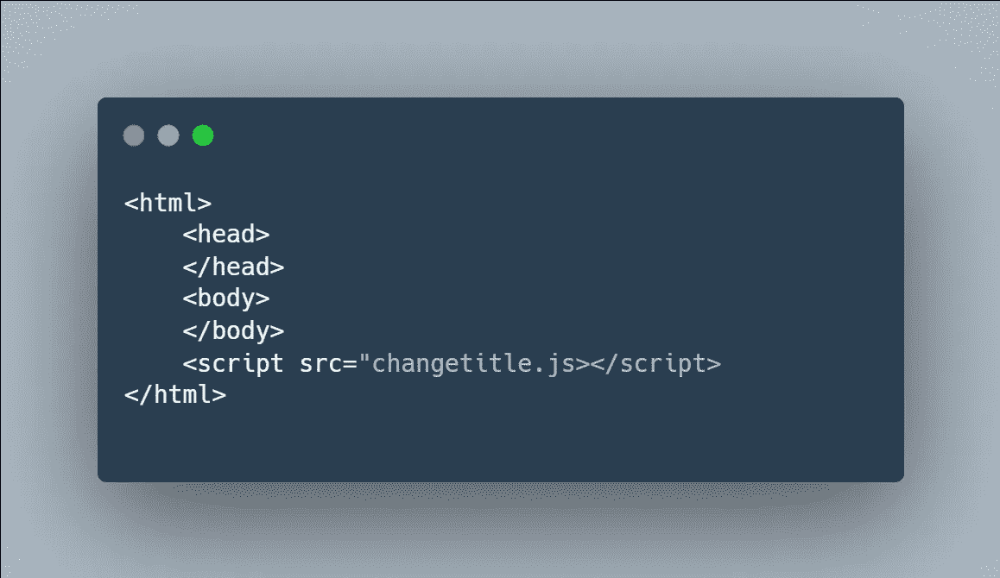
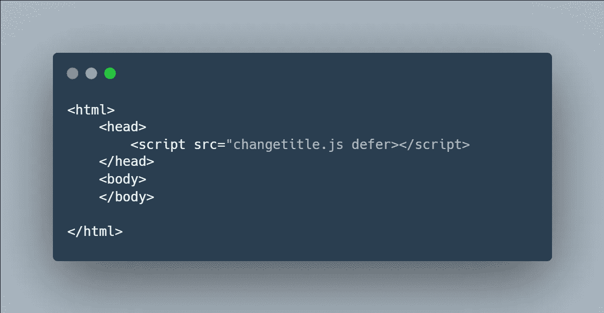

# 加载 JavaScript 脚本的终极指南(延迟、异步)

> 原文：<https://javascript.plainenglish.io/the-ultimate-guide-to-loading-javascript-scripts-defer-async-dea871fa6774?source=collection_archive---------3----------------------->

## 理解在 HTML 解析过程中遇到


Photo By [Mike van den Bos](https://www.instagram.com/lemike16/)

今天我们讨论在 HTML 文件中加载脚本。如果我们想在我们的网站上提供一个动态的和交互式的体验，我们需要使用 JavaScript 来实现。

与 CSS 文件不同，我们可以在 head 元素之外加载脚本。我们可以将它们加载到头部、正文中，甚至在正文的结束标记之后——这有时会产生意想不到的后果。

为了理解这一点，我们需要对浏览器如何向用户呈现和显示网站有一个大致的了解。

最终，它从浏览器从 web 服务器接收 HTML 文件开始。这个 HTML 文件只是一种标记语言。它告诉浏览器应该显示的内容。

然后浏览器读取 HTML 文件并逐行解析它——这非常重要。当浏览器遇到一个`<script>`元素时，它停止解析 HTML 文档。换句话说，它没有加载网页的其余部分。相反，它关注脚本，下载脚本，并执行脚本。脚本执行后，浏览器将继续解析 HTML 文档的其余部分。显然，如果涉及到多个脚本，那么这个过程将会重复。

这可能会有问题。如果您的脚本正在操作 DOM——或者更改网站的可见组件——您希望确保那些被操作的组件已经被呈现。否则，该组件将不存在，您的脚本也不会按预期运行。

为了清楚起见，假设您的脚本`changetitle.js`将 h1 元素更改为`“Hello World”`。

```
<h1> This is a title </h1>
<script src="changetitle.js></script>
```

在这个非常普通的示例代码中，h1 元素在脚本执行时已经存在。该脚本将按预期运行。

```
<script src="changetitle.js></script>
<h1> This is a title </h1>
```

相比之下，在这个示例代码中，脚本将执行并创建一个错误。h1 元素尚不存在。如何改变一个尚不存在的元素的文本？*不能*。

因此，如果您的脚本操作 DOM，请确保在呈现所有被操作的组件之后加载您的脚本。



如果您关注项目教程，您可能会经常发现开发人员在主体的结束标记之后(如图所示)甚至在主体的结束标记之前导入他们的脚本。这确保了在您的脚本开始播放之前，整个 web 页面都已呈现。

如果你的脚本在幕后工作，你可以把它们放在样式表旁边的 head 元素中。如果你有任何错误，就像上面显示的那样把它带下来。

这就是脚本导入的基本过程。现在让我们深入一点。HTML 为脚本标签提供了两个非常有用的属性:`async`和`defer`。

# 推迟

前面提到过，浏览器遇到脚本时，会暂停 HTML 解析，专注于脚本。首先，浏览器将下载脚本。然后浏览器会执行这个脚本。你可以把它想成一个两部分的过程。脚本执行后，HTML 解析将继续。

使用 defer 属性，当浏览器遇到脚本元素时，它将继续解析 HTML 文档，同时下载脚本。只有在解析了整个 HTML 文档之后，才会执行脚本。

这意味着该脚本可能操作的所有 DOM 组件都将及时呈现。不会出现错误，因为脚本是在整个 DOM 渲染完毕后执行的。

您可能会想:这与上面的示例代码有什么不同？这与紧接在`</body>`之前或之后加载脚本有何不同。

因为下载的原因不一样。


在本例中，在`</body>`之后，浏览器将需要时间来下载脚本和额外的时间来执行脚本。



在本例中，浏览器一遇到脚本就会立即下载。使用 defer 标记，浏览器可以在脚本下载时继续解析文档的其余部分。

与前面的示例代码类似，这个脚本将在整个 DOM 呈现后执行。但是，与前面的示例代码不同，脚本已经被加载了。脚本只需要执行。这确实节省了时间，因为脚本的下载与 HTML 解析是并行进行的。浏览器本质上是多任务的。

如果你不相信的话，[《与网络一起成长》](https://www.growingwiththeweb.com/2014/02/async-vs-defer-attributes.html)提供了华丽的图片来帮助你理解这一点。

同样，因为值得一提，这些脚本标签可以放在 HTML 标签中的任何地方。

# 异步ˌ非同步(asynchronous)

`async`是另一个非常有用的属性。

与 defer 属性类似，当浏览器遇到脚本标签时，HTML 解析不会暂停。当浏览器解析 HTML 文档的其余部分时，脚本将被同时下载。

与 defer 属性不同，脚本的执行不会保存到最后。相反，一旦脚本被下载，脚本就会被执行。这类似于加载没有任何属性的脚本。唯一的主要好处是在 HTML 解析的同时下载脚本。它节省时间。

正如在本文中反复提到的，您希望确保脚本可能执行的任何 DOM 操作只影响已经呈现的 DOM 组件。

再一次，[与网络一起成长](https://www.growingwiththeweb.com/2014/02/async-vs-defer-attributes.html)提供了华丽的图表来帮助你理解这一点。

现在你知道了。感谢您的阅读。

*更多内容看* [***说白了. io***](http://plainenglish.io/) ***。*** *报名参加我们的**[***免费每周简讯***](http://newsletter.plainenglish.io/) ***。*** *在我们的**[***社区不和谐***](https://discord.gg/GtDtUAvyhW) ***中获得独家写作机会和建议。*****