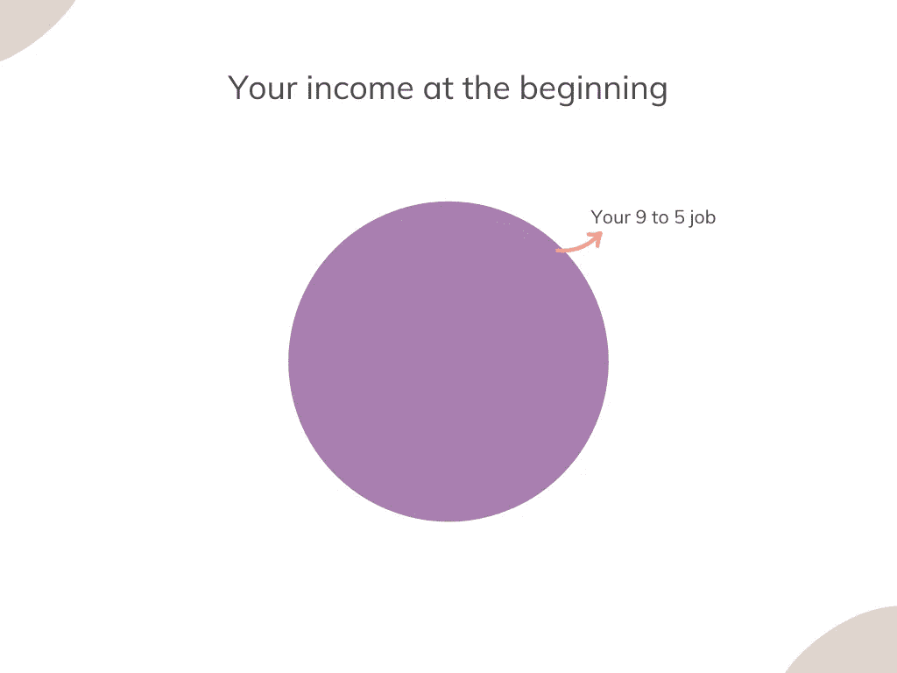
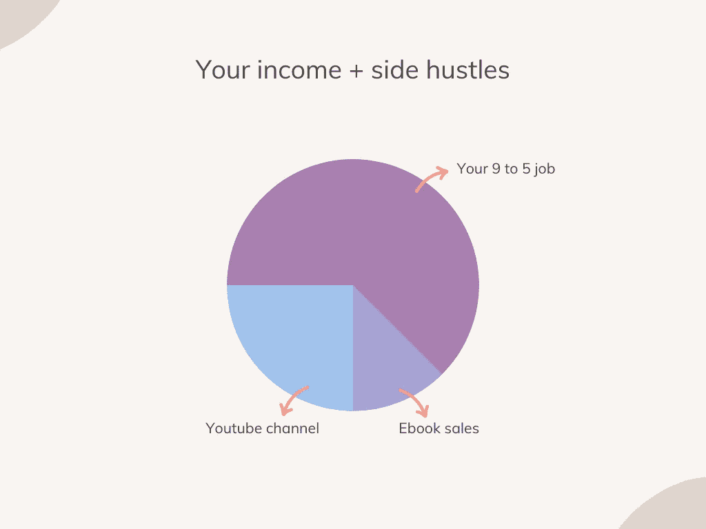
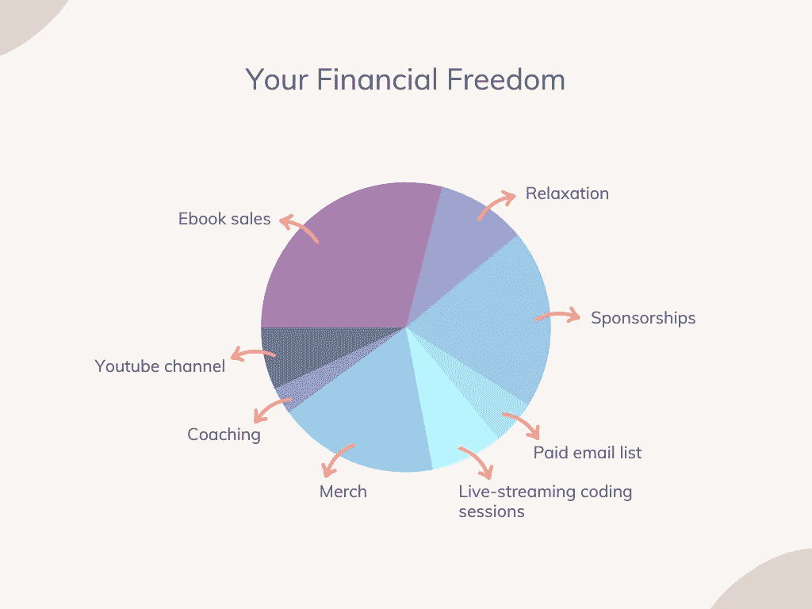

# 作为开发者赚更多钱的终极指南

> 原文：<https://javascript.plainenglish.io/the-ultimate-guide-to-making-more-money-as-a-developer-b8e99ea4fda9?source=collection_archive---------5----------------------->

因为现金永远不够。

"*这钱不够，我需要想办法赚更多。*

你有没有对你重复过那些话？

金钱是我们共同的奋斗目标。我们想要更多，我们需要更多。所以，不管你是想让你爱的人有一个更好的未来，还是你只是需要一些额外的现金，都不要担心。

你手中有一个超能力，叫做**编码**。

你已经拥有的让你与众不同的每一项技能都可以被货币化。尤其是软件开发，因为它很受欢迎，数百万人都想学它。

所以做好心理准备，让我们看看这项技能如何从现在开始让你赚更多的钱。

# 首先，从你朝九晚五的工作中赚取更多

我不太喜欢这样的故事:“*我很勇敢，辞去了我讨厌的工作，忍饥挨饿了八个月，但最终我成功了”。*

> 寻求更多的稳定，或者不想通过挨饿来获得成功，这并不可耻。

所以不要相信年轻人睡在破沙发上等着爆炸的神话。没有这些，你也可以实现财务自由。

那么，你应该从哪里开始改善你的财务状况呢？
你朝九晚五的工作。

我相信有两种方法可以让你在日常工作中赚更多的钱:

*   换公司:在这里你可以得到一笔不错的交易，从你目前收入的 20%到 40%，在某些情况下甚至更多。
*   你要求加薪:如果你对自己所在的公司更满意，你可以这样做。不过，在这一点上，你必须向公司证明为什么你应该得到更多，并找到合适的时机提出要求。这是一个完全不同的主题，需要一篇专门的文章，所以我将把我在这一点上找到的[最佳资源](https://techbeacon.com/app-dev-testing/5-tips-negotiating-raise-software-engineer)留给你。

# 2.找到你的优势

你朝九晚五的工作是很好的收入来源，但是不安全。我们当中没有人是真正不可替代的，疫情教会了我，已经建立的企业可以多么容易地倒下。

永远不要把自己的财务局限于以下公式:
**你的钱=你的工作**

正如你所看到的，失去工作意味着失去所有的钱。此外，一份工作并不是一个可伸缩的收入来源。你不能总是冲进老板的办公室要求加薪 100%。

如果你幸运的话，你会得到 10%。那么请一年后再来。

> 如果你想迈向财务自由，从侧面开始。你的副业是什么？任何可以让你对其他人有用的关于编码的东西。

你不必建立一个品牌。我讨厌这个词。如果你对人们有用，最终他们会要求你给他们更多，包括付费内容，这是你应该追求的目标。

我最喜欢的给开发者们的点子？

*   内容创造:这包括从媒体到博客到个人电子书、课程或指南的任何东西。我平均每月从 Medium 获得 500 美元的收入，我为科技博客写的每篇文章起价最低 200 美元。
*   **开办 Youtube 频道**:这是我的下一个目标。有了 Youtube 频道，你可以制作人们会喜欢的视频，并最终将它们重定向到某种付费产品。从一本书到付费时事通讯。除此之外，你还可以从货币化、附属链接和赞助中获得很多机会。
*   **开始发简讯**:邮件是一种更亲密的人际交流方式。如果你能诚实地赢得他们的信任和尊重，总有一天他们会向你索取更多。
*   辅导:如果你真的很擅长编码，而且你觉得教别人很轻松，为什么不在 Codementor 这样的平台上开始辅导呢？我看到平均每节课 15 分钟 30 美元。一大笔钱。另一大好处？你将学会理解编码人员必须解决的常见问题，并可能就此开设一门课程。

# 3.自动化和增长侧推

此时，如果您正确地完成了本指南的第 2 步，您的钱包应该是这样的:

**你的钱=你的工作+你的兼职**

在这一点上，进一步划分侧面拥挤变量应该真正显示你现在手中的权力。

**你的旁门左道/s = items_sold * item_price**

这就是副业的魅力，用一个简单的数学公式来概括。为了增加你的副业，你要么需要增加你出售的商品数量，要么提高它们的价格。

假设现在你已经创建了一个电子邮件列表，有 5000 名订阅者对你的编码内容感兴趣。你决定以 20 美元的价格出售一本书，其中 200 名订户购买了这本书。

**收入= 200 * 20 → 4000 美元**

所以你从一个产品中赚了 4000 美元。现在你能做的是:

*   你把这本书的产品提高到，比如说，40 美元。
*   你扩大你的电子邮件列表来销售更多的副本。

因此，假设你的电子邮件列表增加了 5000 个订户，而你的购买率保持不变，你现在有一个产品带来了疯狂的 8000 美元。

这样做的另一个好处是？你的产品将永远存在。所以这些都是你月底带回家的被动收入。

这就是工作背后赚真金白银的精髓。创造一个侧面拥挤，增长它，然后扩大它。然后像 Youtube 频道一样重复这个步骤，你的生活就会有多种收入来源。

最后，如果你愿意，你甚至可以放弃你的工作，让你的钱包成为一个很好的被动收入机器。

# 关键外卖

*   你的朝九晚五的工作是一个很好的收入来源，但它并不安全。
*   要获得财务自由，就要把自己放在生产者的角度，而不是消费者的角度。
*   找到一个适合你的好方法，让它成长。
*   重复上述要点，创造多种收入流。
*   调整你的收入，让它变得更被动。
*   给你爱的人一个受之无愧的假期。

—皮耶罗

**你还想要更多的**？⬇️

## [想学习如何通过开发挣更多的钱并达到财务自由吗？这是我给你的免费指南。](https://tinyurl.com/MoneyDev)

*更多内容看* [***说白了就是***](http://plainenglish.io/) *。报名参加我们的* [***免费周报***](http://newsletter.plainenglish.io/) *。在我们的* [***社区获得独家访问写作机会和建议***](https://discord.gg/GtDtUAvyhW) *。*