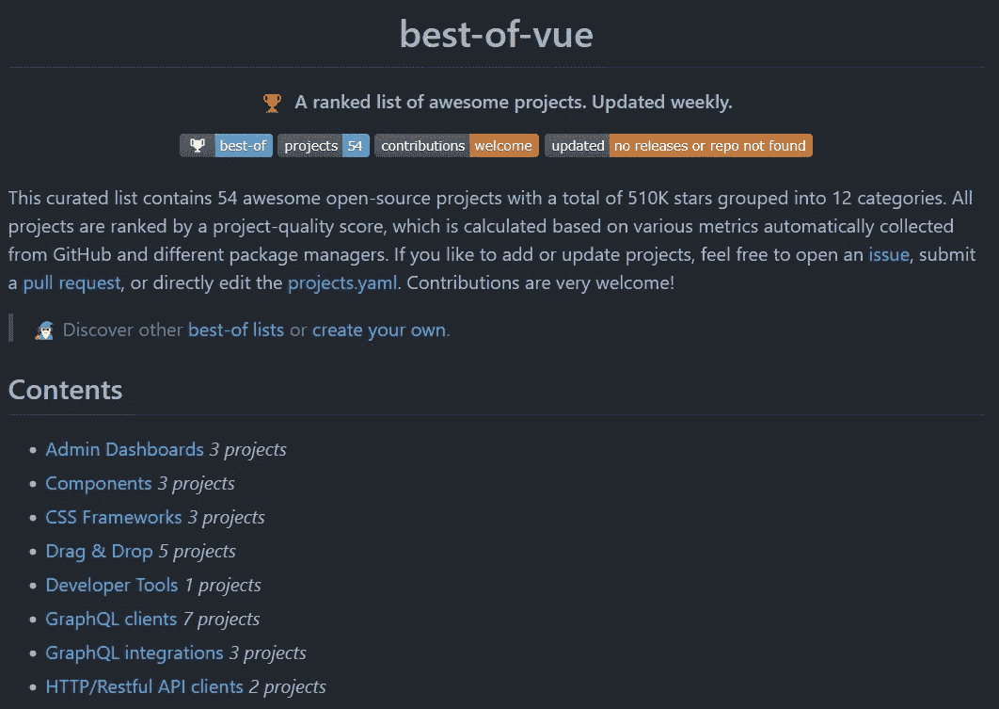
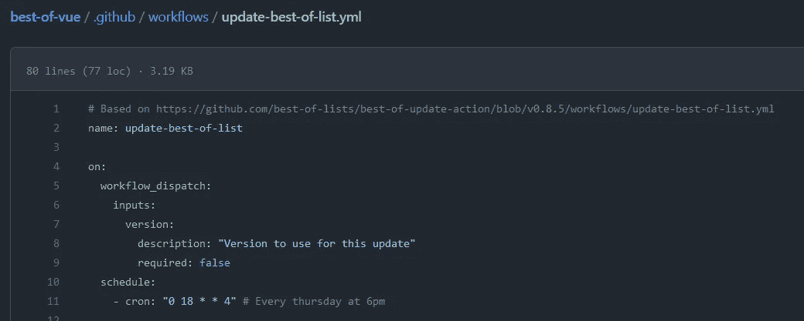

# Vue 3 的终极封装概述

> 原文：<https://javascript.plainenglish.io/the-ultimate-package-overview-for-vue-3-affa3724cb3a?source=collection_archive---------13----------------------->

## 了解 Vue3 的最新最佳软件包。

最后……GitHub 库的 [**精华**](https://github.com/fkromer/best-of-vue) 还活着。

# 起源和灵感

[**最佳反应**](https://github.com/LukasMasuch/best-of-react) GitHub 库试图为 react 项目包评估提供**唯一的真实来源。如果你需要一个 **React** 项目的包…那是你首先要去的地方。**

如果您在包中搜索 **Vue 3** 项目… [**最好的 vue**](https://github.com/fkromer/best-of-vue) **是应该去的地方**。

# 它是如何工作的？

存储库是从 GitHub 模板[的最佳列表/最佳 T21 中生成的。这是](https://github.com/best-of-lists/best-of) [Lukas Masuch](https://github.com/LukasMasuch) 的一个项目，目的是**定期重新生成 GitHub 项目的 README.md** 文件。

与众所周知的 [**牛逼的**](https://github.com/sindresorhus/awesome) **榜单**相比，**的巨大优势在于，最佳项目计算包排名。这种情况发生的频率取决于 GitHub 操作工作流的配置。在下面的示例中，README.md 和包等级每周都会重新生成。**

[https://github.com/fkromer/best-of-vue/blob/main/.github/workflows/update-best-of-list.yml](https://github.com/fkromer/best-of-vue/blob/main/.github/workflows/update-best-of-list.yml)

这意味着你不只是在一个类别中得到最好的包装。此外，您还可以获得该包在同类别的其他包中的**等级。这是一个巨大的优势，因为你可以立即跳过不相关的包。**

*报名参加我们的* [***免费周报***](http://newsletter.plainenglish.io/) *。关注我们关于*[***Twitter***](https://twitter.com/inPlainEngHQ)，[***LinkedIn***](https://www.linkedin.com/company/inplainenglish/)*，*[***YouTube***](https://www.youtube.com/channel/UCtipWUghju290NWcn8jhyAw)*，以及* [***不和***](https://discord.gg/GtDtUAvyhW) ***。***

***有兴趣缩放你的软件启动*** *？检查* [***电路***](https://circuit.ooo?utm=publication-post-cta) *。*