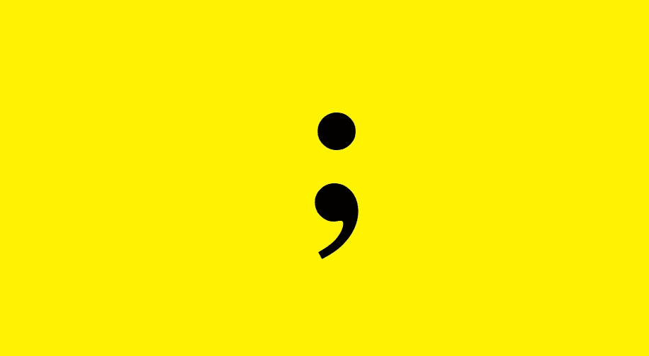

# JavaScript 中分号的用法

> 原文：<https://javascript.plainenglish.io/the-usage-of-semicolons-in-javascript-c7f2d17d94b1?source=collection_archive---------5----------------------->

## JavaScript 中应该使用分号吗？



作为一名开发人员，我在用 JavaScript 编程时仍然在使用分号。由于我们中的许多人来自 C++、Java 或 PHP 背景，你可以称之为一个老习惯。但近年来，许多人开始避免使用分号，而有些人继续使用分号。因此，分号的问题分裂了 JavaScript 开发人员社区！

为什么我们需要在 JavaScript 中使用分号？如果我避免使用分号会发生什么？如果这是一个你需要回答的问题，请阅读这篇博客。


Photo by [Nik Shuliahin 💛💙](https://unsplash.com/@tjump?utm_source=medium&utm_medium=referral) on [Unsplash](https://unsplash.com?utm_source=medium&utm_medium=referral)

## JavaScript 中的分号

根据 [MDN](https://developer.mozilla.org/en-US/docs/Web/JavaScript/Guide/Grammar_and_types) ，

> 如果语句自成一行，则语句后不需要分号。但是如果在一行中需要多个语句，那么它们必须用分号分隔。

所以，分号(；)用在 JavaScript 的最后来分隔[语句](https://developer.mozilla.org/en-US/docs/Glossary/Statement)。在某些地方，分号是必需的，但它在幕后添加了分号。这就把我们带到了自动分号插入(ASI)的过程。

## JavaScript 中的自动分号插入(ASI)是什么？

ECMAScript 有在语句末尾自动插入分号( [ASI](https://developer.mozilla.org/en-US/docs/Web/JavaScript/Reference/Lexical_grammar#automatic_semicolon_insertion) )的规则。JavaScript 解析器在解析源代码时会自动添加分号。

## 受 ASI 影响的声明

分号的自动插入会影响下面的语句。所以，如果你没有使用分号，请考虑下面的陈述。

*   `let`，`const`，变量语句
*   `import`、`export`，模块声明
*   表达式语句
*   `debugger`
*   `continue`、`break`、`throw`
*   `return`

**例题**

```
console.log("Month")
['March', 'Jan', 'Feb'].sort()
```

您将得到错误*未捕获类型错误:无法读取未定义的属性(读取“Feb”)。由于下面显示的转换，您得到了错误。*

```
// is transformed into
console.log("Month")['March', 'Jan', 'Feb'].sort();
```

```
a = b
++c

// is transformed to

a = b;
++c;
```

阅读 MDN 文档中关于[自动分号插入](https://developer.mozilla.org/en-US/docs/Web/JavaScript/Reference/Lexical_grammar#automatic_semicolon_insertion)的更多信息

## 为什么我们需要在 JavaScript 中使用分号？

*   这将使代码更容易理解，因为我们知道一个语句何时结束。
*   使整个代码更加清晰。
*   根据 MDN [语法风格](https://developer.mozilla.org/en-US/docs/MDN/Writing_guidelines/Writing_style_guide/Code_style_guide/JavaScript#general_guidelines_for_javascript_code_examples)，这被认为是最佳实践。
*   在某些情况下，我们可以在一行中使用多个语句。
*   我们可以避免受自动分号插入影响的语句。
*   此外，分号需要与循环和返回语句一起使用。

**例子**

```
const numbers = [1, 2, 3, 4, 5]
for (let i = 0; i < numbers.length; i++) {
    console.log(numbers[i])
}
```

如果没有分号`for (let i = 0; i < numbers.length; i++)`，for 循环将无法工作

## 为什么我们需要在 JavaScript 中避免使用分号？

*   这也使得代码更加清晰(总是一行使用一条语句)。
*   此外，更少的代码(我们节省了一个点击分号😊).
*   无论如何，ASI 将在幕后处理分号(是的，现在我们知道了 ASI👍).
*   在使用无分号风格的[标准](https://standardjs.com/rules.html#semicolons)中也很常见。

更漂亮的代码格式提供了一个避免分号的选项。

## 结论


Photo by [JESHOOTS.COM](https://unsplash.com/@jeshoots?utm_source=medium&utm_medium=referral) on [Unsplash](https://unsplash.com?utm_source=medium&utm_medium=referral)

我们清楚地知道 JavaScript 分号在语句结尾是不必要的。此外，自动分号插入(ASI)会在解析过程中在后台添加分号。但它可能会引入 ASI 故障，并影响您的一些陈述。

所以，如果你知道 ASI 的概念，你可以避免使用分号，这是你在编码时应该注意的。

但总的来说，这纯粹取决于你的决定和方便。此外，也许你的团队的编码指南。

**参考文献:**

```
[https://developer.mozilla.org/en-US/docs/Web/JavaScript/Guide/Grammar_and_types](https://developer.mozilla.org/en-US/docs/Web/JavaScript/Guide/Grammar_and_types)
[https://developer.mozilla.org/en-US/docs/Web/JavaScript/Reference/Lexical_grammar#automatic_semicolon_insertion](https://developer.mozilla.org/en-US/docs/Web/JavaScript/Reference/Lexical_grammar#automatic_semicolon_insertion)
[https://flaviocopes.com/javascript-automatic-semicolon-insertion/](https://flaviocopes.com/javascript-automatic-semicolon-insertion/)
```

*更多内容请看*[***plain English . io***](https://plainenglish.io/)*。报名参加我们的* [***免费周报***](http://newsletter.plainenglish.io/) *。关注我们关于*[***Twitter***](https://twitter.com/inPlainEngHQ)[***LinkedIn***](https://www.linkedin.com/company/inplainenglish/)*[***YouTube***](https://www.youtube.com/channel/UCtipWUghju290NWcn8jhyAw)*[***不和***](https://discord.gg/GtDtUAvyhW) *。***