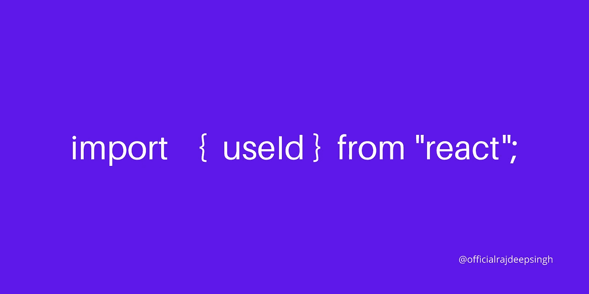

# React 18 中 useId()钩子的介绍

> 原文：<https://javascript.plainenglish.io/the-useid-hook-in-react-18-take-a-look-19a6c2f645bc?source=collection_archive---------1----------------------->

## 反应堆

## useId()钩子是 React 18 中生成唯一随机 Id 的新方法。



useId Hook in Reactjs 18

**useId 是 React 18 中引入的新钩子。useId 挂钩有助于在客户端和服务器端生成唯一的 Id。**

前一个在 React 中被称为`useOpaqueIdentifier`钩子。这个`useOpaqueIdentifier`钩子有很多错误和限制，所以`useId`钩子被推迟了。

在 React 18 中，所有问题都得到正确解决，React 团队引入了新名字为`useId`的`useOpaqueIdentifier`钩子。

```
import React from "react";
import "./styles.css";export default function App() { **const FullName = React.unstable_useOpaqueIdentifier();** **const email = React.unstable_useOpaqueIdentifier();** **const term = React.unstable_useOpaqueIdentifier();**return ( <div className="card"> <div> <label htmlFor={FullName}>Full Name</label> <input type="text" id={FullName} name="Full Name" />  {" "} </div> <div> <label htmlFor={email}>Enter Email</label> <input type="email" id={email} name="email" /> </div> <div> <input type="checkbox" id={term} name="term" /> <label htmlFor={term}>Agree with term</label> </div> <input type="submit" value="Submit" /> </div>);}
```

[](https://github.com/facebook/react/pull/17322#issuecomment-613104823) [## 添加 useOpaqueIdentifier Hook by luna Ruan Pull Request # 17322 Facebook/react

### 我们目前在很多地方使用唯一的 id。例如:* * aria-labelledby 这会导致一些问题:1 .如果我们…

github.com](https://github.com/facebook/react/pull/17322#issuecomment-613104823) 

React 团队尚未提供 React 18 的文档，因为它仍处于测试版。

## 有用的挂钩外卖

1.  useId 是一个钩子
2.  useId 返回字符串
3.  useId 返回客户端和服务器端的唯一 Id。
4.  useId 在 React 18 中已经作为一个完整的函数引入。

## 演示

useOpaqueIdentifier Hook Demo

## useId 钩子的要求是什么？

我们知道，useId 钩子为应用程序生成一个唯一的 Id。我们大部分时间在 HTML 中用 help Id 连接两个 HTML 元素。但是现在，我们可以使用 useId 钩子来连接 React 中的两个元素。

例如，我们可以用`id`和`for`连接标签和输入标记。每个 id 在 HTML 页面上都应该是唯一的。

```
 <label **for="FullName"**>Full Name</label><br>
  <input type="text" **id="FullName"** name="Full Name"> <br><br>

  <label **for="email"**>Enter Email</label><br>
  <input type="email" **id="email"** name="email"> <br><br>
```

## 我们在哪里以及为什么使用 useId 钩子？

我们只在连接两个 HTML 元素时使用 useId 钩子。如果您认为可以使用它来生成 id，那么它是完美的，但是要确保您不要将 id 作为 CSS 中的目标，因为它唯一的 id 每次都会为您生成不同的 id。

[](https://github.com/reactwg/react-18/discussions/111) [## 装运意向:使用讨论#111 reactwg/react-18

### 此时您不能执行该操作。您已使用另一个标签页或窗口登录。您已在另一个选项卡中注销，或者…

github.com](https://github.com/reactwg/react-18/discussions/111) 

## 示例 1

```
import { **useId** } from "react";import "./styles.css";export default function App() { **const FullName = useId();** **const email = useId();** **const term = useId();**return (<div className="card"> <div> <label htmlFor={FullName}>Full Name</label> <input type="text" id={FullName} name="Full Name" />  {" "} </div> <div> <label htmlFor={email}>Enter Email</label> <input type="email" id={email} name="email" /> </div> <div> <input type="checkbox" id={term} name="term" /> <label htmlFor={term}>Agree with term</label> </div> <input type="submit" value="Submit" /></div>);
}
```

## 示例 2

```
import { **useId** } from "react";import "./styles.css";export default function Example2() { **  let prefix1 = useId();** **let prefix2 = useId();** **let prefix3 = useId();**return (<div className="card"> <div> <label **htmlFor={prefix1 + "-fullName"}**>Full Name</label> <input type="text" **id={prefix1 + "-fullName"}** name="Full Name" />     </div> <div> <label **htmlFor={prefix2 + "-email"}**>Enter Email</label> <input type="email" **id={prefix2 + "-email"}** name="email" /> </div> <div> <input type="checkbox" **id={prefix3 + "-term"}** name="term" />       <label **htmlFor={prefix3 + "-term"}**>Agree with term</label> </div> <input type="submit" value="Submit" /></div>);
}
```

## **例 3**

```
import { version, **useId** } from "react";import "./styles.css";export default function App() {let items = [{ id: 1, title: "Lorem ipsum dolor sit amet, consectetur adipiscing elit, sed do eiusmod tempor "
},{ id: 2, title: "Lorem ipsum dolor sit amet, consectetur adipiscing elit, sed do eiusmod tempor "
},{ id: 3, title: "Lorem ipsum dolor sit amet, consectetur adipiscing elit, sed do eiusmod tempor "
},{ id: 4, title: "Lorem ipsum dolor sit amet, consectetur adipiscing elit, sed do eiusmod tempor "
}
];let prefix1 = useId();return (<div className="card"> <p> Reactjs version : {version} </p> {
       items.map((item) => { return ( <p **id={prefix1 + `${item.id}`} key={item.id}**> {item.id}: {item.title} </p> ); })
    } </div>);
}
```

## 实例 4

```
import { **version, useId** } from "react";import "./styles.css";export default function App() { ** const ID = useId();** const type = typeof ID; console.log(ID);return ( <div className="card"> <p> Reactjs version : {version} </p> <h1> **Id: {ID} and type of Id is: {type}** </h1> </div>);}
```

## 实例 5

传递数的参数是用钩子的。根据我的实验，它不起作用。

```
import { version, useId } from "react";import "./styles.css";export default function App() {**const ID = useId(5);**return ( <div className="card"> <p> Reactjs version : {version} </p> <h1> Id: {ID} and type of Id is: {type}</h1> </div>);
}
```

## 演示

useId Hook demo

## 参考

[](https://blog.logrocket.com/exploring-react-18-three-new-apis/) [## 探索 React 18 的三个新 API-log rocket 博客

### React 生态系统中目前最大的话题是 React 18 及其备受期待的……

blog.logrocket.com](https://blog.logrocket.com/exploring-react-18-three-new-apis/) [](https://github.com/facebook/react/pull/17322#issuecomment-613104823) [## 添加 useOpaqueIdentifier Hook by luna Ruan Pull Request # 17322 Facebook/react

### 我们目前在很多地方使用唯一的 id。例如:* * aria-labelledby 这会导致一些问题:1 .如果我们…

github.com](https://github.com/facebook/react/pull/17322#issuecomment-613104823) [](https://github.com/reactwg/react-18/discussions) [## reactwg/react-18

### 此时您不能执行该操作。您已使用另一个标签页或窗口登录。您已在另一个选项卡中注销，或者…

github.com](https://github.com/reactwg/react-18/discussions) [](https://github.com/reactwg/react-18/discussions/111) [## 装运意向:使用讨论#111 reactwg/react-18

### 此时您不能执行该操作。您已使用另一个标签页或窗口登录。您已在另一个选项卡中注销，或者…

github.com](https://github.com/reactwg/react-18/discussions/111) 

## 以前的文章

[](https://medium.com/nextjs/5-most-commonly-error-face-is-next-js-223eab955b83) [## 5 最常见的错误面是 Next.js？

### 根据我的经验，我创建了一个在 nextjs 中重复出现的逗号错误列表。

medium.com](https://medium.com/nextjs/5-most-commonly-error-face-is-next-js-223eab955b83) [](https://medium.com/nerd-for-tech/in-which-case-do-we-need-to-update-reactjs-to-nextjs-5e7ab6dbd995) [## 在哪种情况下我们需要将 reactjs 更新为 nextjs？

### 为什么我们需要将 reactjs 更新为 nextjs？

medium.com](https://medium.com/nerd-for-tech/in-which-case-do-we-need-to-update-reactjs-to-nextjs-5e7ab6dbd995) [](/how-many-hooks-are-present-in-react-c97f0200a26a) [## React 中有多少个钩子？

### 挂钩是在 React 中编写更少、更简洁代码的一种方式。

javascript.plainenglish.io](/how-many-hooks-are-present-in-react-c97f0200a26a) 

## 结论

useId 钩子是 React 18 中新增的；我为 React 团队和社区感到非常高兴。您使用 useId 钩子作为`aria-label` Id 和一些 HTML 属性。

useId 挂钩有许多可能的用途。在未来，我们还会看到 useId 钩子的更多用例。

我的文章是基于我的学习和实验。React 文档提供了完整的信息。

*如果您有任何疑问或需要我的帮助，请随时通过 official rajdeepsingh[@]Gmail . com 与我联系。也可以联系我，关注* [*Next.js 发布*](https://medium.com/nextjs) *。*

如果你喜欢我的文章，请随意喜欢并与他人分享我的文章。你还在推特上标签 [*官方 _ R _ 深度*](https://twitter.com/official_R_deep) *。*

[](https://officialrajdeepsingh.dev/) [## 拉吉迪普·辛格

### 我创建的这个网站是为了让初学者了解编程的基本概念。主要是盖住一个顶部。

officialrajdeepsingh.dev](https://officialrajdeepsingh.dev/) 

*更多内容看* [***说白了就是***](http://plainenglish.io/) *。报名参加我们的* [***免费每周简讯***](http://newsletter.plainenglish.io/) *。在我们的* [***社区不和谐***](https://discord.gg/GtDtUAvyhW) *获得独家获取写作机会和建议。*