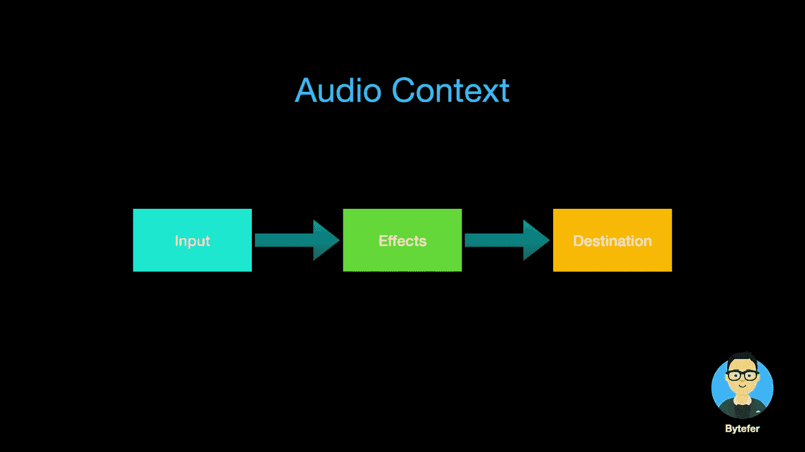

# 网络音频 API 如此强大，让我看到了音频的美丽

> 原文：<https://javascript.plainenglish.io/the-web-audio-api-so-powerful-it-has-opened-my-eyes-to-the-beauty-of-audio-e1f59ea35772?source=collection_archive---------7----------------------->

## 让你的音频起舞，让你的音频可见。让你的页面不无聊。Web 开发人员应该注意 Web 音频 API。


Created by Web Audio API & Canvas API

在浏览器中，我们一般通过`audio`标签来播放音频:

```
<audio controls>
  <source src="myAudio.mp3" type="audio/mpeg">
  <source src="myAudio.ogg" type="audio/ogg">
</audio>
```

这个很好用，但是只控制音频播放，暂停，音量等。但如果要对音频进行更进一步的控制，比如通道合并和分裂、混响、音高和音频幅度压缩等。然后`audio`标签做不到。为了解决这个问题，我们需要使用 [**网络音频**](https://developer.mozilla.org/en-US/docs/Web/API/Web_Audio_API) API。

[**Web Audio**](https://developer.mozilla.org/en-US/docs/Web/API/Web_Audio_API) API 提供了一个非常高效和通用的系统来控制 Web 上的音频，允许开发人员向音频添加特殊效果、**可视化音频**，添加空间效果等等。



Web Audio API 支持用户在音频上下文( [**AudioContext**](https://developer.mozilla.org/en-US/docs/Web/API/AudioContext) )中进行音频操作，具有模块化路由的特点。基本的音频操作在音频节点上执行，这些音频节点连接在一起形成音频路由图。

接下来，我将演示如何使用`AudioContext`来播放音频:

```
<!DOCTYPE html>
<html lang="en">
<head>
    <meta charset="UTF-8">
    <meta http-equiv="X-UA-Compatible" content="IE=edge">
    <meta name="viewport" content="width=device-width, initial-scale=1.0">
    <title>Audio Context</title>
</head>
<body>
    <input id="audioFile" type="file" accept="audio/*"/>
    <script>
    const inputFile = document.querySelector("#audioFile");
    inputFile.onchange = function(event) {
      const file = event.target.files[0]; 
      const reader = new FileReader();
      reader.readAsArrayBuffer(file);
      reader.onload = evt => {
          const encodedBuffer = evt.currentTarget.result;
          const context = new AudioContext();
          context.decodeAudioData(encodedBuffer, decodedBuffer => {
              const dataSource = context.createBufferSource();
              dataSource.buffer = decodedBuffer;
              dataSource.connect(context.destination);
              dataSource.start();
          })
      }
    }    
    </script>
</body>
</html>
```

在上面的代码中，我们使用了`FileReader` API 来读取音频文件的数据。然后创建一个`AudioContext`对象，并在该对象上使用`decodeAudioData`方法解码音频。获得解码后的数据后，我们会继续创建一个 [AudioBufferSourceNode](https://developer.mozilla.org/en-US/docs/Web/API/AudioBufferSourceNode) 对象来存储解码后的音频数据，然后将 [AudioBufferSourceNode](https://developer.mozilla.org/en-US/docs/Web/API/AudioBufferSourceNode) 对象与`context.destination`对象连接，最后调用`start`方法来播放音频。

看到这里，你是不是觉得用`AudioContext`播放音频文件很麻烦？其实是很厉害的。接下来，我将介绍如何使用`AudioContext`、`[AnalyserNode](https://developer.mozilla.org/en-US/docs/Web/API/AnalyserNode)`和`Canvas`来实现音频可视化的功能。

可视化音频文件主要分为以下 3 个步骤:

*   获取音频文件数据；
*   获取音频文件音频数据；
*   使用画布 API 绘制可视化效果。

## 1.获取音频文件数据

在下面的代码中，我们使用`FileReader` API 来读取音频文件的数据。然后创建一个`AudioContext`对象，并在该对象上使用`decodeAudioData`方法解码音频。当然你也可以从网上下载音频文件。

```
inputFile.onchange = function(event) {
  const file = event.target.files[0];

  const reader = new FileReader();
  reader.readAsArrayBuffer(file);
  reader.onload = evt=>{
    const encodedBuffer = evt.currentTarget.result;
    const context = new AudioContext();
    context.decodeAudioData(encodedBuffer, decodedBuffer=>{
      const dataSource = context.createBufferSource();
      dataSource.buffer = decodedBuffer;
      analyser = createAnalyser(context, dataSource);
      bufferLength = analyser.frequencyBinCount;
      frequencyData = new Uint8Array(bufferLength);
      dataSource.start();
      drawBar();
    }
 )
}
```

## 2.获取音频文件频率数据

为了获得频率数据，我们需要利用`[AnalyserNode](https://developer.mozilla.org/en-US/docs/Web/API/AnalyserNode)`接口，该接口提供实时频率和时域分析信息。

```
const analyser = audioCtx.createAnalyser();
analyser.fftSize = 512;
const bufferLength = analyser.frequencyBinCount;
const dataArray = new Uint8Array(bufferLength);
analyser.getByteFrequencyData(dataArray);
```

AnalyserNode 对象上的`getByteFrequencyData()`方法将当前频率数据复制到传入的 Uint8Array 对象。

## 3.使用画布 API 绘制可视化效果

获得频率数据后，可以使用 CanvasRenderingContext2D 接口中的`fillRect`方法等 CanvasRenderingContext2D 来可视化数据。

```
function drawBar() {
  requestAnimationFrame(drawBar);
  analyser.getByteFrequencyData(frequencyData);
  canvasContext.clearRect(0, 0, canvasWidth, canvasHeight);
  let barHeight, barWidth, r, g, b;
  for (let i = 0, x = 0; i < bufferLength; i++) {
    barHeight = frequencyData[i];
    barWidth = canvasWidth / bufferLength * 2;
    r = barHeight + 25 * (i / bufferLength);
    g = 250 * (i / bufferLength);
    b = 50;
    canvasContext.fillStyle = "rgb(" + r + "," + g + "," + b + ")";
    canvasContext.fillRect(x, canvasHeight - barHeight, barWidth, barHeight);
    x += barWidth + 2;
  }
}
```

分析完上面的处理流程后，我们来看看完整的代码:

```
<!DOCTYPE html>
<html lang="en">
    <head>
        <meta charset="UTF-8">
        <meta http-equiv="X-UA-Compatible" content="IE=edge">
        <meta name="viewport" content="width=device-width, initial-scale=1.0">
        <title>Visualizations with Web Audio API</title>
    </head>
    <body>
        <input id="audioFile" type="file" accept="audio/*"/>
        <canvas id="canvas"></canvas>
        <script>
            const canvas = document.querySelector("#canvas");
            const inputFile = document.querySelector("#audioFile");

            const canvasWidth = window.innerWidth;
            const canvasHeight = window.innerHeight;
            const canvasContext = canvas.getContext("2d");
            canvas.width = canvasWidth;
            canvas.height = canvasHeight;
            let frequencyData = [], bufferLength = 0, analyser;

            inputFile.onchange = function(event) {
                const file = event.target.files[0];

                const reader = new FileReader();
                reader.readAsArrayBuffer(file);
                reader.onload = evt=>{
                    const encodedBuffer = evt.currentTarget.result;
                    const context = new AudioContext();
                    context.decodeAudioData(encodedBuffer, decodedBuffer=>{
                        const dataSource = context.createBufferSource();
                        dataSource.buffer = decodedBuffer;
                        analyser = createAnalyser(context, dataSource);
                        bufferLength = analyser.frequencyBinCount;
                        frequencyData = new Uint8Array(bufferLength);
                        dataSource.start();
                        drawBar();
                    }
                    )
                }

                function createAnalyser(context, dataSource) {
                    const analyser = context.createAnalyser();
                    analyser.fftSize = 512;
                    dataSource.connect(analyser);
                    analyser.connect(context.destination);
                    return analyser;
                }

                function drawBar() {
                    requestAnimationFrame(drawBar);
                    analyser.getByteFrequencyData(frequencyData);
                    canvasContext.clearRect(0, 0, canvasWidth, canvasHeight);
                    let barHeight, barWidth, r, g, b;
                    for (let i = 0, x = 0; i < bufferLength; i++) {
                        barHeight = frequencyData[i];
                        barWidth = canvasWidth / bufferLength * 2;
                        r = barHeight + 25 * (i / bufferLength);
                        g = 250 * (i / bufferLength);
                        b = 50;
                        canvasContext.fillStyle = "rgb(" + r + "," + g + "," + b + ")";
                        canvasContext.fillRect(x, canvasHeight - barHeight, barWidth, barHeight);
                        x += barWidth + 2;
                    }
                }
            }
        </script>
    </body>
</html>
```

浏览器打开包含上述代码的网页，然后选择一个音频文件后，可以看到类似的图形。


事实上，在我们有了频率数据之后，我们还可以使用 Canvas API 绘制其他漂亮的图形。


以上图形是使用 Github 上的第三方库 [**vudio.js**](http://vudio.js) 生成的。如果你有其他很酷的音频可视化，请给我留言。

如果你喜欢学习 TypeScript，可以在 [Medium](https://medium.com/@bytefer) 或者 [Twitter](https://twitter.com/Tbytefer) 上关注我，阅读更多关于 TS 和 JS 的内容！


[字节优先](https://medium.com/@bytefer?source=post_page-----e1f59ea35772--------------------------------)

## 掌握打字稿系列

[View list](https://medium.com/@bytefer/list/mastering-typescript-series-688ee7c12807?source=post_page-----e1f59ea35772--------------------------------)47 stories

# 资源

[](https://developer.mozilla.org/en-US/docs/Web/API/Web_Audio_API) [## Web 音频 API-Web API | MDN

### Web Audio API 涉及处理音频上下文中的音频操作，并且被设计成允许模块化的…

developer.mozilla.org](https://developer.mozilla.org/en-US/docs/Web/API/Web_Audio_API) [](https://github.com/willianjusten/awesome-audio-visualization) [## GitHub-willian justen/awesome-Audio-Visualization:一个关于音频可视化的精选列表。

### 音乐可视化是电子音乐可视化工具和媒体播放器软件中的一个功能，可以生成动画…

github.com](https://github.com/willianjusten/awesome-audio-visualization) 

*更多内容请看*[***plain English . io***](https://plainenglish.io/)*。报名参加我们的* [***免费周报***](http://newsletter.plainenglish.io/) *。关注我们关于*[***Twitter***](https://twitter.com/inPlainEngHQ)[***LinkedIn***](https://www.linkedin.com/company/inplainenglish/)*[***YouTube***](https://www.youtube.com/channel/UCtipWUghju290NWcn8jhyAw)***，以及****[***不和***](https://discord.gg/GtDtUAvyhW) *对成长黑客感兴趣？检查* [***电路***](https://circuit.ooo/) ***。*****