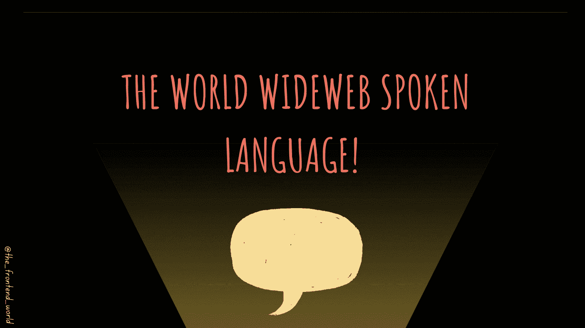
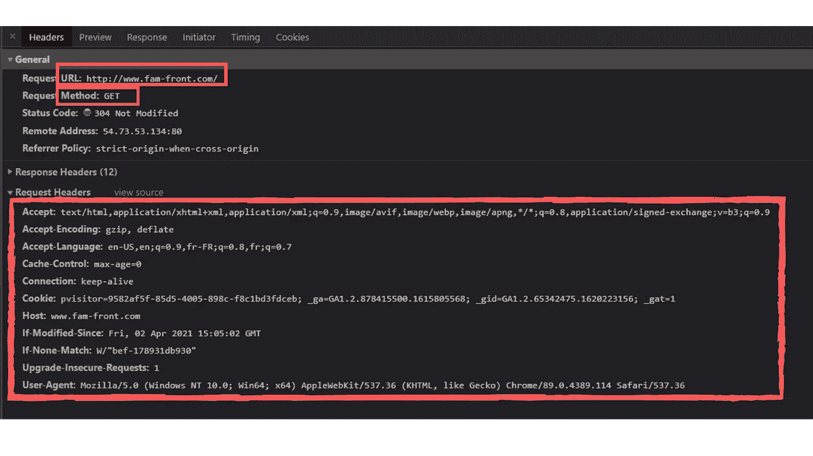
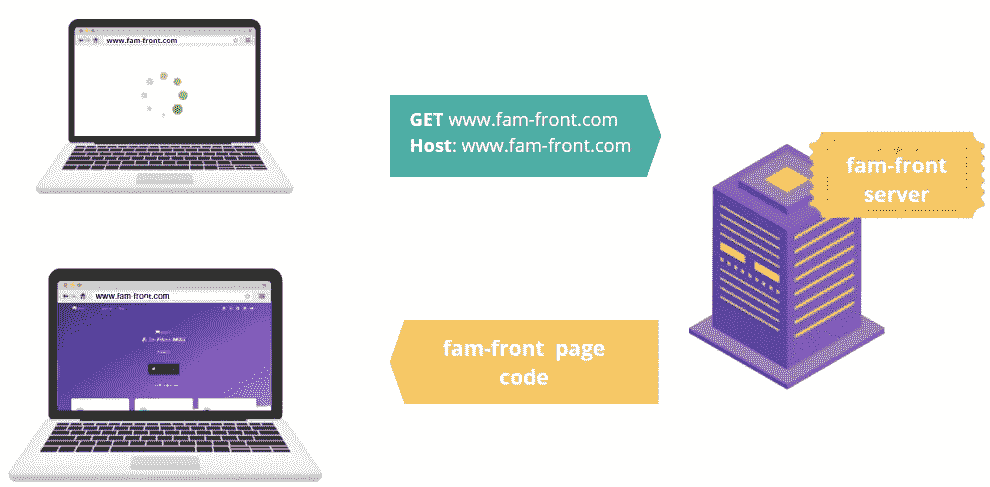
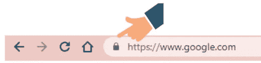
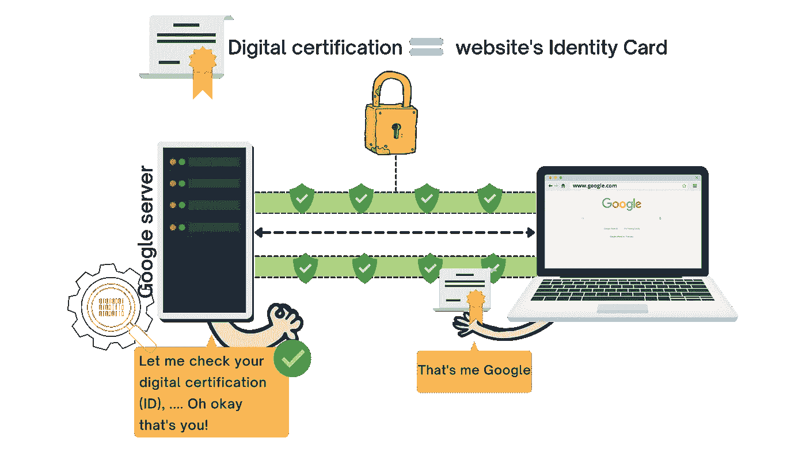
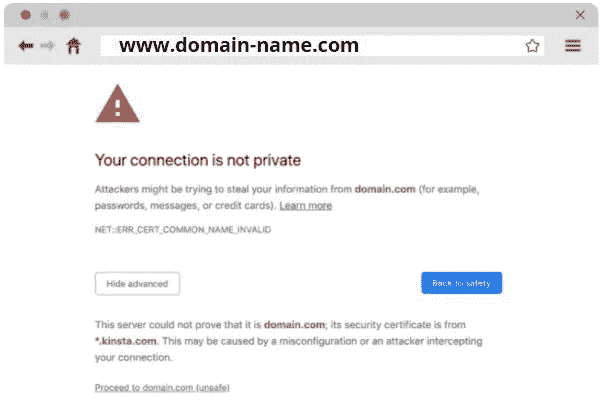

# 万维网口语！🔈

> 原文：<https://javascript.plainenglish.io/the-world-wideweb-spoken-language-70856478dc6b?source=collection_archive---------12----------------------->

## HTTP & HTTPS

By FAM

为了与其他人交流，我们说一种语言。

> HTTP 简单来说就是互联网上网站之间的口语。

HTTP 是一个 ***标准化协议*** ，代表 ***超文本传输协议*** 。它定义了请求(和响应)必须是什么。换句话说，它决定了我们如何为万维网传递数据。

你可能想知道为什么一个 URL 即使不输入 HTTP 协议也是一样的。嗯，这是由于浏览器的工作，自动完成与 HTTP 协议的网址。

互联网上的请求或回应不是简单的问题或回答。它是一个技术性的东西，可以包含数据、元数据(关于数据的数据)，以及应该如何提交请求以使其正常工作。这同样适用于回应。它可以是一个网站，就像[www.fam-front.com](http://www.fam-front.com)的案例一样，或者返回一些数据，或者什么也不返回。

为了看看请求是什么样子，这里有一个 Chrome dev tools 网络的截图。如果您不熟悉它，不要担心，有整整一章专门介绍工具。它会让你成为使用开发工具的专家！

在这个例子中，我请求了我的 web 应用程序[www.fam-front.com。](http://www.fam-front.com.)如您所见，典型的 HTTP 请求消息包含以下内容:

*   网址:[www.fam-front.com](http://www.fam-front.com)
*   方法:`**GET**`
*   状态代码

我们需要指定方法(如`**GET**`)和网站存储的托管服务器。这里有一张图片可以帮助你记住这一点:

By FAM

# 现在，HTTPS 是什么？

互联网对每个人开放。如果我能访问一个网站，你也能。如前所述，发送的请求是以明文形式显示的，这意味着黑客可以利用这些信息来攻击我们。这就是为什么网站在互联网上应该是安全的，以防止黑客攻击。我们需要使用一个已经存在的名为 HTTPS (HTTP Secure)的安全通信通道。

*   为了实现安全的通信，我们需要 SSL(安全套接字层)和它的继任者 TLS(传输层安全性)。可以把 SSL 和 TLS 看作是保护您的通信免受窥探、篡改和其他黑客攻击的包装器。

对于安全网站，URL 中 HTTPS 的旁边会出现一个小锁:

因此，HTTPS 协议确保您在互联网上的请求是安全的，并受到保护:

By FAM

浏览器要求谷歌服务器通过提供数字证书(就像人类的身份证)来建立安全连接，证明想要谷歌页面源代码的人是谷歌自己。如果证书无效，浏览器将通过您可能已经看到的页面警告您:

# 外卖

*   HTTP 是互联网上的协议和口头语言，用于在基于 web 的应用程序之间进行通信和交换数据。
*   HTTP 就像是网络的信使。
*   HTTP 协议传送图像、文件、视频、音频、文档等内容。
*   浏览器使用 HTTP 协议，并尊重它来为用户通信和显示 web 应用程序。
*   HTTP 是无连接的，这意味着客户端(浏览器)在客户端请求后与服务器断开连接。当响应就绪时，服务器重新建立与客户机的连接，以传递对其请求的响应。
*   对于安全通信，请使用 HTTPS。
*   *数字证书由证书颁发机构提供。就像政府给你发身份证和护照一样。*

*下一步是学习 URL 结构、请求头和方法。*

# *2022 年网络计划路线图*

## *I —一般网络知识*

*   *[1-工作原理](https://famzil.medium.com/how-does-a-web-page-load-what-happens-in-the-background-260cee68a88f?source=your_stories_page----------------------------------------)*

> ****2- HTTP & HTTPS****

*   **3-标题&方法**
*   *…*

***了解更多:***

* [## 2022 网络计划启动！

### 改变来自心态和习惯

medium.com](https://medium.com/geekculture/2022-web-program-is-launched-f38a3280af1a)  [## 我的网络文章 2022 年路线图

### 让我们提升我们的网络技能和知识！

javascript.plainenglish.io](/my-web-articles-roadmap-for-2022-20387cab9b07) 

> 我今天的故事到此结束，我希望你喜欢它，并从中吸取教训，❤

如果我的作品 ***打动了你。*** 如果你 ***喜欢的话。*** 如果你觉得 ***值得。请你成为付费会员来支持我，你的一部分费用会寄给我。*** **这有助于我提供更多的时间来写好文章。**

 [## 如果你喜欢看我的文章… ♥️

### 如果你喜欢读我的文章… ♥️，当我的文章发表时，欢迎你第一个得到通知…

famzil.medium.com](https://famzil.medium.com/subscribe) 

亲爱的读者，感谢你在我生命中的存在。让我们在 [**上**取得联系****](https://medium.com/@famzil/)**[**Linkedin**](https://www.linkedin.com/in/fatima-amzil-9031ba95/)**[**脸书**](https://www.facebook.com/The-Front-End-World)**[**insta gram**](https://www.instagram.com/the_frontend_world/)**[**YouTube**](https://www.youtube.com/channel/UCaxr-f9r6P1u7Y7SKFHi12g)**或**********

*******更多内容看* [***说白了就是***](http://plainenglish.io/) *。报名参加我们的* [***免费周报***](http://newsletter.plainenglish.io/) *。在我们的* [***社区不和谐***](https://discord.gg/GtDtUAvyhW) *中获得独家写作机会和建议。********