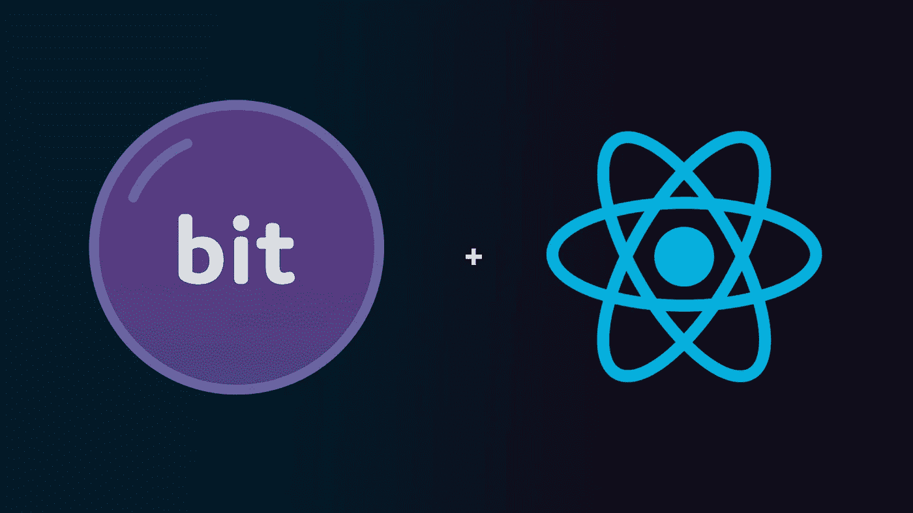
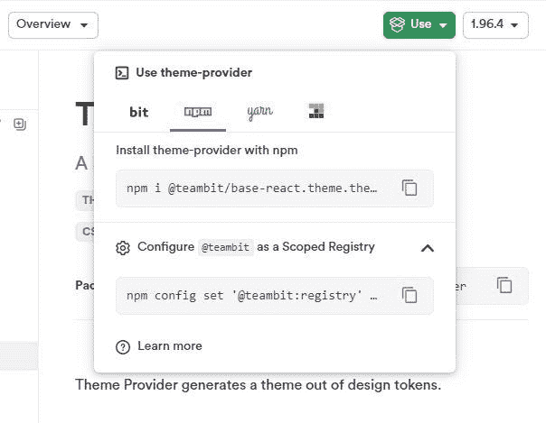

# React 中的主题化和主题切换

> 原文：<https://javascript.plainenglish.io/theming-and-theme-switching-in-react-the-right-way-51b679de9c72?source=collection_archive---------6----------------------->

## 如何使用设计令牌、React、上下文 API 和 Bit 来构建和切换模块化主题组件


Who said Todos were boring? :-)

主题化在过去几年里真正起飞了，苹果和谷歌都采用了黑暗模式，Next.js 等使得 SSR *成为热门商品。主题有助于代码的可维护性和可伸缩性，因为它们是外观变化和组件逻辑之间真正的[关注点分离](https://en.wikipedia.org/wiki/Separation_of_concerns)，所以作为一名擅长样式化的前端开发人员从来没有得到更好的回报。*

但是，这真的有趣吗？

你有多少次遇到队友链接了几十个 CSS `classNames`，扼杀了可读性？或者六个月前提交遗留下来的孤儿 CSS*因为莫名其妙地被共享到其他地方而无法删除？或者发现您不能*实际上*重用您刚刚创建的“可重用”组件，因为它是一个 3 MB 的包？*

*够了。如果您可以[热插拔](https://en.wikipedia.org/wiki/Hot_swapping) 主题而不用担心这些，会怎么样？组件是否真正可重用，因为它们*基于 Figma 导出或消耗的道具动态*填充样式值——而不需要到处使用`!important`来“解决”冲突，拥有巨人 Andre 大小的包，或者一夜之间掌握 PostCSS + Tailwind +模块？*

# *你的新朋友——上下文 API*

****

*Exact same components and logic under the hood, drastically different styles applied dynamically.*

## *全局存储选择的上下文…*

*首先，我们需要一个全局状态变量(可以这么说)来跟踪和切换我们选择的主题——复古或现代。我们将使用 [React Context API](https://reactjs.org/docs/context.html) 作为解决方案，因为它就是为了做到这一点而构建的——让我们将值深入传递到组件树中，而不强迫组件接收它们不能使用的值。*

*接下来呢？*

**“我懂了！”你说。*使用 context 存储当前主题，然后动态分配预制的 CSS 类——复古或现代主题——作为组件的内嵌样式，使用简单的三元运算符，对吗？！***

*没有。*

*如果我们这样做了，我们就完全避免了我们刚刚谈到的任何问题。*

## *…以及动态提供该选择的环境。*

*解决方案是再次使用 Context API*，但这一次是基于您的设计团队从 Figma/Sketch 导出的一组**值**(记住这一点，我们将回头讨论它)为您动态生成一个主题(然后您可以`import`并在需要的地方使用它),并让您以您需要的粒度应用和定制它。**

****

**Bit and React is a match made in developer heaven**

**这正是 [Bit 的](https://bit.dev/) [ThemeProvider](https://bit.cloud/teambit/base-react/theme/theme-provider) 组件所做的，返回一个[高阶组件](https://reactjs.org/docs/higher-order-components.html)(一个提供者)——你可以将它导入到任何你需要主题化和包装组件的地方。通过这种方式，您可以访问这些子组件中的样式值，还可以在站点/应用范围内单独覆盖它们。**

**对于那些还没有尝试过 Bit 的人来说， [Bit](https://bit.cloud/) 是一个开源工具链和组件中心，它简化了组件的构建、发现和共享。你会感觉像一个在玩具店浏览组件的孩子，轻松地将它们导入并集成到你的应用中。**

# **等等…如果我想坚持香草反应呢？**

**如果你选择*而不是*使用 Bit 的 ThemeProvider 组件，这篇文章中解释的设计模式还是一样的，但是你会有一些工作要做，手动导入某种 CSS-in-JS 解决方案中的样式，并一次一个地应用它们，内联。**

```
**// styles (if you weren't using Bit)
const todoButtonStyle = {margin: modernMode? theme.todoButtonModern.margin : theme.todoButtonRetro.margin,borderColor: modernMode? theme.todoButtonModern.borderColor : theme.todoButtonRetro.borderColor,borderRadius: modernMode? theme.todoButtonModern.borderRadius : theme.todoButtonRetro.borderRadius,…}**
```

**这不是火箭科学，但是需要大量的打字工作。此外，使用所有这些内联样式，您的性能会受到影响。**

**我们开始吧！**

# **步骤 0:配置**

**我们的项目没有任何依赖项，除了我们将从 Bit 导入的`ThemeProvider`。**

**Bit 中的组件被存储为[范围的注册表](https://docs.npmjs.com/cli/v7/using-npm/scope)。相关的包，发布在每个`npm`用户/组织的名称空间下，确保与其他用户/组织创建的组件同名的组件可以无冲突地存在。一点点[作用域](https://bit.dev/docs/scope/scope-overview)的功能与*完全相同，基本上就是你的存储库。这样导入更符合逻辑。***

**因此，在我们可以从 Bit 安装组件之前，我们需要将该组件的范围配置为一个`npm`注册表。**

****

**Every component published on Bit will list commands for install and scoped registry configuration, ready to copy-and-paste.**

**在我们的例子中，这意味着像这样添加`@teambit`**

```
**> npm config set ‘@teambit:registry’ [https://node.bit.cloud](https://node.bit.cloud)**
```

**…然后安装我们需要的组件。如果前一步出现问题，这一步将会失败，所以一定要仔细检查。**

```
**> npm i @teambit/base-react.theme.theme-provider**
```

*****注意:*** *我们可以选择使用一个 Bit 工作空间，并将它们导入到自己的环境中。这通常是开发人员使用 Bit 的方式。对于那些喜欢这条路线的人来说，可以查看一下* [***这篇关于主题和主题化的文章***](https://bit.cloud/blog/theming-in-components-with-react-and-bit-l386casw) *直接来自* [*位博客*](http://bit.cloud/blog) *。***

**全部完成！现在，我们可以像往常一样使用 ThemeProvider。**

> ***💡*如果你想要一个复古/现代主题交换的更好的开关/开关，你也可以在这里得到类似于[开关](https://bit.cloud/teambit/design/ui/input/toggle)的东西(也是`*teambit*`作用域注册表的一部分)。**
> 
> **`*npm i @teambit/design.ui.input.toggle*`**
> 
> **现在，您可以将它包含在项目中的任何位置。看看用 Bit 进行组件驱动开发有多简单？**

# **步骤 1A:用设计符号构建主题**

**还记得 ThemeProvider 如何根据设计团队的一组值为您构建主题吗？这些值被称为[设计记号](https://bit.cloud/blog/design-tokens-in-components-with-react-and-bit-l28qlxq6)，它们是**你为达到最终外观**所做的设计决策的集合。颜色、边距、填充、行高&间距、字体系列、过渡、关键帧——任何你能想象到的重复使用的东西，都被整合并存储在这个位于你的应用之上的单一数据层中。**

**这意味着基于设计令牌的方法是与库无关的，可以在任何地方部署，并且可以跨任何需要相同、一致设计的应用进行扩展。它们可能是 JSON，YAML，普通的旧 JavaScript，任何东西。**

**因此，使用这种设计方法学来构建你的两个(或者更多个)主题。作为一个例子，这是我的现代主题的样子。**

# **步骤 1B:将令牌传递给你的主题提供者。**

**拿到你的设计令牌了吗？很好。现在，ThemeProvider 可以用它们构建一个上下文感知的主题。从技术上讲，这将是一个 CSS-in-JS 解决方案，但是 ThemeProvider 为您简化了整个过程。你给它输入你的设计符号——它生成一个主题(用一个定制的钩子— `useTheme` —让你可以访问样式变量),你可以根据需要使用它。**

**这就是你需要担心的全部。**

# **步骤 2:为主题切换建立上下文。**

**我们的主题已经准备就绪，现在我们需要一个全局变量来跟踪我们选择的主题的状态——任何组件都可以访问它，而无需进行适当的处理。**

**这是游戏计划。**

1.  **从 React 导入`createContext`和`useContext`挂钩，并定义您希望全局可用的变量。这是经典的 getter/setter `useState` 模板。没什么特别的。**

```
**const [modernMode, setModernMode] = useState(false);
const toggleModernMode = () => { setModernMode(!modernMode) };**
```

**我们还将定义一个函数来处理这个布尔值的切换，即实际的主题切换。**

**2.用`createContext`钩子创建上下文。这将返回一个对象。**

```
**const ModernModeContext = createContext();**
```

**每个上下文对象都带有一个[提供者](https://reactjs.org/docs/context.html#contextprovider)反应组件。您作为该组件的子/后代包含的任何内容都会自动订阅您定义的上下文变量的更改，并且每当变量(通过此处的`value`属性提供给它)发生更改时，都会重新呈现。**

**在我们的例子中，我们希望这些消费者组件是动态添加的，而不是此时此地定义的，所以我们将它编码为默认的`props.children`。**

```
**/* ‘value’ props = whatever variables must be global */return (<ModernModeContext.Provider value={{ modernMode, toggleModernMode }}>{props.children}</ModernModeContext.Provider>);**
```

**3.为了保持可重用性和最小化渲染，只创建一个返回该提供者的[高阶组件](https://reactjs.org/docs/higher-order-components.html) (HOC)。**

**将所有这些放在一起，这是应用程序整体上下文的代码。**

# **步骤 3:构建您的组件**

**你的 App.js 将只需要你的主组件(这里称之为`Content`)包装在你的上下文提供者中(如果你记得的话，这是特设的)。**

**这是我们解决方案的前半部分——使当前活动的主题(全局变量+它的切换函数)可以被我们拥有的每个组件访问和跟踪。**

**至于主组件本身，从它返回`ThemeProvider`包装的 JSX，并根据主题选择应用`override`。**

```
**const Content = () => {// using the custom hook defined in Step 2const { modernMode } = useModernMode();// ...and choosing a theme based on that.const themeChoice = modernMode ? modernTheme : retroTheme;return (<Theme.ThemeProvider overrides={themeChoice}>{/* your components and JSX here */}</Theme.ThemeProvider>);};**
```

**这是我们解决方案的第二部分——将样式(基于当前活动的主题)向下传播到`Theme.ThemeProvider`中的每个子/后代组件。他们将有权选择主题*和*主题本身(由 ThemeProvider 生成的正确的上下文感知主题，而不仅仅是设计标记)，并可以根据需要进一步使用或修改值。**

**这看起来是这样的:**

**在单个组件中，您可以做完全相同的事情。**

**Only need the context variable modernMode here for dynamically determining the text in the titlebar (‘TodoStation 5’ or ‘Todo.exe’)**

**在这里，您可以看到这种设计模式是多么简单——然而又是多么健壮。**

1.  **导入`useModernMode`钩子，如果需要的话获取全局值。**
2.  **导入`useTheme` 钩子，从中获取想要的样式值(当前活动样式的)，并用 CSS 或普通 JavaScript 覆盖它们。**
3.  **返回 JSX，裹上`<Theme.ThemeProvider>`**
4.  **根据需要重复。**

**…我们完成了！用`npm start`启动本地服务器，然后看着这一切走到一起。**

# **通过你的力量组合…**

**现在，您已经确切地知道了如何将 React Context API 和 Bit 的`ThemeProvider`功能结合起来，从而产生一个不仅仅用于主题化，而且用于主题的适当热交换的非常强大的解决方案——一个允许您在运行时动态更改样式属性的解决方案。**

**你现在手头有多少权力？想想这个:**

*   **你的组件完全服务于你的需求，但是现在是以一种*完全独立于*并且*完全不知道*你使用它们的环境的方式构建的。然后，您可以通过将它们导出到 Bit 来创建您自己的“组件市场”,然后在未来的项目中使用它们——真正的可重用性。**
*   **这些*也是*易于共享的单个文件组件(Styles + Markup + JS all-in-one)，具有动态样式，*不会失去根据需要覆盖值的能力。***
*   **两个字:**打字风格**。你可以确保你的团队使用你定义的“类”，并且只使用你定义的类。不再有失控的连锁。如果你想变得更精细，你可以强制样式精确到*精确值*。**

**世界是你的。**