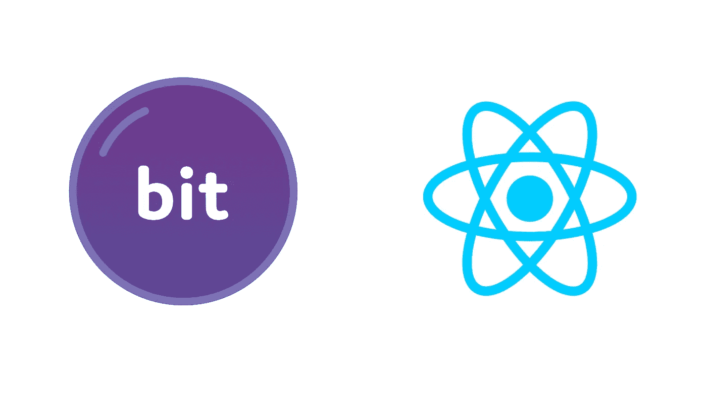

# 使用 React 和 Design 标记对组件进行主题化

> 原文：<https://javascript.plainenglish.io/theming-components-with-react-and-bit-456fca5d537b?source=collection_archive---------6----------------------->

## 使用可组合的主题、React 上下文 API 和 Bit 构建可伸缩的前端

webdev 的圣杯是一个*可伸缩的*前端——远离单一的设计模式，将组件的外观与底层逻辑和系统分离。这是工程和设计团队面临的一个组织问题。

创建一个可重用组件库*独自*不能解决它。

我们需要的是一个*设计系统*——一个统一的视觉语言，让我们不仅可以重用属性，还可以随意进行修饰性的修改，而不用担心组件的功能。主题的概念实现了我们想要的分离，解放了设计团队去解决更大的问题。

让我们看看如何利用 React Context API 来开发我们自己的组件主题化系统，该系统具有无限的可伸缩性和可组合性。我们将使用[位](https://bit.dev/)作为我们的代码示例——一个开源工具链，使构建、发现和共享组件变得轻而易举——但是即使您坚持使用 vanilla React，通过遵循本文中解释的设计模式，您也将很快在您的应用程序中进行系统范围的 UI 更改！

# 这在上下文中是有意义的

让我们快速讨论一下为什么 React v16.3 中引入的上下文 API 能够完美地满足我们的组件主题化需求。

首先，主题只是一种统一的设计语言，可以跨所有组件、站点、应用程序等使用。但是无论你考虑的是一个 UI 元素的组件，还是一个具体的应用程序，主题化都是一个*上下文相关的问题*。

您曾经设计过的表单组件总是由 HTML 标签和输入组成，并且总是作为表单运行——但是您会希望它具有不同的布局、修饰、排版等。这取决于表单在哪里以及如何使用，即表单的*上下文*。

你相信吗，这正是 React 上下文 API 的用途！上下文允许我们将可以被认为是“全局”的数据，容易地提供给所有组件——使用*或*来修改——不管它们的嵌套有多深。像首选语言、当前认证的用户，以及…你猜对了，主题！

# **提供商模式**

使用主题的概念将组件的 UI 从底层逻辑和数据中分离出来，我们可以以一种可伸缩的、设计一致的、高效的方式对 UI 进行大规模的修改。这个想法很简单:

1.  创建主题，即定义应用外观的样式集合。颜色、字体、边框、过渡等。
2.  为主题数据创建一个**上下文**。任何使用我们的**上下文**的组件现在都可以访问我们的主题——在系统范围内应用或更改 UI 样式。
3.  为了保持可重用性和最小化渲染，我们只创建了一个高阶组件——一个**提供者**——它将使用我们的**上下文**(而不是到处导入**上下文**)，用一个定制钩子(通常命名为 **useTheme** )为所有组件提供上下文。
4.  将我们的 **provider** 组件导入到我们想要主题化的任何地方，并包装所有我们希望主题化的 UI 组件——按钮、表单、定制组件，你明白了。
5.  导入你的自定义 **useTheme** 钩子到任何你需要深度定制的组件中。

无论您是使用 React，还是在 Bit workspace 中构建组件，这都是我们的基本设计模式。

主题提供了一种将 UI 与功能分离的方法，React 提供了一种将代码转化为组件的 API，而 Bit 将组件转化为可重用、可组合的构建块。这是一个强大的技术组合。

# 使用 Bit 使主题化变得简单

## 步骤 1:创建一个主题(用设计符号)

为了解决这个问题——是的，你的主题可以简单地是一个巨大的 CSS 文件，为你的应用程序中每一个可能的 UI 组件定义样式，但是这是一个糟糕的做法。这种方法不仅会导致代码可读性/可维护性/可重用性的问题，而且还会在团队中的设计人员和开发人员之间产生摩擦。设计师使用 Sketch、Adobe XD 或 Figma 来可视化地设计 UI/UX*，而开发者则使用样式表、JavaScript 和/或 TypeScript 来构建，即*代码*。*

*这就是[设计标志](https://bit.cloud/blog/design-tokens-in-components-with-react-and-bit-l28qlxq6)的用武之地！*

***设计符号是开发者和设计者都能理解*和*所贡献的真理的单一来源。他们简化了协作以及构建、维护和扩展产品的工作——因为如果你需要在整个网站范围内改变颜色或字体，团队中的任何人只需要在一个地方编辑就可以了。不需要代码重构！***

*听起来令人畏惧？一点也不！如果你曾经使用 CSS 中的 **:root** 伪选择器将你的应用程序的设计语言定义为一组中央变量，那么你已经在正确的轨道上了！定义一个主题的设计符号通常是从你的设计团队的软件中导出的，它们可以是代码、JSON、YAML——这没关系。使用设计令牌的目的是将外观从正在使用的框架中分离出来。*

*如果你愿意，可以看看由 Bit 团队自己创建和维护的 [BaseTheme](https://bit.cloud/teambit/design/themes/base-theme) 来获得一些灵感。它包含了默认主题的所有设计符号。通常情况下，您的代码如下所示:*

## *步骤 2:创建主题提供者*

*为了保持代码的整洁和可维护性，我们只创建了一个称为**提供者**的高阶组件(HOC ),它既可以使用也可以设置**上下文**,可以在整个应用程序中访问和应用。然后你可以在任何你想要主题化的地方导入这个特设(我们称之为 ThemeProvider)。*

*一个好的主题提供者应该能够做到以下几点:*

*   *理想情况下，从一组设计符号中生成一个基本主题；*
*   *应用基本主题；*
*   *提供一个 API(通常带有道具)来覆盖基本主题。*

*同样，对于我们的例子，我们将只使用 Bit 的开源 [ThemeProvider](https://bit.cloud/teambit/base-react/theme/theme-provider) 组件。它使用 **createTheme** 函数从我们的设计令牌中生成一个主题，返回:*

*   *一个自定义钩子( **useTheme** )作为**上下文的包装器，**通过它您可以访问任何组件中的设计令牌值，以及*
*   *我们刚刚谈到的 HOC (ThemeProvider)。*

## *步骤 3:将主题应用到 React 组件*

*既然繁重的工作已经完成，我们就可以将我们希望主题化的组件打包到我们的高阶 ThemeProvider 组件中。*

*我们的 BaseTheme，连同它的一整套设计标记，现在将被应用到按钮上。*

*请记住， **useTheme** 定制钩子让您可以访问设计令牌值，这意味着如果您愿意，您仍然可以按照粒度来设计每个组件！*

## *奖金:如何覆盖一个主题*

*将你的第一个主题作为你的应用程序的基础主题是有意义的，但是即使是一个非常基本的主题设置，你也需要至少两个——一个深色主题和一个浅色主题，你可以在它们之间切换。无论如何，不管你的用例需要多少，这个过程都很简单。要覆盖一个主题，我们首先需要创建另一个主题。*

*在这里，我们可以遵循前面提到的相同步骤——只是不是创建另一个 BaseTheme，而是使用相同的设计令牌集创建它的变体。*

*例如，如果我们的基本主题有一个`{backgroundColor: #FFFFFF}`属性，我们的新主题可能有`{backgroundColor: #FF0000}`。*

*然后，我们可以使用 ThemeProvider 组件中的**覆盖**属性，用新主题中的值替换`backgroundColor` 的基本主题值。*

## *这种方法的好处*

*让我们回顾一下。现在我们已经结合了 React 和 Bit，我们有了一个可组合的主题化方法，它促进了一致性，可无限扩展，遵循了最佳实践，避免了 React 反模式，如 prop-drilling 和全局变量创建，给了我们对系统的信心，并节省了时间、金钱和资源。*

# *结论*

*希望您现在能更好地理解如何使用设计令牌原理进行主题化是一种可伸缩的方式来实现组件的外观和功能之间难以捉摸的关注点分离，以及提供者设计模式如何利用 React 的上下文 API 为我们提供一种优雅的方式来在组件中进行主题化。*

*然而，最令人印象深刻的还是 Bit 本身。像乐高积木一样“插入”主题的能力使得设计变得非常直观，组件驱动的开发也变得非常容易。*