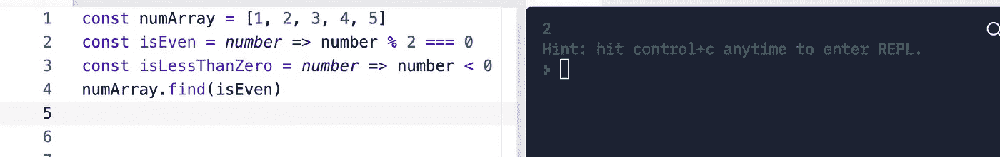

# JavaScript 中数组的 5 种有用方法

> 原文：<https://javascript.plainenglish.io/there-are-several-ways-in-which-we-see-the-world-and-our-brains-are-wired-in-various-ways-8999a2d84120?source=collection_archive---------20----------------------->

## 我发现对我真正有益的五个技巧:`.filter()`、`.find()`、`.map()`、`.forEach()`和`.reduce().`

作为 JavaScript 初学者，可能很难找到存储和组织数据的最佳方法。
另一方面，您可能已经通过在编程中使用“for”循环了解了数组。如果您试图将尽可能多的数据填充到数组中，那么当您评估代码时，您最终会遇到一个难以处理的混乱局面，很难调试。当你知道每个结构的用途时，在一个对象和一个数组之间做出决定就变得简单多了。数组与书籍存储数据的方式非常相似。

在这篇文章中，我将介绍我发现对我真正有益的五种技巧:`.filter()`、`.find()`、`.map()`、`.forEach()`和`.reduce().`

# 。过滤器()

`.filter()`用于定位与参数匹配的特定元素或项目集。此外，它还制造出一个*新的*阵。它接受一个回调函数和一个起始索引，这是可选的。如果没有发现匹配，则返回一个空数组。另外,`.filter()`不会改变调用它的数组。

> 以下是一些例子:

.filter() using arrow function

.filter to search for string

# 。查找()

`.find()`方法将第一个找到的元素返回给数组，并用提供的函数进行测试。如果没有值满足测试函数的要求，则返回 Undefined。

*检查以下内容:*

.find() with numbers array

# 。地图()

当与数组一起使用时，`.map()`将相同的给定函数应用于数组中的每个元素。
`.map()`以回调函数为参数生成一个新数组。如果不想从 0 开始，它也接受一个可选的开始索引。
可以使用这种方法替换 for 循环。

下面列举了几个例子

.map() with string array

.map() with string array

.map() with numbers array

# **。forEach()**

`.forEach()`类似于`.map()`它也用于遍历每个数组元素，但是，它不会自动返回一个包含更新值的新数组。相反，您需要将数据推送到一个新的数组，或者控制台记录更新后的值。`.forEach()`也可以代替 for 循环。

*检查以下内容:*

.forEach() example with array of sports

# 。减少()

最后但同样重要的是`.reduce()`在遍历数组中的所有元素后产生一个值。为了组合结果，每个元素都被返回到方法中。这相当于使用 for 循环对数组求和。`.reduce()`接受两个参数:前一个值，它是前一次函数调用的结果；当前值，它是每次迭代增加的值。它还接受开始索引，这是可选的。你也可以在一个字符串数组上使用它，但是结果会和你使用`.join()`时一样

> `.join()`方法将一个数组的所有元素(或一个类似[数组的对象](https://developer.mozilla.org/en-US/docs/Web/JavaScript/Guide/Indexed_collections#Working_with_array-like_objects))连接成一个字符串并返回这个字符串。这是一个非常有用的方法。

*检查以下内容:*

.reduce() with numbers array

.reduce() with numbers array

看对你有没有好处就看你自己了！当事情出错时，不要放弃。尽最大努力在工作中保持耐心和专注(或者休息一下，去跑步，冥想)。我祝你在编程方面一切顺利！

*更多内容看* [***说白了。报名参加我们的***](http://plainenglish.io/) **[***免费周报***](http://newsletter.plainenglish.io/) *。在我们的* [***社区不和谐***](https://discord.gg/GtDtUAvyhW) *获得独家获取写作机会和建议。***