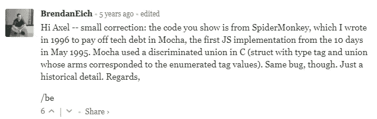

# JavaScript 从第一天起就有一个 BUG“空类型”

> 原文：<https://javascript.plainenglish.io/there-is-a-bug-in-javascript-since-day-one-typeof-null-9b18da349cc6?source=collection_archive---------8----------------------->

## 而且好像总会有。


众所周知，JavaScript 中的所有值要么是原语，要么是对象。

有 7 种原始数据类型:

-字符串

-号码

-bigint

-布尔值

-未定义

-符号

-空

让我们用 typeof 运算符检查它们的类型:

```
console.log(typeof "some text");   // stringconsole.log(typeof 1234);    // numberconsole.log(typeof 9007199254740991n);  // bigintconsole.log(typeof true);   // booleanconsole.log(typeof undefined);    // undefinedconsole.log(typeof Symbol('some text'));  // symbol**console.log(typeof null);    // object**
```

等等！什么？

为什么`typeof null`是一个物体？

这是一个无法解决的错误，因为它会导致当前代码中断。

让我们深潜。

## 对象和原语之间的区别是什么:

原语是不可变的，您不能向它们添加属性:

```
let myString = "abc";// try to add property "figure" myString.figure = 4; console.log(myString.figure) // undefined 
```

并且原语通过值进行比较*，如果它们具有相同的内容，则它们被认为是相等的:*

```
console.log("abc" === "abc") // true
```

**物体。**一切非本原的价值都是对象。对象是可变的:

```
let myObject = {};// try to add property "figure"myObject.figure = 123;  

console.log(myObject.figure);  // 123 
```

并且通过引用来比较对象*。每个对象都有自己的身份，只有当两个对象实际上是同一个对象时，它们才被认为是相等的:*

```
console.log({} === {})    // false

let myObject = {};console.log(myObject === myObject)    // true
```

**包装对象类型。**基本类型布尔、数字和字符串具有相应的包装对象类型布尔、数字和字符串。后者的实例是对象，不同于它们所包装的原语:

```
console.log(typeof new String("abc") )    // objectconsole.log(typeof abc)    // string

console.log(new String("abc") === "abc")  // false 
```

**typeof 是一个对图元进行分类的操作符，有助于将它们与对象区分开来**

“空类型”问题是 JavaScript 原始版本的遗留问题。

在这个版本中，值以 32 位为单位，包括一个短类型标记(1-3 位)和值的实际数据。类型标签保存在单元的低位。

类型标签(1–3 位)+值(29–31 位)=总共 32 位

共有五种类型标签:

*   **000** :对象。数据是对对象的引用。
*   **1** : int。数据是 31 位有符号整数。
*   **010** :双。该数据是对双浮点数的引用。
*   **100** :字符串。数据是对字符串的引用。
*   **110** :布尔型。数据是布尔值。

有两个特殊值:

*   **未定义** (JSVAL_VOID)是整数 2 ⁰(整数范围之外的数字)。
*   **null** (JSVAL_NULL)是机器代码空指针。或者:一个对象类型标签加上一个为零的引用。

因为是以 **000** (也就是对象类型标签)开头，所以的类型认为是对象。

类型的引擎代码:

```
JS_PUBLIC_API(JSType)
    JS_TypeOfValue(JSContext *cx, jsval v)
    {
        JSType type = JSTYPE_VOID;
        JSObject *obj;
        JSObjectOps *ops;
        JSClass *clasp;

        CHECK_REQUEST(cx);
        if (JSVAL_IS_VOID(v)) {  // (1)
            type = JSTYPE_VOID;
        } else if (JSVAL_IS_OBJECT(v)) {  // (2)
            obj = JSVAL_TO_OBJECT(v);
            if (obj &&
                (ops = obj->map->ops,
                 ops == &js_ObjectOps
                 ? (clasp = OBJ_GET_CLASS(cx, obj),
                    clasp->call || clasp == &js_FunctionClass) // (3,4)
                 : ops->call != 0)) {  // (3)
                type = JSTYPE_FUNCTION;
            } else {
                type = JSTYPE_OBJECT;
            }
        } else if (JSVAL_IS_NUMBER(v)) {
            type = JSTYPE_NUMBER;
        } else if (JSVAL_IS_STRING(v)) {
            type = JSTYPE_STRING;
        } else if (JSVAL_IS_BOOLEAN(v)) {
            type = JSTYPE_BOOLEAN;
        }
        return type;
    }
```

它从检查值 v 在语句中是否未定义(VOID)开始:

if (JSVAL_IS_VOID(v))

然后它检查值是否是 object。检查是否有以 000 开始的类型标签。

如果它不是一个对象，它将检查它是一个数字、字符串还是布尔值。

没有任何针对 NULL 的检查。

这是一个很容易被发现的错误，但是由于它没有被及时修复，以后要修复它就变得更加困难了。

就连 JavaScript 的创始人 Brendan Eich 也在博客上对此发表评论，称这确实是一个 bug。



Brendan Eich 曾经考虑过修正 of 类型的需要，但是拒绝了这个提议，他说:“我认为修正 of 类型已经太晚了。为 null 的类型建议的更改将破坏现有代码。

在另一次讨论中，他写道:“总的来说，typeof 看起来像一团乱麻，很难进行明智的改革。我们有理由相信 typeof null = = = " object " *是一个 bug*，它可能会从我们的网络蜘蛛中咬出真正的内容。最好的办法可能是完全不去管 typeof，弃之不用，但我仍然支持 null bug-fix*

*更多内容看* [*说白了。报名参加我们的*](http://plainenglish.io/) [*免费每周简讯*](http://newsletter.plainenglish.io/) *。在我们的* [*社区*](https://discord.gg/GtDtUAvyhW) *获得独家写作机会和建议。*