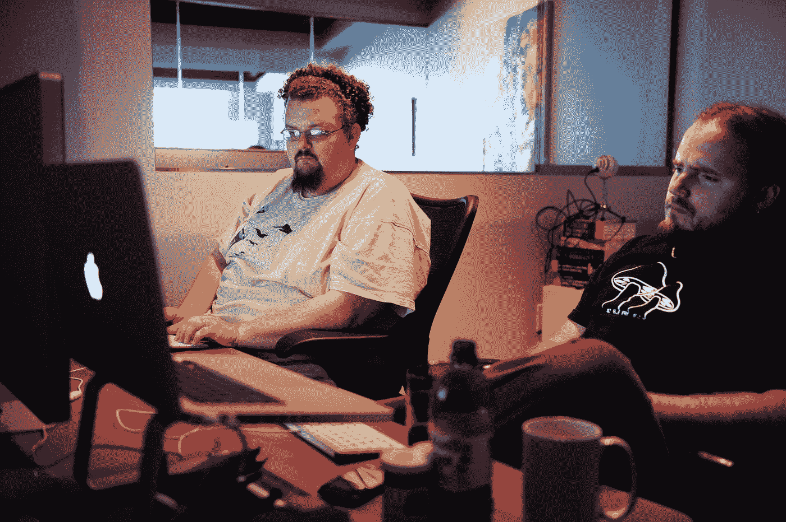

# 没有最好的编程语言。不要声称有一个。

> 原文：<https://javascript.plainenglish.io/theres-no-best-programming-language-stop-claiming-there-is-one-9a5cd79db370?source=collection_archive---------15----------------------->

## 你永远也找不到你想要的。

Photo by [Obie Fernandez](https://unsplash.com/@obiefernandez?utm_source=medium&utm_medium=referral) on [Unsplash](https://unsplash.com?utm_source=medium&utm_medium=referral)

编程不是通过编程语言学习的。然而，它不仅仅是编码部分(这是语言发挥作用的地方)。

编程总是从理解开始。首先，需要理解一个人想要用软件解决的问题。了解之后再决定是否可以用软件解决。

如果问题可以用软件解决，你必须想出一个解决方案。然后，问题被分解成尽可能小的子问题，它们开始被逻辑地解决。

到目前为止，还没有使用过任何编程语言。即使在解决可能出现的子问题时，也不使用编程语言。这里使用了一种抽象语言，它代表了程序的逻辑顺序。一旦这些都完成了，你就可以开始实现它了，这就是编码部分。

但是，你必须选择最合适的编程语言。然后，您可以研究哪种语言适用于哪些任务。许多观点、例子，甚至语言的创造者都在这里提供了信息。

不幸的是，编程经常被分解为编码部分。对于小型项目，这也是可能的，也是可以接受的。然而，对于较大的项目，不应该回避编码前的准备工作。

不幸的是，我反复体验到，我不得不在那些准备工作还没有完成的项目上工作，我不得不花费大量的时间来熟悉代码，并由此理解代码作者的问题。

学习编码没有最好的编程语言。正如大多数人常说的，语言只是以机器可理解的方式表达你的想法和策略的工具。

然而，有一些编程语言提供了很好的 ide，可以帮你做很多工作。也许这使得学习语法更容易，至少在编码时是这样。

比如有 Visual Studio，涵盖了几种语言进行开发。Netbeans 或 Eclipse 最初是为 Java 开发设计的，但现在也非常适合其他语言。

除了大型 ide 之外，一些精简的编辑器也可以帮助你学习语法。这里应该提到的是新人 Visualization Studio 代码或 Atom，老的专业工具如 vi 等。

但是，学习语法并不等同于学习编程。仅仅因为我能在语法上正确地使用一门语言，并不意味着我能逻辑地、有效地、面向目标地编程。

*更多内容请看*[***plain English . io***](https://plainenglish.io/)*。报名参加我们的* [***免费周报***](http://newsletter.plainenglish.io/) *。关注我们关于*[***Twitter***](https://twitter.com/inPlainEngHQ)*和*[***LinkedIn***](https://www.linkedin.com/company/inplainenglish/)*。加入我们的* [***社区不和谐***](https://discord.gg/GtDtUAvyhW) *。*