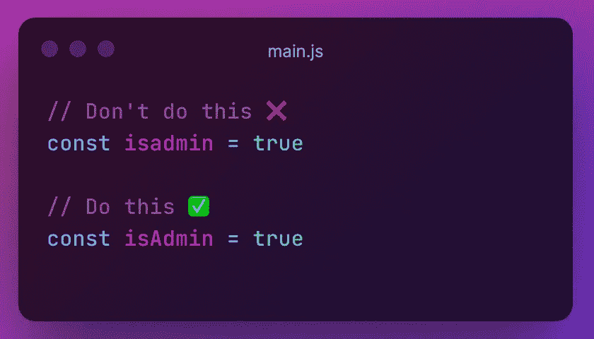
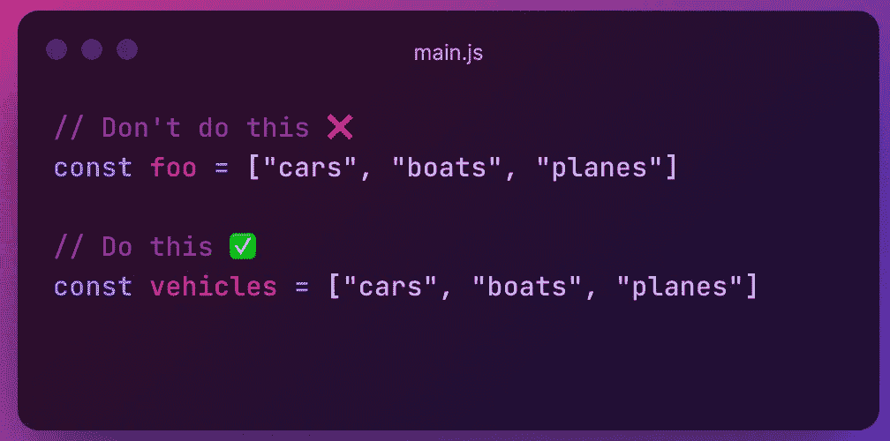
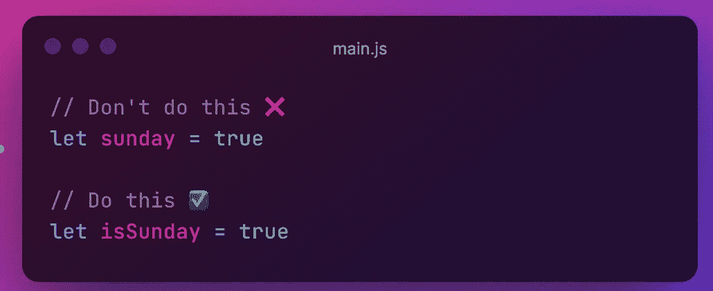
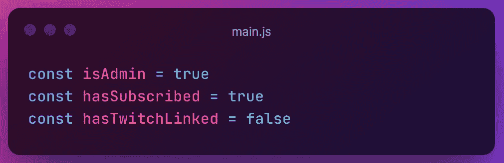
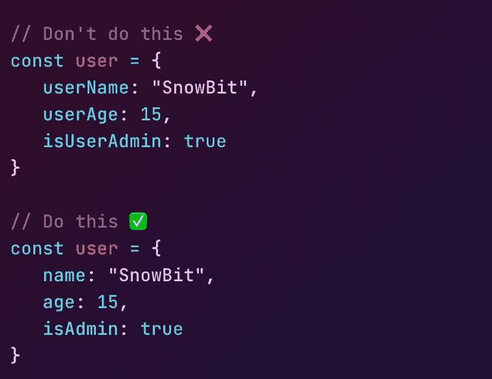
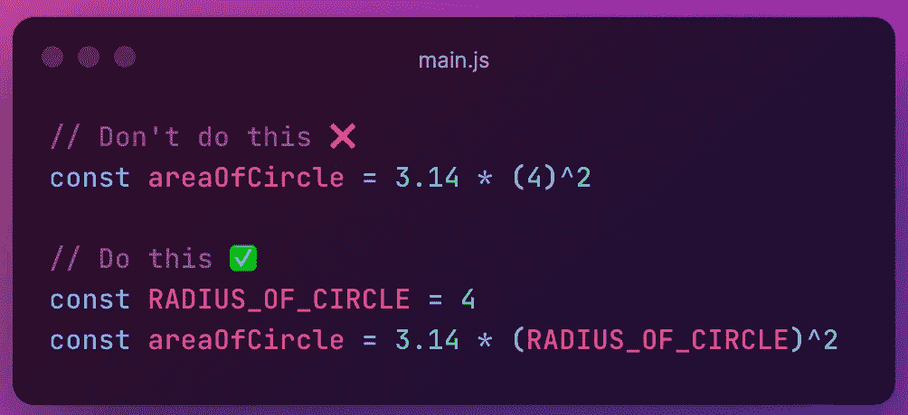

# 写 JavaScript 时应该记住的事情

> 原文：<https://javascript.plainenglish.io/these-things-you-should-keep-in-mind-while-writing-javascript-9858b0dce01d?source=collection_archive---------2----------------------->

# 大家好👋

怎么了，朋友们？这里是**雪球**。我是一个年轻的热情和自学前端网站开发人员，并打算成为一名成功的开发人员。

今天，我在这里告诉你一些重要的事情，当你写 JavaScript 代码的时候，你应该牢记在心。

快乐阅读！

写干净的代码不是有用的代码，而是可读性，被其他开发人员重用和重构。实际上，你并不是为自己而写，你是为其他开发者而写，他们可以很容易地阅读你的代码，可以很容易地理解你的代码，没有任何编辑或参与项目的麻烦。

在这篇文章中，我将关注为什么以及如何编写干净的代码。

# 骆驼箱

Camel case 是一种不用空格或标点符号书写短语的做法，用单个大写字母表示单词的分隔，第一个单词以任意一种大小写开头。

来源:维基百科

# 有意义的变量名

在给变量命名的时候，不应该给不相关的或者无意义的名字；你应该根据变量的工作给它起适当的名字。

**布尔型**

给变量赋值布尔值时，变量名必须用**疑问**语气。

你应该用疑问的语气命名一个布尔变量的原因是很容易在很少的代码中找到变量的类型，但是如果你想检查那个变量的类型，那么找到那个变量的类型并给它赋一个新的值就变得很费时间。

在这里，你可以确定变量的类型——正如你问`Is it Sunday?`一样`isSunday`，答案将是**是(真)**或**否(假)**但是在变量`sunday`的情况下，你不能不看就确定变量的类型，这里`sunday`可以是任何东西——**我喜欢星期天**或**我在星期天打板球**。

# 避免多余和不必要的上下文

当上下文由对象或类提供时，不要在变量名中添加不需要的信息

# 避免硬编码值

最好使用有意义的变量来存储常量值，而不是硬编码的值。最好将全局常量保存在**上部蛇例** —上部蛇例中

所以，这些是我介意与你们分享的一些重要的提示，我希望你喜欢阅读这篇文章。我将很快制作这篇文章的第二部分,所以别忘了关注我。

感谢您的阅读，祝您愉快！您的欣赏是我的动力😊

*   在 Twitter 上关注我— [@codewithsnowbit](https://twitter.com/codewithsnowbit)
*   在 YouTube 上订阅我— [用雪球编码](https://www.youtube.com/channel/UCNTKqF1vhFYX_v0ERnUa1RQ?view_as=subscriber&sub_confirmation=1)

*更多内容看* [***说白了就是***](http://plainenglish.io/) *。报名参加我们的* [***免费周报***](http://newsletter.plainenglish.io/) *。在我们的* [***社区获得独家访问写作机会和建议***](https://discord.gg/GtDtUAvyhW) *。*